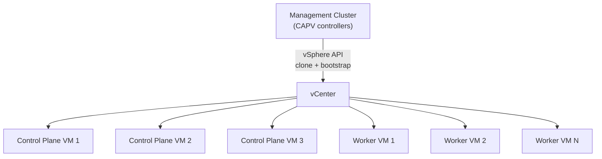

> 💡 **Quick Answer:** Cluster API vSphere provider (CAPV) provisions Kubernetes clusters on VMware vSphere. Create an Ubuntu/RHEL OVA template with `image-builder`, initialize CAPV on a management cluster, then `kubectl apply` a `Cluster` + `VSphereMachineTemplate` manifest. CAPV clones VMs, bootstraps kubeadm, and manages the full cluster lifecycle.

## The Problem

On-premises Kubernetes cluster provisioning is manual: create VMs, install OS, run kubeadm, configure networking, join nodes. Scaling means repeating the process. Upgrades are risky multi-step operations. Cluster API brings cloud-like declarative provisioning to vSphere — define clusters as YAML, manage with kubectl.



## The Solution

### Prerequisites: Build VM Template

```bash
# Use image-builder to create a Kubernetes-ready OVA
git clone https://github.com/kubernetes-sigs/image-builder
cd image-builder/images/capi

# Build Ubuntu 22.04 template for vSphere
cat > vsphere.json << EOF
{
  "vcenter_server": "vcenter.example.com",
  "username": "administrator@vsphere.local",
  "password": "secret",
  "datacenter": "DC1",
  "datastore": "vsanDatastore",
  "network": "VM Network",
  "folder": "templates",
  "kubernetes_semver": "v1.31.0",
  "kubernetes_series": "v1.31"
}
EOF

make build-node-ova-vsphere-ubuntu-2204
# Creates OVA template: ubuntu-2204-kube-v1.31.0
```

### Initialize CAPV

```bash
# Set vSphere credentials
export VSPHERE_USERNAME="administrator@vsphere.local"
export VSPHERE_PASSWORD="secret"

# Initialize Cluster API with vSphere provider
clusterctl init --infrastructure vsphere

# Verify
kubectl get pods -n capv-system
```

### Provision a Cluster

```yaml
# vsphere-cluster.yaml
apiVersion: cluster.x-k8s.io/v1beta1
kind: Cluster
metadata:
  name: production-onprem
  namespace: default
spec:
  clusterNetwork:
    pods:
      cidrBlocks: ["192.168.0.0/16"]
    services:
      cidrBlocks: ["10.96.0.0/12"]
  topology:
    class: vsphere-cluster
    version: v1.31.0
    controlPlane:
      replicas: 3
    workers:
      machineDeployments:
        - class: default-worker
          name: md-0
          replicas: 5
          metadata:
            labels:
              node-role: worker
---
apiVersion: infrastructure.cluster.x-k8s.io/v1beta1
kind: VSphereCluster
metadata:
  name: production-onprem
spec:
  controlPlaneEndpoint:
    host: 10.0.0.100                 # VIP for kube-apiserver
    port: 6443
  server: vcenter.example.com
  thumbprint: "AB:CD:EF:..."         # vCenter TLS thumbprint
  identityRef:
    kind: Secret
    name: vsphere-credentials
---
apiVersion: infrastructure.cluster.x-k8s.io/v1beta1
kind: VSphereMachineTemplate
metadata:
  name: control-plane-template
spec:
  template:
    spec:
      datacenter: DC1
      datastore: vsanDatastore
      folder: /DC1/vm/kubernetes
      network:
        devices:
          - dhcp4: false
            networkName: VM Network
      numCPUs: 4
      memoryMiB: 8192
      diskGiB: 100
      resourcePool: /DC1/host/Cluster1/Resources/k8s
      template: ubuntu-2204-kube-v1.31.0
      cloneMode: linkedClone         # Fast provisioning
---
apiVersion: infrastructure.cluster.x-k8s.io/v1beta1
kind: VSphereMachineTemplate
metadata:
  name: worker-template
spec:
  template:
    spec:
      datacenter: DC1
      datastore: vsanDatastore
      folder: /DC1/vm/kubernetes
      network:
        devices:
          - dhcp4: false
            networkName: VM Network
      numCPUs: 8
      memoryMiB: 32768
      diskGiB: 200
      resourcePool: /DC1/host/Cluster1/Resources/k8s
      template: ubuntu-2204-kube-v1.31.0
```

```bash
# Apply and monitor
kubectl apply -f vsphere-cluster.yaml
kubectl get cluster,machines -w

# Get kubeconfig
clusterctl get kubeconfig production-onprem > onprem.kubeconfig
```

### Day-2 Operations

```bash
# Scale workers
kubectl scale machinedeployment md-0 --replicas=8

# Rolling upgrade to new K8s version
# 1. Build new VM template with v1.32.0
# 2. Update KubeadmControlPlane version
kubectl patch kubeadmcontrolplane production-onprem-control-plane \
  --type=merge -p '{"spec":{"version":"v1.32.0"}}'
# CAPV rolls control plane nodes one at a time

# 3. Update MachineDeployment
kubectl patch machinedeployment md-0 \
  --type=merge -p '{"spec":{"template":{"spec":{"version":"v1.32.0"}}}}'

# Health checks — auto-replace unhealthy nodes
kubectl get machinehealthcheck
```

### Machine Health Checks

```yaml
apiVersion: cluster.x-k8s.io/v1beta1
kind: MachineHealthCheck
metadata:
  name: production-onprem-mhc
spec:
  clusterName: production-onprem
  selector:
    matchLabels:
      cluster.x-k8s.io/cluster-name: production-onprem
  unhealthyConditions:
    - type: Ready
      status: "False"
      timeout: 300s                  # 5 min unhealthy → replace
    - type: Ready
      status: Unknown
      timeout: 300s
  maxUnhealthy: "40%"               # Don't replace if >40% nodes unhealthy
  nodeStartupTimeout: 10m
```

## Common Issues

| Issue | Cause | Fix |
|-------|-------|-----|
| VM clone fails | Template not found | Verify template name and folder path |
| Nodes can't join | Network unreachable | Check VM Network, firewall, kube-vip |
| Upgrade stuck | Old template in use | Build new template with target K8s version |
| `linkedClone` fails | Snapshot missing on template | Create snapshot on base template |
| VIP not responding | kube-vip misconfigured | Check ARP/BGP mode and interface |

## Best Practices

- **Use `linkedClone`** — 10× faster provisioning than full clone
- **Automate template builds** — CI pipeline with image-builder on new K8s releases
- **HA control plane (3 replicas)** — mandatory for production
- **MachineHealthChecks** — auto-replace unhealthy nodes within 5 minutes
- **Separate resource pools** — management cluster and workload clusters in different pools
- **Store vSphere credentials in Secrets** — never hardcode in manifests

## Key Takeaways

- CAPV brings cloud-like declarative provisioning to on-premises vSphere
- Build Kubernetes-ready VM templates with image-builder (OVA)
- Define clusters, control planes, and workers as YAML resources
- Rolling upgrades: update version in manifest, CAPV handles the rest
- MachineHealthChecks auto-detect and replace unhealthy nodes
- Combine with GitOps for fully automated on-prem cluster fleet management
