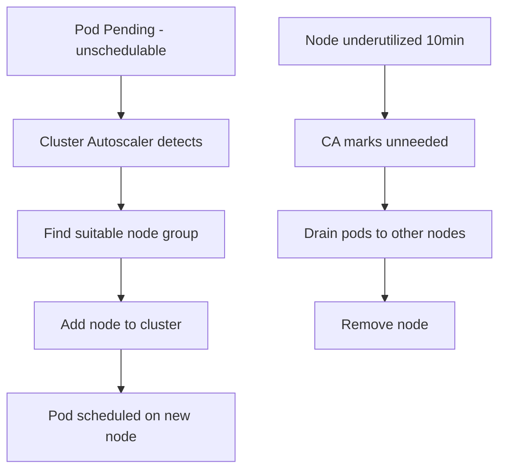

> 💡 **Quick Answer:** Configure the Cluster Autoscaler to automatically add and remove nodes based on pod scheduling demands. Covers AWS, GKE, Azure, and bare-metal setups.

## The Problem

Engineers frequently search for this topic but find scattered, incomplete guides. This recipe provides a comprehensive, production-ready reference.

## The Solution

### Install Cluster Autoscaler (AWS EKS)

```bash
helm repo add autoscaler https://kubernetes.github.io/autoscaler
helm install cluster-autoscaler autoscaler/cluster-autoscaler \
  --namespace kube-system \
  --set autoDiscovery.clusterName=my-cluster \
  --set awsRegion=eu-west-1 \
  --set extraArgs.balance-similar-node-groups=true \
  --set extraArgs.skip-nodes-with-system-pods=false \
  --set extraArgs.scale-down-delay-after-add=10m \
  --set extraArgs.scale-down-unneeded-time=10m
```

### How It Works

```bash
# Scale UP: Pod stuck in Pending → CA adds a node
kubectl get pods | grep Pending

# Scale DOWN: Node underutilized for 10min → CA drains & removes
# Node is "unneeded" if all pods can be rescheduled elsewhere

# Check CA status
kubectl -n kube-system logs -l app.kubernetes.io/name=cluster-autoscaler --tail=50
kubectl get configmap cluster-autoscaler-status -n kube-system -o yaml
```

### Node Group Configuration

```yaml
# AWS: Auto-discovery via ASG tags
# Tag your ASG with:
#   k8s.io/cluster-autoscaler/enabled: true
#   k8s.io/cluster-autoscaler/my-cluster: owned

# GKE: Enable via gcloud
# gcloud container clusters update my-cluster --enable-autoscaling \
#   --min-nodes=1 --max-nodes=10

# Priority-based expander (prefer cheaper instances)
apiVersion: v1
kind: ConfigMap
metadata:
  name: cluster-autoscaler-priority-expander
  namespace: kube-system
data:
  priorities: |
    10:
      - spot-nodes.*
    50:
      - on-demand-nodes.*
```



## Frequently Asked Questions

### Cluster Autoscaler vs Karpenter?

**CA** scales existing node groups (ASGs). **Karpenter** (AWS-only) provisions optimal instances directly — faster, more flexible, bin-packs better. Use Karpenter on EKS if possible.

### Why isn't my node scaling down?

Common blockers: pods with local storage (emptyDir), PDBs preventing drain, pods without controllers, system pods. Check CA logs for "cannot remove node" reasons.

## Best Practices

- Start with the simplest approach that solves your problem
- Test thoroughly in staging before production
- Monitor and iterate based on real metrics
- Document decisions for your team

## Key Takeaways

- This is essential Kubernetes operational knowledge
- Production-readiness requires proper configuration and monitoring
- Use `kubectl describe` and logs for troubleshooting
- Automate where possible to reduce human error
