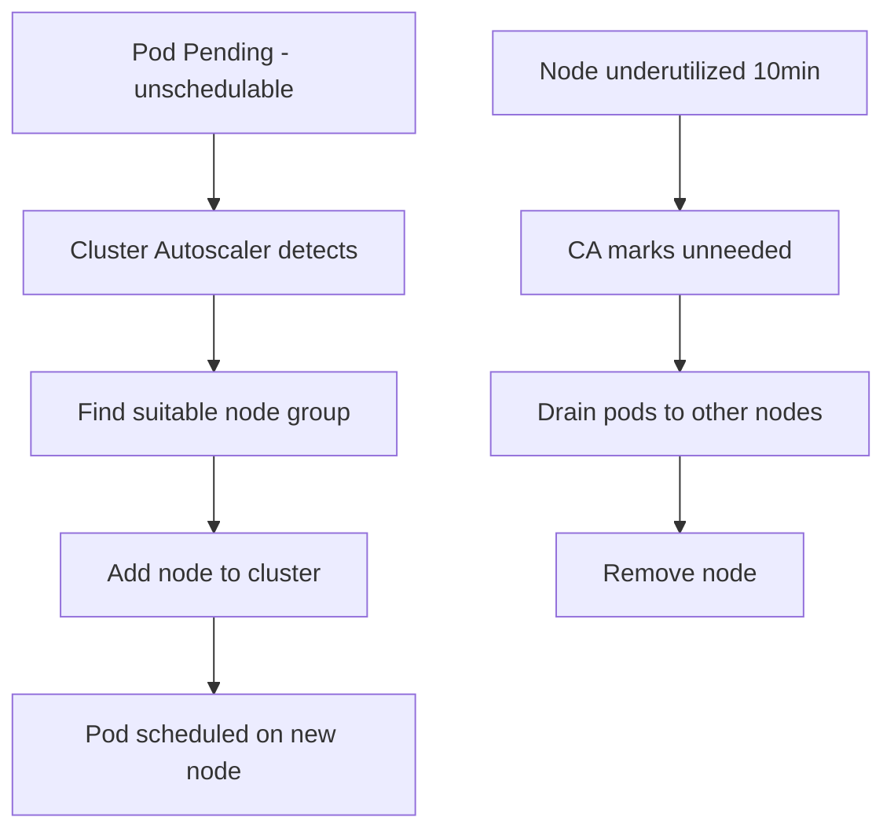

> 💡 **Quick Answer:** Configure the Cluster Autoscaler to automatically add and remove nodes based on pod scheduling demands. Covers AWS, GKE, Azure, and bare-metal setups.

## The Problem

Your cluster runs out of capacity when demand spikes — pods stay Pending because no node has room for them — and manual node scaling is too slow to react. You also don't want nodes sitting idle burning cost once demand drops.

## The Solution

### Install Cluster Autoscaler (AWS EKS)

```bash
helm repo add autoscaler https://kubernetes.github.io/autoscaler
helm install cluster-autoscaler autoscaler/cluster-autoscaler \
  --namespace kube-system \
  --set autoDiscovery.clusterName=my-cluster \
  --set awsRegion=eu-west-1 \
  --set extraArgs.balance-similar-node-groups=true \
  --set extraArgs.skip-nodes-with-system-pods=false \
  --set extraArgs.scale-down-delay-after-add=10m \
  --set extraArgs.scale-down-unneeded-time=10m
```

### How It Works

```bash
# Scale UP: Pod stuck in Pending → CA adds a node
kubectl get pods | grep Pending

# Scale DOWN: Node underutilized for 10min → CA drains & removes
# Node is "unneeded" if all pods can be rescheduled elsewhere

# Check CA status
kubectl -n kube-system logs -l app.kubernetes.io/name=cluster-autoscaler --tail=50
kubectl get configmap cluster-autoscaler-status -n kube-system -o yaml
```

### Node Group Configuration

```yaml
# AWS: Auto-discovery via ASG tags
# Tag your ASG with:
#   k8s.io/cluster-autoscaler/enabled: true
#   k8s.io/cluster-autoscaler/my-cluster: owned

# GKE: Enable via gcloud
# gcloud container clusters update my-cluster --enable-autoscaling \
#   --min-nodes=1 --max-nodes=10

# Priority-based expander (prefer cheaper instances)
apiVersion: v1
kind: ConfigMap
metadata:
  name: cluster-autoscaler-priority-expander
  namespace: kube-system
data:
  priorities: |
    10:
      - spot-nodes.*
    50:
      - on-demand-nodes.*
```



### Expander Strategies

The expander controls which node group Cluster Autoscaler picks when several could satisfy a pending pod:

| Expander | Strategy |
|----------|----------|
| `random` | Random selection |
| `most-pods` | Add the node that fits the most pending pods |
| `least-waste` | Add the node with least idle CPU/memory after scaling |
| `price` | Add the cheapest node (cloud-provider specific) |
| `priority` | Use a priority-based ConfigMap (shown above) |

```yaml
- --expander=least-waste
```

### Scale-Down Configuration

```yaml
- --scale-down-enabled=true
- --scale-down-delay-after-add=10m       # wait this long after adding a node before considering scale-down
- --scale-down-delay-after-delete=0s     # wait this long after deleting a node
- --scale-down-unneeded-time=10m         # a node must be unneeded for this long before removal
- --scale-down-utilization-threshold=0.5 # scale down if utilization is below 50%
```

Setting these delays too low causes thrashing — nodes get added and removed repeatedly as load fluctuates near the threshold.

### Preventing Scale-Down

Protect a node running a workload that shouldn't be evicted:

```yaml
# Pod-level: this pod blocks its node from being scaled down
apiVersion: v1
kind: Pod
metadata:
  name: important-pod
  annotations:
    cluster-autoscaler.kubernetes.io/safe-to-evict: "false"
```

```bash
# Node-level: mark a specific node as non-scalable
kubectl annotate node my-node cluster-autoscaler.kubernetes.io/scale-down-disabled=true
```

Also protect availability during scale-down with a PodDisruptionBudget:

```yaml
apiVersion: policy/v1
kind: PodDisruptionBudget
metadata:
  name: myapp-pdb
spec:
  minAvailable: 2
  selector:
    matchLabels:
      app: myapp
```

### Monitoring

```bash
kubectl get configmap cluster-autoscaler-status -n kube-system -o yaml
kubectl logs -n kube-system -l app.kubernetes.io/name=cluster-autoscaler -f
```

```promql
# Pods stuck Pending
sum(kube_pod_status_phase{phase="Pending"})

# Cluster-wide node count
count(kube_node_info)

# Scaling activity
cluster_autoscaler_scaled_up_nodes_total
cluster_autoscaler_scaled_down_nodes_total
```

## Frequently Asked Questions

### Cluster Autoscaler vs Karpenter?

**CA** scales existing node groups (ASGs). **Karpenter** (AWS-only) provisions optimal instances directly — faster, more flexible, bin-packs better. Use Karpenter on EKS if possible.

### Why isn't my node scaling down?

Common blockers: pods with local storage (emptyDir), PDBs preventing drain, pods without controllers, system pods. Check CA logs for "cannot remove node" reasons.

## Best Practices

- **Set a sane min/max per node group** (e.g. `2:20`) — a minimum of 2 helps HA; a hard max caps runaway cost
- **Use Pod Priority classes** for critical workloads so preemption and scheduling favor them under pressure
- **Don't set scale-down delays too low** — it causes node thrashing
- **Use PodDisruptionBudgets** to keep workloads available while nodes drain during scale-down
- **Watch cloud cost dashboards**, not just cluster metrics — scaling decisions have a direct cost impact

## Key Takeaways

- Cluster Autoscaler adds nodes when pods are Pending and removes nodes that are underutilized for a sustained period
- It complements HPA: HPA scales pod replicas, Cluster Autoscaler scales nodes to fit them
- `safe-to-evict: "false"` and PodDisruptionBudgets are the two levers to stop a node being scaled down
- Karpenter is the modern alternative on AWS — it provisions right-sized instances directly instead of scaling fixed node groups
- Tune `scale-down-delay-after-add` and `scale-down-unneeded-time` to avoid thrashing under fluctuating load
