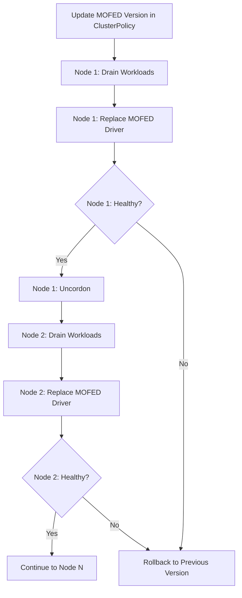

> 💡 **Quick Answer:** Set `mofed.upgradePolicy.autoUpgrade: true` with `maxParallelUpgrades: 1` and drain enabled to safely roll MOFED driver updates across GPU nodes one at a time.

## The Problem

Upgrading MOFED drivers on production GPU nodes is risky — a bad driver version can take down RDMA networking across your entire cluster, breaking distributed training jobs. You need:

- **Rolling upgrades** — update one node at a time, not all at once
- **Workload drain** — move pods off the node before replacing drivers
- **Validation** — verify the new driver works before proceeding to the next node
- **Rollback** — revert if something goes wrong

## The Solution

### Step 1: Configure the Upgrade Policy

```yaml
apiVersion: nvidia.com/v1
kind: ClusterPolicy
metadata:
  name: cluster-policy
spec:
  mofed:
    enabled: true
    image: mofed
    repository: nvcr.io/nvstaging/mellanox
    version: "24.07-0.6.1.0"
    upgradePolicy:
      autoUpgrade: true
      maxParallelUpgrades: 1
      waitForCompletion:
        timeoutSeconds: 600
      drain:
        enable: true
        force: true
        podSelector: ""
        timeoutSeconds: 300
        deleteEmptyDir: true
    startupProbe:
      initialDelaySeconds: 10
      periodSeconds: 20
      failureThreshold: 30
```

### Step 2: Trigger an Upgrade

Update the MOFED version in the ClusterPolicy:

```bash
# Patch to new MOFED version
kubectl patch clusterpolicy cluster-policy --type merge -p '{
  "spec": {
    "mofed": {
      "version": "24.10-1.1.4.0"
    }
  }
}'
```

### Step 3: Monitor the Rolling Upgrade

```bash
# Watch MOFED pods restart one at a time
kubectl get pods -n gpu-operator -l app=mofed-ubuntu -w

# Check upgrade state per node
kubectl get nodes -l nvidia.com/gpu.present=true \
  -o custom-columns=\
'NAME:.metadata.name,MOFED:.metadata.annotations.nvidia\.com/mofed-driver-upgrade-state'

# Detailed logs during upgrade
kubectl logs -n gpu-operator -l app=mofed-ubuntu -f --tail=20
```

### Step 4: Validate After Upgrade

```bash
#!/bin/bash
# validate-mofed-upgrade.sh

EXPECTED_VERSION="24.10-1.1.4.0"

for node in $(kubectl get nodes -l nvidia.com/gpu.present=true -o name); do
  NODE_NAME=$(echo "$node" | cut -d/ -f2)
  POD=$(kubectl get pod -n gpu-operator -l app=mofed-ubuntu \
    --field-selector spec.nodeName="$NODE_NAME" -o jsonpath='{.items[0].metadata.name}')

  VERSION=$(kubectl exec -n gpu-operator "$POD" -- ofed_info -s 2>/dev/null | tr -d '[:space:]')
  LINK_STATE=$(kubectl exec -n gpu-operator "$POD" -- ibstat 2>/dev/null | grep "State:" | head -1)

  if [[ "$VERSION" == *"$EXPECTED_VERSION"* ]]; then
    echo "✅ $NODE_NAME: $VERSION | $LINK_STATE"
  else
    echo "❌ $NODE_NAME: $VERSION (expected $EXPECTED_VERSION)"
  fi
done
```

### Step 5: Rollback if Needed

```bash
# Revert to previous MOFED version
kubectl patch clusterpolicy cluster-policy --type merge -p '{
  "spec": {
    "mofed": {
      "version": "24.07-0.6.1.0"
    }
  }
}'

# Monitor rollback
kubectl get pods -n gpu-operator -l app=mofed-ubuntu -w
```



## Common Issues

### Upgrade Stuck on Drain

Pods with PodDisruptionBudgets may block drain:

```bash
# Force drain with PDB override
kubectl patch clusterpolicy cluster-policy --type merge -p '{
  "spec": {
    "mofed": {
      "upgradePolicy": {
        "drain": {
          "force": true,
          "deleteEmptyDir": true
        }
      }
    }
  }
}'
```

### Timeout During Driver Compilation

Large kernels or slow nodes may need longer startup probes:

```yaml
startupProbe:
  initialDelaySeconds: 30
  periodSeconds: 30
  failureThreshold: 60  # 30 minutes total
```

## Best Practices

- **Always set `maxParallelUpgrades: 1`** in production — never upgrade all nodes simultaneously
- **Test in staging first** — validate the new MOFED version with your workloads before production
- **Enable drain** — workloads should be evacuated before driver replacement
- **Monitor `ibstat` after each node** — verify link state returns to Active
- **Keep the previous version documented** — for quick rollback reference
- **Schedule upgrades during maintenance windows** — even rolling upgrades cause brief disruptions

## Key Takeaways

- The GPU Operator handles MOFED rolling upgrades automatically via the ClusterPolicy `upgradePolicy`
- Set `maxParallelUpgrades: 1` and enable drain for safe production upgrades
- Validate each node with `ofed_info -s` and `ibstat` after the upgrade
- Rollback by simply reverting the version string in the ClusterPolicy
