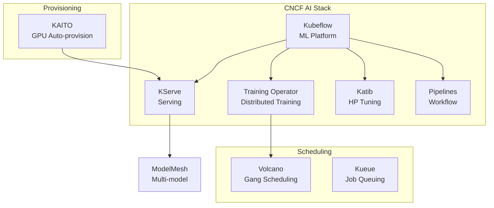

> 💡 **Quick Answer:** The CNCF Cloud Native AI (CNAI) landscape covers: **Kubeflow** (ML platform), **KServe** (model serving), **Volcano** (batch scheduling), **KAITO** (automated GPU provisioning), and **Kueue** (job queuing). Choose based on your stage: Kubeflow for full MLOps, KServe for serving-only, KAITO for quickstart.

## The Problem

The AI/ML ecosystem on Kubernetes has grown from a few projects to a sprawling landscape. Choosing the right combination of CNCF projects for training, serving, scheduling, and monitoring AI workloads is confusing — especially when projects overlap in functionality.

## The Solution

### CNCF AI Project Map

| Category | Project | Stage | Purpose |
|----------|---------|-------|---------|
| **ML Platform** | Kubeflow | Graduated candidate | Full MLOps lifecycle |
| **Model Serving** | KServe | Incubating | Serverless inference |
| **Batch Scheduling** | Volcano | Incubating | Gang scheduling, queues |
| **Job Queuing** | Kueue | Sandbox | Fair sharing, quotas |
| **GPU Provisioning** | KAITO | Sandbox | Automated LLM deploy |
| **Distributed Training** | Training Operator | Part of Kubeflow | PyTorch/TF/MPI jobs |
| **HP Tuning** | Katib | Part of Kubeflow | AutoML experiments |
| **Feature Store** | Feast | Graduated candidate | Feature management |

### Decision Tree

```
Need full ML platform (notebooks + training + serving)?
  → Kubeflow

Just need model serving with autoscaling?
  → KServe (standalone, without full Kubeflow)

Need to deploy a preset LLM quickly?
  → KAITO (provisions GPU nodes automatically)

Need batch scheduling for training jobs?
  → Volcano (gang scheduling, fair-share queues)
  → Kueue (lighter weight, K8s-native queuing)

Need multi-model serving on shared GPUs?
  → ModelMesh (part of KServe)

Need hyperparameter tuning?
  → Katib (part of Kubeflow, or standalone)
```

### Complementary Projects

```yaml
# Common production stack:
# 1. Kueue for job admission control
apiVersion: kueue.x-k8s.io/v1beta1
kind: ClusterQueue
metadata:
  name: gpu-queue
spec:
  resourceGroups:
    - coveredResources: ["nvidia.com/gpu"]
      flavors:
        - name: a100
          resources:
            - name: nvidia.com/gpu
              nominalQuota: 32

---
# 2. Volcano for gang scheduling
apiVersion: scheduling.volcano.sh/v1beta1
kind: Queue
metadata:
  name: training
spec:
  weight: 2
  capability:
    nvidia.com/gpu: 16

---
# 3. KServe for serving
apiVersion: serving.kserve.io/v1beta1
kind: InferenceService
metadata:
  name: production-model
spec:
  predictor:
    model:
      modelFormat:
        name: pytorch
      storageUri: "s3://models/production/v5"
```

### LF AI & Data Landscape

Beyond CNCF, the Linux Foundation AI & Data hosts additional projects:

- **ONNX** — Open model format, framework interoperability
- **Horovod** — Distributed deep learning (Uber)
- **MLflow** — Experiment tracking and model registry
- **Ray** — Distributed computing framework



## Common Issues

**Kubeflow vs KAITO — which to install?**

Different purposes. Kubeflow is a full ML platform (notebooks, training, pipelines, serving). KAITO is a one-click LLM deployment tool. Use KAITO for quick inference, Kubeflow for full MLOps lifecycle.

**Volcano vs Kueue — which scheduler?**

Volcano for complex gang scheduling with custom plugins. Kueue for simpler fair-share queuing that works with the default scheduler. Many teams use Kueue for simplicity.

## Best Practices

- **Start with KServe** if you only need model serving — don't install all of Kubeflow
- **Add Kueue early** — job queuing prevents GPU resource conflicts
- **KAITO for LLM quickstart** — minutes to deploy vs hours with manual setup
- **Volcano for multi-node training** — gang scheduling prevents partial starts
- **Check CNCF maturity level** — Graduated > Incubating > Sandbox for production use

## Key Takeaways

- CNCF AI ecosystem covers the full ML lifecycle: training, tuning, serving, scheduling, monitoring
- Kubeflow is the comprehensive platform; KServe, Katib, and Training Operator can be used standalone
- KAITO automates LLM deployment end-to-end — GPU provisioning through serving
- Volcano and Kueue solve GPU scheduling — gang scheduling and fair-share queuing
- Choose based on need: full platform (Kubeflow), serving only (KServe), quick LLM deploy (KAITO)
