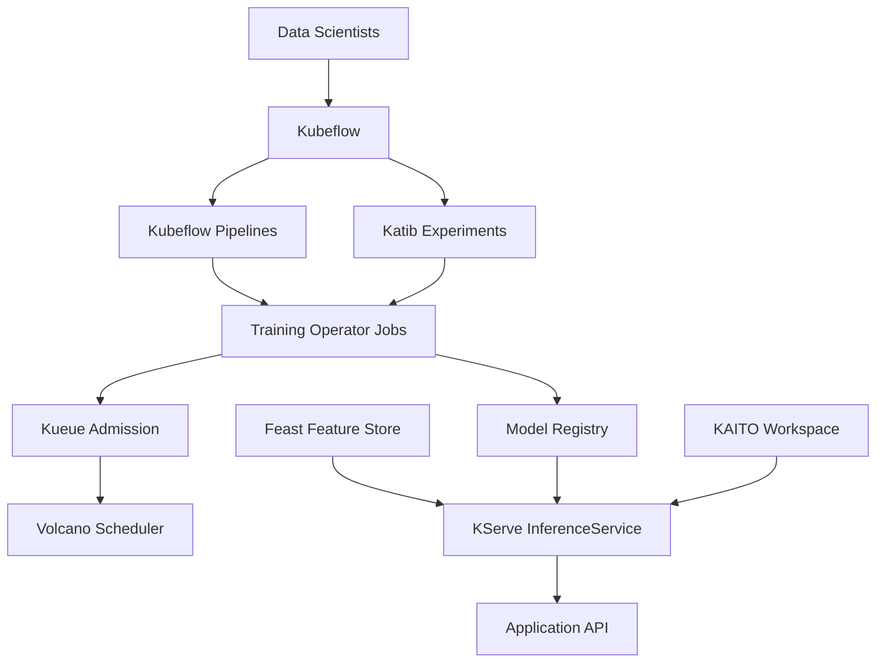

> **Quick Answer:** Start with the workload boundary. Use Kubeflow when you need a full ML platform, KServe when you only need model serving, Katib for hyperparameter search, Feast for online and offline features, Volcano or Kueue for queued GPU jobs, and KAITO when the goal is a fast LLM deployment path on Kubernetes.

## The Problem

The Kubernetes AI ecosystem is no longer one project. It is a set of operators, CRDs, schedulers, serving runtimes, feature stores, and platform components that solve different parts of the machine learning lifecycle.

That creates two recurring mistakes:

- Installing a full MLOps platform when the team only needs inference.
- Building custom glue code for scheduling, tuning, and feature delivery when mature cloud native components already exist.

The right question is not "Which AI project should I install?" The right question is "Which part of the AI lifecycle am I standardizing on Kubernetes?"

## The Solution

### Project-by-Project Map

| Project | Primary job | Use it when | Avoid it when |
| --- | --- | --- | --- |
| Kubeflow | End-to-end ML platform | You need notebooks, pipelines, training, tuning, and serving under one platform | You only need one inference endpoint |
| KServe | Model serving CRDs | You want a Kubernetes-native inference API with autoscaling and model runtime abstraction | You need full experiment tracking and pipeline orchestration |
| Katib | Hyperparameter tuning and AutoML | You run many trials and need early stopping, search algorithms, and experiment CRDs | Training jobs are manual or infrequent |
| Feast | Feature store | Models need consistent online and offline features | Your model uses static files only |
| Volcano | Batch and AI scheduler | Multi-pod training jobs need gang scheduling, queues, and fair sharing | Default scheduler plus simple quotas are enough |
| Kueue | Kubernetes-native job queuing | You want admission control and quota-aware batch scheduling | You need complex custom scheduling plugins |
| KAITO | AI toolchain operator | You want a fast path for LLM inference, fine tuning, and RAG workloads | You need to own every serving and provisioning detail |
| Kubeflow Training Operator | Distributed training CRDs | You run PyTorchJob, TFJob, MPIJob, or XGBoostJob workloads | You only serve already trained models |

### CNCF Maturity Notes

CNCF maturity matters, but it is not the only decision factor. Incubating projects have broader adoption signals than sandbox projects, while sandbox projects can still be useful for focused use cases.

As of July 6, 2026:

- Kubeflow is a CNCF incubating project for AI platforms on Kubernetes.
- KServe is a CNCF incubating project for distributed generative and predictive inference.
- Volcano is a CNCF incubating project for cloud native batch scheduling.
- KAITO is a CNCF sandbox project for LLM inference, tuning, and RAG workloads.

Always verify maturity before making a procurement or production platform decision because project status can change.

## Decision Tree

```text
Do you need an end-to-end ML platform?
  yes -> Kubeflow
  no  -> continue

Do you need to serve models behind an API?
  yes -> KServe
  no  -> continue

Do you need a fast LLM deployment operator?
  yes -> KAITO
  no  -> continue

Do training jobs need all pods to start together?
  yes -> Volcano
  no  -> continue

Do teams compete for shared GPU quota?
  yes -> Kueue
  no  -> continue

Do models need fresh online and offline features?
  yes -> Feast
  no  -> use plain Kubernetes Jobs, Deployments, and storage first

Do you run many tuning trials?
  yes -> Katib
```

## Reference Architecture



## Worked Stack

### 1. Queue GPU Training Jobs with Kueue

```yaml
apiVersion: kueue.x-k8s.io/v1beta1
kind: ResourceFlavor
metadata:
  name: h100
spec:
  nodeLabels:
    accelerator: h100
---
apiVersion: kueue.x-k8s.io/v1beta1
kind: ClusterQueue
metadata:
  name: shared-gpu
spec:
  namespaceSelector: {}
  resourceGroups:
    - coveredResources:
        - nvidia.com/gpu
      flavors:
        - name: h100
          resources:
            - name: nvidia.com/gpu
              nominalQuota: 32
```

### 2. Run Gang-Scheduled Training with Volcano

```yaml
apiVersion: scheduling.volcano.sh/v1beta1
kind: Queue
metadata:
  name: training
spec:
  weight: 2
  capability:
    nvidia.com/gpu: 16
---
apiVersion: batch.volcano.sh/v1alpha1
kind: Job
metadata:
  name: llama-finetune
spec:
  minAvailable: 4
  schedulerName: volcano
  queue: training
  tasks:
    - replicas: 4
      name: worker
      template:
        spec:
          restartPolicy: Never
          containers:
            - name: trainer
              image: registry.example.com/ml/train:2026.07
              command: ["torchrun"]
              args:
                - "--nnodes=4"
                - "--nproc-per-node=8"
                - "/workspace/train.py"
              resources:
                limits:
                  nvidia.com/gpu: 8
```

### 3. Tune with Katib

```yaml
apiVersion: kubeflow.org/v1beta1
kind: Experiment
metadata:
  name: learning-rate-search
spec:
  objective:
    type: minimize
    goal: 0.08
    objectiveMetricName: validation_loss
  algorithm:
    algorithmName: bayesianoptimization
  maxTrialCount: 24
  parallelTrialCount: 4
  parameters:
    - name: lr
      parameterType: double
      feasibleSpace:
        min: "0.00001"
        max: "0.001"
    - name: batch_size
      parameterType: categorical
      feasibleSpace:
        list:
          - "16"
          - "32"
          - "64"
  trialTemplate:
    primaryContainerName: trainer
    trialParameters:
      - name: lr
        reference: lr
      - name: batch_size
        reference: batch_size
    trialSpec:
      apiVersion: batch/v1
      kind: Job
      spec:
        template:
          spec:
            restartPolicy: Never
            containers:
              - name: trainer
                image: registry.example.com/ml/trainer:2026.07
                args:
                  - "--lr=${trialParameters.lr}"
                  - "--batch-size=${trialParameters.batch_size}"
                resources:
                  limits:
                    nvidia.com/gpu: 1
```

### 4. Serve with KServe

```yaml
apiVersion: serving.kserve.io/v1beta1
kind: InferenceService
metadata:
  name: fraud-model
  namespace: ai-serving
spec:
  predictor:
    minReplicas: 2
    model:
      modelFormat:
        name: sklearn
      storageUri: "s3://models/fraud/v17"
      resources:
        requests:
          cpu: "2"
          memory: 4Gi
        limits:
          cpu: "4"
          memory: 8Gi
```

### 5. Add Feast for Feature Consistency

```yaml
apiVersion: apps/v1
kind: Deployment
metadata:
  name: feast-online
  namespace: ai-platform
spec:
  replicas: 3
  selector:
    matchLabels:
      app: feast-online
  template:
    metadata:
      labels:
        app: feast-online
    spec:
      containers:
        - name: feast
          image: feastdev/feature-server:0.40
          args: ["serve", "--host", "0.0.0.0", "--port", "6566"]
          ports:
            - containerPort: 6566
          env:
            - name: FEAST_USAGE
              value: "False"
          resources:
            requests:
              cpu: "1"
              memory: 2Gi
            limits:
              cpu: "2"
              memory: 4Gi
```

## Common Issues

**Installing Kubeflow too early**

Kubeflow is valuable when you need the whole lifecycle. For one inference service, start with KServe, a model registry, object storage, and observability.

**Confusing Volcano and Kueue**

Kueue decides whether a job should be admitted based on quotas and flavors. Volcano controls how pods are scheduled, including gang scheduling. They can be complementary.

**Treating Feast as a database**

Feast is a feature store layer. You still need online storage, offline storage, ingestion jobs, and feature ownership.

**Skipping platform boundaries**

Keep training, serving, and feature namespaces separate. Each has different RBAC, quota, network policy, and data access requirements.

## Best Practices

- Start with the smallest project that solves the current bottleneck.
- Standardize model storage and registry conventions before adding more orchestration.
- Use Kueue or Volcano before GPU contention becomes political.
- Put inference services behind SLOs, not just Deployments.
- Keep training CRDs and serving CRDs separated by namespace and RBAC.
- Revisit CNCF maturity and project health during quarterly platform reviews.

## Key Takeaways

- The CNCF AI ecosystem is a stack, not a single install.
- Kubeflow is the broad platform, while KServe, Katib, and Training Operator solve focused lifecycle stages.
- Feast belongs in the feature path, not the model serving path itself.
- Volcano and Kueue solve different scheduling problems and often work together.
- The best first project is the one that removes the team's current operational constraint.
