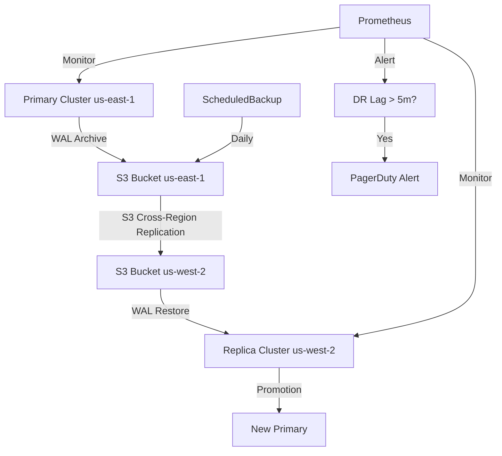

> 💡 **Quick Answer:** Create a CNPG replica cluster in a secondary region that continuously streams WALs from the primary cluster's S3 backup, enabling promotion to standalone with near-zero RPO.

## The Problem

A single-region PostgreSQL cluster is vulnerable to region-wide outages, AZ failures, and catastrophic data corruption. You need a hot standby in another region that can be promoted to primary within minutes, with minimal data loss.

## The Solution

CNPG supports designated replica clusters that continuously restore from an object store backup, staying up-to-date via WAL streaming. On disaster, promote the replica cluster to become the new primary.

### Primary Cluster with Continuous Backup

```yaml
apiVersion: postgresql.cnpg.io/v1
kind: Cluster
metadata:
  name: app-db-primary
  namespace: production
  annotations:
    cnpg.io/replicaClusterDesignatedPrimary: "app-db-primary"
spec:
  instances: 3
  imageName: ghcr.io/cloudnative-pg/postgresql:16.4

  bootstrap:
    initdb:
      database: appdb
      owner: appuser

  storage:
    size: 100Gi
    storageClass: gp3-encrypted

  backup:
    barmanObjectStore:
      destinationPath: s3://pg-backups-us-east-1/app-db/
      s3Credentials:
        accessKeyId:
          name: s3-creds
          key: ACCESS_KEY_ID
        secretAccessKey:
          name: s3-creds
          key: SECRET_ACCESS_KEY
      wal:
        compression: gzip
        maxParallel: 8
      data:
        compression: gzip
        jobs: 4
    retentionPolicy: "30d"

  replica:
    enabled: true
    source: app-db-primary
  
  externalClusters:
    - name: app-db-primary
      barmanObjectStore:
        destinationPath: s3://pg-backups-us-east-1/app-db/
        s3Credentials:
          accessKeyId:
            name: s3-creds
            key: ACCESS_KEY_ID
          secretAccessKey:
            name: s3-creds
            key: SECRET_ACCESS_KEY
```

### Replica Cluster (Secondary Region)

```yaml
# Deploy this in your DR region (e.g., us-west-2)
apiVersion: postgresql.cnpg.io/v1
kind: Cluster
metadata:
  name: app-db-dr
  namespace: production
spec:
  instances: 3
  imageName: ghcr.io/cloudnative-pg/postgresql:16.4

  replica:
    enabled: true
    source: app-db-primary

  externalClusters:
    - name: app-db-primary
      barmanObjectStore:
        destinationPath: s3://pg-backups-us-east-1/app-db/
        s3Credentials:
          accessKeyId:
            name: s3-creds-cross-region
            key: ACCESS_KEY_ID
          secretAccessKey:
            name: s3-creds-cross-region
            key: SECRET_ACCESS_KEY

  storage:
    size: 100Gi
    storageClass: gp3-encrypted

  resources:
    requests:
      cpu: 500m
      memory: 1Gi
    limits:
      cpu: "2"
      memory: 4Gi
```

### Promote Replica to Primary (Failover)

```bash
# During disaster — promote DR cluster to standalone primary
kubectl patch cluster app-db-dr -n production \
  --type merge -p '{"spec":{"replica":{"enabled": false}}}'

# The replica cluster will:
# 1. Stop WAL replay
# 2. Promote the designated primary to read-write
# 3. Begin accepting write traffic
# 4. Start its own WAL archiving

# Verify promotion
kubectl cnpg status app-db-dr -n production

# Update application DNS/endpoints to point to DR cluster
# app-db-dr-rw.production.svc
```

### Cross-Region S3 Replication

```yaml
# Ensure S3 bucket has cross-region replication for lower RPO
# AWS S3 Replication Rule (Terraform example)
# resource "aws_s3_bucket_replication_configuration" "pg_backup" {
#   bucket = aws_s3_bucket.pg_backups_east.id
#   role   = aws_iam_role.replication.arn
#   rule {
#     id     = "replicate-wal"
#     status = "Enabled"
#     destination {
#       bucket        = aws_s3_bucket.pg_backups_west.arn
#       storage_class = "STANDARD_IA"
#     }
#   }
# }

# S3 credentials for DR region need read access to primary backup
apiVersion: v1
kind: Secret
metadata:
  name: s3-creds-cross-region
  namespace: production
type: Opaque
stringData:
  ACCESS_KEY_ID: "AKIA..."
  SECRET_ACCESS_KEY: "..."
```

### Tablespace Support for Tiered Storage

```yaml
apiVersion: postgresql.cnpg.io/v1
kind: Cluster
metadata:
  name: app-db-tiered
  namespace: production
spec:
  instances: 3
  imageName: ghcr.io/cloudnative-pg/postgresql:16.4

  storage:
    size: 50Gi
    storageClass: gp3-encrypted

  tablespaces:
    - name: archive_data
      storage:
        size: 200Gi
        storageClass: st1-large  # Cheaper, throughput-optimized
    - name: hot_data
      storage:
        size: 100Gi
        storageClass: io2-fast   # High IOPS for hot tables
```

### DR Runbook Script

```bash
#!/bin/bash
set -euo pipefail

PRIMARY_CLUSTER="app-db-primary"
DR_CLUSTER="app-db-dr"
NS="production"
PRIMARY_CTX="us-east-1"
DR_CTX="us-west-2"

echo "=== DR Failover Runbook ==="

# 1. Verify primary is actually down
echo "1. Checking primary cluster status..."
if kubectl --context=${PRIMARY_CTX} cnpg status ${PRIMARY_CLUSTER} -n ${NS} 2>/dev/null; then
  echo "WARNING: Primary cluster appears healthy!"
  echo "Are you sure you want to failover? (yes/no)"
  read -r CONFIRM
  [ "$CONFIRM" != "yes" ] && exit 1
fi

# 2. Check DR cluster replication lag
echo "2. Checking DR cluster replication status..."
kubectl --context=${DR_CTX} cnpg status ${DR_CLUSTER} -n ${NS}

# 3. Promote DR cluster
echo "3. Promoting DR cluster to primary..."
kubectl --context=${DR_CTX} patch cluster ${DR_CLUSTER} -n ${NS} \
  --type merge -p '{"spec":{"replica":{"enabled": false}}}'

# 4. Wait for promotion
echo "4. Waiting for promotion..."
kubectl --context=${DR_CTX} wait cluster/${DR_CLUSTER} -n ${NS} \
  --for=jsonpath='{.status.phase}'=Cluster\ in\ healthy\ state \
  --timeout=300s

# 5. Verify write access
echo "5. Verifying write access..."
kubectl --context=${DR_CTX} cnpg psql ${DR_CLUSTER} -n ${NS} -- \
  -c "SELECT pg_is_in_recovery();"
# Should return 'f' (false = primary)

echo "=== Failover complete ==="
echo "Update application DNS to: ${DR_CLUSTER}-rw.${NS}.svc"
echo "New primary: $(kubectl --context=${DR_CTX} get pods -n ${NS} \
  -l cnpg.io/cluster=${DR_CLUSTER},role=primary \
  -o jsonpath='{.items[0].metadata.name}')"
```

### Monitoring DR Health

```yaml
# PrometheusRule for DR alerting
apiVersion: monitoring.coreos.com/v1
kind: PrometheusRule
metadata:
  name: cnpg-dr-alerts
  namespace: production
spec:
  groups:
    - name: cnpg-dr
      rules:
        - alert: CNPGReplicaLagHigh
          expr: |
            cnpg_pg_replication_lag > 300
          for: 5m
          labels:
            severity: warning
          annotations:
            summary: "CNPG replica lag > 5 minutes"
            description: "Cluster {{ $labels.cluster }} replica lag is {{ $value }}s"

        - alert: CNPGBackupFailed
          expr: |
            cnpg_pg_stat_archiver_failed_count > 0
          for: 10m
          labels:
            severity: critical
          annotations:
            summary: "CNPG WAL archiving failures detected"

        - alert: CNPGDRClusterNotReplicating
          expr: |
            cnpg_pg_replication_streaming == 0
          for: 15m
          labels:
            severity: critical
          annotations:
            summary: "DR cluster stopped replicating"
```



## Common Issues

- **Replica cluster not catching up** — verify S3 cross-region replication is enabled; check IAM permissions on DR region credentials
- **Promotion stuck** — check CNPG operator logs in DR cluster; ensure no fencing issues on replica pods
- **High RPO after failover** — WAL archival has inherent delay; for near-zero RPO, use streaming replication between clusters (requires network connectivity)
- **Split-brain after primary recovery** — never bring the old primary back without demoting it first; fence it and rebuild as replica of the new primary
- **WAL archival failures** — monitor `cnpg_pg_stat_archiver_failed_count`; common cause is S3 credential expiry

## Best Practices

- Use S3 cross-region replication for WAL delivery — don't rely on direct streaming for DR
- Monitor replica lag and WAL archival failures with Prometheus alerts
- Test DR failover quarterly with real promotion exercises
- Document the failover runbook and keep it in version control
- After failover, reconfigure old primary as replica of new primary (never just restart it)
- Use `retentionPolicy` of at least 7 days on both primary and DR backups
- Store S3 credentials in a secrets manager (External Secrets Operator or Vault)

## Key Takeaways

- CNPG replica clusters provide hot standby DR via continuous WAL restoration from S3
- Promotion is a single patch command: disable `spec.replica.enabled`
- Cross-region S3 replication reduces RPO without direct cluster-to-cluster networking
- Tablespaces enable tiered storage for cost optimization
- Always monitor replication lag and WAL archival — these are your DR health indicators
- Never bring an old primary back online without rebuilding it as a replica
