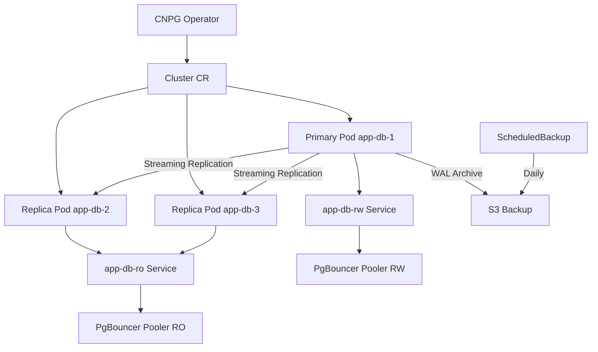

> 💡 **Quick Answer:** Install CloudNativePG operator and create a `Cluster` CR to get a production-ready PostgreSQL cluster with streaming replication, automatic failover, and continuous backup to S3.

## The Problem

Running PostgreSQL on Kubernetes with StatefulSets requires manual replication setup, failover scripting, backup orchestration, and connection pooling. A single misconfigured replica can cause data loss. You need an operator that handles the full PostgreSQL lifecycle natively.

## The Solution

CloudNativePG (CNPG) manages the entire PostgreSQL lifecycle — provisioning, replication, failover, backup, and monitoring — through Kubernetes-native CRDs.

### Install CloudNativePG Operator

```bash
# Install via Helm
helm repo add cnpg https://cloudnative-pg.github.io/charts
helm repo update

helm install cnpg cnpg/cloudnative-pg \
  --namespace cnpg-system \
  --create-namespace \
  --set monitoring.podMonitorEnabled=true

# Verify operator is running
kubectl get pods -n cnpg-system
kubectl get crds | grep cnpg
```

### Basic PostgreSQL Cluster

```yaml
apiVersion: postgresql.cnpg.io/v1
kind: Cluster
metadata:
  name: app-db
  namespace: production
spec:
  instances: 3
  imageName: ghcr.io/cloudnative-pg/postgresql:16.4

  postgresql:
    parameters:
      max_connections: "200"
      shared_buffers: "256MB"
      effective_cache_size: "768MB"
      work_mem: "8MB"
      maintenance_work_mem: "128MB"
      wal_buffers: "16MB"
      max_wal_size: "2GB"
      min_wal_size: "512MB"

  bootstrap:
    initdb:
      database: appdb
      owner: appuser
      secret:
        name: app-db-credentials

  storage:
    size: 50Gi
    storageClass: gp3-encrypted

  resources:
    requests:
      cpu: 500m
      memory: 1Gi
    limits:
      cpu: "2"
      memory: 2Gi

  affinity:
    enablePodAntiAffinity: true
    topologyKey: kubernetes.io/hostname
```

### Database Credentials Secret

```yaml
apiVersion: v1
kind: Secret
metadata:
  name: app-db-credentials
  namespace: production
type: kubernetes.io/basic-auth
stringData:
  username: appuser
  password: "change-me-to-a-strong-password"
```

### Continuous Backup to S3

```yaml
apiVersion: postgresql.cnpg.io/v1
kind: Cluster
metadata:
  name: app-db
  namespace: production
spec:
  instances: 3
  imageName: ghcr.io/cloudnative-pg/postgresql:16.4

  bootstrap:
    initdb:
      database: appdb
      owner: appuser

  storage:
    size: 50Gi
    storageClass: gp3-encrypted

  backup:
    barmanObjectStore:
      destinationPath: s3://my-pg-backups/app-db/
      s3Credentials:
        accessKeyId:
          name: s3-creds
          key: ACCESS_KEY_ID
        secretAccessKey:
          name: s3-creds
          key: SECRET_ACCESS_KEY
      wal:
        compression: gzip
        maxParallel: 4
      data:
        compression: gzip
    retentionPolicy: "30d"
```

### Scheduled Backups

```yaml
apiVersion: postgresql.cnpg.io/v1
kind: ScheduledBackup
metadata:
  name: app-db-daily
  namespace: production
spec:
  schedule: "0 0 2 * * *"  # Daily at 2 AM
  backupOwnerReference: self
  cluster:
    name: app-db
  method: barmanObjectStore
```

### Restore from Backup (PITR)

```yaml
apiVersion: postgresql.cnpg.io/v1
kind: Cluster
metadata:
  name: app-db-restored
  namespace: production
spec:
  instances: 3
  imageName: ghcr.io/cloudnative-pg/postgresql:16.4

  bootstrap:
    recovery:
      source: app-db-backup
      recoveryTarget:
        targetTime: "2026-03-13T07:00:00Z"

  externalClusters:
    - name: app-db-backup
      barmanObjectStore:
        destinationPath: s3://my-pg-backups/app-db/
        s3Credentials:
          accessKeyId:
            name: s3-creds
            key: ACCESS_KEY_ID
          secretAccessKey:
            name: s3-creds
            key: SECRET_ACCESS_KEY

  storage:
    size: 50Gi
    storageClass: gp3-encrypted
```

### Connection Pooling with PgBouncer

```yaml
apiVersion: postgresql.cnpg.io/v1
kind: Pooler
metadata:
  name: app-db-pooler-rw
  namespace: production
spec:
  cluster:
    name: app-db
  instances: 2
  type: rw
  pgbouncer:
    poolMode: transaction
    parameters:
      max_client_conn: "1000"
      default_pool_size: "25"
      min_pool_size: "5"
  template:
    metadata:
      labels:
        app: app-db-pooler
    spec:
      containers:
        - name: pgbouncer
          resources:
            requests:
              cpu: 100m
              memory: 128Mi
            limits:
              cpu: 500m
              memory: 256Mi
---
apiVersion: postgresql.cnpg.io/v1
kind: Pooler
metadata:
  name: app-db-pooler-ro
  namespace: production
spec:
  cluster:
    name: app-db
  instances: 2
  type: ro
  pgbouncer:
    poolMode: transaction
    parameters:
      max_client_conn: "2000"
      default_pool_size: "50"
```

### Application Connection

```yaml
# Services created automatically by CNPG:
# app-db-rw   → primary (read-write)
# app-db-ro   → replicas (read-only)
# app-db-r    → any instance (round-robin)

apiVersion: apps/v1
kind: Deployment
metadata:
  name: myapp
  namespace: production
spec:
  template:
    spec:
      containers:
        - name: app
          image: myapp:latest
          env:
            # Write connection via pooler
            - name: DATABASE_URL
              value: "postgresql://appuser@app-db-pooler-rw:5432/appdb"
            # Read connection via pooler
            - name: DATABASE_READ_URL
              value: "postgresql://appuser@app-db-pooler-ro:5432/appdb"
            - name: PGPASSWORD
              valueFrom:
                secretKeyRef:
                  name: app-db-app
                  key: password
```

### Monitoring with Prometheus

```yaml
apiVersion: postgresql.cnpg.io/v1
kind: Cluster
metadata:
  name: app-db
  namespace: production
spec:
  instances: 3
  imageName: ghcr.io/cloudnative-pg/postgresql:16.4

  monitoring:
    enablePodMonitor: true
    customQueriesConfigMap:
      - name: cnpg-default-monitoring
        key: queries

  storage:
    size: 50Gi
---
# Import CNPG Grafana dashboard
# Dashboard ID: 20417 (CloudNativePG)
```

### Verify Cluster Health

```bash
# Cluster status
kubectl cnpg status app-db -n production

# Check replication lag
kubectl cnpg status app-db -n production --verbose

# Promote a replica (manual failover)
kubectl cnpg promote app-db app-db-2 -n production

# List backups
kubectl get backups -n production

# Check WAL archiving
kubectl cnpg status app-db -n production | grep -A5 "WAL archiving"

# Connect to primary
kubectl cnpg psql app-db -n production -- -c "SELECT pg_is_in_recovery();"

# Benchmark
kubectl cnpg pgbench app-db -n production \
  --job-name=bench-init -- --initialize --scale=10
kubectl cnpg pgbench app-db -n production \
  --job-name=bench-run -- --time=60 --client=10 --jobs=2
```



## Common Issues

- **Cluster stuck in `Setting up primary`** — check StorageClass exists and PVC can bind; verify `kubectl get pvc -n production`
- **Replication lag increasing** — check replica resource limits; increase `max_wal_senders` and network bandwidth
- **Backup failing to S3** — verify S3 credentials secret exists and IAM role has `s3:PutObject`, `s3:GetObject`, `s3:ListBucket`
- **Failover not happening** — CNPG uses lease-based failover; check operator logs `kubectl logs -n cnpg-system deploy/cnpg-cloudnative-pg`
- **PgBouncer connection errors** — ensure `max_client_conn` in Pooler > total app connections; check `default_pool_size` matches PostgreSQL `max_connections`

## Best Practices

- Always deploy 3+ instances for HA with pod anti-affinity across nodes
- Enable continuous WAL archiving to S3/GCS from day one — not just scheduled backups
- Use PgBouncer Pooler for connection management — prevents connection exhaustion
- Separate read-write and read-only traffic via `app-db-rw` and `app-db-ro` services
- Set `retentionPolicy` to keep at least 7 days of backups
- Install the `kubectl cnpg` plugin for cluster management
- Enable PodMonitor for Prometheus metrics and import Grafana dashboard 20417
- Test PITR recovery regularly in a staging environment

## Key Takeaways

- CNPG manages PostgreSQL lifecycle entirely through Kubernetes CRDs
- Automatic failover with streaming replication and lease-based leader election
- Built-in continuous backup to S3/GCS/Azure with point-in-time recovery
- PgBouncer Pooler CRD handles connection pooling natively
- Three auto-created Services: `-rw` (primary), `-ro` (replicas), `-r` (any)
- `kubectl cnpg` plugin provides status, failover, psql, and benchmark commands
