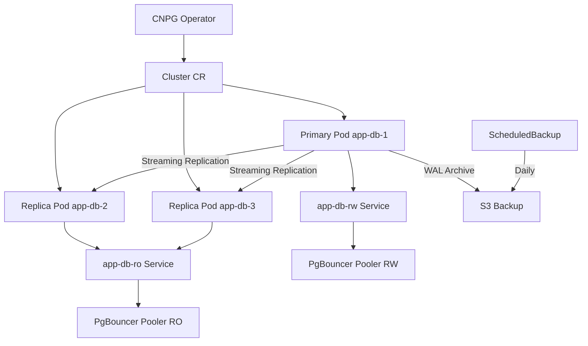

> 💡 **Quick Answer:** CloudNativePG (CNPG, a CNCF project) is the Kubernetes operator for PostgreSQL. Install it (`helm install cnpg cnpg/cloudnative-pg -n cnpg-system --create-namespace`), then create a `Cluster` CR with `instances: 3`: the operator runs one primary and two streaming replicas, fails over automatically, creates `<name>-rw` / `-ro` / `-r` Services and an `<name>-app` credentials Secret, archives WAL to S3 for point-in-time recovery, and adds PgBouncer via the `Pooler` CR. Manage it with the `kubectl cnpg` plugin.
>
> **Gotcha:** `ScheduledBackup.spec.schedule` uses a **6-field** cron with seconds (`"0 0 2 * * *"` = 02:00 daily) — a 5-field Kubernetes-style cron means something else.

## The Problem

Running PostgreSQL on Kubernetes with StatefulSets requires manual replication setup, failover scripting, backup orchestration, and connection pooling. A single misconfigured replica can cause data loss. You need an operator that handles the full PostgreSQL lifecycle natively.

## The Solution

CloudNativePG (CNPG) manages the entire PostgreSQL lifecycle — provisioning, replication, failover, backup, and monitoring — through Kubernetes-native CRDs.

### Install CloudNativePG Operator

```bash
# Install via Helm
helm repo add cnpg https://cloudnative-pg.github.io/charts
helm repo update

helm install cnpg cnpg/cloudnative-pg \
  --namespace cnpg-system \
  --create-namespace \
  --set monitoring.podMonitorEnabled=true

# Or plain manifests (server-side apply is required for the large CRDs)
kubectl apply --server-side -f \
  https://raw.githubusercontent.com/cloudnative-pg/cloudnative-pg/release-1.27/releases/cnpg-1.27.0.yaml

# kubectl plugin
curl -sSfL https://github.com/cloudnative-pg/cloudnative-pg/raw/main/hack/install-cnpg-plugin.sh | sudo sh -s -- -b /usr/local/bin

# Verify operator is running
kubectl get pods -n cnpg-system
kubectl get crds | grep cnpg
```

On OpenShift, install CloudNativePG from OperatorHub (or EDB Postgres for Kubernetes for commercial support); the default `restricted-v2` SCC works without changes.

### Basic PostgreSQL Cluster

```yaml
apiVersion: postgresql.cnpg.io/v1
kind: Cluster
metadata:
  name: app-db
  namespace: production
spec:
  instances: 3
  imageName: ghcr.io/cloudnative-pg/postgresql:16.4

  postgresql:
    parameters:
      max_connections: "200"
      shared_buffers: "256MB"
      effective_cache_size: "768MB"
      work_mem: "8MB"
      maintenance_work_mem: "128MB"
      wal_buffers: "16MB"
      max_wal_size: "2GB"
      min_wal_size: "512MB"

  bootstrap:
    initdb:
      database: appdb
      owner: appuser
      secret:
        name: app-db-credentials

  storage:
    size: 50Gi
    storageClass: gp3-encrypted

  resources:
    requests:
      cpu: 500m
      memory: 1Gi
    limits:
      cpu: "2"
      memory: 2Gi

  affinity:
    enablePodAntiAffinity: true
    topologyKey: kubernetes.io/hostname
```

### High Availability and Placement

```yaml
spec:
  instances: 3
  primaryUpdateStrategy: unsupervised   # switchover automatically during rolling updates
  failoverDelay: 0                       # seconds to wait before failing over an unhealthy primary
  affinity:
    enablePodAntiAffinity: true
    podAntiAffinityType: required        # "preferred" if you have fewer nodes than instances
    topologyKey: topology.kubernetes.io/zone   # or kubernetes.io/hostname
    nodeSelector:
      node-role: database
    tolerations:
      - key: dedicated
        operator: Equal
        value: database
        effect: NoSchedule
  postgresql:
    synchronous:                         # optional synchronous replication (RPO 0), CNPG 1.24+
      method: any                        # quorum-based; "first" = priority-based
      number: 1                          # replicas that must confirm each commit
      dataDurability: required           # "preferred" (1.25+) keeps writes flowing if replicas are down
```

`minSyncReplicas`/`maxSyncReplicas` still work but are the legacy API; don't mix them with `postgresql.synchronous`.

All placement settings live under a single `affinity:` block — two `affinity:` keys in one YAML map silently drop the first. CNPG creates a PodDisruptionBudget for the cluster automatically.

### Database Credentials Secret

```yaml
apiVersion: v1
kind: Secret
metadata:
  name: app-db-credentials
  namespace: production
type: kubernetes.io/basic-auth
stringData:
  username: appuser
  password: "change-me-to-a-strong-password"
```

### Continuous Backup to S3

```yaml
apiVersion: postgresql.cnpg.io/v1
kind: Cluster
metadata:
  name: app-db
  namespace: production
spec:
  instances: 3
  imageName: ghcr.io/cloudnative-pg/postgresql:16.4

  bootstrap:
    initdb:
      database: appdb
      owner: appuser

  storage:
    size: 50Gi
    storageClass: gp3-encrypted

  backup:
    barmanObjectStore:
      destinationPath: s3://my-pg-backups/app-db/
      s3Credentials:
        accessKeyId:
          name: s3-creds
          key: ACCESS_KEY_ID
        secretAccessKey:
          name: s3-creds
          key: SECRET_ACCESS_KEY
      wal:
        compression: gzip
        maxParallel: 4
      data:
        compression: gzip
    retentionPolicy: "30d"
```

> **CNPG 1.26+:** the in-tree `barmanObjectStore` still works but is deprecated in favour of the **Barman Cloud Plugin**. New clusters should install the plugin and use an `ObjectStore` CR:
>
> ```yaml
> apiVersion: barmancloud.cnpg.io/v1
> kind: ObjectStore
> metadata:
>   name: s3-store
>   namespace: production
> spec:
>   configuration:
>     destinationPath: s3://my-pg-backups/app-db/
>     s3Credentials:
>       accessKeyId: { name: s3-creds, key: ACCESS_KEY_ID }
>       secretAccessKey: { name: s3-creds, key: SECRET_ACCESS_KEY }
>     wal:
>       compression: gzip
>   retentionPolicy: "30d"
> ---
> # in the Cluster spec
> plugins:
>   - name: barman-cloud.cloudnative-pg.io
>     isWALArchiver: true
>     parameters:
>       barmanObjectName: s3-store
> ```
>
> and `method: plugin` + `pluginConfiguration: {name: barman-cloud.cloudnative-pg.io}` in ScheduledBackups.

### Scheduled Backups

```yaml
apiVersion: postgresql.cnpg.io/v1
kind: ScheduledBackup
metadata:
  name: app-db-daily
  namespace: production
spec:
  schedule: "0 0 2 * * *"  # sec min hour dom month dow → daily at 02:00
  backupOwnerReference: self
  cluster:
    name: app-db
  method: barmanObjectStore
```

### Restore from Backup (PITR)

```yaml
apiVersion: postgresql.cnpg.io/v1
kind: Cluster
metadata:
  name: app-db-restored
  namespace: production
spec:
  instances: 3
  imageName: ghcr.io/cloudnative-pg/postgresql:16.4

  bootstrap:
    recovery:
      source: app-db-backup
      recoveryTarget:
        targetTime: "2026-03-13T07:00:00Z"

  externalClusters:
    - name: app-db-backup
      barmanObjectStore:
        destinationPath: s3://my-pg-backups/app-db/
        s3Credentials:
          accessKeyId:
            name: s3-creds
            key: ACCESS_KEY_ID
          secretAccessKey:
            name: s3-creds
            key: SECRET_ACCESS_KEY

  storage:
    size: 50Gi
    storageClass: gp3-encrypted
```

### Connection Pooling with PgBouncer

```yaml
apiVersion: postgresql.cnpg.io/v1
kind: Pooler
metadata:
  name: app-db-pooler-rw
  namespace: production
spec:
  cluster:
    name: app-db
  instances: 2
  type: rw
  pgbouncer:
    poolMode: transaction
    parameters:
      max_client_conn: "1000"
      default_pool_size: "25"
      min_pool_size: "5"
  template:
    metadata:
      labels:
        app: app-db-pooler
    spec:
      containers:
        - name: pgbouncer
          resources:
            requests:
              cpu: 100m
              memory: 128Mi
            limits:
              cpu: 500m
              memory: 256Mi
---
apiVersion: postgresql.cnpg.io/v1
kind: Pooler
metadata:
  name: app-db-pooler-ro
  namespace: production
spec:
  cluster:
    name: app-db
  instances: 2
  type: ro
  pgbouncer:
    poolMode: transaction
    parameters:
      max_client_conn: "2000"
      default_pool_size: "50"
```

### Application Connection

```yaml
# Services created automatically by CNPG:
# app-db-rw   → primary (read-write)
# app-db-ro   → replicas (read-only)
# app-db-r    → any instance (round-robin)

apiVersion: apps/v1
kind: Deployment
metadata:
  name: myapp
  namespace: production
spec:
  template:
    spec:
      containers:
        - name: app
          image: myapp:latest
          env:
            # Write connection via pooler
            - name: DATABASE_URL
              value: "postgresql://appuser@app-db-pooler-rw:5432/appdb"
            # Read connection via pooler
            - name: DATABASE_READ_URL
              value: "postgresql://appuser@app-db-pooler-ro:5432/appdb"
            - name: PGPASSWORD
              valueFrom:
                secretKeyRef:
                  name: app-db-app
                  key: password
```

### Monitoring with Prometheus

```yaml
apiVersion: postgresql.cnpg.io/v1
kind: Cluster
metadata:
  name: app-db
  namespace: production
spec:
  instances: 3
  imageName: ghcr.io/cloudnative-pg/postgresql:16.4

  monitoring:
    enablePodMonitor: true
    customQueriesConfigMap:
      - name: cnpg-default-monitoring
        key: queries

  storage:
    size: 50Gi
---
# Import CNPG Grafana dashboard
# Dashboard ID: 20417 (CloudNativePG)
```

### Verify Cluster Health

```bash
# Cluster status
kubectl cnpg status app-db -n production

# Check replication lag
kubectl cnpg status app-db -n production --verbose

# Promote a replica (manual failover)
kubectl cnpg promote app-db app-db-2 -n production

# List backups
kubectl get backups -n production

# Check WAL archiving
kubectl cnpg status app-db -n production | grep -A5 "WAL archiving"

# Connect to primary
kubectl cnpg psql app-db -n production -- -c "SELECT pg_is_in_recovery();"

# Benchmark
kubectl cnpg pgbench app-db -n production \
  --job-name=bench-init -- --initialize --scale=10
kubectl cnpg pgbench app-db -n production \
  --job-name=bench-run -- --time=60 --client=10 --jobs=2
```


```mermaid
graph TD
    A[CNPG Operator] --> B[Cluster CR]
    B --> C[Primary Pod app-db-1]
    B --> D[Replica Pod app-db-2]
    B --> E[Replica Pod app-db-3]
    C -->|Streaming Replication| D
    C -->|Streaming Replication| E
    C --> F[app-db-rw Service]
    D --> G[app-db-ro Service]
    E --> G
    F --> H[PgBouncer Pooler RW]
    G --> I[PgBouncer Pooler RO]
    C -->|WAL Archive| J[S3 Backup]
    K[ScheduledBackup] -->|Daily| J
```

## Common Issues

- **Cluster stuck in `Setting up primary`** — check StorageClass exists and PVC can bind; verify `kubectl get pvc -n production`
- **Replication lag increasing** — check replica resource limits; increase `max_wal_senders` and network bandwidth
- **Backup failing to S3** — verify S3 credentials secret exists and IAM role has `s3:PutObject`, `s3:GetObject`, `s3:ListBucket`
- **Failover not happening** — CNPG uses lease-based failover; check operator logs `kubectl logs -n cnpg-system deploy/cnpg-cloudnative-pg`
- **PgBouncer connection errors** — ensure `max_client_conn` in Pooler > total app connections; check `default_pool_size` matches PostgreSQL `max_connections`
- **Pods Pending with `enablePodAntiAffinity`** — `required` anti-affinity needs as many eligible nodes (or zones) as instances; switch to `preferred` or add nodes
- **App errors right after failover** — apps must connect through the `-rw` Service (or pooler), never pod IPs, and retry on disconnect
- **PVC full (WAL piling up)** — usually WAL archiving is failing so WAL can't be recycled; fix archiving first, then grow `spec.storage.size` (StorageClass must allow expansion) or add a separate `walStorage` volume
- **Short connection drops during failover/switchover** — expected (seconds); apps need reconnect/retry logic, and a Pooler hides most of it
- **ScheduledBackup runs at the wrong time** — 5-field cron used; CNPG expects 6 fields with seconds first

## Best Practices

- Always deploy 3+ instances for HA with pod anti-affinity across nodes
- Enable continuous WAL archiving to S3/GCS from day one — not just scheduled backups
- Use PgBouncer Pooler for connection management — prevents connection exhaustion
- Separate read-write and read-only traffic via `app-db-rw` and `app-db-ro` services
- Set `retentionPolicy` to keep at least 7 days of backups
- Install the `kubectl cnpg` plugin for cluster management
- Enable PodMonitor for Prometheus metrics and import Grafana dashboard 20417
- Test PITR recovery regularly in a staging environment

## Key Takeaways

- CNPG manages PostgreSQL lifecycle entirely through Kubernetes CRDs
- Automatic failover with streaming replication and lease-based leader election
- Built-in continuous backup to S3/GCS/Azure with point-in-time recovery
- PgBouncer Pooler CRD handles connection pooling natively
- Three auto-created Services: `-rw` (primary), `-ro` (replicas), `-r` (any)
- `kubectl cnpg` plugin provides status, failover, psql, and benchmark commands

## Frequently Asked Questions

### What is CloudNativePG?

An open-source Kubernetes operator (CNCF sandbox, originally by EDB) that manages PostgreSQL clusters without StatefulSets: it creates the pods and PVCs itself, configures streaming replication, performs failover/switchover, handles rolling minor upgrades, WAL archiving, backups, PITR and connection pooling — all declared in a `Cluster` CR.

### How does CNPG failover work?

The instance manager in each pod reports health to the operator. If the primary becomes unhealthy for longer than `failoverDelay`, the operator promotes the most up-to-date replica and repoints the `-rw` Service; the old primary rejoins as a replica once it recovers (using `pg_rewind`). Typical failover takes seconds.

### How do I connect to a CloudNativePG database?

Use the `<cluster>-rw` Service for writes and `<cluster>-ro` for read replicas, with credentials from the generated `<cluster>-app` Secret (it contains `username`, `password`, `host`, `uri` and `jdbc-uri`). Put a `Pooler` in front for many short-lived connections.

### CloudNativePG vs other Postgres operators?

Zalando and Crunchy PGO rely on Patroni/StatefulSets; CNPG talks to the Kubernetes API directly for leader election and manages pods itself, with a small footprint and first-class Barman backups. See also [scaling and upgrades](/recipes/deployments/cnpg-scaling-upgrades/) and [disaster recovery](/recipes/storage/cnpg-disaster-recovery/).
