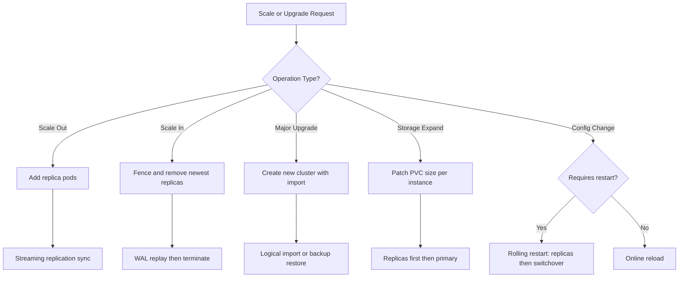

> 💡 **Quick Answer:** Scale CNPG clusters by patching `spec.instances`, perform PostgreSQL major upgrades via `pg_upgrade` import, and expand storage in-place with `allowVolumeExpansion` — all with zero downtime.

## The Problem

Production PostgreSQL clusters need to scale horizontally for read traffic, vertically for write-heavy workloads, and undergo major version upgrades (e.g., PG 15 → 16) without application downtime. Each operation carries risk of data loss or extended outages if done incorrectly.

## The Solution

CNPG provides declarative scaling, online storage expansion, and safe major version upgrade paths using logical import or physical backup restore.

### Horizontal Scaling (Add Read Replicas)

```bash
# Scale from 3 to 5 instances
kubectl patch cluster app-db -n production \
  --type merge -p '{"spec":{"instances": 5}}'

# Watch new replicas join
kubectl get pods -n production -l cnpg.io/cluster=app-db -w

# Verify replication status
kubectl cnpg status app-db -n production
```

### Scale Down Safely

```bash
# Scale from 5 to 3 — CNPG removes the newest replicas first
kubectl patch cluster app-db -n production \
  --type merge -p '{"spec":{"instances": 3}}'

# CNPG will:
# 1. Fence the replica being removed
# 2. Wait for WAL replay to complete
# 3. Terminate the pod
# 4. Delete the PVC (if reclaimPolicy allows)
```

### Vertical Scaling (Resources)

```yaml
apiVersion: postgresql.cnpg.io/v1
kind: Cluster
metadata:
  name: app-db
  namespace: production
spec:
  instances: 3
  imageName: ghcr.io/cloudnative-pg/postgresql:16.4

  resources:
    requests:
      cpu: "1"
      memory: 2Gi
    limits:
      cpu: "4"
      memory: 8Gi

  postgresql:
    parameters:
      shared_buffers: "2GB"
      effective_cache_size: "6GB"
      work_mem: "32MB"
      maintenance_work_mem: "512MB"
      max_connections: "400"
      max_worker_processes: "4"
      max_parallel_workers_per_gather: "2"
      max_parallel_workers: "4"

  storage:
    size: 100Gi
    storageClass: gp3-encrypted
```

### Online Storage Expansion

```bash
# Ensure StorageClass has allowVolumeExpansion: true
kubectl get sc gp3-encrypted -o jsonpath='{.allowVolumeExpansion}'

# Expand storage from 50Gi to 100Gi
kubectl patch cluster app-db -n production \
  --type merge -p '{"spec":{"storage":{"size":"100Gi"}}}'

# CNPG expands PVCs one at a time (replicas first, then primary)
kubectl get pvc -n production -l cnpg.io/cluster=app-db -w
```

### PostgreSQL Major Version Upgrade (pg_upgrade)

```yaml
# Step 1: Create a new cluster with the target PG version
# importing from the existing cluster
apiVersion: postgresql.cnpg.io/v1
kind: Cluster
metadata:
  name: app-db-pg17
  namespace: production
spec:
  instances: 3
  imageName: ghcr.io/cloudnative-pg/postgresql:17.0

  bootstrap:
    initdb:
      import:
        type: monolith
        databases:
          - appdb
        roles:
          - appuser
        source:
          externalCluster: app-db-pg16

  externalClusters:
    - name: app-db-pg16
      connectionParameters:
        host: app-db-rw.production.svc
        user: postgres
        dbname: appdb
      password:
        name: app-db-superuser
        key: password

  storage:
    size: 100Gi
    storageClass: gp3-encrypted

  resources:
    requests:
      cpu: "1"
      memory: 2Gi
    limits:
      cpu: "4"
      memory: 8Gi
```

### Upgrade via Backup Restore

```yaml
# Alternative: Restore from backup into new PG version
apiVersion: postgresql.cnpg.io/v1
kind: Cluster
metadata:
  name: app-db-pg17
  namespace: production
spec:
  instances: 3
  imageName: ghcr.io/cloudnative-pg/postgresql:17.0

  bootstrap:
    recovery:
      source: app-db-backup

  externalClusters:
    - name: app-db-backup
      barmanObjectStore:
        destinationPath: s3://my-pg-backups/app-db/
        s3Credentials:
          accessKeyId:
            name: s3-creds
            key: ACCESS_KEY_ID
          secretAccessKey:
            name: s3-creds
            key: SECRET_ACCESS_KEY

  storage:
    size: 100Gi
```

### Rolling Config Changes

```yaml
# PostgreSQL parameter changes that require restart
# are handled by CNPG with rolling restart (replicas first)
apiVersion: postgresql.cnpg.io/v1
kind: Cluster
metadata:
  name: app-db
  namespace: production
spec:
  postgresql:
    parameters:
      # These require restart — CNPG handles it
      shared_buffers: "4GB"
      max_connections: "500"
      max_worker_processes: "8"
      wal_buffers: "64MB"
      
      # These are applied online — no restart needed
      work_mem: "64MB"
      effective_cache_size: "12GB"
      random_page_cost: "1.1"
      effective_io_concurrency: "200"
  
  # Control restart behavior
  primaryUpdateStrategy: unsupervised  # or "supervised" for manual
  primaryUpdateMethod: switchover      # graceful primary switch
```

### Switchover Verification Script

```bash
#!/bin/bash
set -euo pipefail

CLUSTER="app-db"
NS="production"

echo "=== Pre-scaling checks ==="
kubectl cnpg status ${CLUSTER} -n ${NS}

echo "=== Current replication status ==="
kubectl cnpg psql ${CLUSTER} -n ${NS} -- -c "
  SELECT client_addr, state, sent_lsn, write_lsn, flush_lsn, replay_lsn,
         (sent_lsn - replay_lsn) AS replication_lag
  FROM pg_stat_replication;"

echo "=== Active connections ==="
kubectl cnpg psql ${CLUSTER} -n ${NS} -- -c "
  SELECT datname, usename, count(*)
  FROM pg_stat_activity
  WHERE state = 'active'
  GROUP BY datname, usename;"

echo "=== Database sizes ==="
kubectl cnpg psql ${CLUSTER} -n ${NS} -- -c "
  SELECT pg_database.datname,
         pg_size_pretty(pg_database_size(pg_database.datname)) AS size
  FROM pg_database
  ORDER BY pg_database_size(pg_database.datname) DESC;"
```



## Common Issues

- **Scale-up pod stuck Pending** — check node resources and PVC availability; CNPG creates one PVC per instance
- **Storage expansion not working** — StorageClass must have `allowVolumeExpansion: true`; some CSI drivers require pod restart
- **Major upgrade import slow** — logical import depends on database size; for large DBs (>100GB), use backup-based restore instead
- **Replication lag after scaling** — new replicas need to catch up; monitor with `kubectl cnpg status`; ensure adequate network bandwidth
- **Config change causing unexpected restart** — check if parameter requires restart via `pg_settings.pending_restart`; use `supervised` primaryUpdateStrategy to control timing

## Best Practices

- Scale read replicas based on query load; use CNPG Pooler for connection distribution
- Always test major upgrades on a staging cluster first
- Use `primaryUpdateStrategy: supervised` in production for manual failover control
- Monitor replication lag during scaling with Prometheus alerts
- Expand storage proactively when usage exceeds 70%
- Keep old cluster running during major upgrades until application validation completes
- Use PDB (automatically created by CNPG) to prevent simultaneous pod disruptions

## Key Takeaways

- Horizontal scaling is a one-line patch: `spec.instances`
- Storage expansion works online if StorageClass supports it
- Major version upgrades use logical import or backup restore — not in-place
- Rolling config changes are automatic — CNPG restarts replicas first, then switches over primary
- `kubectl cnpg status` is the single command for cluster health verification
