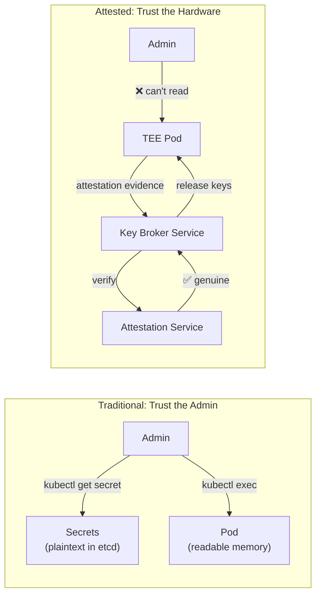
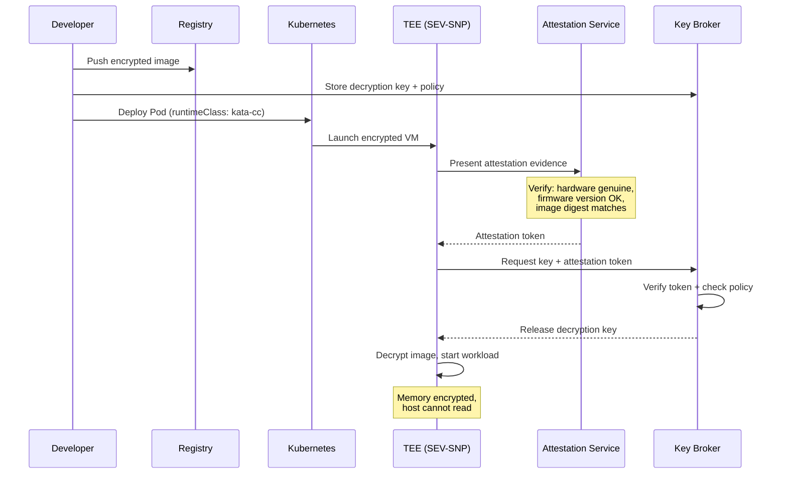

> 💡 **Quick Answer:** Remote attestation proves that a workload runs inside a genuine, unmodified TEE before releasing secrets. Deploy a Key Broker Service (KBS) on Kubernetes, configure attestation policies (allowed firmware versions, image digests), and have TEE workloads present attestation evidence. Only verified workloads receive decryption keys and secrets — even the cluster admin can't intercept them.

## The Problem

In standard Kubernetes, anyone with cluster-admin access can read Secrets, exec into pods, or dump memory. For zero-trust compute, you need cryptographic proof that: the hardware is genuine (not emulated), the firmware hasn't been tampered with, the workload image matches expected hashes, and the TEE is properly configured. Only then should secrets be released.



## The Solution

### Deploy Key Broker Service (KBS)

```yaml
apiVersion: apps/v1
kind: Deployment
metadata:
  name: kbs
  namespace: coco-system
spec:
  replicas: 2
  selector:
    matchLabels:
      app: kbs
  template:
    spec:
      containers:
        - name: kbs
          image: ghcr.io/confidential-containers/kbs:v0.10.0
          ports:
            - containerPort: 8080
          env:
            - name: KBS_CONFIG
              value: /config/kbs-config.toml
          volumeMounts:
            - name: config
              mountPath: /config
            - name: secrets-store
              mountPath: /secrets
      volumes:
        - name: config
          configMap:
            name: kbs-config
        - name: secrets-store
          secret:
            secretName: kbs-secret-store
---
apiVersion: v1
kind: ConfigMap
metadata:
  name: kbs-config
  namespace: coco-system
data:
  kbs-config.toml: |
    [attestation]
    type = "coco-as"
    url = "http://attestation-service:8081"
    
    [repository]
    type = "local-fs"
    dir = "/secrets"
    
    [policy]
    # Only release secrets to workloads that pass attestation
    default = "deny"
    
    [[policy.rules]]
    resource_path = "models/*"
    attestation_required = true
    allowed_policies = ["production-policy"]
```

### Configure Attestation Policies

```yaml
apiVersion: v1
kind: ConfigMap
metadata:
  name: attestation-policy
  namespace: coco-system
data:
  production-policy.rego: |
    package policy
    
    import future.keywords.if
    
    # Allow only genuine AMD SEV-SNP or Intel TDX
    allow if {
      input.tee in ["sev-snp", "tdx"]
    }
    
    # Require minimum firmware version
    allow if {
      input.tee == "sev-snp"
      semver.compare(input.firmware_version, "1.55.0") >= 0
    }
    
    # Verify workload image digest
    allow if {
      input.image_digest in data.allowed_images
    }
    
    # Require secure boot
    allow if {
      input.secure_boot == true
    }
    
    # Deny debug mode
    deny if {
      input.debug_mode == true
    }
```

### Workload Requesting Attested Secrets

```yaml
apiVersion: v1
kind: Pod
metadata:
  name: ml-inference
  annotations:
    io.confidentialcontainers.attestation: "required"
spec:
  runtimeClassName: kata-cc-sev-snp
  containers:
    - name: inference
      image: registry.example.com/ml-inference:v2@sha256:abc123
      env:
        # Secret fetched from KBS after attestation
        - name: MODEL_KEY
          value: "kbs:///models/production/decryption-key"
      command:
        - /bin/sh
        - -c
        - |
          # Fetch secret from KBS (happens inside TEE)
          MODEL_KEY=$(curl -s \
            --cacert /etc/attestation/ca.crt \
            http://kbs.coco-system:8080/v0/resource/models/production/decryption-key)
          
          # Decrypt and load model
          decrypt-model --key "$MODEL_KEY" --input /models/encrypted --output /tmp/model
          
          # Start inference server
          python serve.py --model /tmp/model
```

### End-to-End Flow



### Monitor Attestation

```yaml
# PrometheusRule for attestation failures
apiVersion: monitoring.coreos.com/v1
kind: PrometheusRule
metadata:
  name: attestation-alerts
spec:
  groups:
    - name: attestation
      rules:
        - alert: AttestationFailure
          expr: increase(kbs_attestation_failures_total[5m]) > 0
          for: 1m
          labels:
            severity: critical
          annotations:
            summary: "Attestation failure detected — possible hardware compromise"

        - alert: AttestationHighLatency
          expr: kbs_attestation_duration_seconds{quantile="0.99"} > 5
          for: 5m
          labels:
            severity: warning
          annotations:
            summary: "Attestation taking >5s — check attestation service"
```

## Common Issues

| Issue | Cause | Fix |
|-------|-------|-----|
| Attestation always fails | BIOS settings wrong | Enable SEV-SNP/TDX in BIOS, update firmware |
| KBS unreachable from TEE | Network policy blocking | Allow TEE pods → kbs.coco-system |
| Policy denies valid workload | Image digest changed | Update `allowed_images` in policy |
| Slow attestation (>10s) | Attestation service overloaded | Scale AS replicas, add caching |
| Keys leaked in logs | Logging secret values | Never log KBS responses; use audit trail |

## Best Practices

- **Deny by default** — only release secrets to explicitly allowed workloads
- **Pin image digests** — tags can be overwritten; digests are immutable
- **Rotate attestation keys** — update KBS signing keys quarterly
- **Alert on attestation failures** — they may indicate hardware tampering
- **Separate KBS from workload clusters** — KBS should run in a hardened management cluster
- **Audit all secret access** — log which TEE accessed which secret (not the secret value)

## Key Takeaways

- Remote attestation provides cryptographic proof of genuine TEE execution
- Key Broker Service releases secrets only to verified, unmodified workloads
- Rego policies control which workloads get which secrets
- Protects against rogue admins, compromised hosts, and supply chain attacks
- Essential building block for zero-trust compute on Kubernetes
- Monitor attestation failures as potential security incidents
