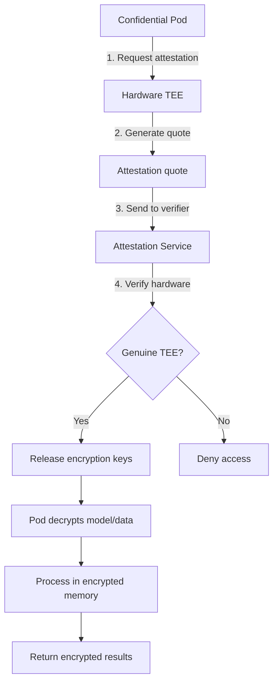

> 💡 **Quick Answer:** Deploy confidential containers with encrypted memory using Intel SGX, AMD SEV-SNP, and Kata Containers. Protect data in use from even the cluster admin.

## The Problem

Confidential computing protects data **in use** by running workloads inside hardware-encrypted enclaves (TEEs). Even cluster admins, hypervisor operators, and cloud providers cannot access the data in memory.

## The Solution

### Understanding Confidential Computing

| Technology | Vendor | Protection Level | K8s Integration |
|-----------|--------|-----------------|-----------------|
| Intel SGX | Intel | Application enclave | SGX device plugin |
| Intel TDX | Intel | Full VM isolation | Kata Containers |
| AMD SEV-SNP | AMD | Full VM isolation | Kata Containers |
| ARM CCA | ARM | Realm isolation | Kata Containers |

### Step 1: Deploy Confidential Containers Operator

```bash
# Install the Confidential Containers operator
kubectl apply -k github.com/confidential-containers/operator/config/default

# Create a CcRuntime for Kata with SEV-SNP
cat << 'EOF' | kubectl apply -f -
apiVersion: confidentialcontainers.org/v1beta1
kind: CcRuntime
metadata:
  name: ccruntime-sev-snp
spec:
  runtimeName: kata-qemu-sev
  config:
    installType: bundle
  implementation:
    name: kata-qemu-sev
EOF

# Verify RuntimeClass was created
kubectl get runtimeclass | grep kata
# kata-qemu-sev   kata-qemu-sev   30s
```

### Step 2: Deploy a Confidential Workload

```yaml
apiVersion: v1
kind: Pod
metadata:
  name: confidential-inference
  labels:
    app: confidential-ai
spec:
  runtimeClassName: kata-qemu-sev    # Run inside encrypted VM
  containers:
    - name: inference
      image: myregistry.example.com/encrypted-model:v1
      resources:
        limits:
          memory: 8Gi
          cpu: "4"
      env:
        - name: MODEL_KEY
          valueFrom:
            secretKeyRef:
              name: model-encryption-key
              key: key
      ports:
        - containerPort: 8080
  initContainers:
    - name: attestation
      image: myregistry.example.com/attestation-agent:v1
      command: ["attestation-agent"]
      args:
        - --attestation-url=https://attestation.example.com
        - --expected-measurement=sha256:abc123...
```

### Step 3: Remote Attestation

```bash
# Verify the TEE is genuine before sending secrets
# The attestation flow:
# 1. Confidential pod starts in encrypted VM
# 2. Attestation agent requests a quote from hardware
# 3. Quote is sent to attestation service
# 4. Service verifies hardware genuineness
# 5. Only then are encryption keys released to the pod
```

```yaml
# Key Broker Service configuration
apiVersion: v1
kind: ConfigMap
metadata:
  name: kbs-config
data:
  policy.json: |
    {
      "default": ["deny"],
      "rules": {
        "model-key": {
          "allowed_tee": ["sev-snp", "tdx"],
          "min_fw_version": "1.55.0",
          "require_attestation": true
        }
      }
    }
```



## Best Practices

- **Start with observation** — measure before optimizing
- **Automate** — manual processes don't scale
- **Iterate** — implement changes gradually and measure impact
- **Document** — keep runbooks for your team

## Key Takeaways

- This is a critical capability for production Kubernetes clusters
- Start with the simplest approach and evolve as needed
- Monitor and measure the impact of every change
- Share knowledge across your team with internal documentation
