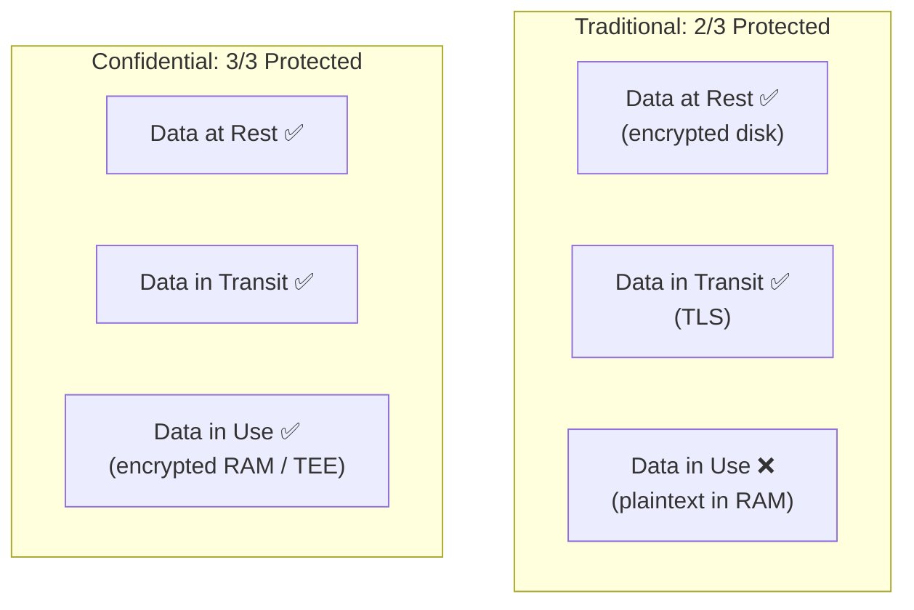

> 💡 **Quick Answer:** Confidential computing protects data while it's being processed (in-use), not just at rest or in transit. Intel SGX creates encrypted enclaves; AMD SEV-SNP encrypts entire VM memory. On Kubernetes, use Kata Containers with \`peer-pods\` for confidential VMs, or SGX device plugins for enclave-based workloads. Remote attestation proves to clients that their code runs in a genuine TEE.

## The Problem

Traditional encryption protects data at rest (encrypted disks) and in transit (TLS). But during processing, data is decrypted in memory — accessible to anyone with root/admin access, including cloud operators, compromised hypervisors, or malicious co-tenants. Confidential computing creates hardware-enforced trusted execution environments (TEEs) where even the infrastructure owner can't access the data.



## The Solution

### Intel SGX on Kubernetes

```yaml
# Install SGX device plugin
apiVersion: apps/v1
kind: DaemonSet
metadata:
  name: sgx-device-plugin
  namespace: kube-system
spec:
  selector:
    matchLabels:
      app: sgx-device-plugin
  template:
    spec:
      containers:
        - name: sgx-plugin
          image: intel/intel-device-plugins-for-kubernetes:0.30.0
          command: ["/usr/bin/intel_sgx_device_plugin"]
          securityContext:
            privileged: true
          volumeMounts:
            - name: dev-sgx
              mountPath: /dev/sgx
      volumes:
        - name: dev-sgx
          hostPath:
            path: /dev/sgx
---
# SGX workload requesting enclave memory
apiVersion: v1
kind: Pod
metadata:
  name: sgx-enclave-app
spec:
  containers:
    - name: app
      image: myorg/sgx-enclave-app:v1.0
      resources:
        limits:
          sgx.intel.com/epc: "10Mi"     # Enclave Page Cache
          sgx.intel.com/enclave: 1       # SGX enclave device
          sgx.intel.com/provision: 1     # Provisioning device
```

### AMD SEV-SNP with Kata Containers

```yaml
# RuntimeClass for confidential containers
apiVersion: node.k8s.io/v1
kind: RuntimeClass
metadata:
  name: kata-cc-snp
handler: kata-cc-snp                    # Kata with SEV-SNP
overhead:
  podFixed:
    memory: "256Mi"
    cpu: "250m"
scheduling:
  nodeSelector:
    cc-capable: "true"                  # Node must have SEV-SNP
---
# Confidential pod — entire VM memory is encrypted
apiVersion: v1
kind: Pod
metadata:
  name: confidential-inference
spec:
  runtimeClassName: kata-cc-snp         # Run in confidential VM
  containers:
    - name: inference
      image: myorg/confidential-llm:v1.0
      env:
        - name: MODEL_KEY
          valueFrom:
            secretKeyRef:
              name: model-encryption-key
              key: key
      resources:
        limits:
          cpu: "4"
          memory: "16Gi"
```

### Remote Attestation Service

```yaml
# Attestation service verifies TEE authenticity
apiVersion: apps/v1
kind: Deployment
metadata:
  name: attestation-service
spec:
  template:
    spec:
      containers:
        - name: attestation
          image: myorg/attestation-service:v1.0
          ports:
            - containerPort: 8080
          env:
            - name: SUPPORTED_TEES
              value: "sgx,sev-snp,tdx"
            - name: INTEL_PCCS_URL
              value: "https://pccs.internal:8081"
            - name: AMD_VLEK_CACHE
              value: "/certs/amd-vlek"
          volumeMounts:
            - name: tee-certs
              mountPath: /certs
```

```bash
# Client verifies attestation before sending sensitive data
curl -X POST http://attestation-service:8080/verify \
  -d '{"quote": "<attestation-quote-base64>"}' 

# Response:
# {
#   "verified": true,
#   "tee_type": "sev-snp",
#   "measurement": "sha256:abc123...",  # Code measurement
#   "platform": "AMD EPYC 9004",
#   "firmware_version": "1.55.22",
#   "guest_policy": {
#     "debug_disabled": true,
#     "migration_disabled": true
#   }
# }
```

### Confidential AI Inference

```yaml
# Run sensitive AI inference in confidential VM
# Model weights and input data never visible to host
apiVersion: apps/v1
kind: Deployment
metadata:
  name: confidential-medical-ai
spec:
  template:
    spec:
      runtimeClassName: kata-cc-snp
      containers:
        - name: inference
          image: myorg/medical-ai:v2.0
          env:
            - name: MODEL_DECRYPTION_KEY
              valueFrom:
                secretKeyRef:
                  name: medical-model-key
                  key: key
            # Model is encrypted at rest, decrypted only inside TEE
            - name: ENCRYPTED_MODEL_PATH
              value: "/models/medical-diagnosis.enc"
            - name: ATTESTATION_SERVICE
              value: "http://attestation-service:8080"
          resources:
            limits:
              cpu: "8"
              memory: "32Gi"
          volumeMounts:
            - name: encrypted-models
              mountPath: /models
```

### Technology Comparison

| Feature | Intel SGX | AMD SEV-SNP | Intel TDX |
|---------|:---------:|:-----------:|:---------:|
| Protection scope | Application enclave | Full VM | Full VM |
| Memory encryption | Enclave only (256MB-1GB) | All VM memory | All VM memory |
| Performance overhead | 5-20% | 2-5% | 2-5% |
| Attestation | EPID/DCAP | SEV-SNP report | TDX report |
| K8s integration | Device plugin | Kata Containers | Kata Containers |
| Best for | Small secure functions | Full confidential VMs | Full confidential VMs |
| Cloud support | Azure, IBM | Azure, AWS, GCP | Azure |

### Key Rotation in TEE

```yaml
# CronJob: rotate encryption keys inside confidential environment
apiVersion: batch/v1
kind: CronJob
metadata:
  name: tee-key-rotation
spec:
  schedule: "0 0 * * 0"              # Weekly
  jobTemplate:
    spec:
      template:
        spec:
          runtimeClassName: kata-cc-snp
          containers:
            - name: rotate
              image: myorg/key-rotation:v1.0
              env:
                - name: KMS_ENDPOINT
                  value: "http://confidential-kms:8080"
                - name: ATTESTATION_REQUIRED
                  value: "true"
          restartPolicy: Never
```

## Common Issues

| Issue | Cause | Fix |
|-------|-------|-----|
| \`sgx.intel.com/epc\` not available | SGX not enabled in BIOS/no device plugin | Enable SGX in BIOS, deploy device plugin |
| Kata pod fails to start | SEV-SNP not enabled or firmware outdated | Verify with \`dmesg | grep SEV\`, update firmware |
| Performance regression | Encryption overhead | Use SEV-SNP over SGX for larger workloads |
| Attestation fails | Stale platform certificates | Update PCCS/VLEK certificates |
| Memory limit too small | SGX EPC limited to 256MB default | Increase EPC in BIOS or use SEV-SNP for larger workloads |

## Best Practices

- **Use SEV-SNP for full workloads** — encrypts all VM memory with minimal overhead
- **Use SGX for small secure operations** — key management, signing, secret computation
- **Always require remote attestation** — verify TEE before sending sensitive data
- **Encrypt models and data at rest** — decrypt only inside the TEE
- **Disable debug in production** — debug mode allows host access to enclave memory
- **Combine with network isolation** — TEE protects compute; NetworkPolicy protects network

## Key Takeaways

- Confidential computing encrypts data during processing — completing the at-rest + in-transit triad
- Intel SGX = application-level enclaves; AMD SEV-SNP = full VM encryption
- Kata Containers + peer-pods enables confidential VMs on Kubernetes
- Remote attestation proves code integrity to clients before they send data
- Essential for multi-tenant AI inference where model IP and input data must be protected
- 2026 trend: confidential computing going mainstream as AI workloads move to shared infrastructure
