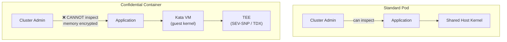
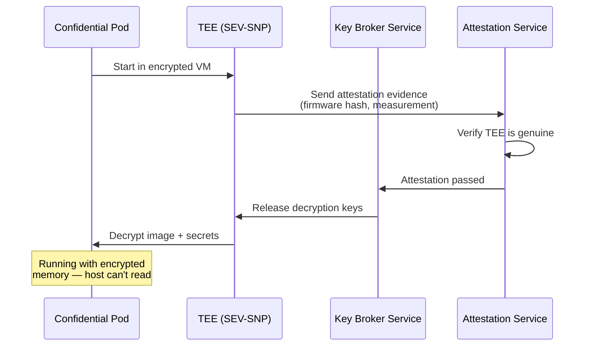

> 💡 **Quick Answer:** Confidential Containers (CoCo) run workloads inside hardware TEEs (AMD SEV-SNP or Intel TDX) using Kata Containers as the runtime. Install the CoCo operator, create a `RuntimeClass` for `kata-cc`, and deploy pods with `runtimeClassName: kata-cc`. The workload runs in an encrypted VM — even the cluster admin can't see the memory contents.

## The Problem

Standard Kubernetes pods share the host kernel, and cluster admins can inspect any pod's memory. For regulated workloads (healthcare, finance, multi-tenant AI), you need protection even from the infrastructure provider. Confidential Containers combine Kata Containers (VM-level isolation) with CPU-level encryption (SEV-SNP/TDX) — the workload is encrypted in memory, and only the CPU can decrypt it.



## The Solution

### Install CoCo Operator

```bash
# Prerequisites: nodes with AMD SEV-SNP or Intel TDX support
# Check hardware support:
# AMD: dmesg | grep -i sev
# Intel: dmesg | grep -i tdx

# Install Confidential Containers operator
kubectl apply -f https://github.com/confidential-containers/operator/releases/latest/download/deploy.yaml

# Create CoCo custom resource
cat << EOF | kubectl apply -f -
apiVersion: confidentialcontainers.org/v1beta1
kind: CcRuntime
metadata:
  name: ccruntime-default
spec:
  runtimeName: kata
  config:
    installType: bundle
EOF

# Verify RuntimeClass is created
kubectl get runtimeclass
# NAME              HANDLER           AGE
# kata-cc-sev-snp   kata-cc-sev-snp   30s
# kata-cc-tdx       kata-cc-tdx       30s
```

### Deploy a Confidential Pod

```yaml
apiVersion: v1
kind: Pod
metadata:
  name: confidential-workload
  labels:
    app: confidential
spec:
  runtimeClassName: kata-cc-sev-snp    # or kata-cc-tdx
  containers:
    - name: app
      image: registry.example.com/ml-inference:v1.0
      resources:
        limits:
          memory: 4Gi
          cpu: "2"
      env:
        - name: MODEL_KEY
          valueFrom:
            secretKeyRef:
              name: model-decryption-key
              key: key
      volumeMounts:
        - name: encrypted-model
          mountPath: /models
  volumes:
    - name: encrypted-model
      persistentVolumeClaim:
        claimName: encrypted-model-pvc
```

### Encrypted Container Images

```bash
# Encrypt a container image for CoCo
# Only the TEE can decrypt it at runtime

# Generate encryption key
openssl rand -out image-key.bin 32

# Build and encrypt image
skopeo copy \
  --encryption-key jwe:image-key.pub \
  docker://registry.example.com/app:v1 \
  docker://registry.example.com/app:v1-encrypted

# The key is released to the TEE via attestation
# (never exposed to the host or cluster admin)
```

### Remote Attestation

```yaml
# Attestation verifies the TEE is genuine before releasing secrets
apiVersion: v1
kind: ConfigMap
metadata:
  name: attestation-config
  namespace: confidential-containers-system
data:
  config.json: |
    {
      "attestation_url": "https://attestation.example.com",
      "policy": {
        "allowed_digests": [
          "sha256:abc123..."
        ],
        "min_firmware_version": "1.55",
        "require_secure_boot": true,
        "allowed_platforms": ["sev-snp", "tdx"]
      }
    }
```



### Peer Pods (Remote Attestation for Cloud)

```yaml
# Peer Pods: TEE runs in a separate cloud VM
# Useful when the K8s node doesn't have TEE hardware
apiVersion: v1
kind: Pod
metadata:
  name: peer-pod-workload
  annotations:
    io.katacontainers.config.hypervisor.machine_type: "sev-snp"
spec:
  runtimeClassName: kata-remote
  containers:
    - name: app
      image: registry.example.com/sensitive-app:v1
      resources:
        limits:
          kata.peerpods.io/vm: "1"
```

## Common Issues

| Issue | Cause | Fix |
|-------|-------|-----|
| `RuntimeClass not found` | CoCo operator not installed | Install operator and CcRuntime CR |
| Pod stuck in `ContainerCreating` | TEE not available on node | Check `dmesg` for SEV/TDX support |
| Attestation fails | Firmware version too old | Update BIOS/firmware on host |
| Encrypted image won't start | Wrong key or format | Verify key matches encryption |
| Performance overhead | VM boot + attestation | Expected: ~2-5s startup overhead |

## Best Practices

- **Use SEV-SNP for AMD, TDX for Intel** — check your hardware generation
- **Encrypt sensitive container images** — model weights, proprietary algorithms
- **Remote attestation for secrets** — never embed keys in manifests
- **Separate CoCo nodes** — label and taint nodes with TEE hardware
- **Test with non-confidential kata first** — verify Kata works before adding TEE
- **Monitor attestation failures** — they may indicate compromised hardware

## Key Takeaways

- Confidential Containers protect workloads from infrastructure admins
- CPU-level encryption (SEV-SNP/TDX) — even root on the host can't read pod memory
- Kata Containers provides VM isolation; TEE provides memory encryption
- Remote attestation verifies hardware integrity before releasing secrets
- Essential for multi-tenant AI inference, healthcare, and financial workloads
- 2-5 second startup overhead is the tradeoff for hardware-level security
