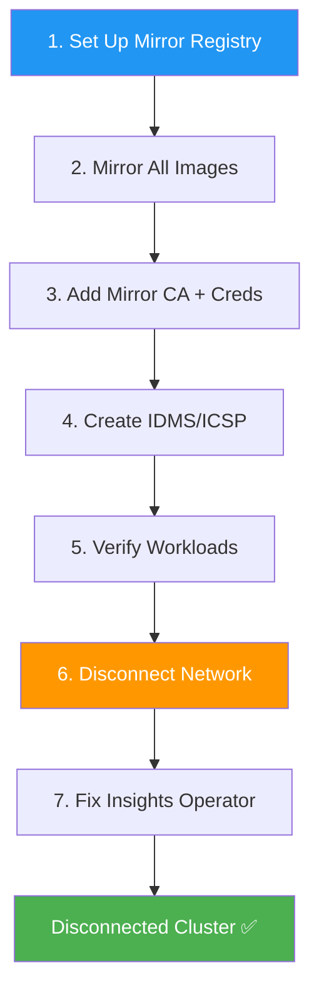

> 💡 **Quick Answer:** To convert a running connected OpenShift cluster to disconnected: (1) set up a mirror registry, (2) mirror all required images, (3) add mirror registry CA and credentials to the cluster, (4) create IDMS/ICSP resources, (5) verify all workloads still function, (6) disconnect the network, (7) fix the degraded Insights Operator by removing the `cloud.openshift.com` pull secret entry.

## The Problem

Organizations sometimes need to move an existing internet-connected OpenShift cluster into a disconnected state:

- Security policy changes require air-gap isolation
- Regulatory compliance (PCI-DSS, HIPAA, government) mandates network segregation
- Infrastructure moves from cloud to on-premises secure facilities
- The cluster was initially deployed connected but must operate disconnected long-term

Abruptly cutting internet access breaks the cluster — images can't be pulled, operators can't update, and the Insights Operator goes degraded.

## The Solution

### Conversion Workflow



### Step 1: Set Up Mirror Registry

```bash
# Deploy mirror-registry on an accessible host
./mirror-registry install \
  --quayHostname mirror.internal.example.com \
  --quayRoot /opt/quay-install

# Or use existing Quay, Artifactory, Harbor, Nexus
```

### Step 2: Mirror All Required Images

```bash
# Mirror OCP release images
oc adm release mirror \
  -a .dockerconfigjson \
  --from=quay.io/openshift-release-dev/ocp-release:4.18.15-x86_64 \
  --to=mirror.internal.example.com:8443/ocp/release \
  --to-release-image=mirror.internal.example.com:8443/ocp/release:4.18.15-x86_64

# Mirror OLM catalogs
oc adm catalog mirror \
  registry.redhat.io/redhat/redhat-operator-index:v4.18 \
  mirror.internal.example.com:8443/olm \
  -a .dockerconfigjson \
  --index-filter-by-os='.*'

# Mirror any other registries your workloads use
oc image mirror \
  docker.io/library/nginx:latest \
  mirror.internal.example.com:8443/library/nginx:latest
```

### Step 3: Add Mirror Registry Credentials and CA

```bash
# Add mirror registry to global pull secret
oc set data secret/pull-secret -n openshift-config \
  --from-file=.dockerconfigjson=pull-secret-with-mirror.json

# Add mirror registry CA to cluster trust
oc create configmap mirror-ca \
  --from-file=mirror.internal.example.com..8443=/opt/quay-install/quay-rootCA/rootCA.pem \
  -n openshift-config

oc patch image.config.openshift.io/cluster \
  --patch '{"spec":{"additionalTrustedCA":{"name":"mirror-ca"}}}' \
  --type=merge
```

### Step 4: Create IDMS/ICSP

```yaml
apiVersion: config.openshift.io/v1
kind: ImageDigestMirrorSet
metadata:
  name: mirror-ocp
spec:
  imageDigestMirrors:
  - mirrors:
    - mirror.internal.example.com:8443/ocp/release
    source: quay.io/openshift-release-dev/ocp-release
  - mirrors:
    - mirror.internal.example.com:8443/ocp/release
    source: quay.io/openshift-release-dev/ocp-v4.0-art-dev
```

```bash
oc apply -f idms.yaml

# Wait for MCP rollout
oc get mcp -w
# All nodes must show UPDATED=True before proceeding
```

### Step 5: Verify Everything Works

```bash
# Check all pods are running
oc get pods --all-namespaces --field-selector=status.phase!=Running,status.phase!=Succeeded \
  | grep -v Completed

# Check all nodes are Ready
oc get nodes

# Check cluster operators
oc get co | grep -v "True.*False.*False"

# Verify image pulls work from mirror
oc run test --image=mirror.internal.example.com:8443/library/nginx:latest --restart=Never
oc delete pod test
```

### Step 6: Disconnect the Network

After verifying everything works through the mirror:

```bash
# Remove external network access (firewall, router, etc.)
# This is infrastructure-specific
```

### Step 7: Fix Insights Operator

The Insights Operator becomes degraded without internet. Remove its credential:

```bash
# Extract current pull secret
oc extract secret/pull-secret -n openshift-config --confirm --to=.

# Remove cloud.openshift.com entry
cat .dockerconfigjson | jq 'del(.auths["cloud.openshift.com"])' > pull-secret-disconnected.json

# Update the pull secret
oc set data secret/pull-secret -n openshift-config \
  --from-file=.dockerconfigjson=pull-secret-disconnected.json

# Verify Insights Operator is no longer degraded
oc get co insights
# NAME       VERSION   AVAILABLE   PROGRESSING   DEGRADED   SINCE
# insights   4.18.15   True        False         False      1m
```

### Reconnecting (If Needed)

```bash
# 1. Restore network access

# 2. Remove IDMS/ICSP (optional — can keep both working)
oc delete imagedigestmirrorset mirror-ocp

# 3. Wait for MCP rollout

# 4. Restore cloud.openshift.com pull secret for Insights
```

## Common Issues

**Workloads using hardcoded external registry URLs**

IDMS only redirects images pulled through CRI-O. If your application code constructs registry URLs at runtime (e.g., Kaniko builds), IDMS won't help. You must update application configs to use the mirror registry.

**Third-party Operators with unlisted related images**

Some Operators reference images not declared in their CSV. These won't be mirrored by oc-mirror. Test each Operator in a staging disconnected cluster before production conversion.

**PersistentVolumes with external dependencies**

Storage classes using cloud provider CSI (EBS, Azure Disk) may fail if the CSI controller needs internet access for API calls. Verify storage operations work before disconnecting.

## Best Practices

- **Mirror BEFORE disconnecting** — never cut internet without verified mirror content
- **Test with `NeverContactSource`** policy first — simulates disconnected mode while still connected
- **Inventory ALL external image references** — pods, jobs, CronJobs, build configs
- **Plan for Operator updates** — set up OSUS and mirrored catalogs before disconnecting
- **Keep a bastion with internet access** — for future mirror updates via oc-mirror

## Key Takeaways

- Converting connected → disconnected requires careful pre-staging of all images
- Seven-step process: mirror registry → mirror images → CA/creds → IDMS → verify → disconnect → fix Insights
- Insights Operator fix: remove `cloud.openshift.com` from the global pull secret
- IDMS/ICSP must be applied and MCP rolled out BEFORE disconnecting the network
- Test everything through the mirror while still connected — there's no fallback after disconnect
