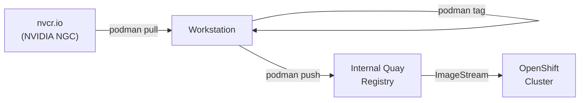

> 💡 **Quick Answer:** Use `podman pull` from `nvcr.io`, retag for your internal Quay, then `podman push`. For API token endpoints, ensure your JSON has no escaped backslashes inside single quotes and use the correct field capitalization (`GrantType` not `grantType`).

## The Problem

You need to deploy NVIDIA NIM containers (like DeepSeek-R1) on an OpenShift cluster that cannot pull directly from `nvcr.io`. Your organization uses an internal Quay registry, and all images must be promoted through a controlled pipeline. Along the way, you hit authentication issues with the platform API token endpoint and shell escaping problems with `curl`.



## The Solution

### Step 1: Authenticate to NVIDIA NGC

```bash
# Login to NVIDIA NGC registry
# Username is always $oauthtoken
# Password is your NGC API key from https://ngc.nvidia.com/setup
podman login nvcr.io
# Username: $oauthtoken
# Password: <your-ngc-api-key>
# Login Succeeded
```

### Step 2: Authenticate to Internal Quay

```bash
# Login to your internal Quay registry
podman login quay-int.registry.example.com
# Username: your-username (or robot account)
# Password: <your-token>
# Login Succeeded
```

### Step 3: Pull the NIM Image

```bash
# Pull the specific NIM image
podman pull nvcr.io/nim/deepseek-ai/deepseek-r1:latest

# Verify the image is present
podman images | grep deepseek
# nvcr.io/nim/deepseek-ai/deepseek-r1   latest   abc123...   11.5GB
```

> ⚠️ **Pin by version, not `latest`** — for production, always use a specific tag like `1.7.3` to avoid unexpected changes.

```bash
# Better: pull a pinned version
podman pull nvcr.io/nim/deepseek-ai/deepseek-r1:1.7.3
```

### Step 4: Retag for Internal Registry

```bash
# Tag for your internal Quay repository
podman tag \
  nvcr.io/nim/deepseek-ai/deepseek-r1:1.7.3 \
  quay-int.registry.example.com/ai-models/deepseek-r1:1.7.3
```

### Step 5: Push to Internal Quay

```bash
# Push to internal registry
podman push quay-int.registry.example.com/ai-models/deepseek-r1:1.7.3

# Verify in Quay UI or via API
podman search quay-int.registry.example.com/ai-models/deepseek-r1
```

### Step 6: Create OpenShift ImageStream (Optional)

```yaml
apiVersion: image.openshift.io/v1
kind: ImageStream
metadata:
  name: deepseek-r1
  namespace: ai-workloads
spec:
  lookupPolicy:
    local: true
  tags:
    - name: "1.7.3"
      from:
        kind: DockerImage
        name: quay-int.registry.example.com/ai-models/deepseek-r1:1.7.3
      importPolicy:
        scheduled: false
      referencePolicy:
        type: Local
```

```bash
oc apply -f imagestream-deepseek.yaml
oc get is deepseek-r1 -n ai-workloads
```

### Bonus: Pin by Digest for Immutable References

```bash
# Get the exact digest
podman inspect nvcr.io/nim/deepseek-ai/deepseek-r1:1.7.3 \
  --format '{{.Digest}}'
# sha256:a1b2c3d4e5f6...

# Tag with digest-based version
podman tag \
  nvcr.io/nim/deepseek-ai/deepseek-r1@sha256:a1b2c3d4e5f6... \
  quay-int.registry.example.com/ai-models/deepseek-r1:1.7.3

podman push quay-int.registry.example.com/ai-models/deepseek-r1:1.7.3
```

## Fixing curl Token Endpoint Issues

When authenticating to platform APIs (like Run:AI or other ML platforms), a common pattern is requesting an OAuth token via `curl`. Here are the most frequent pitfalls:

### Problem 1: Trailing Spaces After Backslash

```bash
# ❌ WRONG — trailing space after backslash breaks line continuation
curl -X POST 'https://api.platform.example.com/api/v1/token' \·
  --header 'Content-Type: application/json' \·
  --data-raw '{"grantType":"client_credentials"}'
# bash: --header: command not found
```

The backslash (`\`) must be the **very last character** on the line — no trailing spaces.

```bash
# ✅ CORRECT — no spaces after backslash
curl -X POST 'https://api.platform.example.com/api/v1/token' \
  -H 'Content-Type: application/json' \
  -d '{"GrantType":"client_credentials","clientId":"my-client","clientSecret":"my-secret"}'
```

### Problem 2: Backslashes Inside Single-Quoted JSON

```bash
# ❌ WRONG — backslashes inside single quotes become literal
curl -X POST 'https://api.platform.example.com/api/v1/token' \
  -d '{ \
  "GrantType":"client_credentials" \
}'
# Error: invalid character '\\' looking for beginning of object key string
```

Single quotes in bash already protect everything — **never add backslashes inside them**:

```bash
# ✅ CORRECT — clean JSON inside single quotes
curl -X POST 'https://api.platform.example.com/api/v1/token' \
  -H 'Content-Type: application/json' \
  -d '{
    "GrantType": "client_credentials",
    "clientId": "my-client",
    "clientSecret": "my-secret"
  }'
```

### Problem 3: Case-Sensitive Field Names

Many OAuth endpoints are case-sensitive. `grantType` ≠ `GrantType`:

```bash
# ❌ May fail — wrong case
-d '{"grantType": "client_credentials"}'

# ✅ Check API docs for exact casing
-d '{"GrantType": "client_credentials"}'
```

### Debug Tip: Verbose Mode

```bash
# Add -v to see exactly what curl sends
curl -v -X POST 'https://api.platform.example.com/api/v1/token' \
  -H 'Content-Type: application/json' \
  -d '{"GrantType":"client_credentials","clientId":"my-client","clientSecret":"my-secret"}'

# Look for:
# > Content-Type: application/json
# > {"GrantType":"client_credentials",...}
# If you see backslashes in the body → your JSON is malformed
```

## Automation Script: Bulk NIM Image Mirror

```bash
#!/bin/bash
# mirror-nim-images.sh — Pull NIM images from NGC and push to internal Quay
set -euo pipefail

INTERNAL_REGISTRY="quay-int.registry.example.com"
INTERNAL_ORG="ai-models"

# List of NIM images to mirror
IMAGES=(
  "nvcr.io/nim/deepseek-ai/deepseek-r1:1.7.3"
  "nvcr.io/nim/meta/llama-3.1-405b-instruct:1.5.2"
  "nvcr.io/nim/meta/llama-3.1-70b-instruct:1.5.2"
)

for IMAGE in "${IMAGES[@]}"; do
  # Extract name and tag
  NAME=$(echo "$IMAGE" | awk -F'/' '{print $NF}' | cut -d: -f1)
  TAG=$(echo "$IMAGE" | awk -F: '{print $NF}')
  TARGET="${INTERNAL_REGISTRY}/${INTERNAL_ORG}/${NAME}:${TAG}"

  echo "=== Mirroring ${IMAGE} → ${TARGET} ==="

  # Pull
  podman pull "$IMAGE"

  # Tag
  podman tag "$IMAGE" "$TARGET"

  # Push
  podman push "$TARGET"

  echo "✅ ${NAME}:${TAG} mirrored successfully"
done

echo "=== All images mirrored ==="
```

## Common Issues

| Issue | Cause | Fix |
|-------|-------|-----|
| `denied: requested access` on push | Missing Quay permissions | Create repo first or grant robot account write access |
| `manifest unknown` on pull | Tag doesn't exist | List available tags: `podman search --list-tags nvcr.io/nim/...` |
| `x509: certificate signed by unknown authority` | Internal Quay uses custom CA | Add CA to `/etc/pki/ca-trust/` and run `update-ca-trust` |
| `invalid character '\\'` in curl | Backslashes inside single-quoted JSON | Remove all `\` from inside `'...'` blocks |
| `unsupported value '' for field 'GrantType'` | Broken line continuation or wrong case | Fix trailing spaces after `\`, check field capitalization |
| Image too large for single pull | Multi-GB NIM images (10GB+) | Use `--retry 3` flag, ensure sufficient disk space |

## Best Practices

- **Pin versions** — never use `latest` in production; pin to specific tags like `1.7.3`
- **Pin by digest** — for immutable references, use `@sha256:...` notation
- **Use robot accounts** — create dedicated Quay robot accounts for CI/CD image mirroring
- **Mirror on schedule** — automate with CronJobs or Tekton pipelines to keep images current
- **Verify after push** — always check the Quay UI or use `skopeo inspect` to confirm
- **Use skopeo for air-gapped** — `skopeo copy` can transfer between registries without pulling locally
- **Clean up local images** — remove pulled images after push to save disk: `podman rmi $IMAGE`

## Key Takeaways

- Pull NIM images from `nvcr.io` with your NGC API key, retag, and push to internal Quay
- Always pin image versions for production deployments
- When using `curl` for API tokens: no trailing spaces after `\`, no backslashes inside single quotes, and check field name casing
- Use `skopeo copy` for direct registry-to-registry transfer without local storage
- Create OpenShift ImageStreams to reference internal registry images cleanly
