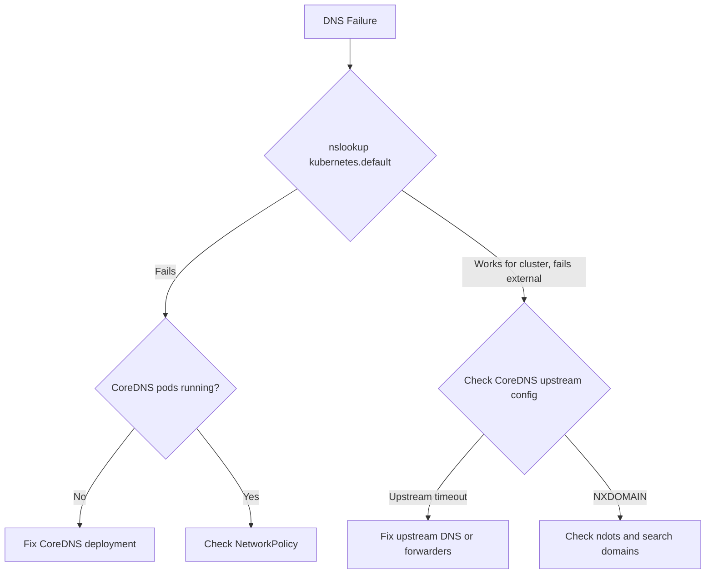

> 💡 **Quick Answer:** DNS failures in pods usually come from CoreDNS pods being down, misconfigured `resolv.conf`, or upstream DNS timeouts. Test with `kubectl exec <pod> -- nslookup kubernetes.default`. If it fails, check CoreDNS pods and logs in `kube-system`.
>
> **Gotcha:** The default `ndots:5` setting causes ALL short names to try 5 search domain suffixes before querying the actual name. This adds latency and load. Set `ndots:2` for most workloads.

## The Problem

```bash
$ kubectl exec myapp-abc123 -- nslookup google.com
;; connection timed out; no servers could be reached

# Or
$ kubectl exec myapp-abc123 -- curl https://api.example.com
curl: (6) Could not resolve host: api.example.com
```

## The Solution

### Step 1: Test DNS Inside the Pod

```bash
# Test cluster DNS
kubectl exec myapp-abc123 -- nslookup kubernetes.default
# Test external DNS
kubectl exec myapp-abc123 -- nslookup google.com

# Check resolv.conf
kubectl exec myapp-abc123 -- cat /etc/resolv.conf
# nameserver 10.96.0.10  (CoreDNS ClusterIP)
# search default.svc.cluster.local svc.cluster.local cluster.local
# options ndots:5
```

### Step 2: Check CoreDNS

```bash
# Are CoreDNS pods running?
kubectl get pods -n kube-system -l k8s-app=kube-dns

# Check CoreDNS logs
kubectl logs -n kube-system -l k8s-app=kube-dns --tail=50

# Is the CoreDNS service reachable?
kubectl get svc -n kube-system kube-dns
```

### Step 3: Fix Common Issues

**CoreDNS pods crashing:**
```bash
# Check for OOM or config errors
kubectl describe pods -n kube-system -l k8s-app=kube-dns
# Increase memory if OOMKilled
kubectl edit deployment coredns -n kube-system
# Set resources.limits.memory to 256Mi or higher
```

**Slow external DNS (ndots issue):**
```yaml
# Pod spec — reduce ndots for external-heavy workloads
spec:
  dnsConfig:
    options:
      - name: ndots
        value: "2"
```

With `ndots:5` (default), resolving `api.example.com` tries:
1. `api.example.com.default.svc.cluster.local` → NXDOMAIN
2. `api.example.com.svc.cluster.local` → NXDOMAIN
3. `api.example.com.cluster.local` → NXDOMAIN
4. `api.example.com` → SUCCESS

That's 3 wasted queries per lookup.

**NetworkPolicy blocking DNS:**
```yaml
# Ensure DNS egress is allowed
apiVersion: networking.k8s.io/v1
kind: NetworkPolicy
metadata:
  name: allow-dns
spec:
  podSelector: {}
  policyTypes: ["Egress"]
  egress:
    - to:
        - namespaceSelector: {}
          podSelector:
            matchLabels:
              k8s-app: kube-dns
      ports:
        - protocol: UDP
          port: 53
        - protocol: TCP
          port: 53
```



## Common Issues

### DNS works from some pods but not others
NetworkPolicy in that namespace is blocking UDP/53 egress. Add a DNS egress rule.

### DNS slow but eventually resolves
Classic `ndots:5` issue. Every external name tries cluster suffixes first. Set `ndots:2`.

### DNS resolution races (intermittent failures)
Known Linux conntrack race condition with UDP DNS. Fix: enable `dnsPolicy: Default` for host-network pods, or use TCP for DNS queries.

## Best Practices

- **Set `ndots:2`** for workloads that primarily resolve external domains
- **Use FQDN with trailing dot** (`api.example.com.`) to skip search domain expansion entirely
- **Monitor CoreDNS metrics**: `coredns_dns_requests_total`, `coredns_dns_responses_rcode_total`
- **Always allow DNS egress** in NetworkPolicies — it's easy to forget

## Key Takeaways

- Check CoreDNS pods first — if they're down, nothing resolves
- `ndots:5` causes 3-4 wasted queries per external lookup — reduce for most workloads
- NetworkPolicies must explicitly allow UDP/53 egress to CoreDNS
- Use `nslookup kubernetes.default` to test cluster DNS vs external DNS separately
