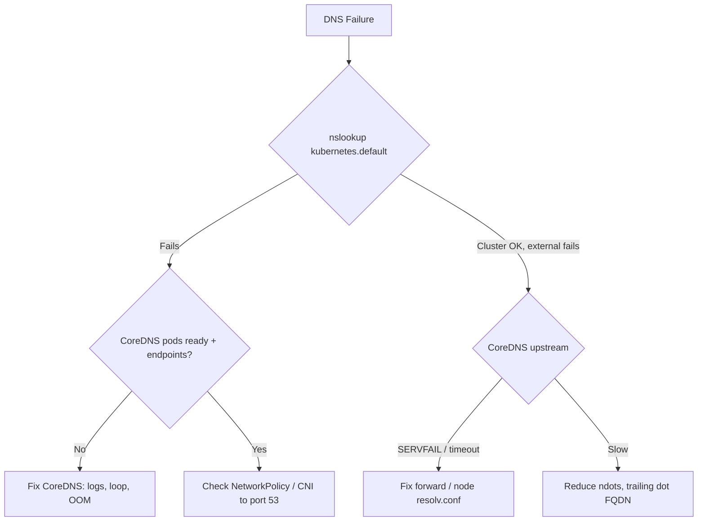

> 💡 **Quick Answer:** Test from a throwaway pod: `kubectl run dnstest --image=busybox:1.36 --rm -it --restart=Never -- nslookup kubernetes.default`. If it fails, check CoreDNS: `kubectl get pods,endpoints -n kube-system -l k8s-app=kube-dns` and `kubectl logs -n kube-system -l k8s-app=kube-dns`. Quick fix after a config change or crash: `kubectl rollout restart deployment/coredns -n kube-system`.
>
> **Gotcha:** The default `ndots:5` makes every name with fewer than 5 dots walk all search domains before the real lookup. Set `ndots:2` for external-heavy workloads.

## The Problem

```bash
$ kubectl exec myapp-abc123 -- nslookup google.com
;; connection timed out; no servers could be reached

$ kubectl exec myapp-abc123 -- curl https://api.example.com
curl: (6) Could not resolve host: api.example.com
```

Symptoms fall into four buckets: service names don't resolve, external names don't resolve, lookups are slow (multi-second), or failures are intermittent.

## The Solution

### Step 1: Test DNS From a Pod

```bash
# Cluster DNS — should return the kubernetes Service ClusterIP (e.g. 10.96.0.1)
kubectl run dnstest --image=busybox:1.36 --rm -it --restart=Never -- \
  nslookup kubernetes.default

# A specific Service
kubectl run dnstest --image=busybox:1.36 --rm -it --restart=Never -- \
  nslookup my-service.my-namespace.svc.cluster.local

# External DNS
kubectl run dnstest --image=busybox:1.36 --rm -it --restart=Never -- \
  nslookup google.com

# resolv.conf of the failing pod
kubectl exec myapp-abc123 -- cat /etc/resolv.conf
# nameserver 10.96.0.10        <- kube-dns Service IP
# search default.svc.cluster.local svc.cluster.local cluster.local
# options ndots:5
```

Cluster names fail → CoreDNS or network path. Cluster names work but external fails → upstream/forward config.

### Step 2: Check CoreDNS Health

```bash
kubectl get pods -n kube-system -l k8s-app=kube-dns -o wide
kubectl logs -n kube-system -l k8s-app=kube-dns --tail=50

kubectl get svc -n kube-system kube-dns
# kube-dns   ClusterIP   10.96.0.10   53/UDP,53/TCP,9153/TCP

# Endpoints must list the CoreDNS pod IPs — empty means no ready pods
kubectl get endpoints -n kube-system kube-dns

kubectl get configmap coredns -n kube-system -o yaml
```

On OpenShift the equivalent is `oc get pods -n openshift-dns` and `oc get dns.operator/default -o yaml`; CoreDNS is managed by the DNS Operator, so edit the operator CR, not the ConfigMap.

### Step 3: Fix by Symptom

**CoreDNS in CrashLoopBackOff with `Loop detected`:** CoreDNS forwards to itself, usually because the node's `/etc/resolv.conf` points to `127.0.0.53` (systemd-resolved). Point kubelet at the real upstream file (`resolvConf: /run/systemd/resolve/resolv.conf` in the KubeletConfiguration) or change `forward . /etc/resolv.conf` to explicit upstream IPs.

**CoreDNS OOMKilled:**
```bash
kubectl describe pods -n kube-system -l k8s-app=kube-dns | grep -A3 "Last State"
# Raise memory limit (default 170Mi) to 256Mi+ on large clusters
kubectl -n kube-system set resources deployment coredns --limits=memory=256Mi
```

**`NXDOMAIN` for a service name:** the Service doesn't exist in that namespace, or you used a short name from another namespace. Use `svc.ns` or the FQDN and verify:
```bash
kubectl get svc,endpoints -n my-namespace
```

**`SERVFAIL` for external domains:** CoreDNS can't reach upstream. Check the node's resolv.conf used by `forward . /etc/resolv.conf`, or test with an explicit upstream (`forward . 8.8.8.8`).

**`i/o timeout` / `connection timed out`:** pods can't reach CoreDNS on port 53 — NetworkPolicy, CNI issue, or CoreDNS pods on a broken node.

**Slow lookups (ndots):**
```yaml
spec:
  dnsConfig:
    options:
      - name: ndots
        value: "2"
```

With `ndots:5`, resolving `api.example.com` (2 dots) tries:
1. `api.example.com.default.svc.cluster.local` → NXDOMAIN
2. `api.example.com.svc.cluster.local` → NXDOMAIN
3. `api.example.com.cluster.local` → NXDOMAIN
4. any node search domains → NXDOMAIN
5. `api.example.com` → success

Each step is done for both A and AAAA, so one external lookup can cost 8-10 queries.

**NetworkPolicy blocking DNS:**
```yaml
apiVersion: networking.k8s.io/v1
kind: NetworkPolicy
metadata:
  name: allow-dns
spec:
  podSelector: {}
  policyTypes: ["Egress"]
  egress:
    - to:
        - namespaceSelector: {}
          podSelector:
            matchLabels:
              k8s-app: kube-dns
      ports:
        - protocol: UDP
          port: 53
        - protocol: TCP
          port: 53
```

### Step 4: Corefile Fixes (Forwarding, Stub Zones)

```bash
kubectl edit configmap coredns -n kube-system
```

```
.:53 {
    errors
    health {
        lameduck 5s
    }
    ready
    kubernetes cluster.local in-addr.arpa ip6.arpa {
        pods insecure
        fallthrough in-addr.arpa ip6.arpa
        ttl 30
    }
    prometheus :9153
    forward . /etc/resolv.conf {
        max_concurrent 1000
    }
    cache 30
    loop
    reload
    loadbalance
}

# Corporate zone to internal DNS
example.com:53 {
    forward . 10.0.0.53
    cache 60
}

# Consul stub domain
consul.local:53 {
    forward . 10.0.0.100:8600
}
```

The `reload` plugin picks up changes in ~30s; restart to apply immediately:

```bash
kubectl rollout restart deployment/coredns -n kube-system
```

For full Corefile customization (hosts, rewrite, NodeLocal DNSCache) see [CoreDNS configuration](/recipes/networking/coredns-configuration/).


```mermaid
graph TD
    A[DNS Failure] --> B{nslookup kubernetes.default}
    B -->|Fails| C{CoreDNS pods ready + endpoints?}
    C -->|No| D[Fix CoreDNS: logs, loop, OOM]
    C -->|Yes| E[Check NetworkPolicy / CNI to port 53]
    B -->|Cluster OK, external fails| F{CoreDNS upstream}
    F -->|SERVFAIL / timeout| G[Fix forward / node resolv.conf]
    F -->|Slow| H[Reduce ndots, trailing dot FQDN]
```

## Common Issues

### DNS works from some pods but not others
A NetworkPolicy in that namespace blocks UDP/TCP 53 egress. Add the DNS egress rule above.

### DNS slow but eventually resolves
Classic `ndots:5` search-domain expansion. Set `ndots:2` or use FQDNs with a trailing dot.

### Intermittent 5-second timeouts
Linux conntrack race when A and AAAA queries share a UDP socket. Mitigate with `options: [{name: single-request-reopen}]` in `dnsConfig` (glibc images), deploy NodeLocal DNSCache, or scale CoreDNS.

### hostNetwork pods can't resolve Services
They inherit the node's resolver. Set `dnsPolicy: ClusterFirstWithHostNet` — see [DNS policies](/recipes/networking/dns-policies-configuration/).

## Best Practices

- **Set `ndots:2`** for workloads that mostly resolve external domains
- **Use FQDN with trailing dot** (`api.example.com.`) to skip search expansion
- **Monitor CoreDNS metrics**: `coredns_dns_requests_total`, `coredns_dns_responses_total{rcode="SERVFAIL"}`
- **Scale CoreDNS** beyond 2 replicas on 100+ node clusters (or use the dns-autoscaler)
- **Always allow DNS egress** in default-deny NetworkPolicies

## Frequently Asked Questions

### How do I check if CoreDNS is working?
Run `kubectl run dnstest --image=busybox:1.36 --rm -it --restart=Never -- nslookup kubernetes.default`. A reply with the `kubernetes` Service ClusterIP means CoreDNS and the network path work. Then check `kubectl get endpoints -n kube-system kube-dns` is not empty.

### How do I restart CoreDNS?
`kubectl rollout restart deployment/coredns -n kube-system`. This is safe with 2+ replicas; lookups continue while pods roll.

### What does "Loop detected" mean in CoreDNS logs?
CoreDNS forwarded a query back to itself, typically via a node resolv.conf pointing to `127.0.0.53`. Point kubelet `resolvConf` to the real upstream file or forward to explicit DNS IPs.

### Why are DNS lookups slow in Kubernetes pods?
`ndots:5` makes short external names try every search domain (for A and AAAA) before the real query. Lower `ndots` in `dnsConfig` or use trailing-dot FQDNs.

## Key Takeaways

- Check CoreDNS pods and `kube-dns` endpoints first — if they're down, nothing resolves
- Test cluster and external names separately to split CoreDNS vs upstream problems
- `ndots:5` multiplies external lookups — reduce it for most workloads
- NetworkPolicies must explicitly allow UDP and TCP 53 egress to CoreDNS
