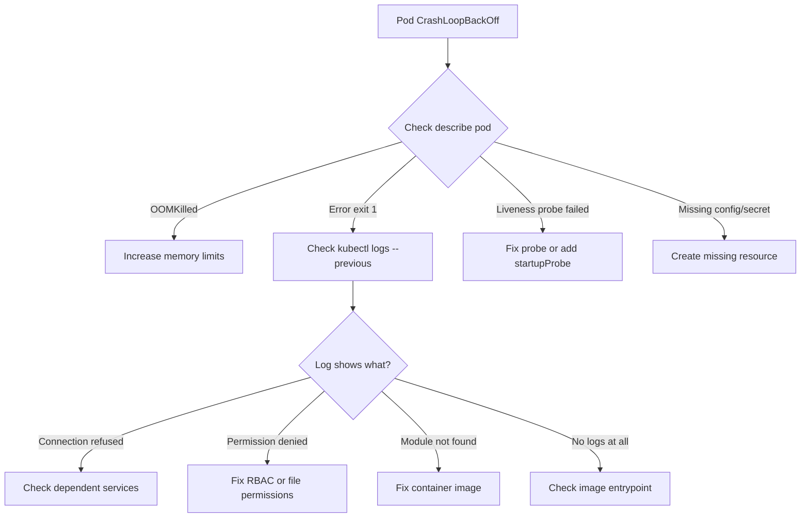

> 💡 **Quick Answer:** CrashLoopBackOff means your container starts, crashes, and Kubernetes keeps restarting it with increasing backoff delays. Run `kubectl logs <pod>` and `kubectl describe pod <pod>` to find the root cause — usually OOMKilled, missing env vars/configs, failed liveness probes, or application errors.
>
> **Key insight:** The backoff delay doubles each restart (10s, 20s, 40s, 80s... max 5 minutes). Your container IS running briefly each time — check logs from the **previous** crash with `--previous`.
>
> **Gotcha:** Liveness probes should NEVER check external dependencies like databases. If the DB is down, restarting the app won't fix it — and causes a thundering herd.

## The Problem

Your pod shows `CrashLoopBackOff` status and won't stay running:

```bash
$ kubectl get pods
NAME                    READY   STATUS             RESTARTS      AGE
myapp-7b9f5c6d4-x2k8j  0/1     CrashLoopBackOff   5 (42s ago)   3m
```

## The Solution

### Step 1: Check the Crash Reason

```bash
# Get the last termination reason
kubectl describe pod myapp-7b9f5c6d4-x2k8j | grep -A5 "Last State"
```

Common termination reasons:

| Reason | Meaning | Fix |
|--------|---------|-----|
| `OOMKilled` | Container exceeded memory limit | Increase `resources.limits.memory` |
| `Error` (exit code 1) | Application error | Check logs |
| `Error` (exit code 137) | SIGKILL — OOM or preemption | Increase memory or check node pressure |
| `Error` (exit code 143) | SIGTERM — graceful shutdown failed | Check `terminationGracePeriodSeconds` |
| `Completed` (exit code 0) | Container finished normally | Add a long-running process or use a Job |

### Step 2: Check Logs

```bash
# Current crash attempt logs
kubectl logs myapp-7b9f5c6d4-x2k8j

# Previous crash logs (crucial — current attempt may have no output yet)
kubectl logs myapp-7b9f5c6d4-x2k8j --previous

# All containers including init containers
kubectl logs myapp-7b9f5c6d4-x2k8j --all-containers
```

### Step 3: Common Fixes

**OOMKilled — increase memory:**

```yaml
resources:
  requests:
    memory: "256Mi"
  limits:
    memory: "512Mi"  # Increase this
```

**Missing ConfigMap or Secret:**

```bash
# Check events for mount failures
kubectl describe pod myapp-7b9f5c6d4-x2k8j | grep -A3 "Events"
# "MountVolume.SetUp failed: configmap "myapp-config" not found"

# Create the missing ConfigMap
kubectl create configmap myapp-config --from-file=config.yaml
```

**Bad liveness probe:**

```yaml
# BAD — checks database (causes thundering herd)
livenessProbe:
  httpGet:
    path: /health/full  # Includes DB check
    port: 8080

# GOOD — checks only the process itself
livenessProbe:
  httpGet:
    path: /healthz  # Simple "am I alive" check
    port: 8080
  initialDelaySeconds: 15  # Give app time to start
  periodSeconds: 10
  failureThreshold: 3
```

**Application needs startup time:**

```yaml
# Add startupProbe for slow-starting apps
startupProbe:
  httpGet:
    path: /healthz
    port: 8080
  failureThreshold: 30
  periodSeconds: 10
  # App has 300s (30 × 10) to start before being killed
```



### Step 4: Debug Interactively

If logs aren't enough, override the command to keep the container alive:

```bash
# Override entrypoint to sleep (keeps pod running for debugging)
kubectl run debug-myapp --image=myapp:latest \
  --overrides='{"spec":{"containers":[{"name":"debug","image":"myapp:latest","command":["sleep","3600"]}]}}' \
  -- sleep 3600

# Exec into it
kubectl exec -it debug-myapp -- /bin/sh

# Try running the app manually
/app/start.sh
```

Or use ephemeral debug containers (Kubernetes 1.23+):

```bash
kubectl debug myapp-7b9f5c6d4-x2k8j -it --image=busybox --target=myapp
```

## Common Issues

### CrashLoopBackOff with zero logs
The container crashes before producing any output. Check:
- Is the image correct? (`kubectl describe pod` → Image field)
- Is the entrypoint valid? (`docker inspect <image>` locally)
- Are required env vars set?

### Restart count keeps increasing but pod eventually works
This is normal for pods that depend on other services not yet ready. Use init containers to wait for dependencies:

```yaml
initContainers:
  - name: wait-for-db
    image: busybox
    command: ['sh', '-c', 'until nc -z postgres-svc 5432; do sleep 2; done']
```

### OOMKilled but app normally uses less memory
Check for memory leaks. Also check if the JVM, Python, or Node.js runtime has its own memory limits that conflict with the container limit.

## Best Practices

- **Always set `resources.requests` AND `resources.limits`** — prevents OOMKilled surprises
- **Liveness probes: check the process, not dependencies** — if the DB is down, restarting the app makes it worse
- **Use `startupProbe` for slow-starting apps** — prevents liveness probe from killing during startup
- **Set `initialDelaySeconds` on liveness probes** — give the app time to initialize
- **Log to stdout/stderr** — Kubernetes captures these; file-based logs are lost on crash

## Key Takeaways

- CrashLoopBackOff is a symptom, not a diagnosis — always check `logs --previous` and `describe pod`
- The top causes are: OOMKilled, missing configs, bad liveness probes, and application errors
- Backoff delay maxes at 5 minutes — be patient or fix the root cause
- Never make liveness probes check external dependencies
- Use ephemeral debug containers or command overrides for interactive debugging
