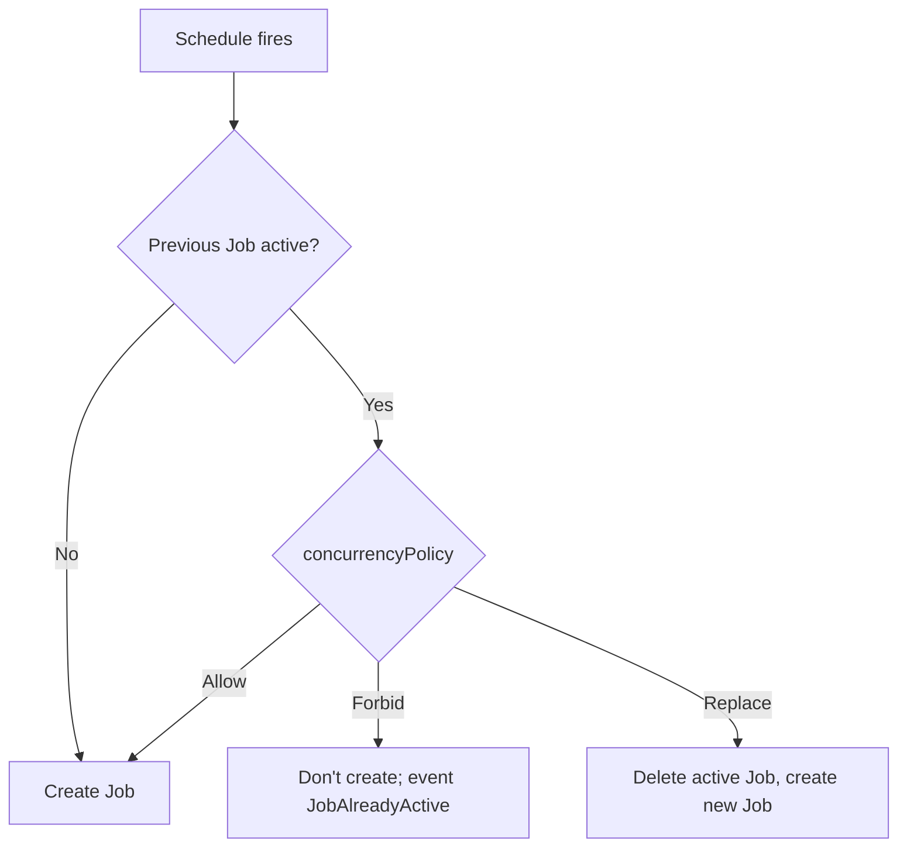

> 💡 **Quick Answer:** `spec.concurrencyPolicy` decides what happens when a CronJob's schedule fires while its previous Job is still active: **`Allow`** (default) starts another Job alongside it, **`Forbid`** skips the new run, **`Replace`** deletes the running Job and starts a new one. Use `Forbid` for backups, reports and anything that takes locks; `Replace` for "latest data wins" refreshes. Pair it with `activeDeadlineSeconds` so a hung Job can't block (Forbid) or pile up (Allow) forever.
>
> **Gotcha:** If runs keep overlapping, `Forbid` only hides the problem — the job is slower than its interval. Fix the job or the schedule.

## The Problem

A CronJob runs every 5 minutes but sometimes takes 7. Without a policy you get:

- Overlapping runs competing for CPU, memory and database connections
- Duplicate processing, double-sent emails, lock contention
- Two backups writing the same file
- Jobs accumulating until the namespace quota is exhausted

## The Three Policies

| Policy | Previous Job still active → | Missed runs | Use when |
|--------|---------|--------|----------|
| **Allow** (default) | New Job runs concurrently | None | Runs are idempotent and independent (per-time-window processing) |
| **Forbid** | New run not started | Possible (started late within `startingDeadlineSeconds`, else skipped) | Runs must be sequential: backups, ETL, file processing, exclusive locks |
| **Replace** | Running Job deleted, new Job created | None — the old one is interrupted | Only the latest run matters: cache refresh, status sync |

The policy only applies to Jobs created by **this** CronJob. Jobs from other CronJobs, or created manually with `kubectl create job --from=cronjob/...`, aren't counted as "active".



## Allow

```yaml
apiVersion: batch/v1
kind: CronJob
metadata:
  name: send-notifications
spec:
  schedule: "*/5 * * * *"
  concurrencyPolicy: Allow
  jobTemplate:
    spec:
      activeDeadlineSeconds: 1800        # safeguard: no Job lives longer than 30 min
      template:
        spec:
          restartPolicy: Never
          containers:
            - name: notify
              image: registry.example.com/notify:v1
              resources:
                requests: {cpu: 100m, memory: 128Mi}
                limits: {memory: 256Mi}
```

If a run takes longer than the interval, running Jobs accumulate without bound. Always add `activeDeadlineSeconds` and resource requests with `Allow`, and consider a ResourceQuota on `count/jobs.batch` in the namespace.

## Forbid

```yaml
apiVersion: batch/v1
kind: CronJob
metadata:
  name: database-backup
spec:
  schedule: "0 2 * * *"
  concurrencyPolicy: Forbid
  startingDeadlineSeconds: 3600        # a blocked run may still start up to 1h late
  successfulJobsHistoryLimit: 3
  failedJobsHistoryLimit: 3
  jobTemplate:
    spec:
      activeDeadlineSeconds: 7200      # a hung backup is killed after 2h and stops blocking
      template:
        spec:
          restartPolicy: Never
          containers:
            - name: backup
              image: registry.example.com/db-backup:v1
              env:
                - name: DATABASE_URL
                  valueFrom:
                    secretKeyRef:
                      name: db-credentials
                      key: url
              volumeMounts:
                - name: backup-volume
                  mountPath: /backups
          volumes:
            - name: backup-volume
              persistentVolumeClaim:
                claimName: backup-pvc
```

### How Forbid interacts with startingDeadlineSeconds

When a run is blocked, the controller keeps treating that schedule as **missed** and re-checks it:

- **No `startingDeadlineSeconds`** — as soon as the previous Job finishes, the most recent missed run starts immediately, however late. (After more than 100 missed schedules the controller stops and logs "too many missed start times".)
- **With `startingDeadlineSeconds: N`** — the missed run starts only if the previous Job finishes within N seconds of the scheduled time; otherwise it's skipped until the next schedule.

So set the deadline to "how late is still useful". A 02:00 backup starting at 02:40 is fine; a 5-minute metrics push starting 4 minutes late usually isn't. Don't set it below ~10 s — the controller may never get to start the Job.

And set `activeDeadlineSeconds` on the Job: a hung Job with `Forbid` blocks **every** future run until someone deletes it.

## Replace

```yaml
apiVersion: batch/v1
kind: CronJob
metadata:
  name: cache-refresh
spec:
  schedule: "*/10 * * * *"
  concurrencyPolicy: Replace
  jobTemplate:
    spec:
      activeDeadlineSeconds: 540       # finish (or die) before the next tick at 10 min
      template:
        spec:
          restartPolicy: Never
          terminationGracePeriodSeconds: 30
          containers:
            - name: refresh
              image: registry.example.com/cache-refresh:v1
```

The controller deletes the old Job (background cascade); its pods get SIGTERM and `terminationGracePeriodSeconds` to exit. The app must handle SIGTERM (commit or roll back its transaction, release locks) — see [graceful shutdown](/recipes/deployments/kubernetes-graceful-shutdown-guide/). Never use `Replace` for work that can't be safely interrupted.

## Check What the Controller Did

```bash
kubectl get cronjobs
# NAME              SCHEDULE       SUSPEND   ACTIVE   LAST SCHEDULE   AGE
# database-backup   0 2 * * *      False     1        8h              30d   ← ACTIVE 1 = a run is in progress
# cache-refresh     */10 * * * *   False     1        2m              7d

kubectl describe cronjob database-backup
# Events:
#   Normal   SuccessfulCreate   Created job database-backup-29345678
#   Normal   JobAlreadyActive   Not starting job because prior execution is running and concurrency policy is Forbid
#   Normal   SawCompletedJob    Saw completed job: database-backup-29345678, status: Complete
#   Warning  MissSchedule       Missed scheduled time to start a job: ...

kubectl get events --field-selector involvedObject.name=database-backup,reason=JobAlreadyActive

# Which Job is blocking? (active Jobs are listed in status)
kubectl get cronjob database-backup -o jsonpath='{.status.active[*].name}'
```

For `Replace`, look for `SuccessfulDelete` events on the CronJob.

## Common Mistakes

### 1. Allow with no safeguards

```yaml
# ❌ Unbounded: slow runs accumulate
spec:
  concurrencyPolicy: Allow

# ✅ Bound each run
spec:
  concurrencyPolicy: Allow
  jobTemplate:
    spec:
      activeDeadlineSeconds: 1800
```

### 2. Forbid with a hung Job and no activeDeadlineSeconds

The CronJob silently stops running: every tick logs `JobAlreadyActive`. Add `activeDeadlineSeconds` and alert on `kube_cronjob_status_last_successful_time`.

### 3. Forbid with a tiny startingDeadlineSeconds

`startingDeadlineSeconds: 10` on a job that sometimes overruns means the blocked run is almost always skipped. Size it to the acceptable delay.

### 4. Replace for non-interruptible work

A killed migration or half-written export is worse than a skipped refresh. Use `Forbid`.

## Decision Flow

```text
Can two runs safely execute at the same time?
├── YES → Allow (+ activeDeadlineSeconds + requests)
└── NO  → Is only the latest run's result useful, and is interruption safe?
          ├── YES → Replace (+ SIGTERM handling)
          └── NO  → Forbid (+ activeDeadlineSeconds + startingDeadlineSeconds)
```

## Best Practices

1. **Default to `Forbid`** for production CronJobs
2. **Always set `activeDeadlineSeconds`** — shorter than the interval for `Replace`, shorter than "blocking is acceptable" for `Forbid`
3. **Set `startingDeadlineSeconds`** to the latest acceptable start
4. **Keep history limits low** (`3`/`3`) so `kubectl get jobs` stays readable
5. **Alert on skipped runs** — `JobAlreadyActive` events or stale last-success time
6. **Make jobs idempotent** — retries and late starts happen with every policy

## Frequently Asked Questions

### What is the default concurrencyPolicy for a CronJob?

`Allow`. Concurrent runs are permitted unless you set `Forbid` or `Replace`.

### What does concurrencyPolicy: Forbid do?

If the previous Job created by the CronJob is still active when the schedule fires, the controller doesn't create a new Job. The run is treated as missed: it may start late once the previous Job finishes (within `startingDeadlineSeconds`, if set), otherwise it's skipped.

### Forbid vs Replace?

`Forbid` protects the running Job and drops or delays the new one. `Replace` kills the running Job and starts fresh. Choose `Forbid` when interruption is harmful, `Replace` when stale results are worse than interrupted ones.

### Does activeDeadlineSeconds have a default?

No. Without it a Job can run forever — and with `Forbid`, block all future runs. Set it in `jobTemplate.spec`, not on the CronJob spec.

### Does concurrencyPolicy apply to manually triggered Jobs?

No. Jobs created with `kubectl create job --from=cronjob/<name>` aren't tracked in the CronJob's `status.active`, so they neither block nor get replaced.
