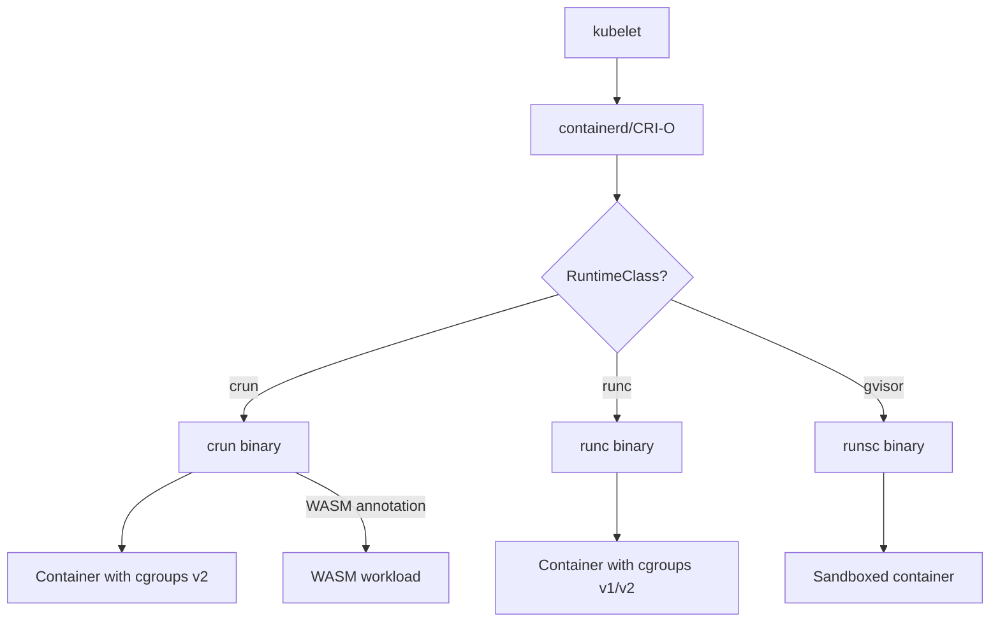

> 💡 **Quick Answer:** `runc` is the default OCI runtime (Go, battle-tested). `crun` is a faster alternative written in C — 50% faster startup, 50% less memory, native cgroups v2, and WASM support. OpenShift 4.12+ uses crun by default. Both are fully OCI-compliant.

## The Problem

Choosing a container runtime affects:
- Container startup latency (matters for serverless/scale-to-zero)
- Memory overhead per container
- cgroups v2 feature support
- WASM/WebAssembly workload support
- Security (memory safety tradeoffs)

## The Solution

### Feature Comparison

| Feature | runc | crun |
|---------|------|------|
| Language | Go | C |
| Container startup | ~50ms | ~25ms |
| Memory per container | ~12MB | ~6MB |
| cgroups v2 | Full | Full + extra features |
| OCI compliance | Reference implementation | Fully compliant |
| WASM support | No | Yes (wasmedge, wasmtime) |
| Default in | Kubernetes, Docker | OpenShift 4.12+, Fedora |
| Seccomp | Yes | Yes |
| rootless | Yes | Yes |
| io_uring support | No | Yes |

### Performance Benchmarks

```bash
# Startup time comparison (1000 containers)
# runc:  average 52ms per container
# crun:  average 24ms per container
# → crun is ~2x faster at startup

# Memory overhead (idle container)
# runc:  ~12MB RSS
# crun:  ~6MB RSS
# → crun uses ~50% less memory

# At scale (1000 containers on a node):
# runc:  12GB overhead
# crun:  6GB overhead
# → 6GB savings available for workloads
```

### Check Current Runtime

```bash
# Check which runtime your cluster uses
kubectl get nodes -o jsonpath='{.items[*].status.nodeInfo.containerRuntimeVersion}'
# containerd://1.7.20 (runtime is configured inside containerd)

# Check containerd's default runtime
cat /etc/containerd/config.toml | grep -A5 "runtimes.runc"
# [plugins."io.containerd.grpc.v1.cri".containerd.runtimes.runc]
#   runtime_type = "io.containerd.runc.v2"

# On the node, check actual binary
ls -la /usr/bin/runc /usr/bin/crun 2>/dev/null
```

### Switch to crun

```bash
# Install crun
# Fedora/RHEL
sudo dnf install -y crun

# Ubuntu/Debian
sudo apt install -y crun

# Configure containerd to use crun
cat <<EOF | sudo tee /etc/containerd/config.toml
[plugins."io.containerd.grpc.v1.cri".containerd.runtimes.crun]
  runtime_type = "io.containerd.runc.v2"
  [plugins."io.containerd.grpc.v1.cri".containerd.runtimes.crun.options]
    BinaryName = "/usr/bin/crun"
    SystemdCgroup = true

[plugins."io.containerd.grpc.v1.cri".containerd]
  default_runtime_name = "crun"
EOF

sudo systemctl restart containerd
```

### Use RuntimeClass for Mixed Runtimes

```yaml
# Define RuntimeClasses for both
apiVersion: node.k8s.io/v1
kind: RuntimeClass
metadata:
  name: crun
handler: crun
---
apiVersion: node.k8s.io/v1
kind: RuntimeClass
metadata:
  name: runc
handler: runc
---
# Use crun for high-density workloads
apiVersion: apps/v1
kind: Deployment
metadata:
  name: serverless-function
spec:
  template:
    spec:
      runtimeClassName: crun  # Fast startup, low memory
      containers:
        - name: function
          image: my-function:1.0.0
---
# Keep runc for maximum compatibility
apiVersion: apps/v1
kind: Deployment
metadata:
  name: legacy-app
spec:
  template:
    spec:
      runtimeClassName: runc
      containers:
        - name: app
          image: legacy:1.0.0
```

### crun WASM Support

```bash
# crun can run WASM workloads directly
# Install with WASM support
sudo dnf install -y crun-wasm

# containerd config for WASM runtime
[plugins."io.containerd.grpc.v1.cri".containerd.runtimes.crun-wasm]
  runtime_type = "io.containerd.runc.v2"
  [plugins."io.containerd.grpc.v1.cri".containerd.runtimes.crun-wasm.options]
    BinaryName = "/usr/bin/crun"
    SystemdCgroup = true
  [plugins."io.containerd.grpc.v1.cri".containerd.runtimes.crun-wasm.options.Annotations]
    "run.oci.handler" = "wasm"
```

### Architecture



## Common Issues

| Issue | Cause | Fix |
|-------|-------|-----|
| crun not found | Not installed | `dnf install crun` or `apt install crun` |
| Container fails to start with crun | Old crun version | Upgrade to crun ≥ 1.8 |
| Seccomp profile error | crun version mismatch | Update seccomp profiles for crun |
| Existing containers still use runc | Containers created before switch | Recreate pods (rolling restart) |
| WASM not working | crun compiled without WASM support | Install `crun-wasm` package |

## Best Practices

1. **Use crun for new clusters** — strictly better performance, OCI compliant
2. **Keep runc as fallback RuntimeClass** — maximum compatibility for edge cases
3. **Test existing workloads before switching** — 99% work fine, but verify
4. **Enable WASM via crun** — avoid separate WASM runtimes when possible
5. **Monitor startup latency** — crun benefits are most visible at scale

## Key Takeaways

- crun is a drop-in replacement for runc — same OCI interface, better performance
- 2× faster startup, 50% less memory — significant at 100+ containers per node
- OpenShift 4.12+ already defaults to crun; vanilla K8s still defaults to runc
- Use RuntimeClass to run both side-by-side during migration
- crun adds WASM support and io_uring — features runc doesn't have
