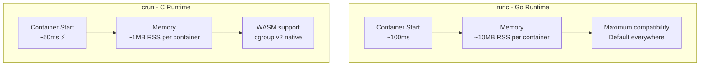

> 💡 **Quick Answer:** Use crun for faster container startup (50% faster cold start) and lower memory usage (10x less RSS). Use runc for maximum compatibility and when running on cgroup v1. Both are OCI-compliant — switching is a one-line config change in containerd or CRI-O.

## The Problem

Teams assume all container runtimes are equal, but crun (written in C) starts containers 50% faster and uses 10x less memory than runc (written in Go). For Kubernetes nodes running 100+ pods, the difference in node overhead is significant.

## The Solution

### Performance Comparison

| Feature | runc | crun |
|---------|------|------|
| Language | Go | C |
| Cold start | ~100ms | ~50ms |
| Memory per container | ~10MB RSS | ~1MB RSS |
| cgroup v2 native | Partial | Full |
| Rootless containers | Yes | Yes |
| WASM support | No | Yes (wasmedge) |
| OCI compliant | Yes | Yes |
| Default in containerd | Yes | No |
| Default in Podman/CRI-O | No | Yes (RHEL 9+) |

### Configure containerd to use crun

```toml
# /etc/containerd/config.toml
[plugins."io.containerd.grpc.v1.cri".containerd.runtimes.crun]
  runtime_type = "io.containerd.runc.v2"
  [plugins."io.containerd.grpc.v1.cri".containerd.runtimes.crun.options]
    BinaryName = "/usr/bin/crun"
```

### Configure CRI-O to use crun

```toml
# /etc/crio/crio.conf.d/01-crun.conf
[crio.runtime]
default_runtime = "crun"

[crio.runtime.runtimes.crun]
runtime_path = "/usr/bin/crun"
runtime_type = "oci"
```

### Install crun

```bash
# Fedora / RHEL 9+
sudo dnf install crun

# Ubuntu / Debian
sudo apt install crun

# Verify
crun --version
# crun version 1.14
# spec: 1.0.0
# +SYSTEMD +SELINUX +CAP +SECCOMP +EBPF +CRIU +LIBKRUN +WASM:wasmedge
```

### Kubernetes RuntimeClass

```yaml
apiVersion: node.k8s.io/v1
kind: RuntimeClass
metadata:
  name: crun
handler: crun
---
apiVersion: v1
kind: Pod
metadata:
  name: fast-start
spec:
  runtimeClassName: crun
  containers:
    - name: app
      image: registry.example.com/app:v1
```



## Common Issues

**crun not found after install**: Verify path: `which crun`. containerd needs the full path in config. Restart containerd after config changes.

**Pods failing with crun**: Check crun supports your seccomp profile. Some older seccomp profiles reference syscalls not handled by crun.

## Best Practices

- **crun for performance** — 50% faster starts, 10x less memory
- **runc for compatibility** — default everywhere, battle-tested
- **Both OCI-compliant** — same container images, same behavior
- **RuntimeClass for mixed** — run both on the same cluster
- **RHEL 9+ defaults to crun** — Red Hat already made this choice

## Key Takeaways

- crun is 50% faster and 10x lighter than runc — written in C vs Go
- Both are fully OCI-compliant — switching requires only a config change
- crun is default on RHEL 9+, Fedora, and Podman
- Use RuntimeClass to run both runtimes on the same Kubernetes cluster
- crun adds WASM support via wasmedge — runc doesn't support WASM
