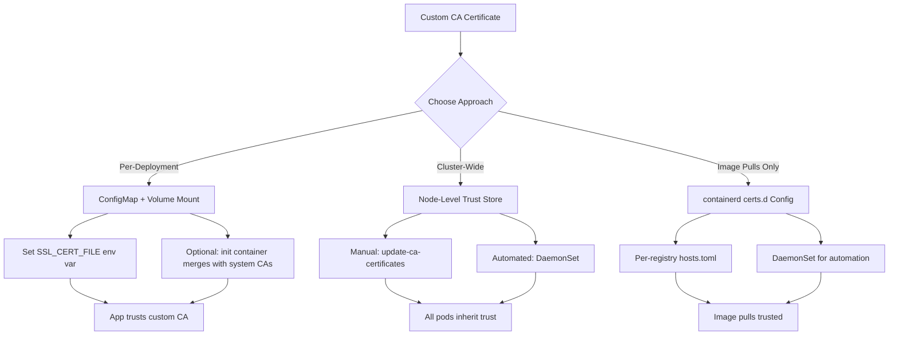

> 💡 **Quick Answer:** Create a ConfigMap from your CA certificate and mount it as a volume in your pods with the `SSL_CERT_FILE` environment variable. For cluster-wide trust, install the CA on each node with `update-ca-certificates` or configure containerd for registry-specific trust.

## The Problem

Your Kubernetes cluster needs to trust a custom Certificate Authority. Unlike OpenShift, vanilla Kubernetes has **no built-in cluster-wide CA injection mechanism**. You need to handle this yourself for:

- **Private container registries** — Harbor, Nexus, GitLab Registry with self-signed TLS
- **Internal services** — APIs, databases, message brokers with corporate PKI
- **Webhook endpoints** — admission webhooks, external DNS, cert-manager ACME servers
- **Git repositories** — private GitLab/Gitea for Flux or ArgoCD source repos

Without custom CA trust, you'll see:

```plaintext
x509: certificate signed by unknown authority
Failed to pull image: tls: failed to verify certificate
```

You have three approaches, each with different trade-offs.

## The Solution

### Approach 1: ConfigMap Volume Mount (Per-Deployment)

The most portable and Kubernetes-native approach. Works on any distribution — EKS, GKE, AKS, k3s, kubeadm.

#### Step 1: Create the CA ConfigMap

```bash
# Single CA file
kubectl create configmap custom-ca \
  -n my-namespace \
  --from-file=ca-certificates.crt=/path/to/custom-ca.pem

# Multiple CAs — concatenate first
cat root-ca.pem intermediate-ca.pem > ca-bundle.pem
kubectl create configmap custom-ca \
  -n my-namespace \
  --from-file=ca-certificates.crt=ca-bundle.pem
```

Or declaratively:

```yaml
apiVersion: v1
kind: ConfigMap
metadata:
  name: custom-ca
  namespace: my-namespace
data:
  ca-certificates.crt: |
    -----BEGIN CERTIFICATE-----
    MIIDXTCCAkWgAwIBAgIJAJC1HiIAZAiUMA0GCSqGSIb3Dq...
    -----END CERTIFICATE-----
```

#### Step 2: Mount in Your Deployment

```yaml
apiVersion: apps/v1
kind: Deployment
metadata:
  name: my-app
  namespace: my-namespace
spec:
  replicas: 2
  selector:
    matchLabels:
      app: my-app
  template:
    metadata:
      labels:
        app: my-app
    spec:
      containers:
        - name: app
          image: my-app:v1.0.0
          volumeMounts:
            - name: ca-certs
              mountPath: /etc/ssl/certs/custom-ca.crt
              subPath: ca-certificates.crt
              readOnly: true
          env:
            # Go applications
            - name: SSL_CERT_FILE
              value: /etc/ssl/certs/custom-ca.crt
            # Python requests
            - name: REQUESTS_CA_BUNDLE
              value: /etc/ssl/certs/custom-ca.crt
            # Node.js
            - name: NODE_EXTRA_CA_CERTS
              value: /etc/ssl/certs/custom-ca.crt
            # curl
            - name: CURL_CA_BUNDLE
              value: /etc/ssl/certs/custom-ca.crt
            # Java (alternative: mount as truststore)
            - name: JAVA_TOOL_OPTIONS
              value: -Djavax.net.ssl.trustStore=/etc/ssl/certs/custom-ca.crt
      volumes:
        - name: ca-certs
          configMap:
            name: custom-ca
```

#### Step 3: Create a Reusable Init Container Pattern

For applications that need the CA merged with system certificates:

```yaml
apiVersion: apps/v1
kind: Deployment
metadata:
  name: my-app
  namespace: my-namespace
spec:
  replicas: 1
  selector:
    matchLabels:
      app: my-app
  template:
    metadata:
      labels:
        app: my-app
    spec:
      initContainers:
        - name: ca-merger
          image: alpine:3.19
          command:
            - sh
            - -c
            - |
              # Copy system CA bundle
              cp /etc/ssl/certs/ca-certificates.crt /merged-certs/ca-certificates.crt
              # Append custom CA
              cat /custom-ca/ca-certificates.crt >> /merged-certs/ca-certificates.crt
              echo "Merged $(grep -c 'BEGIN CERTIFICATE' /merged-certs/ca-certificates.crt) certificates"
          volumeMounts:
            - name: custom-ca
              mountPath: /custom-ca
              readOnly: true
            - name: merged-certs
              mountPath: /merged-certs
      containers:
        - name: app
          image: my-app:v1.0.0
          volumeMounts:
            - name: merged-certs
              mountPath: /etc/ssl/certs
              readOnly: true
          env:
            - name: SSL_CERT_FILE
              value: /etc/ssl/certs/ca-certificates.crt
      volumes:
        - name: custom-ca
          configMap:
            name: custom-ca
        - name: merged-certs
          emptyDir: {}
```

### Approach 2: Node-Level Trust Store (Cluster-Wide)

Install the CA on every node so kubelet, container runtime, and all pods inherit trust.

#### Manual Installation

```bash
# Debian/Ubuntu nodes
sudo cp custom-ca.crt /usr/local/share/ca-certificates/custom-ca.crt
sudo update-ca-certificates

# RHEL/CentOS/Fedora nodes
sudo cp custom-ca.crt /etc/pki/ca-trust/source/anchors/custom-ca.crt
sudo update-ca-trust extract

# SUSE nodes
sudo cp custom-ca.crt /usr/share/pki/trust/anchors/custom-ca.crt
sudo update-ca-certificates
```

#### Automated via DaemonSet

For dynamic clusters where nodes come and go:

```yaml
apiVersion: v1
kind: ConfigMap
metadata:
  name: custom-ca-cert
  namespace: kube-system
data:
  custom-ca.crt: |
    -----BEGIN CERTIFICATE-----
    MIIDXTCCAkWgAwIBAgIJAJC1HiIAZAiUMA0GCSqGSIb3Dq...
    -----END CERTIFICATE-----
---
apiVersion: apps/v1
kind: DaemonSet
metadata:
  name: ca-cert-installer
  namespace: kube-system
  labels:
    app: ca-cert-installer
spec:
  selector:
    matchLabels:
      app: ca-cert-installer
  template:
    metadata:
      labels:
        app: ca-cert-installer
    spec:
      hostPID: true
      tolerations:
        - operator: Exists
      initContainers:
        - name: install-ca
          image: alpine:3.19
          command:
            - sh
            - -c
            - |
              echo "Installing custom CA on node..."
              cp /ca-source/custom-ca.crt /host-certs/custom-ca.crt
              # Run update-ca-certificates on host
              nsenter --target 1 --mount -- update-ca-certificates 2>/dev/null || \
              nsenter --target 1 --mount -- update-ca-trust extract 2>/dev/null || \
              echo "CA file copied, manual trust update may be needed"
              echo "Done at $(date)"
          volumeMounts:
            - name: ca-source
              mountPath: /ca-source
              readOnly: true
            - name: host-certs-debian
              mountPath: /host-certs
          securityContext:
            privileged: true
      containers:
        - name: pause
          image: registry.k8s.io/pause:3.9
          resources:
            requests:
              cpu: 1m
              memory: 4Mi
            limits:
              cpu: 5m
              memory: 8Mi
      volumes:
        - name: ca-source
          configMap:
            name: custom-ca-cert
        - name: host-certs-debian
          hostPath:
            path: /usr/local/share/ca-certificates
            type: DirectoryOrCreate
```

> ⚠️ **Security warning:** This DaemonSet requires `privileged: true` and `hostPID: true`. Only use this if you control the cluster infrastructure. For managed Kubernetes (EKS, GKE, AKS), use Approach 1 or 3 instead.

#### For Managed Kubernetes

Each cloud provider has a different mechanism:

```bash
# EKS — use launch template user data
# In your launch template:
MIME-Version: 1.0
Content-Type: multipart/mixed; boundary="==MYBOUNDARY=="

--==MYBOUNDARY==
Content-Type: text/x-shellscript; charset="us-ascii"

#!/bin/bash
cat <<EOF > /usr/local/share/ca-certificates/custom-ca.crt
-----BEGIN CERTIFICATE-----
...your CA here...
-----END CERTIFICATE-----
EOF
update-ca-certificates
systemctl restart containerd

--==MYBOUNDARY==--

# GKE — use DaemonSet approach (no node SSH access)

# AKS — custom node configuration is limited, use ConfigMap approach
```

### Approach 3: containerd Registry Configuration

For container image pulls specifically, configure containerd directly:

#### Per-Registry Trust

Create the directory structure on each node:

```bash
# Create registry-specific cert directory
sudo mkdir -p /etc/containerd/certs.d/registry.internal.example.com

# Create the hosts.toml configuration
sudo cat > /etc/containerd/certs.d/registry.internal.example.com/hosts.toml <<EOF
server = "https://registry.internal.example.com"

[host."https://registry.internal.example.com"]
  capabilities = ["pull", "resolve"]
  ca = "/etc/containerd/certs.d/registry.internal.example.com/ca.crt"
EOF

# Copy the CA certificate
sudo cp custom-ca.crt /etc/containerd/certs.d/registry.internal.example.com/ca.crt
```

#### Configure containerd to Use certs.d

Ensure containerd is configured to read the `certs.d` directory:

```toml
# /etc/containerd/config.toml
version = 2

[plugins."io.containerd.grpc.v1.cri".registry]
  config_path = "/etc/containerd/certs.d"
```

Restart containerd:

```bash
sudo systemctl restart containerd

# Verify the configuration
sudo ctr images pull registry.internal.example.com/test:latest
```

#### Automate with a DaemonSet

```yaml
apiVersion: apps/v1
kind: DaemonSet
metadata:
  name: containerd-ca-config
  namespace: kube-system
spec:
  selector:
    matchLabels:
      app: containerd-ca-config
  template:
    metadata:
      labels:
        app: containerd-ca-config
    spec:
      tolerations:
        - operator: Exists
      initContainers:
        - name: configure-containerd
          image: alpine:3.19
          command:
            - sh
            - -c
            - |
              REGISTRY="registry.internal.example.com"
              CERT_DIR="/host-containerd/certs.d/${REGISTRY}"
              mkdir -p "${CERT_DIR}"
              cp /ca-source/custom-ca.crt "${CERT_DIR}/ca.crt"
              cat > "${CERT_DIR}/hosts.toml" <<EOF
              server = "https://${REGISTRY}"
              [host."https://${REGISTRY}"]
                capabilities = ["pull", "resolve"]
                ca = "${CERT_DIR}/ca.crt"
              EOF
              echo "Configured containerd trust for ${REGISTRY}"
          volumeMounts:
            - name: ca-source
              mountPath: /ca-source
              readOnly: true
            - name: host-containerd
              mountPath: /host-containerd
          securityContext:
            privileged: true
      containers:
        - name: pause
          image: registry.k8s.io/pause:3.9
          resources:
            requests:
              cpu: 1m
              memory: 4Mi
      volumes:
        - name: ca-source
          configMap:
            name: custom-ca-cert
        - name: host-containerd
          hostPath:
            path: /etc/containerd
            type: DirectoryOrCreate
```

### Verification

```bash
# Test from a pod using the ConfigMap approach
kubectl run ca-test --rm -it --restart=Never \
  --overrides='{
    "spec": {
      "containers": [{
        "name": "ca-test",
        "image": "curlimages/curl",
        "command": ["curl", "-v", "https://registry.internal.example.com/v2/"],
        "volumeMounts": [{"name": "ca", "mountPath": "/etc/ssl/certs/custom-ca.crt", "subPath": "ca-certificates.crt", "readOnly": true}],
        "env": [{"name": "CURL_CA_BUNDLE", "value": "/etc/ssl/certs/custom-ca.crt"}]
      }],
      "volumes": [{"name": "ca", "configMap": {"name": "custom-ca"}}]
    }
  }' -- curl -v https://registry.internal.example.com/v2/

# Test image pull after node-level or containerd configuration
kubectl run pull-test --rm -it --restart=Never \
  --image=registry.internal.example.com/test:latest -- echo "Success"

# Check certificate details
kubectl run ssl-check --rm -it --restart=Never \
  --image=alpine/openssl -- \
  s_client -connect registry.internal.example.com:443 -showcerts
```



## Common Issues

### Application ignores the CA environment variable

Different runtimes use different variables:

```bash
# Check which variable your runtime expects
# Go: SSL_CERT_FILE or SSL_CERT_DIR
# Python: REQUESTS_CA_BUNDLE or SSL_CERT_FILE
# Node.js: NODE_EXTRA_CA_CERTS (adds to defaults, doesn't replace)
# Ruby: SSL_CERT_FILE
# Java: javax.net.ssl.trustStore (needs JKS/PKCS12 format)
# curl: CURL_CA_BUNDLE
```

For Java, you need a keystore:

```bash
# Convert PEM to JKS truststore
keytool -import -trustcacerts -keystore /tmp/truststore.jks \
  -storepass changeit -noprompt -alias custom-ca \
  -file custom-ca.pem
```

### containerd not picking up certs.d changes

```bash
# Verify the config_path is set
sudo containerd config dump | grep config_path

# If not set, add it and restart
sudo systemctl restart containerd

# Test directly with ctr
sudo ctr images pull --hosts-dir /etc/containerd/certs.d \
  registry.internal.example.com/test:latest
```

### DaemonSet CA installation not persisting

```bash
# Check if the file exists on the node
kubectl debug node/worker-0 -it --image=alpine -- \
  ls -la /host/usr/local/share/ca-certificates/

# Some managed K8s providers use ephemeral node disks
# In that case, the DaemonSet must re-run on every node restart
# Use an initContainer (not a one-shot Job) to handle this
```

### subPath mount replacing entire directory

```bash
# Wrong: this replaces all of /etc/ssl/certs/
volumeMounts:
  - name: ca-certs
    mountPath: /etc/ssl/certs/

# Right: use subPath to add a single file
volumeMounts:
  - name: ca-certs
    mountPath: /etc/ssl/certs/custom-ca.crt
    subPath: ca-certificates.crt
```

## Best Practices

- **Use ConfigMap mounts for portability** — they work on any Kubernetes distribution including managed services
- **Set the right env var for your runtime** — `SSL_CERT_FILE` for Go, `NODE_EXTRA_CA_CERTS` for Node.js, `REQUESTS_CA_BUNDLE` for Python
- **Use `subPath`** when mounting into existing directories to avoid hiding other files
- **Use the init container pattern** to merge custom CAs with system CAs — some apps need the complete chain
- **Automate with Kustomize overlays** — define the CA ConfigMap and volume mounts in a base, overlay per environment
- **Never use `insecureSkipVerify`** — it defeats TLS entirely; always add the CA properly
- **Plan for CA rotation** — ConfigMaps update automatically in mounted volumes (within kubelet sync period), but pods may need restart
- **Prefer containerd `certs.d`** over node-level trust for registry-only use cases — it's more targeted and doesn't require `update-ca-certificates`
- **For managed Kubernetes**, stick to ConfigMap mounts — you often can't modify node trust stores

## Key Takeaways

- Vanilla Kubernetes has **no built-in cluster-wide CA injection** — you must choose between per-deployment mounts, node-level trust, or containerd config
- **ConfigMap + volume mount** is the most portable approach — works on EKS, GKE, AKS, kubeadm, k3s
- **Node-level `update-ca-certificates`** provides cluster-wide trust but requires privileged DaemonSets or node SSH
- **containerd `certs.d`** is the cleanest solution for private registry image pulls
- Always set the appropriate **environment variable** (`SSL_CERT_FILE`, `NODE_EXTRA_CA_CERTS`, etc.) — not all applications check the same trust store path
- Use `subPath` for volume mounts to avoid overwriting existing certificate directories
