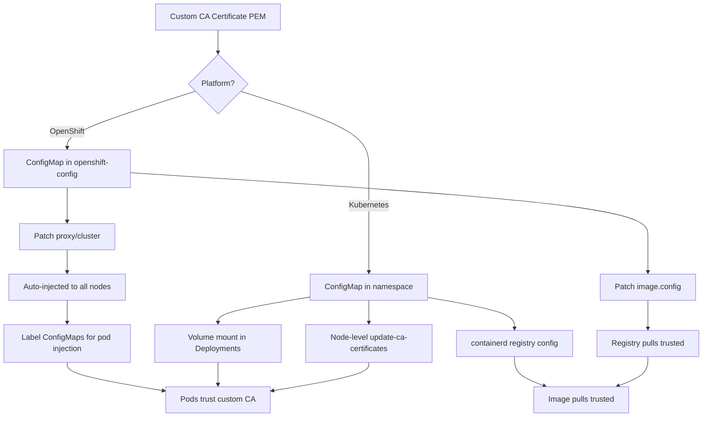

> 💡 **Quick Answer:** In OpenShift, create a ConfigMap with your CA bundle and patch `image.config.openshift.io/cluster` or the cluster-wide proxy. In vanilla Kubernetes, mount your CA into pods via ConfigMaps or use the `update-ca-certificates` approach on nodes.

## The Problem

Your organization uses a private Certificate Authority (CA) for:

- **Private container registries** — Harbor, Quay, Nexus, Artifactory with self-signed TLS
- **Internal APIs and services** — mutual TLS between microservices
- **Corporate proxy** — TLS-intercepting proxies that re-sign certificates
- **Private Git servers** — GitLab/Gitea with internal CA

Without adding your custom CA to the trust store, you'll see errors like:

```plaintext
x509: certificate signed by unknown authority
tls: failed to verify certificate: x509: certificate signed by unknown authority
```

OpenShift and vanilla Kubernetes handle this differently — OpenShift has built-in cluster-wide CA injection, while Kubernetes requires manual configuration.

## The Solution

### OpenShift: Cluster-Wide Custom CA

OpenShift provides a declarative way to add custom CAs that automatically propagates to all nodes and many operators.

#### Step 1: Create the CA ConfigMap

```yaml
apiVersion: v1
kind: ConfigMap
metadata:
  name: custom-ca-bundle
  namespace: openshift-config
data:
  ca-bundle.crt: |
    -----BEGIN CERTIFICATE-----
    MIIDXTCCAkWgAwIBAgIJAJC1HiIAZAiUMA...
    -----END CERTIFICATE-----
    -----BEGIN CERTIFICATE-----
    MIIDXTCCAkWgAwIBAgIJAJC1HiIAZAiUMB...
    -----END CERTIFICATE-----
```

Apply it:

```bash
# From a file containing your CA certificate(s)
oc create configmap custom-ca-bundle \
  -n openshift-config \
  --from-file=ca-bundle.crt=/path/to/ca-bundle.pem
```

#### Step 2: Configure the Cluster-Wide Proxy (Recommended)

This is the most comprehensive approach — it injects the CA into all OpenShift-managed components:

```bash
oc patch proxy/cluster --type=merge \
  --patch='{"spec":{"trustedCA":{"name":"custom-ca-bundle"}}}'
```

Verify the proxy configuration:

```bash
oc get proxy/cluster -o jsonpath='{.spec.trustedCA.name}'
# Output: custom-ca-bundle
```

#### Step 3: Configure Image Registry Trust

For private container registries specifically, patch the image config:

```yaml
apiVersion: config.openshift.io/v1
kind: Image
metadata:
  name: cluster
spec:
  additionalTrustedCA:
    name: custom-ca-bundle
  registrySources:
    allowedRegistries:
      - registry.internal.example.com
      - quay.io
      - registry.redhat.io
      - docker.io
```

Apply with:

```bash
oc patch image.config.openshift.io/cluster --type=merge \
  --patch='{"spec":{"additionalTrustedCA":{"name":"custom-ca-bundle"}}}'
```

#### Step 4: Automatic CA Injection into Pods

OpenShift can automatically inject the cluster CA bundle into any ConfigMap that has the right label:

```yaml
apiVersion: v1
kind: ConfigMap
metadata:
  name: trusted-ca
  namespace: my-app
  labels:
    config.openshift.io/inject-trusted-cabundle: "true"
data: {}
```

OpenShift's CA injection operator automatically populates this ConfigMap with the merged CA bundle. Mount it in your pods:

```yaml
apiVersion: apps/v1
kind: Deployment
metadata:
  name: my-app
  namespace: my-app
spec:
  template:
    spec:
      containers:
        - name: app
          image: registry.internal.example.com/my-app:latest
          volumeMounts:
            - name: trusted-ca
              mountPath: /etc/pki/ca-trust/extracted/pem
              readOnly: true
          env:
            - name: SSL_CERT_FILE
              value: /etc/pki/ca-trust/extracted/pem/tls-ca-bundle.pem
      volumes:
        - name: trusted-ca
          configMap:
            name: trusted-ca
            items:
              - key: ca-bundle.crt
                path: tls-ca-bundle.pem
```

### Kubernetes: Manual Custom CA Configuration

Vanilla Kubernetes doesn't have a cluster-wide CA injection mechanism. You have three approaches depending on your needs.

#### Approach 1: ConfigMap + Volume Mount (Per-Deployment)

The most portable approach — works on any Kubernetes distribution:

```bash
# Create a ConfigMap from your CA certificate
kubectl create configmap custom-ca \
  -n my-namespace \
  --from-file=ca-certificates.crt=/path/to/ca-bundle.pem
```

Mount it in your deployment:

```yaml
apiVersion: apps/v1
kind: Deployment
metadata:
  name: my-app
  namespace: my-namespace
spec:
  replicas: 1
  selector:
    matchLabels:
      app: my-app
  template:
    metadata:
      labels:
        app: my-app
    spec:
      containers:
        - name: app
          image: my-app:latest
          volumeMounts:
            - name: ca-certs
              mountPath: /etc/ssl/certs/ca-certificates.crt
              subPath: ca-certificates.crt
              readOnly: true
          env:
            # For Go applications
            - name: SSL_CERT_FILE
              value: /etc/ssl/certs/ca-certificates.crt
            # For Python requests library
            - name: REQUESTS_CA_BUNDLE
              value: /etc/ssl/certs/ca-certificates.crt
            # For Node.js
            - name: NODE_EXTRA_CA_CERTS
              value: /etc/ssl/certs/ca-certificates.crt
            # For curl
            - name: CURL_CA_BUNDLE
              value: /etc/ssl/certs/ca-certificates.crt
      volumes:
        - name: ca-certs
          configMap:
            name: custom-ca
```

#### Approach 2: Node-Level CA Trust (Cluster-Wide)

For cluster-wide trust, install the CA on every node. This works for kubelet, container runtime, and all pods that use the system trust store:

```bash
# On each node (Debian/Ubuntu)
sudo cp /path/to/custom-ca.crt /usr/local/share/ca-certificates/custom-ca.crt
sudo update-ca-certificates

# On each node (RHEL/CentOS/Fedora)
sudo cp /path/to/custom-ca.crt /etc/pki/ca-trust/source/anchors/custom-ca.crt
sudo update-ca-trust extract
```

Automate with a DaemonSet for dynamic clusters:

```yaml
apiVersion: apps/v1
kind: DaemonSet
metadata:
  name: ca-installer
  namespace: kube-system
spec:
  selector:
    matchLabels:
      app: ca-installer
  template:
    metadata:
      labels:
        app: ca-installer
    spec:
      hostPID: true
      hostNetwork: true
      tolerations:
        - operator: Exists
      containers:
        - name: ca-installer
          image: ubuntu:22.04
          command:
            - /bin/bash
            - -c
            - |
              cp /ca-certs/custom-ca.crt /host-certs/custom-ca.crt
              chroot /host update-ca-certificates
              echo "CA installed at $(date)"
              sleep infinity
          volumeMounts:
            - name: ca-cert-source
              mountPath: /ca-certs
              readOnly: true
            - name: host-certs
              mountPath: /host-certs
            - name: host-root
              mountPath: /host
          securityContext:
            privileged: true
      volumes:
        - name: ca-cert-source
          configMap:
            name: custom-ca-cert
        - name: host-certs
          hostPath:
            path: /usr/local/share/ca-certificates
        - name: host-root
          hostPath:
            path: /
```

> ⚠️ **Warning:** The DaemonSet approach requires privileged containers and `hostPID`. Use it only when you control the infrastructure and understand the security implications.

#### Approach 3: containerd Registry Configuration

For container image pulls specifically, configure containerd on each node:

```toml
# /etc/containerd/certs.d/registry.internal.example.com/hosts.toml
server = "https://registry.internal.example.com"

[host."https://registry.internal.example.com"]
  ca = "/etc/containerd/certs.d/registry.internal.example.com/ca.crt"
  skip_verify = false
```

Or for a simpler setup, add to `/etc/containerd/config.toml`:

```toml
[plugins."io.containerd.grpc.v1.cri".registry.configs."registry.internal.example.com".tls]
  ca_file = "/etc/pki/ca-trust/source/anchors/custom-ca.crt"
```

Restart containerd after changes:

```bash
sudo systemctl restart containerd
```

### Verification

Verify the CA is trusted from inside a pod:

```bash
# OpenShift — check the injected bundle
oc exec -it deploy/my-app -- cat /etc/pki/ca-trust/extracted/pem/tls-ca-bundle.pem | grep "BEGIN CERTIFICATE" | wc -l

# Kubernetes — test connectivity to internal service
kubectl run ca-test --rm -it --restart=Never \
  --image=curlimages/curl -- \
  curl -v https://registry.internal.example.com/v2/

# Check certificate chain
kubectl run ssl-test --rm -it --restart=Never \
  --image=alpine/openssl -- \
  s_client -connect registry.internal.example.com:443 -showcerts
```



## Common Issues

### Certificate format problems

```bash
# Verify your certificate is valid PEM
openssl x509 -in custom-ca.crt -text -noout

# Convert DER to PEM if needed
openssl x509 -inform DER -in custom-ca.der -out custom-ca.pem -outform PEM

# Convert PKCS7 to PEM
openssl pkcs7 -print_certs -in custom-ca.p7b -out custom-ca.pem
```

### OpenShift CA injection not working

```bash
# Verify the ConfigMap has the injection label
oc get configmap trusted-ca -n my-app -o yaml | grep inject-trusted-cabundle

# Check if the operator is running
oc get pods -n openshift-config-operator

# Force a rollout after CA change
oc rollout restart deployment/my-app -n my-app
```

### Multiple CAs in a single bundle

```bash
# Concatenate multiple CA certificates into one bundle
cat intermediate-ca.pem root-ca.pem > ca-bundle.pem

# Verify the bundle contains all certificates
openssl crl2pkcs7 -nocrl -certfile ca-bundle.pem | \
  openssl pkcs7 -print_certs -noout
```

### Nodes not picking up CA changes

```bash
# Check if update-ca-certificates ran successfully
ls -la /etc/ssl/certs/ | grep custom

# On RHEL/CentOS, check the extracted bundle
trust list | grep -i "your-ca-name"

# Verify containerd can reach the registry
sudo ctr images pull registry.internal.example.com/test:latest
```

## Best Practices

- **Use the cluster-wide proxy approach on OpenShift** — it propagates the CA to all managed components automatically
- **Prefer ConfigMap mounts over node-level changes** in vanilla Kubernetes — they're declarative and version-controlled
- **Include the full certificate chain** — root CA plus any intermediate CAs
- **Set environment variables** for your application's runtime — `SSL_CERT_FILE`, `REQUESTS_CA_BUNDLE`, `NODE_EXTRA_CA_CERTS`
- **Automate CA rotation** — set up monitoring for certificate expiration and plan rotation procedures
- **Never use `skip_verify: true` in production** — it defeats the purpose of TLS entirely
- **Test CA trust from inside pods** — not just from nodes, as pods may have different trust stores
- **Use cert-manager for internal PKI** — it automates certificate issuance and renewal within the cluster
- **Document your CA hierarchy** — record which CAs are trusted, their expiration dates, and renewal procedures

## Key Takeaways

- **OpenShift** has built-in cluster-wide CA injection via `proxy/cluster` and `image.config.openshift.io` — use ConfigMaps with the `inject-trusted-cabundle` label for automatic pod injection
- **Kubernetes** requires manual configuration — ConfigMap volume mounts (per-deployment), node-level `update-ca-certificates` (cluster-wide), or containerd registry config (image pulls only)
- Always verify CA trust from inside pods, not just nodes
- Include environment variables (`SSL_CERT_FILE`, etc.) so applications use the custom CA regardless of their default trust store location
- Plan for CA rotation — certificates expire, and your cluster needs to handle updates gracefully
