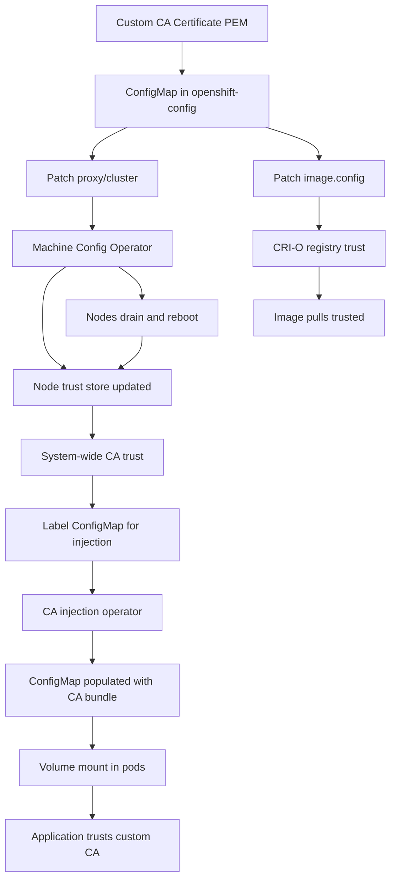

> 💡 **Quick Answer:** Create a ConfigMap with your CA bundle in `openshift-config` namespace, then patch `proxy/cluster` for cluster-wide trust or `image.config.openshift.io/cluster` for registry-specific trust. Use the `config.openshift.io/inject-trusted-cabundle: "true"` label on ConfigMaps for automatic injection into pods.

## The Problem

OpenShift clusters in enterprise environments need to trust custom Certificate Authorities for:

- **Private container registries** — Harbor, Quay, Nexus behind self-signed or corporate TLS
- **Corporate TLS-intercepting proxies** — Zscaler, Bluecoat, Palo Alto that re-sign HTTPS traffic
- **Internal services** — GitLab, Vault, monitoring tools with internal PKI
- **Air-gapped environments** — disconnected clusters with custom mirror registries

Without the custom CA in the trust store, you get `x509: certificate signed by unknown authority` errors across image pulls, git clones, webhook calls, and API integrations.

OpenShift has a powerful built-in mechanism for this — the cluster-wide proxy and CA injection operator — that vanilla Kubernetes lacks entirely.

## The Solution

### Step 1: Prepare Your CA Bundle

Gather all custom CA certificates into a single PEM file:

```bash
# Single CA
cp corporate-root-ca.pem ca-bundle.pem

# Multiple CAs — concatenate them
cat corporate-root-ca.pem intermediate-ca.pem registry-ca.pem > ca-bundle.pem

# Verify each certificate in the bundle
openssl crl2pkcs7 -nocrl -certfile ca-bundle.pem | \
  openssl pkcs7 -print_certs -text -noout | grep "Subject:"
```

> ⚠️ **Important:** The file must be PEM-encoded (Base64 with `-----BEGIN CERTIFICATE-----` headers). Convert DER format first: `openssl x509 -inform DER -in cert.der -out cert.pem`

### Step 2: Create the ConfigMap in openshift-config

```bash
oc create configmap custom-ca-bundle \
  -n openshift-config \
  --from-file=ca-bundle.crt=ca-bundle.pem
```

Or declaratively:

```yaml
apiVersion: v1
kind: ConfigMap
metadata:
  name: custom-ca-bundle
  namespace: openshift-config
data:
  ca-bundle.crt: |
    -----BEGIN CERTIFICATE-----
    MIIDXTCCAkWgAwIBAgIJAJC1HiIAZAiUMA0GCSqGSIb3Dq...
    -----END CERTIFICATE-----
```

> ⚠️ The key **must** be `ca-bundle.crt` — OpenShift operators look for this specific key name.

### Step 3: Cluster-Wide Proxy Trust (Recommended)

This is the most comprehensive approach. It injects the CA into the Machine Config Operator, which updates the trust store on every node:

```bash
oc patch proxy/cluster --type=merge \
  --patch='{"spec":{"trustedCA":{"name":"custom-ca-bundle"}}}'
```

What this does:
- Updates the **node trust store** on all nodes via Machine Config Operator
- Nodes will **drain and reboot** one by one (rolling update)
- After rollout, all system processes trust the custom CA
- Container runtime (CRI-O) trusts the CA for image pulls

Monitor the rollout:

```bash
# Watch Machine Config Pool status
oc get mcp -w

# Check if nodes are updating
oc get nodes -o wide

# Wait for all nodes to be Ready
oc wait mcp/worker --for condition=Updated --timeout=30m
oc wait mcp/master --for condition=Updated --timeout=30m
```

### Step 4: Image Registry Trust

For private registries specifically, also patch the image config:

```bash
oc patch image.config.openshift.io/cluster --type=merge \
  --patch='{"spec":{"additionalTrustedCA":{"name":"custom-ca-bundle"}}}'
```

This configures CRI-O on all nodes to trust the CA for container image pulls without requiring a full Machine Config rollout.

Add specific registry sources if needed:

```yaml
apiVersion: config.openshift.io/v1
kind: Image
metadata:
  name: cluster
spec:
  additionalTrustedCA:
    name: custom-ca-bundle
  registrySources:
    allowedRegistries:
      - registry.internal.example.com
      - quay.io
      - registry.redhat.io
      - registry.access.redhat.com
      - docker.io
      - gcr.io
```

### Step 5: Automatic CA Injection into Application Pods

The CA injection operator watches for ConfigMaps with a specific label and automatically populates them with the merged CA bundle:

```yaml
apiVersion: v1
kind: ConfigMap
metadata:
  name: trusted-ca
  namespace: my-app
  labels:
    config.openshift.io/inject-trusted-cabundle: "true"
data: {}
```

Apply it:

```bash
oc apply -f - <<EOF
apiVersion: v1
kind: ConfigMap
metadata:
  name: trusted-ca
  namespace: my-app
  labels:
    config.openshift.io/inject-trusted-cabundle: "true"
data: {}
EOF
```

Verify the injection happened:

```bash
# The ConfigMap should now contain the full CA bundle
oc get configmap trusted-ca -n my-app -o yaml | head -20
```

Mount it in your deployment:

```yaml
apiVersion: apps/v1
kind: Deployment
metadata:
  name: my-app
  namespace: my-app
spec:
  replicas: 2
  selector:
    matchLabels:
      app: my-app
  template:
    metadata:
      labels:
        app: my-app
    spec:
      containers:
        - name: app
          image: registry.internal.example.com/my-app:v1.2.0
          volumeMounts:
            - name: trusted-ca
              mountPath: /etc/pki/ca-trust/extracted/pem
              readOnly: true
          env:
            - name: SSL_CERT_FILE
              value: /etc/pki/ca-trust/extracted/pem/tls-ca-bundle.pem
            - name: REQUESTS_CA_BUNDLE
              value: /etc/pki/ca-trust/extracted/pem/tls-ca-bundle.pem
      volumes:
        - name: trusted-ca
          configMap:
            name: trusted-ca
            items:
              - key: ca-bundle.crt
                path: tls-ca-bundle.pem
```

### Step 6: Verify Everything Works

```bash
# Test image pull from private registry
oc run test-pull --image=registry.internal.example.com/test:latest \
  --restart=Never -- echo "Pull succeeded"

# Test HTTPS connectivity from a pod
oc exec -it deploy/my-app -- \
  curl -v https://internal-service.example.com/health

# Check the certificate chain
oc exec -it deploy/my-app -- \
  openssl s_client -connect registry.internal.example.com:443 \
  -CAfile /etc/pki/ca-trust/extracted/pem/tls-ca-bundle.pem

# Verify the CA is in the node trust store
oc debug node/worker-0 -- chroot /host \
  trust list | grep -A2 "your-ca-subject"
```



## Common Issues

### Machine Config Pool stuck updating

```bash
# Check MCP status
oc get mcp

# Check for degraded machines
oc get machines -A | grep -v Running

# Check Machine Config Daemon logs on stuck node
oc debug node/worker-2 -- chroot /host journalctl -u machine-config-daemon -n 50

# If a node is stuck, you may need to approve pending CSRs
oc get csr | grep Pending
oc adm certificate approve <csr-name>
```

### CA injection not populating the ConfigMap

```bash
# Ensure the label is exactly correct (common typo)
oc get configmap trusted-ca -n my-app -o jsonpath='{.metadata.labels}'
# Must contain: config.openshift.io/inject-trusted-cabundle: "true"

# Check the service-ca-operator is running
oc get pods -n openshift-service-ca

# Check the config-operator
oc get pods -n openshift-config-operator
oc logs -n openshift-config-operator deployment/openshift-config-operator --tail=20
```

### Proxy settings conflicting

```bash
# View current proxy configuration
oc get proxy/cluster -o yaml

# If you have HTTP_PROXY set, ensure NO_PROXY includes internal domains
oc patch proxy/cluster --type=merge --patch='{
  "spec": {
    "httpProxy": "http://proxy.corp.example.com:8080",
    "httpsProxy": "http://proxy.corp.example.com:8080",
    "noProxy": ".cluster.local,.svc,10.0.0.0/8,172.16.0.0/12,192.168.0.0/16,.internal.example.com",
    "trustedCA": {"name": "custom-ca-bundle"}
  }
}'
```

### Updating the CA bundle

```bash
# Replace the ConfigMap contents
oc create configmap custom-ca-bundle \
  -n openshift-config \
  --from-file=ca-bundle.crt=new-ca-bundle.pem \
  --dry-run=client -o yaml | oc apply -f -

# Force re-injection by deleting and recreating labeled ConfigMaps
oc delete configmap trusted-ca -n my-app
oc apply -f trusted-ca-configmap.yaml

# Restart deployments to pick up changes
oc rollout restart deployment/my-app -n my-app
```

## Best Practices

- **Use `proxy/cluster` for comprehensive trust** — it updates node trust stores, affecting kubelet, CRI-O, and all system components
- **Use `image.config` for registry-specific trust** — lighter touch, no node reboots required
- **Always use the injection label** on application ConfigMaps — don't manually copy CA bundles into namespaces
- **Include the full chain** — root CA plus all intermediate CAs in the bundle
- **Plan for MCP rollouts** — patching `proxy/cluster` causes rolling node reboots; schedule during maintenance windows
- **Test in a non-production cluster first** — a bad CA ConfigMap can break node updates
- **Monitor certificate expiration** — set alerts for CA certificates nearing expiry
- **Use `registrySources.allowedRegistries`** — explicitly list allowed registries for defense in depth
- **Document your CA hierarchy** — record which CAs are in the bundle, their purpose, and expiration dates

## Key Takeaways

- OpenShift provides **three levels** of custom CA trust: cluster-wide proxy (nodes), image config (registries), and injection labels (pods)
- The `proxy/cluster` approach is most comprehensive but triggers **rolling node reboots** via Machine Config Operator
- Use the `config.openshift.io/inject-trusted-cabundle: "true"` label for **automatic CA injection** into application ConfigMaps
- The ConfigMap key **must be `ca-bundle.crt`** in PEM format — this is an OpenShift convention
- Always verify trust from inside pods, not just from nodes — different trust store paths may apply
