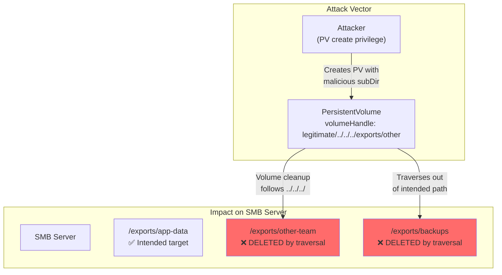

> 💡 **Quick Answer:** CVE-2026-3865 is a **medium severity (CVSS 6.5)** path traversal in the Kubernetes CSI Driver for SMB. Attackers with PersistentVolume creation privileges can craft `subDir` fields containing `../` sequences, causing the driver to **delete or modify unintended directories** on the SMB server during volume cleanup. **Upgrade to CSI SMB Driver v1.20.1+** immediately. Restrict PV creation to trusted admins.

## The Problem

The Kubernetes CSI Driver for SMB (`smb.csi.k8s.io`) does not properly validate the `subDir` parameter in volume identifiers. An attacker who can create PersistentVolumes can inject path traversal sequences (`../`) into the `volumeHandle`, causing the driver to operate on directories **outside the intended SMB export path** during deletion or cleanup.

**Impact:** Deletion or modification of arbitrary directories on the SMB server — potentially destroying data from other teams, applications, or backups sharing the same SMB server.



## The Solution

### 1. Upgrade CSI SMB Driver

```bash
# Check current version
kubectl get pods -n kube-system -l app=csi-smb-controller -o jsonpath='{.items[0].spec.containers[0].image}'

# Upgrade via Helm
helm repo update
helm upgrade csi-driver-smb csi-driver-smb/csi-driver-smb \
  --namespace kube-system \
  --set image.smb.tag=v1.20.1

# Or upgrade via kubectl
kubectl set image deployment/csi-smb-controller \
  smb=registry.k8s.io/sig-storage/smbplugin:v1.20.1 \
  -n kube-system

kubectl set image daemonset/csi-smb-node \
  smb=registry.k8s.io/sig-storage/smbplugin:v1.20.1 \
  -n kube-system

# Verify upgrade
kubectl get pods -n kube-system -l app=csi-smb-controller
kubectl get pods -n kube-system -l app=csi-smb-node
```

### 2. Detect Malicious PersistentVolumes

```bash
# Scan for path traversal in existing PVs
kubectl get pv -o json | jq -r '
  .items[] |
  select(.spec.csi.driver == "smb.csi.k8s.io") |
  select(.spec.csi.volumeHandle | contains("..")) |
  "\(.metadata.name): \(.spec.csi.volumeHandle)"
'

# Check CSI controller logs for traversal evidence
kubectl logs -n kube-system -l app=csi-smb-controller --since=720h | \
  grep -i "subpath\|traversal\|\.\.\/"

# Automated detection script
cat << 'EOF' > detect-cve-2026-3865.sh
#!/bin/bash
echo "=== CVE-2026-3865 Detection ==="
echo ""

# Check driver version
VERSION=$(kubectl get pods -n kube-system -l app=csi-smb-controller \
  -o jsonpath='{.items[0].spec.containers[0].image}' 2>/dev/null)
echo "CSI SMB Driver: ${VERSION:-NOT FOUND}"

# Check for traversal in PVs
SUSPICIOUS=$(kubectl get pv -o json | jq -r '
  [.items[] |
   select(.spec.csi.driver == "smb.csi.k8s.io") |
   select(.spec.csi.volumeHandle | test("\\.\\."))] | length')

if [ "$SUSPICIOUS" -gt 0 ]; then
  echo "⚠️  FOUND $SUSPICIOUS PVs with path traversal sequences!"
  kubectl get pv -o json | jq -r '
    .items[] |
    select(.spec.csi.driver == "smb.csi.k8s.io") |
    select(.spec.csi.volumeHandle | test("\\.\\."))|
    "  PV: \(.metadata.name) → \(.spec.csi.volumeHandle)"'
else
  echo "✅ No suspicious PVs found"
fi

# Check who can create PVs
echo ""
echo "=== Users/SAs with PV create permissions ==="
kubectl auth can-i create persistentvolumes --list 2>/dev/null || \
  echo "  (requires cluster-admin to check)"
EOF
chmod +x detect-cve-2026-3865.sh
```

### 3. Restrict PV Creation (Mitigation)

```yaml
# ClusterRole: deny PV creation for non-admins
# Most users should use PVCs with StorageClasses, not direct PV creation
apiVersion: rbac.authorization.k8s.io/v1
kind: ClusterRole
metadata:
  name: deny-pv-create
rules: []
# Bind this to groups that should NOT create PVs
# (PV creation is cluster-scoped and powerful)

---
# ValidatingAdmissionPolicy (K8s 1.30+): block traversal in SMB PVs
apiVersion: admissionregistration.k8s.io/v1
kind: ValidatingAdmissionPolicy
metadata:
  name: block-smb-traversal
spec:
  failurePolicy: Fail
  matchConstraints:
    resourceRules:
      - apiGroups: [""]
        apiVersions: ["v1"]
        operations: ["CREATE", "UPDATE"]
        resources: ["persistentvolumes"]
  validations:
    - expression: >-
        !has(object.spec.csi) ||
        object.spec.csi.driver != "smb.csi.k8s.io" ||
        !object.spec.csi.volumeHandle.contains("..")
      message: "SMB CSI volumeHandle must not contain path traversal sequences (../)"
---
apiVersion: admissionregistration.k8s.io/v1
kind: ValidatingAdmissionPolicyBinding
metadata:
  name: block-smb-traversal-binding
spec:
  policyName: block-smb-traversal
  validationActions: ["Deny"]
```

### 4. Audit SMB Server Directories

```bash
# On the SMB server: check for unexpected directory deletions
# Review SMB audit logs
grep -i "delete\|remove" /var/log/samba/audit.log | \
  grep -v "expected-app-directory"

# Check directory structure hasn't been tampered with
find /exports -maxdepth 2 -type d -newer /exports/.baseline -ls
```

## Affected Versions

| Component | Vulnerable | Fixed |
|-----------|-----------|-------|
| CSI Driver for SMB | All versions < v1.20.1 | **v1.20.1+** |

## CVSS Details

| Metric | Value |
|--------|-------|
| **Score** | 6.5 (Medium) |
| **Vector** | `CVSS:3.1/AV:N/AC:L/PR:H/UI:N/S:U/C:N/I:H/A:H` |
| **Attack Vector** | Network |
| **Privileges Required** | High (PV creation) |
| **Impact** | Integrity: High, Availability: High |

## Common Issues

| Issue | Cause | Fix |
|-------|-------|-----|
| Upgrade fails | Custom CSI SMB deployment | Manually update container image tags |
| PV scan finds no SMB PVs | Using different storage driver | Not affected by this CVE |
| ValidatingAdmissionPolicy not working | K8s < 1.30 | Use OPA Gatekeeper or Kyverno instead |
| SMB data already deleted | Exploit already used | Restore from backups; report to security@kubernetes.io |
| PV creation still allowed | RBAC not restrictive enough | Audit ClusterRoleBindings for PV permissions |

## Best Practices

- **Upgrade immediately** — v1.20.1 adds traversal validation in the driver
- **Restrict PV creation** — only cluster admins should create PVs directly
- **Use StorageClasses** — users create PVCs; dynamic provisioning creates PVs safely
- **Add admission policy** — defense-in-depth even after upgrading the driver
- **Audit SMB server** — check for evidence of exploitation before upgrading
- **Monitor CSI logs** — alert on unusual directory operations

## Key Takeaways

- CVE-2026-3865 allows path traversal in CSI SMB `subDir` → arbitrary directory deletion
- CVSS 6.5 (Medium) — requires PV creation privileges but no user interaction
- Fix: upgrade CSI SMB Driver to **v1.20.1+** and restrict PV creation via RBAC
- Defense-in-depth: ValidatingAdmissionPolicy blocks `..` in volumeHandle
- Reported by SentinelOne researcher, fixed by CSI SMB maintainers + K8s Security Response
- Always use StorageClasses for user-facing storage instead of direct PV creation
