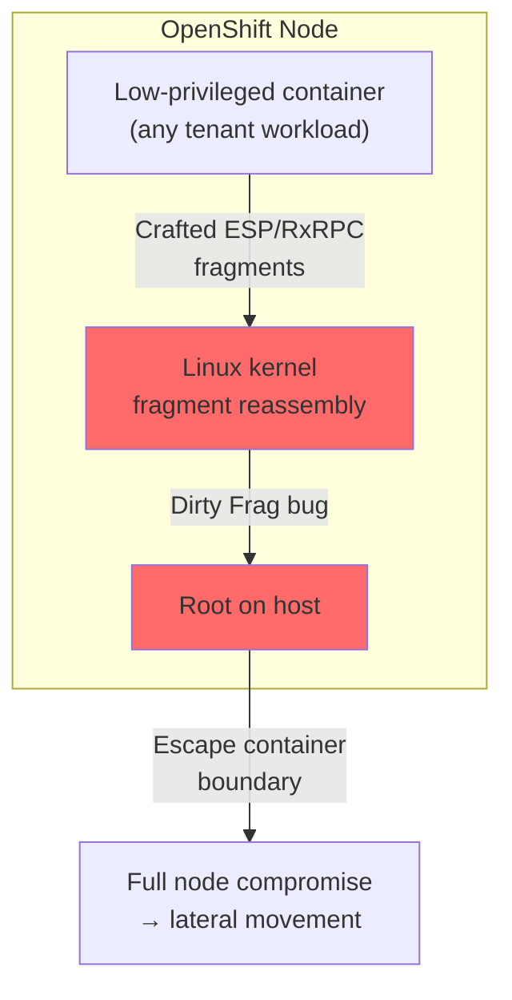

> 💡 **Quick Answer:** "Dirty Frag" (CVE-2026-43284, CVE-2026-43500, CVE-2026-46300) is a Linux kernel local privilege escalation reachable through IPsec ESP fragment reassembly. It is being **actively exploited**. Until your OpenShift nodes have a patched kernel, mitigate by blacklisting and unloading the `esp4`, `esp6`, and `rxrpc` kernel modules on every node with a privileged DaemonSet. See [Red Hat solution 7142250](https://access.redhat.com/solutions/7142250).

## The Problem

CVE-2026-43284, along with the related CVE-2026-43500 and CVE-2026-46300 ("Fragnesia"), are Linux kernel vulnerabilities in the networking fragment-reassembly path used by IPsec ESP, ESP6, and RxRPC. A **local, low-privileged user or compromised container process** can trigger the bug to escalate to **root on the node** — no cluster-admin or special RBAC required, just code execution inside any pod that shares the host kernel.

Because the flaw lives in the host kernel rather than in Kubernetes/OpenShift itself, normal Pod Security Standards, SCCs, and RBAC do **not** stop it — any workload capable of sending crafted traffic that reaches the vulnerable reassembly path can trip it.



### Am I Vulnerable?

```bash
# Check whether the affected modules are currently loaded on a node
oc debug node/<node-name> -- chroot /host sh -c \
  'grep -E "^(esp4|esp6|rxrpc) " /proc/modules || echo "not loaded"'

# Check the running kernel version against your vendor's fixed builds
oc debug node/<node-name> -- chroot /host uname -r
```

If `esp4`, `esp6`, or `rxrpc` show up as loaded and your kernel predates the fix referenced in [RHSB-2026-003](https://access.redhat.com/security/vulnerabilities/RHSB-2026-003), the node is exposed.

## The Solution

Red Hat has not yet shipped patched kernels to every OpenShift z-stream at once, so the interim mitigation is to **prevent the vulnerable modules from loading** (or unload them if already loaded) on all nodes. Ship it as a GitOps-managed namespace + privileged DaemonSet with environment-specific overlays.

### 1. Base: Namespace and RBAC

```yaml
# base/dirtyfrag-namespace.yaml
apiVersion: v1
kind: Namespace
metadata:
  name: disable-dirtyfrag
```

```yaml
# base/dirtyfrag-rbac.yaml
# Workaround / Mitigation for CVE-2026-43284 in OpenShift 4
# https://access.redhat.com/solutions/7142250
apiVersion: v1
kind: ServiceAccount
metadata:
  name: disable-dirtyfrag
  namespace: disable-dirtyfrag
---
apiVersion: rbac.authorization.k8s.io/v1
kind: ClusterRoleBinding
metadata:
  name: disable-dirtyfrag-privileged
roleRef:
  apiGroup: rbac.authorization.k8s.io
  kind: ClusterRole
  name: system:openshift:scc:privileged
subjects:
  - kind: ServiceAccount
    name: disable-dirtyfrag
    namespace: disable-dirtyfrag
```

```yaml
# base/kustomization.yaml
resources:
  - dirtyfrag-namespace.yaml
  - dirtyfrag-rbac.yaml
```

The DaemonSet needs the `privileged` SCC because it must `chroot` into the host filesystem and unload live kernel modules — see [OpenShift SCC guide](/recipes/security/openshift-scc-security-context-constraints/) for why this bypasses the default `restricted` SCC and how to scope it down once the workaround is retired.

### 2. Overlay: DaemonSet per environment

```yaml
# overlays/preprod/dirtyfrag-daemonset.yaml
# Workaround / Mitigation for CVE-2026-43284 in OpenShift 4
# https://access.redhat.com/solutions/7142250
apiVersion: apps/v1
kind: DaemonSet
metadata:
  name: disable-dirtyfrag
  namespace: disable-dirtyfrag
  labels:
    app: disable-dirtyfrag
spec:
  selector:
    matchLabels:
      app: disable-dirtyfrag
  template:
    metadata:
      labels:
        app: disable-dirtyfrag
    spec:
      serviceAccountName: disable-dirtyfrag
      nodeSelector:
        kubernetes.io/os: linux
      tolerations:
        - operator: Exists
      terminationGracePeriodSeconds: 1
      containers:
        - name: disable-modules
          image: registry.example.com/openshift/release-images@sha256:0000000000000000000000000000000000000000000000000000000000000
          command:
            - /bin/sh
            - "-c"
            - |
              if grep -qs "esp4" /host/etc/modprobe.d/dirtyfrag.conf 2>/dev/null; then
                echo "Modprobe config already present, skipping"
              else
                printf 'install esp4 /bin/false\ninstall esp6 /bin/false\ninstall rxrpc /bin/false\n' > /host/etc/modprobe.d/dirtyfrag.conf
                echo "Created /etc/modprobe.d/dirtyfrag.conf"
              fi
              for mod in esp4 esp6 rxrpc; do
                if chroot /host grep -q "^${mod} " /proc/modules 2>/dev/null; then
                  if chroot /host modprobe -r "${mod}" 2>/dev/null; then
                    echo "Unloaded ${mod}"
                  else
                    echo "WARNING: could not unload ${mod} (may be in use, reboot required)"
                  fi
                else
                  echo "OK: ${mod} was not loaded"
                fi
              done
              echo "=== result ==="
              PROTECTED=true
              for mod in esp4 esp6 rxrpc; do
                if chroot /host grep -q "^${mod} " /proc/modules 2>/dev/null; then
                  echo "WARNING: ${mod} is still loaded, reboot node to complete mitigation"
                  PROTECTED=false
                fi
              done
              if [ "${PROTECTED}" = "true" ]; then
                echo "Node is protected"
              fi
              sleep infinity
          securityContext:
            privileged: true
          volumeMounts:
            - name: host-root
              mountPath: /host
      volumes:
        - name: host-root
          hostPath:
            path: /
```

```yaml
# overlays/preprod/kustomization.yaml
resources:
  - dirtyfrag-daemonset.yaml
```

The `prod` overlay is identical — copy the same `dirtyfrag-daemonset.yaml` and `kustomization.yaml`, pointing `image:` at whichever registry mirrors your release images in that environment. Keeping the DaemonSet manifest per-overlay (rather than patching a base) makes it obvious in GitOps diffs which environments have already rolled out the mitigation.

### 3. Roll it out

```bash
# Apply to an environment
oc apply -k overlays/preprod/

# Watch the mitigation land on every node
oc get pods -n disable-dirtyfrag -o wide
oc logs -n disable-dirtyfrag -l app=disable-dirtyfrag --tail=20 --prefix
```

A node that reports `WARNING: could not unload ... reboot required` still has the module resident in memory — schedule a reboot for that node; the `install ... /bin/false` line in `modprobe.d` prevents it from reloading afterward.

## Verification

```bash
# Confirm no node has the vulnerable modules loaded
oc get nodes -o name | while read -r node; do
  echo "== ${node} =="
  oc debug "${node}" -- chroot /host sh -c \
    'grep -E "^(esp4|esp6|rxrpc) " /proc/modules && echo "STILL LOADED" || echo "clear"'
done

# Confirm the modprobe blacklist persisted across a reboot
oc debug node/<node-name> -- chroot /host cat /etc/modprobe.d/dirtyfrag.conf
```

## Removing the Workaround

Once a patched kernel (per [RHSB-2026-003](https://access.redhat.com/security/vulnerabilities/RHSB-2026-003)) has rolled out to every node, remove the mitigation rather than leaving it in place indefinitely — `esp4`/`esp6` are required for legitimate IPsec traffic, and `rxrpc` for AFS/Kerberos workloads that may need it.

```bash
oc delete -k overlays/preprod/
oc debug node/<node-name> -- chroot /host rm -f /etc/modprobe.d/dirtyfrag.conf
oc delete -k base/
```

## Affected Versions

| Component | Vulnerable | Fixed |
|-----------|-----------|-------|
| RHEL / RHCOS kernel (OpenShift 4 node OS) | Kernels predating the RHSB-2026-003 fixes | See [RHSB-2026-003](https://access.redhat.com/security/vulnerabilities/RHSB-2026-003) for per-errata fixed builds |
| Any Linux distro shipping the affected fragment-reassembly code | esp4/esp6/rxrpc modules loadable | Vendor kernel with the Dirty Frag fix backported |

## CVSS Details

| Metric | Value |
|--------|-------|
| **CVEs** | CVE-2026-43284, CVE-2026-43500, CVE-2026-46300 |
| **Class** | Local privilege escalation (root) |
| **Attack Vector** | Local — code execution inside any pod on the node |
| **Privileges Required** | Low |
| **Status** | Actively exploited |

## Common Issues

| Issue | Cause | Fix |
|-------|-------|-----|
| `modprobe -r` fails with "module in use" | Module already backing live IPsec/AFS traffic | Drain the node and reboot to fully unload |
| DaemonSet pod stuck `Pending` | SCC not bound before rollout | Verify `disable-dirtyfrag-privileged` ClusterRoleBinding applied from `base/` first |
| Blacklist doesn't survive reboot | `/etc/modprobe.d/dirtyfrag.conf` written to an ephemeral overlay | Confirm the `host-root` hostPath actually mounts RHCOS's persistent `/etc`, not a container-local path |
| Legitimate IPsec breaks after mitigation | esp4/esp6 blacklisted cluster-wide | If you depend on kernel-level IPsec, coordinate a maintenance window for the patched-kernel upgrade instead of blanket-disabling the modules |

## Best Practices

- **Treat this as temporary** — it disables kernel features, it doesn't patch the bug; track the RHSB-2026-003 fixed-kernel rollout and remove the DaemonSet once nodes are patched
- **Roll out preprod first** — confirm no workload depends on esp4/esp6/rxrpc before touching prod
- **Reboot nodes that fail to unload** — a written-but-not-yet-effective blacklist still leaves the node exposed until reboot
- **Scope the privileged SCC tightly** — bind it only to the `disable-dirtyfrag` ServiceAccount in its own namespace, not to a broader group
- **Alert on drift** — re-run the verification loop periodically; a node replaced or reprovisioned after rollout won't have the mitigation until the DaemonSet schedules a pod on it

## Key Takeaways

- "Dirty Frag" (CVE-2026-43284 + CVE-2026-43500 + CVE-2026-46300) is a host-kernel privilege escalation, not a Kubernetes/OpenShift RBAC or SCC issue — normal cluster hardening doesn't stop it
- Mitigate by blacklisting and unloading `esp4`, `esp6`, `rxrpc` via `/etc/modprobe.d` on every node until a patched kernel ships
- A privileged DaemonSet is the only reliable way to apply and verify this across a fleet of OpenShift nodes
- Nodes where the module can't be unloaded live need a reboot to complete the mitigation
- Remove the workaround once nodes run a patched kernel — it's a stopgap, not a permanent config
