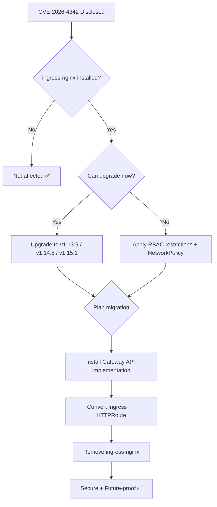

> 💡 **Quick Answer:** CVE-2026-4342 is a CVSS 8.8 vulnerability in ingress-nginx that allows configuration injection and arbitrary code execution via crafted Ingress annotations. Upgrade to v1.13.9, v1.14.5, or v1.15.1 immediately. ingress-nginx is now EOL — migrate to Gateway API.

## The Problem

A critical security vulnerability (CVE-2026-4342) was disclosed in **ingress-nginx** on 2026-03-19. A combination of Ingress annotations can inject arbitrary nginx configuration, leading to:

- **Arbitrary code execution** in the ingress-nginx controller context
- **Cluster-wide Secret disclosure** — by default, the controller can access ALL Secrets in the cluster
- **Full cluster compromise** via stolen ServiceAccount tokens

**CVSS Score: 8.8 (High)** — Network-accessible, low complexity, low privilege required.

### Am I Vulnerable?

```bash
# Check if ingress-nginx is installed
kubectl get pods --all-namespaces --selector app.kubernetes.io/name=ingress-nginx

# Check your version
kubectl exec -n ingress-nginx \
  $(kubectl get pods -n ingress-nginx -l app.kubernetes.io/component=controller -o jsonpath='{.items[0].metadata.name}') \
  -- /nginx-ingress-controller --version

# Affected: ALL versions below v1.13.9, v1.14.5, and v1.15.1
```

### Detect Exploitation Attempts

```bash
# Look for suspicious Ingress annotations
kubectl get ingress -A -o json | jq -r '
  .items[] |
  select(.metadata.annotations != null) |
  select(
    (.metadata.annotations | to_entries[] |
     .value | test("\\\\n|#|\\{|load_module|lua_|proxy_pass")) // false
  ) |
  "\(.metadata.namespace)/\(.metadata.name): SUSPICIOUS"
'

# Check for unusual characters in Ingress paths
kubectl get ingress -A -o json | jq -r '
  .items[] |
  .metadata as $meta |
  .spec.rules[]? |
  .http.paths[]? |
  select(.path | test("[;#{}\\\\]")) |
  "\($meta.namespace)/\($meta.name): suspicious path: \(.path)"
'
```

## The Solution

### Option 1: Upgrade ingress-nginx (Immediate Fix)

```bash
# Upgrade via Helm
helm repo update
helm upgrade ingress-nginx ingress-nginx/ingress-nginx \
  --namespace ingress-nginx \
  --version 4.13.9 \
  --set controller.image.tag=v1.13.9

# Or for the 1.14.x branch
helm upgrade ingress-nginx ingress-nginx/ingress-nginx \
  --namespace ingress-nginx \
  --set controller.image.tag=v1.14.5

# Or for the 1.15.x branch
helm upgrade ingress-nginx ingress-nginx/ingress-nginx \
  --namespace ingress-nginx \
  --set controller.image.tag=v1.15.1

# Verify the upgrade
kubectl rollout status deployment/ingress-nginx-controller -n ingress-nginx
kubectl exec -n ingress-nginx \
  $(kubectl get pods -n ingress-nginx -l app.kubernetes.io/component=controller -o jsonpath='{.items[0].metadata.name}') \
  -- /nginx-ingress-controller --version
```

### Option 2: Restrict Controller Permissions (Mitigation)

If you can't upgrade immediately, limit the blast radius:

```yaml
# Restrict the controller's RBAC — don't let it read all Secrets
apiVersion: rbac.authorization.k8s.io/v1
kind: ClusterRole
metadata:
  name: ingress-nginx-restricted
rules:
  - apiGroups: [""]
    resources: ["services", "endpoints", "configmaps"]
    verbs: ["get", "list", "watch"]
  - apiGroups: ["networking.k8s.io"]
    resources: ["ingresses", "ingressclasses"]
    verbs: ["get", "list", "watch"]
  # Only allow Secrets in the ingress-nginx namespace
  # NOT cluster-wide
  - apiGroups: [""]
    resources: ["secrets"]
    verbs: ["get", "list", "watch"]
    # Use namespace-scoped Role instead of ClusterRole for secrets
---
# Namespace-scoped secret access only
apiVersion: rbac.authorization.k8s.io/v1
kind: Role
metadata:
  name: ingress-nginx-secrets
  namespace: ingress-nginx
rules:
  - apiGroups: [""]
    resources: ["secrets"]
    verbs: ["get", "list", "watch"]
```

```yaml
# Network Policy — restrict controller egress
apiVersion: networking.k8s.io/v1
kind: NetworkPolicy
metadata:
  name: ingress-nginx-restrict
  namespace: ingress-nginx
spec:
  podSelector:
    matchLabels:
      app.kubernetes.io/name: ingress-nginx
  policyTypes:
    - Egress
  egress:
    - to:
        - namespaceSelector: {}
      ports:
        - port: 443     # API server
        - port: 6443
    - to:
        - podSelector: {}
      ports:
        - port: 80      # Backend services
        - port: 443
        - port: 8080
        - port: 8443
```

### Option 3: Migrate to Gateway API (Recommended Long-Term)

ingress-nginx is **EOL** (End of Life). The recommended path forward is Kubernetes Gateway API:

```yaml
# Gateway API equivalent of Ingress
apiVersion: gateway.networking.k8s.io/v1
kind: Gateway
metadata:
  name: main-gateway
  namespace: gateway-system
spec:
  gatewayClassName: nginx   # or envoy, istio, cilium
  listeners:
    - name: http
      protocol: HTTP
      port: 80
    - name: https
      protocol: HTTPS
      port: 443
      tls:
        mode: Terminate
        certificateRefs:
          - name: wildcard-tls
            namespace: gateway-system
---
apiVersion: gateway.networking.k8s.io/v1
kind: HTTPRoute
metadata:
  name: my-app
  namespace: production
spec:
  parentRefs:
    - name: main-gateway
      namespace: gateway-system
  hostnames:
    - "app.example.com"
  rules:
    - matches:
        - path:
            type: PathPrefix
            value: /api
      backendRefs:
        - name: api-service
          port: 8080
    - matches:
        - path:
            type: PathPrefix
            value: /
      backendRefs:
        - name: frontend-service
          port: 80
```

### Migration Path: Ingress → Gateway API

```bash
# 1. Install a Gateway API implementation
# Envoy Gateway
helm install envoy-gateway oci://docker.io/envoyproxy/gateway-helm \
  --version v1.2.0 -n envoy-gateway-system --create-namespace

# Or Cilium (if already using Cilium CNI)
cilium install --set gatewayAPI.enabled=true

# Or NGINX Gateway Fabric (NGINX's Gateway API implementation)
helm install ngf oci://ghcr.io/nginx/charts/nginx-gateway-fabric \
  --version 1.5.0 -n nginx-gateway --create-namespace

# 2. Create Gateway
kubectl apply -f gateway.yaml

# 3. Convert Ingress resources to HTTPRoute
# For each Ingress, create an equivalent HTTPRoute

# 4. Test with canary traffic
# Point a subset of DNS to the new Gateway

# 5. Cut over DNS
# Update DNS records to point to Gateway's external IP

# 6. Remove ingress-nginx
helm uninstall ingress-nginx -n ingress-nginx
kubectl delete namespace ingress-nginx
```

### Scan for All Ingress Resources to Migrate

```bash
# List all Ingress resources that need migration
kubectl get ingress -A -o custom-columns=\
'NAMESPACE:.metadata.namespace,NAME:.metadata.name,HOSTS:.spec.rules[*].host,CLASS:.spec.ingressClassName'

# Export as HTTPRoute templates
kubectl get ingress -A -o json | jq -r '
  .items[] |
  "---\napiVersion: gateway.networking.k8s.io/v1\nkind: HTTPRoute\nmetadata:\n  name: \(.metadata.name)\n  namespace: \(.metadata.namespace)\nspec:\n  parentRefs:\n    - name: main-gateway\n      namespace: gateway-system\n  hostnames:\n    - \"\(.spec.rules[0].host // "example.com")\"\n  rules:\n    - backendRefs:\n        - name: \(.spec.rules[0].http.paths[0].backend.service.name)\n          port: \(.spec.rules[0].http.paths[0].backend.service.port.number)"
'
```



## Common Issues

| Issue | Cause | Fix |
|-------|-------|-----|
| Upgrade breaks custom annotations | Deprecated annotations removed | Check migration guide for replacements |
| TLS not working after Gateway migration | Certificate ref namespace | Use `ReferenceGrant` for cross-namespace |
| Backend 502 after migration | Service port mismatch | Verify `backendRefs` port matches Service |
| Gateway not getting external IP | Missing LoadBalancer support | Check cloud provider or use MetalLB |

## Best Practices

- **Upgrade immediately** — CVSS 8.8 with network access means active exploitation is likely
- **Restrict controller RBAC** — never give cluster-wide Secret access in production
- **Monitor Ingress annotations** — use OPA/Gatekeeper to block dangerous annotation patterns
- **Plan Gateway API migration** — ingress-nginx is EOL, no more security patches coming
- **Report exploitation** to security@kubernetes.io if you find evidence of compromise

## Key Takeaways

- CVE-2026-4342 enables code execution and cluster-wide Secret theft via ingress-nginx
- Upgrade to v1.13.9, v1.14.5, or v1.15.1 immediately
- ingress-nginx is EOL — migrate to Gateway API (Envoy Gateway, Cilium, NGINX Gateway Fabric)
- Restrict controller RBAC as defense-in-depth — it should never need cluster-wide Secret access
- Gateway API is the future of Kubernetes ingress — start migrating now
