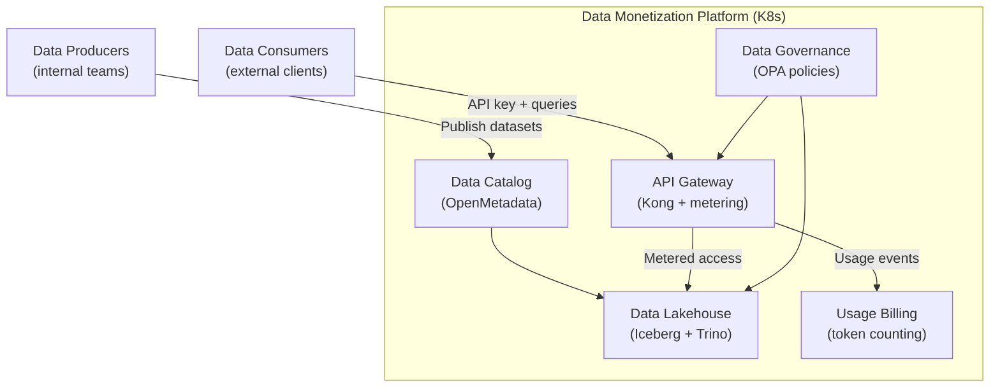

> 💡 **Quick Answer:** Data monetization platforms on Kubernetes expose curated datasets and analytics as metered API products. Build with: API gateway (Kong/Envoy) for access control and metering, Apache Iceberg/Delta Lake for data lakehouse, data catalog (DataHub/OpenMetadata) for discovery, and usage-based billing via token/query counting. Data mesh domains run as independent K8s namespaces.

## The Problem

McKinsey's 2026 CIO agenda shows leading tech leaders using data monetization to create measurable business value — not just cost savings. This means packaging internal data (IoT telemetry, transaction analytics, market signals) as paid API products or secure data-sharing partnerships. Kubernetes provides the multi-tenant, metered, secure infrastructure to run these platforms.



## The Solution

### Data Catalog (OpenMetadata)

```yaml
apiVersion: apps/v1
kind: Deployment
metadata:
  name: openmetadata
  namespace: data-platform
spec:
  template:
    spec:
      containers:
        - name: openmetadata
          image: docker.getcollate.io/openmetadata/server:1.5.0
          ports:
            - containerPort: 8585
          env:
            - name: DB_HOST
              value: "postgres.data-platform.svc"
            - name: DB_USER
              valueFrom:
                secretKeyRef:
                  name: openmetadata-db
                  key: username
            - name: ELASTICSEARCH_HOST
              value: "elasticsearch.data-platform.svc"
          resources:
            requests:
              cpu: "2"
              memory: "4Gi"
---
apiVersion: v1
kind: Service
metadata:
  name: openmetadata
spec:
  selector:
    app: openmetadata
  ports:
    - port: 8585
```

### Query Engine (Trino + Iceberg)

```yaml
# Trino for federated SQL across data products
apiVersion: apps/v1
kind: Deployment
metadata:
  name: trino-coordinator
  namespace: data-platform
spec:
  template:
    spec:
      containers:
        - name: trino
          image: trinodb/trino:450
          ports:
            - containerPort: 8080
          volumeMounts:
            - name: catalog-config
              mountPath: /etc/trino/catalog
          resources:
            requests:
              cpu: "4"
              memory: "16Gi"
      volumes:
        - name: catalog-config
          configMap:
            name: trino-catalogs
---
apiVersion: v1
kind: ConfigMap
metadata:
  name: trino-catalogs
data:
  iceberg.properties: |
    connector.name=iceberg
    iceberg.catalog.type=rest
    iceberg.rest-catalog.uri=http://iceberg-rest:8181
    iceberg.rest-catalog.warehouse=s3://data-lakehouse/
  
  # Each data product is a separate catalog/schema
  customer_analytics.properties: |
    connector.name=iceberg
    iceberg.catalog.type=rest
    iceberg.rest-catalog.uri=http://iceberg-rest:8181
    iceberg.rest-catalog.warehouse=s3://data-products/customer-analytics/
```

### API Gateway with Usage Metering

```yaml
# Kong Gateway for metered data API access
apiVersion: apps/v1
kind: Deployment
metadata:
  name: kong-gateway
  namespace: data-platform
spec:
  template:
    spec:
      containers:
        - name: kong
          image: kong/kong-gateway:3.7
          env:
            - name: KONG_DATABASE
              value: "postgres"
            - name: KONG_PLUGINS
              value: "bundled,rate-limiting,key-auth,prometheus,request-size-limiting"
          ports:
            - containerPort: 8000    # Proxy
            - containerPort: 8001    # Admin
---
# Kong route with metering for a data product API
apiVersion: configuration.konghq.com/v1
kind: KongIngress
metadata:
  name: data-product-api
spec:
  route:
    paths:
      - /api/v1/customer-analytics
    strip_path: true
  plugins:
    - name: key-auth
      config:
        key_names: ["X-API-Key"]
    - name: rate-limiting
      config:
        minute: 1000
        policy: redis
        redis_host: redis
    - name: prometheus
      config:
        per_consumer: true       # Track usage per customer
    - name: request-size-limiting
      config:
        allowed_payload_size: 10  # MB
```

### Usage Billing Service

```yaml
apiVersion: apps/v1
kind: Deployment
metadata:
  name: billing-service
  namespace: data-platform
spec:
  template:
    spec:
      containers:
        - name: billing
          image: myorg/data-billing:v1.0
          env:
            - name: PROMETHEUS_URL
              value: "http://prometheus:9090"
            - name: BILLING_PROVIDER
              value: "stripe"
            - name: STRIPE_KEY
              valueFrom:
                secretKeyRef:
                  name: stripe-keys
                  key: secret-key
          ports:
            - containerPort: 8080
```

```python
# billing_service.py — Query Prometheus for usage, bill customers
from prometheus_api_client import PrometheusConnect

prom = PrometheusConnect(url="http://prometheus:9090")

# Get API calls per customer this month
usage = prom.custom_query(
    'sum by (consumer) (increase(kong_http_requests_total{service="customer-analytics"}[30d]))'
)

for customer in usage:
    consumer = customer['metric']['consumer']
    calls = float(customer['value'][1])
    
    # Pricing: $0.001 per API call + $0.01 per MB transferred
    cost = calls * 0.001
    create_invoice(consumer, cost)
```

### Data Mesh: Domain-as-Namespace

```yaml
# Each data domain owns its namespace and data products
apiVersion: v1
kind: Namespace
metadata:
  name: domain-customer-analytics
  labels:
    data-domain: customer-analytics
    data-owner: analytics-team
---
apiVersion: v1
kind: Namespace
metadata:
  name: domain-iot-telemetry
  labels:
    data-domain: iot-telemetry
    data-owner: iot-team
---
# ResourceQuota per domain
apiVersion: v1
kind: ResourceQuota
metadata:
  name: domain-quota
  namespace: domain-customer-analytics
spec:
  hard:
    requests.cpu: "16"
    requests.memory: "64Gi"
    persistentvolumeclaims: "10"
```

### Secure Data Sharing

```yaml
# OPA policy: enforce data access based on contract
apiVersion: kyverno.io/v1
kind: ClusterPolicy
metadata:
  name: data-access-control
spec:
  rules:
    - name: enforce-data-contract
      match:
        resources:
          kinds: ["Pod"]
          namespaces: ["data-platform"]
      validate:
        message: "Pods must have data-contract annotation"
        pattern:
          metadata:
            annotations:
              data-contract/id: "?*"
              data-contract/expiry: "?*"
```

## Common Issues

| Issue | Cause | Fix |
|-------|-------|-----|
| Query too slow | Large dataset scan | Add Iceberg partitioning, predicate pushdown |
| API key leaked | Client exposed key | Rotate keys, add IP allowlisting |
| Billing mismatch | Prometheus gaps | Use backup metering in application layer |
| Data quality issues | No validation pipeline | Add Great Expectations data quality checks |
| Cross-domain access violation | Missing network policy | Isolate domain namespaces with NetworkPolicy |

## Best Practices

- **Treat data products like APIs** — versioned, documented, metered
- **Use data contracts** — schema + SLA + access terms defined upfront
- **Meter everything** — queries, rows scanned, bytes transferred
- **Namespace per domain** — data mesh ownership with K8s isolation
- **Audit all access** — compliance requires knowing who accessed what data
- **Cache popular queries** — reduce compute costs for frequently accessed data

## Key Takeaways

- Data monetization packages internal data as metered API products
- Kubernetes provides: API gateway (metering), query engine, catalog, billing
- Data mesh maps to K8s namespaces — each domain owns its data products
- Usage billing via Prometheus metrics → invoicing per API call/MB
- Data governance (OPA/Kyverno) enforces access contracts at admission time
- 2026 trend: CIOs moving from cost savings to revenue generation through data
