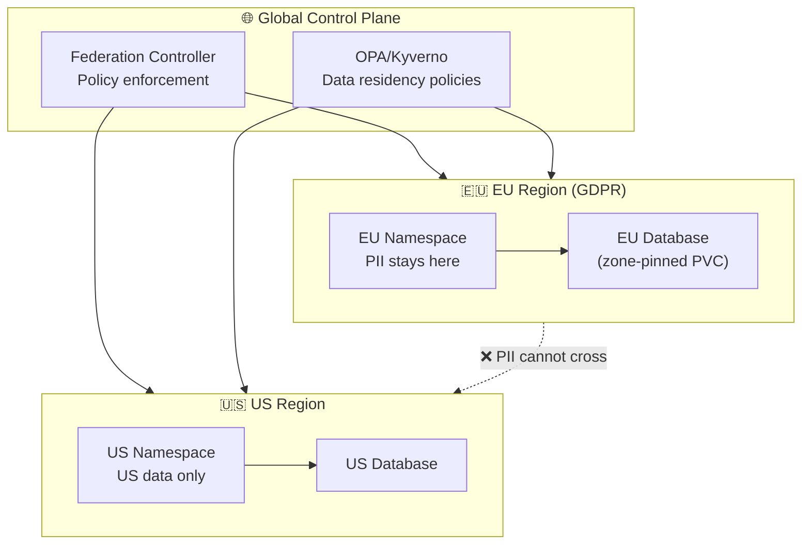

> 💡 **Quick Answer:** Data sovereignty requires that data stays within specific geographic/legal boundaries. On Kubernetes, implement it with: multi-region clusters with region-locked namespaces, OPA/Kyverno policies enforcing data residency labels, topology-constrained storage (zone-pinned PVCs), and federated identity with regional IdPs. Geopatriation = actively moving workloads back to sovereign infrastructure.

## The Problem

In 2026, governments are mandating data localization: GDPR (EU), PIPL (China), DPDPA (India), and new US sector-specific rules. Gartner calls "geopatriation" a top 2026 trend — countries and enterprises are actively localizing data, compute, and cloud choices. Kubernetes clusters often span regions without considering which data can cross borders, creating compliance violations.



## The Solution

### Region-Locked Namespaces

```yaml
# EU namespace with data residency labels
apiVersion: v1
kind: Namespace
metadata:
  name: eu-production
  labels:
    data-residency: eu
    compliance: gdpr
    region: eu-west-1
---
# US namespace
apiVersion: v1
kind: Namespace
metadata:
  name: us-production
  labels:
    data-residency: us
    compliance: hipaa
    region: us-east-1
```

### OPA Policy: Enforce Data Residency

```yaml
# Kyverno policy: pods in EU namespace must run on EU nodes
apiVersion: kyverno.io/v1
kind: ClusterPolicy
metadata:
  name: enforce-data-residency
spec:
  validationFailureAction: Enforce
  rules:
    - name: eu-pods-on-eu-nodes
      match:
        resources:
          kinds: ["Pod"]
          namespaces: ["eu-*"]
      validate:
        message: "EU pods must run on EU nodes (nodeSelector required)"
        pattern:
          spec:
            nodeSelector:
              topology.kubernetes.io/region: "eu-west-1"
    
    - name: block-cross-region-volumes
      match:
        resources:
          kinds: ["PersistentVolumeClaim"]
          namespaces: ["eu-*"]
      validate:
        message: "EU PVCs must use EU storage class"
        pattern:
          spec:
            storageClassName: "eu-*"
---
# Policy: prevent EU data from being mounted in non-EU namespaces
apiVersion: kyverno.io/v1
kind: ClusterPolicy
metadata:
  name: block-cross-region-pvc-access
spec:
  validationFailureAction: Enforce
  rules:
    - name: no-eu-pvc-in-us
      match:
        resources:
          kinds: ["Pod"]
          namespaces: ["us-*"]
      validate:
        message: "US pods cannot mount EU PVCs"
        deny:
          conditions:
            - key: "{{ request.object.spec.volumes[].persistentVolumeClaim.claimName }}"
              operator: AnyIn
              value: "eu-*"
```

### Zone-Pinned Storage

```yaml
# EU-only StorageClass
apiVersion: storage.k8s.io/v1
kind: StorageClass
metadata:
  name: eu-west-1-encrypted
provisioner: ebs.csi.aws.com
parameters:
  type: gp3
  encrypted: "true"
  kmsKeyId: "arn:aws:kms:eu-west-1:123456789:key/eu-data-key"
allowedTopologies:
  - matchLabelExpressions:
      - key: topology.kubernetes.io/zone
        values:
          - eu-west-1a
          - eu-west-1b
          - eu-west-1c
volumeBindingMode: WaitForFirstConsumer
---
# PVC that can only exist in EU
apiVersion: v1
kind: PersistentVolumeClaim
metadata:
  name: customer-pii-db
  namespace: eu-production
  labels:
    data-classification: pii
    data-residency: eu
spec:
  storageClassName: eu-west-1-encrypted
  accessModes: ["ReadWriteOnce"]
  resources:
    requests:
      storage: 500Gi
```

### Network Policy: Block Cross-Region Traffic

```yaml
apiVersion: networking.k8s.io/v1
kind: NetworkPolicy
metadata:
  name: eu-data-isolation
  namespace: eu-production
spec:
  podSelector: {}
  policyTypes:
    - Egress
  egress:
    # Allow within EU namespace
    - to:
        - podSelector: {}
    # Allow DNS
    - to:
        - namespaceSelector:
            matchLabels:
              name: kube-system
      ports:
        - port: 53
          protocol: UDP
    # Block: No traffic to non-EU namespaces
    # Block: No traffic to non-EU external IPs
    - to:
        - ipBlock:
            cidr: 10.0.0.0/16          # EU VPC CIDR only
            except:
              - 10.1.0.0/16            # US VPC — blocked
```

### Multi-Region Cluster Federation

```yaml
# Admiralty or KubeFed for multi-region federation
# Each region runs its own cluster with local data
apiVersion: types.kubefed.io/v1beta1
kind: FederatedDeployment
metadata:
  name: user-service
  namespace: global
spec:
  template:
    spec:
      replicas: 3
      template:
        spec:
          containers:
            - name: user-service
              image: myorg/user-service:v2.0
  placement:
    clusters:
      - name: eu-cluster     # Handles EU users
      - name: us-cluster     # Handles US users
  overrides:
    - clusterName: eu-cluster
      clusterOverrides:
        - path: "/spec/template/spec/containers/0/env"
          value:
            - name: DATABASE_URL
              value: "postgres://eu-db.eu-west-1.rds.amazonaws.com/users"
    - clusterName: us-cluster
      clusterOverrides:
        - path: "/spec/template/spec/containers/0/env"
          value:
            - name: DATABASE_URL
              value: "postgres://us-db.us-east-1.rds.amazonaws.com/users"
```

### Audit Trail for Compliance

```yaml
# Kubernetes audit policy logging all data access
apiVersion: audit.k8s.io/v1
kind: Policy
rules:
  # Log all access to PII-labeled resources
  - level: RequestResponse
    resources:
      - group: ""
        resources: ["secrets", "configmaps"]
    namespaces: ["eu-production", "us-production"]
  # Log all PVC operations
  - level: Metadata
    resources:
      - group: ""
        resources: ["persistentvolumeclaims"]
```

## Common Issues

| Issue | Cause | Fix |
|-------|-------|-----|
| Pod scheduled in wrong region | Missing nodeSelector | Add Kyverno policy to enforce node region |
| Data replicated cross-region | Storage replication not region-aware | Use zone-pinned StorageClasses |
| DNS resolving to wrong region | Global DNS without geo-routing | Use Route53/Cloud DNS geo-routing |
| Backup stored in wrong region | Velero backups to global S3 | Configure per-region backup locations |
| Audit logs incomplete | Not logging namespace-level access | Enable RequestResponse audit level |

## Best Practices

- **Label everything** — namespaces, PVCs, pods with \`data-residency\` labels
- **Policy-as-code** — use OPA/Kyverno to enforce, don't rely on humans
- **Encrypt at rest AND in transit** — region-specific KMS keys
- **Separate clusters per jurisdiction** — cleanest isolation, simplest compliance
- **Audit everything** — regulators want proof of data residency
- **Plan for data subject requests** — GDPR right to erasure must work cross-region

## Key Takeaways

- Data sovereignty = data must stay within geographic/legal boundaries
- Geopatriation = actively moving workloads back to sovereign infrastructure (2026 trend)
- Kubernetes implements it via: region-locked namespaces, node selectors, zone-pinned storage
- OPA/Kyverno policies enforce data residency at admission time
- Network policies block cross-region traffic at the pod level
- Separate clusters per jurisdiction is the cleanest approach for strict compliance
