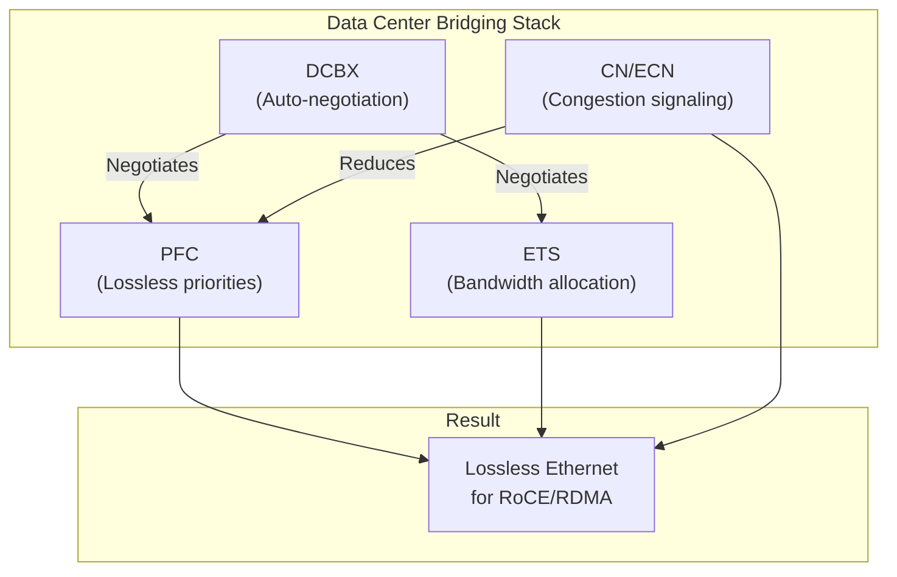

> 💡 **Quick Answer:** **DCB (Data Center Bridging)** is a set of IEEE standards that make Ethernet lossless: **PFC** (802.1Qbb) pauses specific priorities, **ETS** (802.1Qaz) allocates bandwidth per traffic class, and **DCBX** auto-negotiates settings between NIC and switch. On Mellanox ConnectX, enable DCB with `mlnx_qos` for PFC/ETS and configure DCBX mode with `lldptool` or let firmware auto-negotiate. All three must be configured for production RoCE.

## The Problem

Standard Ethernet is best-effort — it drops packets when buffers fill. RDMA/RoCE requires guaranteed delivery. DCB adds three capabilities to Ethernet to make it behave like InfiniBand:

| Standard | Name | What It Does |
|----------|------|-------------|
| **IEEE 802.1Qbb** | PFC (Priority Flow Control) | Pauses specific traffic classes to prevent drops |
| **IEEE 802.1Qaz** | ETS (Enhanced Transmission Selection) | Guarantees bandwidth per traffic class |
| **IEEE 802.1Qaz** | DCBX (DCB Exchange) | Auto-negotiates PFC/ETS between NIC and switch |
| **IEEE 802.1Qau** | CN (Congestion Notification) / ECN | Signals congestion before buffers fill |



## DCB Components Explained

### PFC: Priority Flow Control

PFC extends IEEE 802.3x PAUSE to work per-priority (8 priorities, 0-7). Only the lossless priority pauses; other traffic continues flowing.

```
Without PFC:  ALL traffic pauses (802.3x global PAUSE)
With PFC:     Only priority 3 pauses → RoCE lossless, SSH/management unaffected
```

### ETS: Enhanced Transmission Selection

ETS guarantees minimum bandwidth per traffic class and defines scheduling:

```
TC0 (Best Effort):  70% bandwidth, ETS scheduling
TC3 (RoCE/RDMA):    30% bandwidth, ETS scheduling
TC1-2, TC4-7:       Strict priority (served immediately when queued)
```

### DCBX: DCB Exchange Protocol

DCBX runs over LLDP to synchronize PFC/ETS settings between NIC and switch automatically:

| DCBX Version | Standard | Notes |
|-------------|----------|-------|
| CEE (pre-standard) | Cisco/Intel | Legacy, avoid |
| IEEE 802.1Qaz | IEEE standard | **Use this** |
| Auto | Auto-detect | Tries IEEE first, falls back to CEE |

## Step-by-Step DCB Configuration

### Step 1: Check DCB Firmware Capability

```bash
# Verify firmware supports DCB
ethtool -i ens8f0np0
# driver: mlx5_core
# firmware-version: 28.39.1002

# Check DCB capability
ethtool --show-features ens8f0np0 | grep dcb
# DCB: on

# If DCB is off:
ethtool --set-features ens8f0np0 dcb on
```

### Step 2: Configure DCBX Mode

```bash
# Option A: Using lldptool (recommended for DCBX control)
# Install lldpad daemon
yum install -y lldpad    # RHEL
apt install -y lldpad    # Ubuntu

systemctl enable --now lldpad

# Set DCBX to IEEE mode
lldptool -T -i ens8f0np0 -V IEEE-DCBX mode=reset
lldptool set-lldp -i ens8f0np0 adminStatus=rxtx

# Configure PFC via DCBX (advertise priority 3 as lossless)
lldptool -T -i ens8f0np0 -V PFC enabled=3
# This tells the switch: "I want priority 3 to be lossless"

# Configure ETS via DCBX
lldptool -T -i ens8f0np0 -V ETS-CFG \
  tsa=0:ets,1:strict,2:strict,3:ets,4:strict,5:strict,6:strict,7:strict \
  up2tc=0:0,1:1,2:2,3:3,4:4,5:5,6:6,7:7 \
  tcbw=70,0,0,30,0,0,0,0

# Verify DCBX state
lldptool -t -i ens8f0np0 -V PFC
lldptool -t -i ens8f0np0 -V ETS-CFG
```

```bash
# Option B: Disable DCBX, configure manually with mlnx_qos
# (Use when switch doesn't support DCBX or you want static config)
mlnx_qos -i ens8f0np0 --trust dscp
mlnx_qos -i ens8f0np0 --pfc 0,0,0,1,0,0,0,0
mlnx_qos -i ens8f0np0 --tc_bw 70,0,0,30,0,0,0,0 \
  --tsa ets,strict,strict,ets,strict,strict,strict,strict
```

### Step 3: Verify DCB Negotiation

```bash
# Check if DCBX negotiated successfully
lldptool -t -i ens8f0np0 -V IEEE-DCBX -c mode
# mode = IEEE

# Check PFC willing/status
lldptool -t -i ens8f0np0 -V PFC -c willing
# willing=yes    ← NIC will accept switch's PFC config

lldptool -t -i ens8f0np0 -V PFC -c enabled
# enabled=3      ← Priority 3 is lossless

# Check what the switch is advertising
lldptool -n -t -i ens8f0np0 -V PFC
# enabled=3      ← Switch also says priority 3 is lossless ✅

# Check ETS negotiation
lldptool -n -t -i ens8f0np0 -V ETS-CFG
# Shows switch's ETS configuration
```

### Step 4: Linux DCB Tools (Alternative)

The `dcb` command (from `iproute2`) is another way to configure DCB on Linux:

```bash
# Show DCB state
dcb ets show dev ens8f0np0
# tc-tsa: 0:ets 1:strict 2:strict 3:ets 4:strict 5:strict 6:strict 7:strict
# tc-bw:  70 0 0 30 0 0 0 0
# pg-bw:  70 0 0 30 0 0 0 0

dcb pfc show dev ens8f0np0
# pfc-cap 8 macsec-bypass off delay 0
# prio-pfc 0:off 1:off 2:off 3:on 4:off 5:off 6:off 7:off

# Set PFC via dcb tool
dcb pfc set dev ens8f0np0 prio-pfc 0:off 1:off 2:off 3:on 4:off 5:off 6:off 7:off

# Set ETS via dcb tool
dcb ets set dev ens8f0np0 \
  tc-tsa 0:ets 3:ets \
  tc-bw 0:70 3:30

# Show DCBX mode
dcb dcbx show dev ens8f0np0
# host firmware
```

### Step 5: Verify End-to-End

```bash
#!/bin/bash
# dcb-verify.sh — Full DCB health check for Mellanox NIC
IFACE=${1:-ens8f0np0}

echo "=== DCB Feature ==="
ethtool --show-features "$IFACE" | grep dcb

echo -e "\n=== Trust Mode ==="
mlnx_qos -i "$IFACE" 2>/dev/null | grep -i trust

echo -e "\n=== PFC State ==="
mlnx_qos -i "$IFACE" 2>/dev/null | grep -A2 "PFC"

echo -e "\n=== ETS State ==="
mlnx_qos -i "$IFACE" 2>/dev/null | grep -A3 "tc:"

echo -e "\n=== PFC Counters (Priority 3) ==="
ethtool -S "$IFACE" | grep prio3
# Non-zero pause = PFC active
# Non-zero discard = PROBLEM

echo -e "\n=== DCBX Negotiation ==="
if command -v lldptool &>/dev/null; then
    echo "Local PFC:"
    lldptool -t -i "$IFACE" -V PFC -c enabled 2>/dev/null
    echo "Peer PFC:"
    lldptool -n -t -i "$IFACE" -V PFC -c enabled 2>/dev/null
    echo "DCBX mode:"
    lldptool -t -i "$IFACE" -V IEEE-DCBX -c mode 2>/dev/null
else
    echo "lldptool not installed — DCBX status unavailable"
    dcb dcbx show dev "$IFACE" 2>/dev/null
fi

echo -e "\n=== RoCE Mode ==="
cma_roce_mode -d mlx5_0 2>/dev/null || echo "cma_roce_mode not found"

echo -e "\n=== ECN State (TC3) ==="
for type in roce_np roce_rp; do
    val=$(cat /sys/class/net/"$IFACE"/ecn/${type}/enable/3 2>/dev/null || echo "N/A")
    echo "$type: $val"
done

echo -e "\n=== RDMA Devices ==="
rdma link show 2>/dev/null | grep "$IFACE"

echo ""
echo "=== Summary ==="
PFC_OK=$(mlnx_qos -i "$IFACE" 2>/dev/null | grep -A1 "enabled:" | tail -1 | awk '{print $4}')
TRUST_OK=$(mlnx_qos -i "$IFACE" 2>/dev/null | grep -i trust | grep -c dscp)
DROPS=$(ethtool -S "$IFACE" 2>/dev/null | grep "prio3_discard" | awk '{print $2}')

[[ "$PFC_OK" == "1" ]] && echo "✅ PFC enabled on priority 3" || echo "❌ PFC NOT enabled on priority 3"
[[ "$TRUST_OK" -gt 0 ]] && echo "✅ DSCP trust mode" || echo "❌ Not in DSCP trust mode"
[[ "${DROPS:-0}" == "0" ]] && echo "✅ Zero drops on priority 3" || echo "❌ Drops detected on priority 3: $DROPS"
```

## DCBX: Willing vs Non-Willing

| Mode | Behavior | Use When |
|------|----------|----------|
| **Willing** | NIC accepts switch's PFC/ETS config | Switch is the source of truth (recommended) |
| **Non-willing** | NIC pushes its config to switch | NIC is the source of truth (rare) |

```bash
# Set NIC to willing mode (accept switch config)
lldptool -T -i ens8f0np0 -V PFC willing=yes
lldptool -T -i ens8f0np0 -V ETS-CFG willing=yes

# Set NIC to non-willing (push config to switch)
lldptool -T -i ens8f0np0 -V PFC willing=no
```

**Recommendation:** Use willing mode. Configure PFC/ETS on the switch, let DCBX push settings to NICs automatically. This ensures consistency across all ports.

## Kubernetes: Automate DCB with MachineConfig

```yaml
apiVersion: machineconfiguration.openshift.io/v1
kind: MachineConfig
metadata:
  name: 99-dcb-lossless-roce
  labels:
    machineconfiguration.openshift.io/role: worker
spec:
  config:
    ignition:
      version: 3.4.0
    systemd:
      units:
        - name: dcb-config.service
          enabled: true
          contents: |
            [Unit]
            Description=Configure DCB for lossless RoCE
            After=network-online.target
            Wants=network-online.target
            [Service]
            Type=oneshot
            RemainAfterExit=yes
            ExecStart=/usr/local/bin/configure-dcb.sh
            [Install]
            WantedBy=multi-user.target
    storage:
      files:
        - path: /usr/local/bin/configure-dcb.sh
          mode: 0755
          contents:
            inline: |
              #!/bin/bash
              set -euo pipefail
              for iface in $(ls /sys/class/net/); do
                if ethtool -i "$iface" 2>/dev/null | grep -q mlx5_core; then
                  echo "Configuring DCB on $iface"
                  # Trust DSCP
                  mlnx_qos -i "$iface" --trust dscp
                  # PFC on priority 3
                  mlnx_qos -i "$iface" --pfc 0,0,0,1,0,0,0,0
                  # ETS: 70% best-effort, 30% RoCE
                  mlnx_qos -i "$iface" \
                    --tc_bw 70,0,0,30,0,0,0,0 \
                    --tsa ets,strict,strict,ets,strict,strict,strict,strict
                  # ECN on TC3
                  echo 1 > /sys/class/net/"$iface"/ecn/roce_np/enable/3 2>/dev/null || true
                  echo 1 > /sys/class/net/"$iface"/ecn/roce_rp/enable/3 2>/dev/null || true
                fi
              done
```

## Common Issues

| Issue | Cause | Fix |
|-------|-------|-----|
| DCBX not negotiating | lldpad not running or switch LLDP disabled | `systemctl start lldpad`, enable LLDP on switch |
| PFC mismatch between NIC and switch | Different willing modes | Set NIC willing=yes, configure PFC on switch |
| CEE vs IEEE mismatch | NIC in IEEE, switch in CEE (or vice versa) | Set both to IEEE or use DCBX auto mode |
| ETS bandwidth not enforced | Wrong tsa mode | Use `ets` not `strict` for bandwidth-limited TCs |
| `dcb` command not found | Old iproute2 | Update iproute2 package or use `mlnx_qos` |
| PFC storms / head-of-line blocking | Congestion loop | Enable ECN, increase switch buffers, check for slow receivers |

## Best Practices

- **Use DCBX IEEE mode** — standard, supported by all modern switches
- **Switch as source of truth** — configure on switch, NIC in willing mode
- **PFC on priority 3 only** — only RoCE needs lossless
- **ECN always alongside PFC** — prevents PFC storms
- **Monitor PFC counters** — high pause counts signal congestion
- **ETS guarantees bandwidth** — don't rely on strict priority for RDMA (starves other traffic)
- **Test with ib_write_bw** — verify lossless RDMA before deploying AI workloads
- **Persist with MachineConfig** — mlnx_qos is volatile

## Key Takeaways

- DCB = PFC + ETS + DCBX — together they make Ethernet lossless
- DCBX auto-negotiates PFC/ETS between NIC and switch over LLDP
- Configure with `mlnx_qos` (Mellanox-specific) or `dcb` (Linux generic) or `lldptool` (DCBX)
- Willing mode on NIC + switch-driven config = consistent fleet-wide settings
- PFC prevents drops, ETS guarantees bandwidth, ECN reduces PFC frequency
- Must be configured end-to-end: NIC ↔ every switch hop ↔ NIC
