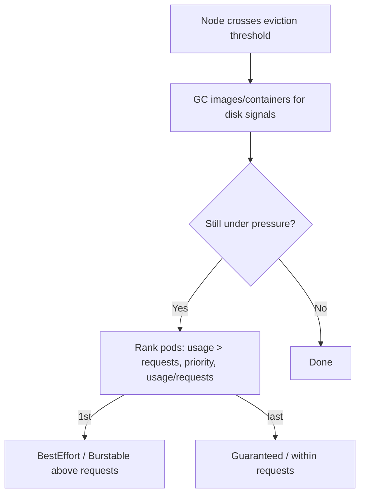

> 💡 **Quick Answer:** An evicted pod ends in `Status: Failed, Reason: Evicted` with a message saying why. Most evictions are **kubelet node-pressure evictions** ("The node was low on resource: memory / ephemeral-storage") — fix them with accurate requests, ephemeral-storage limits and enough node headroom. Other causes: **preemption** by a higher-priority pod, **NoExecute taints** (node not-ready/unreachable for 5 min), and **API-initiated eviction** from drains or autoscalers (paced by PodDisruptionBudgets).
>
> **Key command:** `kubectl get pods -A --field-selector status.phase=Failed -o wide | grep Evicted`

## Find Why the Pod Was Evicted

```bash
kubectl describe pod <evicted-pod> | grep -E "Status|Reason|Message"
# Status:   Failed
# Reason:   Evicted
# Message:  The node was low on resource: memory. Threshold quantity: 100Mi,
#           available: 91Mi. Container app was using 1.2Gi, request is 256Mi.

kubectl get events -A --field-selector reason=Evicted --sort-by=.lastTimestamp
kubectl get events -A --field-selector reason=Preempted
kubectl describe node <node> | grep -A8 Conditions   # MemoryPressure / DiskPressure / PIDPressure
kubectl describe node <node> | grep Taints
```

| Message / signal | Cause | Fix |
|------------------|-------|-----|
| `low on resource: memory` | Node `memory.available` below threshold | Set realistic memory requests, reserve system memory |
| `low on resource: ephemeral-storage` / DiskPressure | Logs, writable layer, `emptyDir`, images filling the disk | Ephemeral-storage limits, log rotation, bigger disks |
| `Pod ephemeral local storage usage exceeds the total limit` | Container exceeded its own `ephemeral-storage` limit | Raise the limit or write to a volume |
| `low on resource: pids` | PID exhaustion | `podPidsLimit` in kubelet config, fix fork bombs |
| `Preempted by ...` | Higher-priority pod needed the space | PriorityClasses, capacity |
| `Taint ... NoExecute` | Node not-ready/unreachable or manually tainted | Fix node, tune `tolerationSeconds` |
| Eviction during drain | `kubectl drain`, upgrades, autoscaler | PodDisruptionBudgets, replicas ≥ 2 |

## Node-Pressure Eviction

The kubelet monitors eviction signals and evicts pods when a threshold is crossed. Default hard thresholds (Linux):

```text
memory.available  < 100Mi
nodefs.available  < 10%
imagefs.available < 15%
nodefs.inodesFree < 5%
```

Tune them in the KubeletConfiguration (on OpenShift via a `KubeletConfig` CR):

```yaml
apiVersion: kubelet.config.k8s.io/v1beta1
kind: KubeletConfiguration
evictionHard:
  memory.available: "500Mi"
  nodefs.available: "10%"
  imagefs.available: "15%"
evictionSoft:
  memory.available: "1Gi"
evictionSoftGracePeriod:
  memory.available: "1m30s"
evictionMaxPodGracePeriod: 60
systemReserved:
  memory: "1Gi"
kubeReserved:
  memory: "1Gi"
```

For disk pressure the kubelet first garbage-collects dead containers and unused images, then evicts.

### Which Pods Go First

The kubelet ranks pods by:

1. Whether usage of the starved resource **exceeds requests**
2. Pod **priority**
3. Usage relative to requests

This produces the familiar QoS order — BestEffort first, then Burstable pods above their requests, Guaranteed (and Burstable pods below their requests) last. Critical system pods are only evicted when nothing else remains.



Node-pressure evictions ignore PodDisruptionBudgets and, for hard thresholds, termination grace periods.

## Ephemeral Storage Evictions

```yaml
resources:
  requests:
    ephemeral-storage: 1Gi
  limits:
    ephemeral-storage: 2Gi     # Pod evicted if container logs + writable layer exceed this
volumes:
  - name: scratch
    emptyDir:
      sizeLimit: 5Gi           # emptyDir over sizeLimit also evicts the pod
```

Find what is filling a node's disk (logs are the usual culprit):

```bash
kubectl debug node/worker-2 -it --image=busybox:1.36 -- \
  sh -c 'du -sh /host/var/log/pods/* 2>/dev/null | sort -rh | head -10'
# OpenShift: oc debug node/worker-2 -- chroot /host du -sh /var/log/pods/* | sort -rh | head
```

A pod evicted for memory can land on the same node and be evicted again if its request is far below real usage — fix the request, not the node.

## Preemption

When a pending pod can't fit, the scheduler may evict lower-priority pods to make room:

```yaml
apiVersion: scheduling.k8s.io/v1
kind: PriorityClass
metadata:
  name: critical-apps
value: 1000000
preemptionPolicy: PreemptLowerPriority
description: "Critical production workloads"
---
spec:
  priorityClassName: critical-apps
```

Preemption respects PDBs on a best-effort basis only. See [pod priority and preemption](/recipes/deployments/kubernetes-pod-priority-preemption/).

## Taint-Based Eviction

When a node becomes `NotReady` or unreachable, the node lifecycle controller adds `node.kubernetes.io/not-ready:NoExecute` or `node.kubernetes.io/unreachable:NoExecute`. Pods get default tolerations for these with `tolerationSeconds: 300`, so they are evicted after 5 minutes. Shorten it for fast failover of stateless apps:

```yaml
tolerations:
  - key: node.kubernetes.io/unreachable
    operator: Exists
    effect: NoExecute
    tolerationSeconds: 30
```

## API-Initiated Eviction (Drain, Autoscalers)

`kubectl drain`, Cluster Autoscaler and Karpenter call the Eviction API, which enforces PodDisruptionBudgets:

```yaml
apiVersion: policy/v1
kind: PodDisruptionBudget
metadata:
  name: myapp-pdb
spec:
  maxUnavailable: 1
  selector:
    matchLabels:
      app: myapp
```

See the [PDB guide](/recipes/deployments/pod-disruption-budget-config/).

## Clean Up Evicted Pods

Evicted pods stay as `Failed` objects until their controller or the pod GC (`--terminated-pod-gc-threshold`, default 12500) removes them:

```bash
kubectl delete pods -A --field-selector status.phase=Failed
```

## Prevention Checklist

- **Set requests on every container** so usage rarely exceeds requests; Guaranteed QoS for critical pods
- **Set `ephemeral-storage` limits** and `emptyDir.sizeLimit`; rotate container logs
- **Reserve node resources** with `systemReserved`/`kubeReserved` so the kubelet and OS don't starve
- **Use PriorityClasses** for critical workloads and PDBs for voluntary disruptions
- **Alert on node conditions** (`kube_node_status_condition{condition=~".*Pressure",status="true"}`) before evictions start

## Frequently Asked Questions

### What does "The node was low on resource: memory" mean?

The node's `memory.available` fell below the kubelet's eviction threshold (100Mi by default), so the kubelet evicted pods — starting with those using the most memory above their requests. Raise memory requests to match real usage, add node capacity, or reserve memory for system daemons.

### How is eviction different from OOMKilled?

OOMKilled is the kernel killing a container that exceeded its own memory limit (or the node running out before the kubelet reacted); the container restarts in place. Eviction is the kubelet (or API) removing the whole pod, which ends as `Failed/Evicted` and is recreated by its controller, possibly on another node.

### How do I prevent pod eviction?

Accurate requests (or Guaranteed QoS), ephemeral-storage limits, node reservations and headroom prevent node-pressure eviction. PriorityClasses reduce preemption risk. PDBs pace drains and autoscaler evictions.

### Why doesn't my PDB stop evictions?

PDBs only apply to the Eviction API (drain, autoscalers). Kubelet node-pressure eviction, taint-based eviction and preemption (best-effort only) don't honor them.
