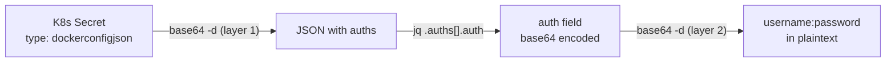

> 💡 **Quick Answer:** Use `kubectl get secret <name> -o jsonpath='{.data.\.dockerconfigjson}' | base64 -d | jq` to decode any docker-registry Secret, then pipe the `auth` field through `base64 -d` again to see the plain `username:password`.

## The Problem

You're troubleshooting `ImagePullBackOff` errors and need to verify that your Kubernetes pull secret contains the right registry credentials. But the secret data is double base64-encoded:

1. The `.dockerconfigjson` value is base64-encoded (Kubernetes stores all secret data in base64)
2. Inside the decoded JSON, each `auth` field is also base64-encoded (`base64(username:password)`)

You need to decode both layers to inspect the actual credentials.

## The Solution

### Decode the Full Secret

```bash
# Decode the entire .dockerconfigjson
kubectl get secret my-pull-secret \
  -n my-namespace \
  -o jsonpath='{.data.\.dockerconfigjson}' | base64 -d | jq .
```

Output:

```json
{
  "auths": {
    "quay.io": {
      "auth": "bXlvcmcrazhzX3Byb2RfcHVsbGVyOkFCQzEyMw==",
      "email": "robot@myorg.example.com"
    }
  }
}
```

### Decode the Auth Credential

The `auth` field is `base64(username:password)` — decode it to see the actual credentials:

```bash
# Extract and decode the auth for a specific registry
kubectl get secret my-pull-secret \
  -n my-namespace \
  -o jsonpath='{.data.\.dockerconfigjson}' | base64 -d \
  | jq -r '.auths["quay.io"].auth' \
  | base64 -d
```

Output:

```
myorg+k8s_prod_puller:ABC123
```

### One-Liner: Show All Registries and Credentials

```bash
# Decode all registry credentials in a secret
kubectl get secret my-pull-secret -n my-namespace \
  -o jsonpath='{.data.\.dockerconfigjson}' | base64 -d \
  | jq -r '.auths | to_entries[] | "\(.key) → \(.value.auth | @base64d)"'
```

Output:

```
quay.io → myorg+k8s_prod_puller:ABC123ROBOTTOKEN
gcr.io → _json_key:{...service-account-json...}
```

### OpenShift: Inspect the Cluster-Wide Pull Secret

```bash
# Decode the cluster-wide pull secret
oc get secret pull-secret -n openshift-config \
  -o jsonpath='{.data.\.dockerconfigjson}' | base64 -d | jq .

# Decode a specific registry's auth
oc get secret pull-secret -n openshift-config \
  -o jsonpath='{.data.\.dockerconfigjson}' | base64 -d \
  | jq -r '.auths["quay.internal.example.com"].auth' | base64 -d
```

### Alternative: Decode with Python

If `jq` isn't available:

```bash
python3 -c "
import base64, json, sys
data = json.loads(base64.b64decode(sys.stdin.read()))
for host, creds in data['auths'].items():
    username_password = base64.b64decode(creds['auth']).decode()
    print(f'{host} → {username_password}')
" <<< "$(kubectl get secret my-pull-secret -n my-namespace -o jsonpath='{.data.\.dockerconfigjson}')"
```

### Audit All Pull Secrets in a Namespace

```bash
#!/bin/bash
# audit-pull-secrets.sh — List all pull secrets and their registries

NAMESPACE="${1:-default}"

echo "=== Pull secrets in namespace: $NAMESPACE ==="
for secret in $(kubectl get secrets -n "$NAMESPACE" \
  -o jsonpath='{range .items[?(@.type=="kubernetes.io/dockerconfigjson")]}{.metadata.name}{"\n"}{end}'); do

  echo ""
  echo "Secret: $secret"
  kubectl get secret "$secret" -n "$NAMESPACE" \
    -o jsonpath='{.data.\.dockerconfigjson}' | base64 -d \
    | jq -r '.auths | to_entries[] | "  Registry: \(.key)  User: \(.value.auth | @base64d | split(":")[0])"'
done
```

Output:

```
=== Pull secrets in namespace: production ===

Secret: quay-pull-secret
  Registry: quay.io  User: myorg+k8s_prod_puller

Secret: gcr-pull-secret
  Registry: gcr.io  User: _json_key
```



## Common Issues

### jq Not Installed

Use `python3` as shown above, or decode manually:

```bash
# Without jq — raw decode
kubectl get secret my-pull-secret -n my-namespace \
  -o jsonpath='{.data.\.dockerconfigjson}' | base64 -d
```

### Permission Denied

You need `get` permission on secrets in the target namespace:

```bash
kubectl auth can-i get secrets -n my-namespace
```

### Secret Type Mismatch

Ensure you're inspecting a `kubernetes.io/dockerconfigjson` type secret, not `Opaque`:

```bash
kubectl get secret my-pull-secret -n my-namespace -o jsonpath='{.type}'
```

## Best Practices

- **Never log decoded credentials** — inspect interactively, don't pipe to files or CI logs
- **Use `jq` for safe parsing** — don't rely on string splitting for JSON
- **Audit pull secrets periodically** — verify credentials haven't expired or been rotated
- **Check both layers** — a valid-looking secret can still have wrong credentials in the `auth` field
- **Clean up shell history** — `history -d` or `history -c` after decoding sensitive data

## Key Takeaways

- Docker registry secrets have two layers of base64: Kubernetes secret encoding and the `auth` field itself
- Use `base64 -d | jq` to decode the first layer, then `base64 -d` again for the auth credential
- The `auth` field format is always `base64(username:password)` separated by a colon
- Audit all pull secrets in a namespace with a simple loop script
