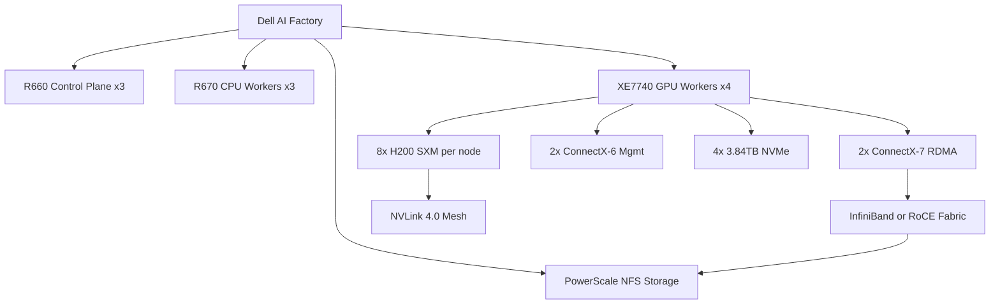

> 💡 **Quick Answer:** Configure XE7740 BIOS for GPU passthrough (IOMMU, SR-IOV, Above 4G Decoding), set power policy to Maximum Performance, configure iDRAC for remote management, and install OpenShift with GPU Operator targeting `nvidia.com/gpu.product: NVIDIA-H200`.

## The Problem

Dell PowerEdge XE7740 is a purpose-built GPU server with 4-8x H200 GPUs, high-wattage PSUs, and liquid cooling. Out of the box, BIOS defaults are optimized for general compute, not GPU workloads. Incorrect BIOS settings cause GPU detection failures, SR-IOV issues, and performance degradation.

## The Solution

### Dell AI Factory Cluster Architecture

```yaml
# Dell AI Factory bare-metal reference:
Control_Plane:
  model: "PowerEdge R660"
  count: 3
  role: "OpenShift control plane"
  cpu: "2x Intel Xeon 5th Gen"
  memory: "512 GB"
  storage: "2x 480GB SSD (OS), 2x 1.92TB NVMe (etcd)"
  network: "2x 25GbE"

CPU_Workers:
  model: "PowerEdge R670"
  count: 3
  role: "Infrastructure workloads (ingress, monitoring, logging)"
  cpu: "2x Intel Xeon 5th Gen"
  memory: "512 GB"
  storage: "4x 1.92TB NVMe"
  network: "2x 25GbE"

GPU_Workers:
  model: "PowerEdge XE7740"
  count: 4
  role: "GPU workloads (training, inference)"
  cpu: "2x Intel Xeon 5th Gen"
  memory: "2 TB DDR5"
  gpu: "8x NVIDIA H200 SXM (141GB HBM3e each)"
  storage: "4x 3.84TB NVMe U.2"
  network:
    - "2x ConnectX-7 (NVIDIA Network Operator, RDMA, GPUDirect)"
    - "2x ConnectX-6 (OCP SR-IOV Operator, management)"
    - "1x 1GbE iDRAC"
  cooling: "Direct liquid cooling (DLC)"
  power: "4x 2400W PSU"

Storage:
  model: "PowerScale"
  protocol: "NFS over RDMA (NFSoRDMA)"
  filesystem: "OneFS"
  capacity: "200 TB+"
```

### BIOS Settings (iDRAC or F2 Setup)

```yaml
# Critical BIOS settings for GPU workloads:
System_Profile:
  System_Profile_Settings: "Performance"
  # Maximizes GPU and CPU clock speeds

Processor_Settings:
  Logical_Processor: "Enabled"
  Virtualization_Technology: "Enabled"
  IOMMU: "Enabled"                  # Required for GPU passthrough and SR-IOV
  Sub_NUMA_Clustering: "Disabled"   # Avoid NUMA complexity for GPU workloads

Integrated_Devices:
  SR_IOV_Global_Enable: "Enabled"   # Required for NIC SR-IOV
  Memory_Mapped_IO_Above_4GB: "Enabled"  # Required for GPU BAR1 mapping
  Memory_Mapped_IO_Base: "56T"      # Large MMIO for multiple GPUs
  Memory_Mapped_IO_Limit: "Auto"

Power_Management:
  Power_Profile: "Maximum Performance"
  C_States: "Disabled"             # No CPU sleep states — stable latency
  P_States: "Maximum Performance"  # Fixed high clock speed
  Turbo_Boost: "Enabled"

Boot_Settings:
  Boot_Mode: "UEFI"
  Secure_Boot: "Disabled"          # GPU drivers may need unsigned modules
```

### iDRAC Remote Configuration

```bash
# Configure iDRAC via racadm (remote)
racadm -r $IDRAC_IP -u root -p $IDRAC_PASS set \
  BIOS.SysProfileSettings.SysProfile "PerfOptimized"

racadm -r $IDRAC_IP -u root -p $IDRAC_PASS set \
  BIOS.ProcSettings.ProcVirtualization "Enabled"

racadm -r $IDRAC_IP -u root -p $IDRAC_PASS set \
  BIOS.IntegratedDevices.SriovGlobalEnable "Enabled"

racadm -r $IDRAC_IP -u root -p $IDRAC_PASS set \
  BIOS.IntegratedDevices.MmioAbove4Gb "Enabled"

# Apply BIOS changes (requires reboot)
racadm -r $IDRAC_IP -u root -p $IDRAC_PASS jobqueue create BIOS.Setup.1-1
racadm -r $IDRAC_IP -u root -p $IDRAC_PASS serveraction powercycle
```

### OpenShift Node Configuration

```yaml
# MachineConfig for GPU workers
apiVersion: machineconfiguration.openshift.io/v1
kind: MachineConfig
metadata:
  name: 99-xe7740-gpu-tuning
  labels:
    machineconfiguration.openshift.io/role: gpu-worker
spec:
  config:
    ignition:
      version: 3.4.0
    storage:
      files:
        - path: /etc/sysctl.d/99-gpu-tuning.conf
          mode: 0644
          contents:
            inline: |
              # GPU workload tuning
              vm.zone_reclaim_mode=0
              vm.min_free_kbytes=1048576
              net.core.rmem_max=16777216
              net.core.wmem_max=16777216
              kernel.numa_balancing=0
        - path: /etc/modprobe.d/nvidia-open.conf
          mode: 0644
          contents:
            inline: |
              options nvidia NVreg_OpenRmEnableUnsupportedGpus=1
              options nvidia NVreg_RegistryDwords="PeerMappingOverride=1"
```

### Verify GPU Node

```bash
# Check GPU detection
oc debug node/gpu-worker-1 -- chroot /host nvidia-smi

# Verify 8x H200 GPUs
oc debug node/gpu-worker-1 -- chroot /host \
  nvidia-smi --query-gpu=name,memory.total,pci.bus_id --format=csv

# Check NVLink topology
oc debug node/gpu-worker-1 -- chroot /host nvidia-smi topo -m

# Check RDMA NICs
oc debug node/gpu-worker-1 -- chroot /host ibstat

# Power and thermal
oc debug node/gpu-worker-1 -- chroot /host \
  nvidia-smi --query-gpu=power.draw,temperature.gpu --format=csv

# ipmitool for chassis power
oc debug node/gpu-worker-1 -- chroot /host \
  ipmitool sensor list | grep -i "psu\|fan\|temp"
```



## Common Issues

- **GPUs not detected** — IOMMU and Above 4G Decoding must be enabled in BIOS; check `dmesg | grep -i nvidia`
- **SR-IOV VFs not created** — SR-IOV Global Enable must be on in BIOS; verify with `lspci -vvv | grep SR-IOV`
- **Power throttling under load** — ensure Power Profile is Maximum Performance; check PSU health via iDRAC
- **Liquid cooling alarm** — XE7740 requires DLC; verify coolant flow and temperature via iDRAC sensors
- **NVLink not detected** — NVLink is SXM-only; PCIe variants don't have NVLink

## Best Practices

- Configure BIOS via racadm/Ansible for reproducible settings across all GPU nodes
- Disable C-States and NUMA balancing for consistent GPU latency
- Enable 56T MMIO base for 8-GPU configurations — default may be too small
- Monitor power draw — 8x H200 at 700W TDP = 5.6kW GPU alone + CPU/memory/fans
- Use dedicated MachineConfigPool for GPU workers — don't mix with regular workers
- Label GPU nodes with `nvidia.com/gpu.product` and `node-role.kubernetes.io/gpu-worker`

## Key Takeaways

- XE7740 is a purpose-built GPU server with 8x H200 SXM and liquid cooling
- BIOS settings are critical: IOMMU, SR-IOV, Above 4G Decoding, Maximum Performance
- Use racadm or Ansible for reproducible BIOS configuration across fleet
- Mixed NICs: ConnectX-7 for RDMA/GPUDirect, ConnectX-6 for management traffic
- PowerScale with NFSoRDMA provides shared storage for training datasets and checkpoints
- Direct liquid cooling is required — air cooling cannot handle 8x 700W GPU TDP
