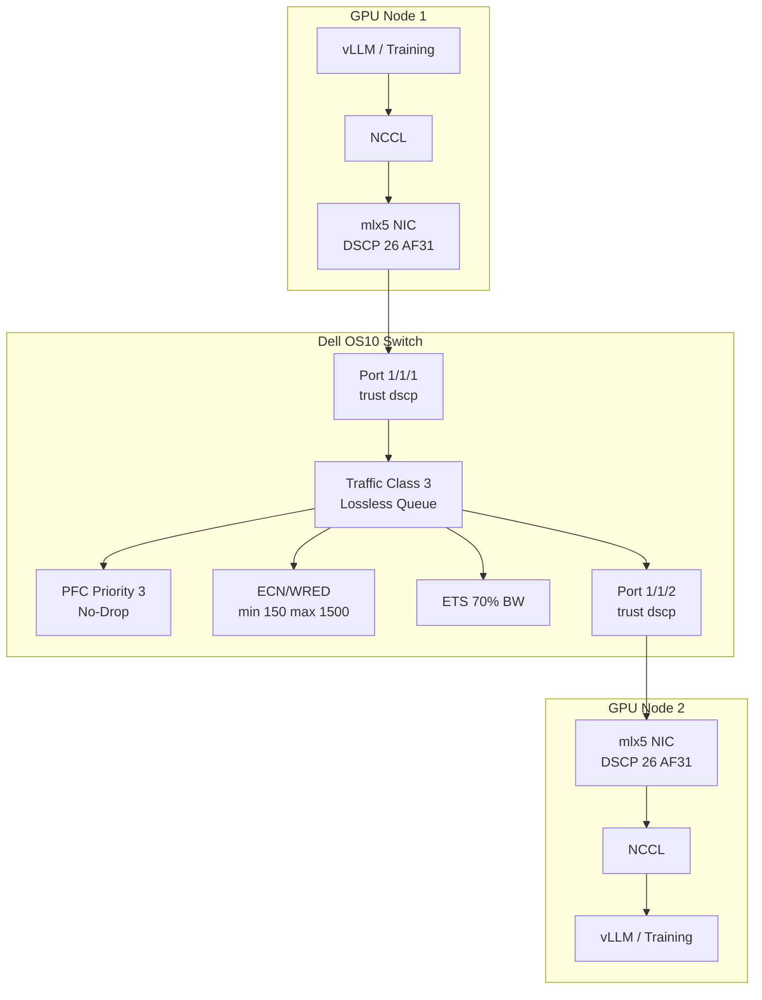

> 💡 **Quick Answer:** Dell OS10 switches map DSCP values 24 and 26 to traffic class 3 by default. Enable PFC on traffic class 3, configure ECN/WRED thresholds, and set DSCP trust on ports connected to GPU nodes for lossless RoCEv2.

## The Problem

RoCEv2 (RDMA over Converged Ethernet v2) requires a lossless fabric to prevent packet drops that cause NCCL retransmissions and GPU idle time. The switch must:
- **Trust DSCP markings** from the host (not remark to best-effort)
- **Map DSCP 24 (CS3) and 26 (AF31) to traffic class 3** for priority queuing
- **Enable PFC (Priority Flow Control)** on traffic class 3 to prevent buffer overflow
- **Enable ECN (Explicit Congestion Notification)** to signal congestion before buffers fill
- **Configure WRED (Weighted Random Early Detection)** for graceful degradation

Without these, RDMA traffic competes with best-effort traffic, causing drops that force NCCL to fall back to TCP or retransmit — destroying GPU training/inference performance.

## The Solution

### Dell OS10 Switch Configuration

#### 1. Enable DSCP Trust on Ports

```
! Trust DSCP markings from GPU nodes (don't remark to default)
interface ethernet1/1/1-1/1/32
  qos-map traffic-class queue-map
  trust dscp
  no shutdown
```

#### 2. DSCP-to-Traffic-Class Mapping

Dell OS10 default mapping already places DSCP 24 and 26 into traffic class 3:

| DSCP Value | DSCP Name | Traffic Class | Purpose |
|------------|-----------|---------------|---------|
| 24 | CS3 | 3 | RoCEv2 control |
| 26 | AF31 | 3 | RoCEv2 data (default) |
| 0 | BE | 0 | Best-effort |
| 46 | EF | 5 | Voice (if used) |

Verify the default mapping:
```
show qos-map dscp-tc
```

Custom mapping (if defaults were changed):
```
! Map DSCP 24 and 26 to traffic class 3
qos-map dscp-tc dscp-tc-map
  dscp 24 traffic-class 3
  dscp 26 traffic-class 3
```

#### 3. Enable PFC on Traffic Class 3

```
! Enable PFC globally
dcbx enable

! Configure PFC — only traffic class 3 is lossless
interface ethernet1/1/1-1/1/32
  priority-flow-control mode on
  priority-flow-control priority 3 no-drop

! Alternatively, use DCBX to negotiate PFC
interface ethernet1/1/1-1/1/32
  dcbx pfc-tlv
  dcbx pfc-willing
```

#### 4. Configure ECN and WRED

```
! Create WRED profile for traffic class 3
wred ecn-profile rdma-ecn
  ecn enable
  threshold minimum 150 maximum 1500 probability 100

! Apply WRED/ECN to traffic class 3
qos-map traffic-class tc-queue-map
  traffic-class 3 qos-group 3

interface ethernet1/1/1-1/1/32
  wred-profile rdma-ecn queue 3
```

ECN thresholds explained:
- **minimum 150** — start marking ECN at 150 KB buffer usage (early warning)
- **maximum 1500** — mark all packets at 1500 KB (hard limit before PFC kicks in)
- **probability 100** — 100% ECN marking between min/max (aggressive, recommended for RDMA)

#### 5. ETS (Enhanced Transmission Selection) Bandwidth

```
! Allocate bandwidth: 50% to TC3 (RDMA), 50% to TC0 (best-effort)
interface ethernet1/1/1-1/1/32
  ets mode on
  ets traffic-class 0 bandwidth 50
  ets traffic-class 3 bandwidth 50
```

For GPU-heavy clusters, allocate more to TC3:
```
  ets traffic-class 0 bandwidth 20
  ets traffic-class 3 bandwidth 80
```

#### 6. Buffer Allocation

```
! Allocate shared buffer to traffic class 3
interface ethernet1/1/1-1/1/32
  qos-map queue buffer-allocation 3 60
```

### Complete Switch Port Configuration

```
interface ethernet1/1/1
  description "GPU Node eth1 - RoCEv2"
  no shutdown
  switchport mode trunk
  trust dscp
  mtu 9216
  flowcontrol receive off
  flowcontrol transmit off
  priority-flow-control mode on
  priority-flow-control priority 3 no-drop
  ets mode on
  ets traffic-class 0 bandwidth 30
  ets traffic-class 3 bandwidth 70
  wred-profile rdma-ecn queue 3
  qos-map queue buffer-allocation 3 60
```

### Verification Commands

```
! Verify PFC status
show priority-flow-control interface ethernet1/1/1

! Check PFC counters (should see pause frames during congestion)
show interfaces ethernet1/1/1 counters pfc

! Verify DSCP-to-TC mapping
show qos-map dscp-tc

! Check ECN/WRED profile
show wred-profile rdma-ecn

! Verify ETS bandwidth allocation
show ets interface ethernet1/1/1

! Check buffer utilization
show qos statistics interface ethernet1/1/1

! Verify DCBX negotiation with host
show dcbx interface ethernet1/1/1
```

### End-to-End Verification

From GPU nodes, verify the full path:

```bash
# Check DSCP marking from host
tcpdump -i net1 -v udp port 4791 | grep -o 'tos 0x[0-9a-f]*'
# Should show tos 0x68 (DSCP 26 = AF31, ECN 00)
# or tos 0x6a (DSCP 26 = AF31, ECN 10 = ECT(0))

# Run RDMA bandwidth test
ib_write_bw --rdma_cm -d mlx5_0 -R --report_gbits

# Check NCCL transport (should show NET/IB, not NET/Socket)
kubectl logs my-training-pod | grep "NCCL INFO.*Using network"
```



## Common Issues

**PFC storms — switch sends excessive pause frames**

Symptoms: all traffic on the port halts, not just TC3. Check for:
```
show priority-flow-control interface ethernet1/1/1 counters
```
If pause TX count is growing rapidly, check buffer allocation and ECN thresholds. ECN should react before PFC:
- Lower ECN minimum threshold (e.g., 50 KB)
- Ensure ECN is enabled on both switch AND host NICs

**DSCP markings stripped by switch**

Verify `trust dscp` is set on the ingress port. Without it, all traffic maps to TC0:
```
show running-configuration interface ethernet1/1/1 | grep trust
```

**Link partner doesn't support PFC (legacy devices)**

Use DCBX willing mode to negotiate:
```
dcbx pfc-willing
```
Or fall back to link-level flow control (less granular):
```
flowcontrol receive on
flowcontrol transmit on
```

**MTU mismatch causes RDMA failures**

Ensure jumbo frames are consistent: switch (9216) matches host (9000 payload + headers):
```
show interfaces ethernet1/1/1 | grep MTU
```

**WRED dropping RDMA packets before PFC activates**

WRED should only ECN-mark, not drop, for lossless traffic. Ensure:
- ECN is enabled in the WRED profile (`ecn enable`)
- The WRED profile is applied to the correct queue
- Probability is 100% (mark all, drop none when ECN-capable)

## Best Practices

- **DSCP 26 (AF31) → TC3** is the industry-standard RoCEv2 mapping — don't change unless you have a reason
- **Enable ECN alongside PFC** — ECN reacts at microsecond timescales, PFC at nanoseconds; together they prevent both congestion and drops
- **Set jumbo MTU (9216)** on all switch ports connected to RDMA nodes — reduces per-packet overhead by 6×
- **Allocate ≥60% buffer to TC3** for GPU-heavy clusters — RDMA traffic is bursty
- **ETS bandwidth 70/30** (RDMA/best-effort) is a good starting point — adjust based on traffic mix
- **Monitor PFC counters** weekly — sustained PFC pauses indicate undersized buffers or misconfigured ECN
- **Use DCBX** for automatic PFC/ETS negotiation when both switch and NIC support it
- **Document your DSCP mapping** — mismatches between switch and host are the #1 cause of RDMA performance issues
- **Test with `ib_write_bw`** before running training workloads — isolates fabric issues from application issues

## Key Takeaways

- Dell OS10 maps DSCP 24/26 to traffic class 3 by default — verify with `show qos-map dscp-tc`
- PFC on priority 3 makes TC3 lossless — RDMA packets are never dropped, only paused
- ECN/WRED marks packets before buffers fill — reduces PFC activation and tail latency
- `trust dscp` on switch ports is mandatory — without it, host DSCP markings are ignored
- ETS controls bandwidth allocation between traffic classes — give RDMA the majority
- The full stack must agree: host DSCP marking → switch trust → TC mapping → PFC → ECN
- Monitor PFC counters in production — excessive pauses indicate a tuning problem
- DCBX automates PFC/ETS negotiation but requires both endpoints to support it
