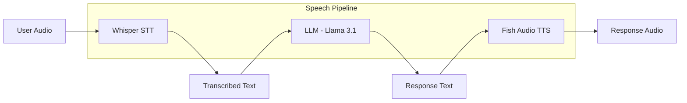

> 💡 **Quick Answer:** Deploy Fish Audio S2-Pro (5B parameters) for high-quality text-to-speech on Kubernetes. Supports multi-speaker voice cloning, streaming audio output, and multiple languages. Pair with Whisper for a complete speech pipeline (STT → LLM → TTS).

## The Problem

Production text-to-speech on Kubernetes needs:

- **Natural-sounding voices** — robotic TTS is unacceptable for modern applications
- **Voice cloning** — generate speech in a specific person's voice from a short sample
- **Streaming** — start playing audio before the full text is synthesized
- **Multi-language** — support for English, Chinese, Japanese, and other languages
- **Low latency** — real-time enough for conversational AI

Fish Audio S2-Pro is a 5B parameter TTS model with 1.8K+ downloads, designed for high-quality voice synthesis.

## The Solution

### Step 1: Deploy Fish Audio S2-Pro

```yaml
apiVersion: apps/v1
kind: Deployment
metadata:
  name: fish-tts
  namespace: ai-inference
  labels:
    app: fish-tts
spec:
  replicas: 1
  selector:
    matchLabels:
      app: fish-tts
  template:
    metadata:
      labels:
        app: fish-tts
    spec:
      containers:
        - name: fish-tts
          image: python:3.11-slim
          command:
            - /bin/bash
            - -c
            - |
              apt-get update && apt-get install -y ffmpeg
              pip install fish-speech fastapi uvicorn

              python3 << 'PYEOF'
              from fastapi import FastAPI
              from fastapi.responses import StreamingResponse
              import io

              app = FastAPI()

              # Initialize Fish Audio model
              from fish_speech.models import load_model
              model = load_model("fishaudio/s2-pro", device="cuda")

              @app.get("/health")
              def health():
                  return {"status": "ready", "model": "s2-pro"}

              @app.post("/synthesize")
              async def synthesize(request: dict):
                  text = request.get("text", "Hello world")
                  speaker = request.get("speaker", "default")
                  format = request.get("format", "wav")

                  audio = model.synthesize(
                      text=text,
                      speaker=speaker,
                  )

                  buf = io.BytesIO()
                  audio.save(buf, format=format)
                  buf.seek(0)

                  return StreamingResponse(
                      buf,
                      media_type=f"audio/{format}",
                      headers={"Content-Disposition": f"attachment; filename=speech.{format}"}
                  )

              import uvicorn
              uvicorn.run(app, host="0.0.0.0", port=8000)
              PYEOF
          ports:
            - containerPort: 8000
          resources:
            limits:
              nvidia.com/gpu: "1"
              memory: 24Gi
              cpu: "8"
          env:
            - name: HUGGING_FACE_HUB_TOKEN
              valueFrom:
                secretKeyRef:
                  name: huggingface-token
                  key: token
          volumeMounts:
            - name: model-cache
              mountPath: /root/.cache/huggingface
          startupProbe:
            httpGet:
              path: /health
              port: 8000
            initialDelaySeconds: 120
            periodSeconds: 15
            failureThreshold: 16
          readinessProbe:
            httpGet:
              path: /health
              port: 8000
            periodSeconds: 10
      volumes:
        - name: model-cache
          persistentVolumeClaim:
            claimName: fish-tts-cache
---
apiVersion: v1
kind: Service
metadata:
  name: fish-tts
  namespace: ai-inference
spec:
  selector:
    app: fish-tts
  ports:
    - port: 8000
      targetPort: 8000
```

### Step 2: Complete Speech Pipeline (STT → LLM → TTS)

```yaml
apiVersion: v1
kind: ConfigMap
metadata:
  name: speech-pipeline
  namespace: ai-inference
data:
  pipeline.py: |
    """
    Full voice AI pipeline:
    1. Whisper STT: Audio → Text
    2. LLM: Text → Response
    3. Fish TTS: Response → Audio
    """
    import requests

    def speech_pipeline(audio_file_path):
        # Step 1: Speech-to-Text (Whisper)
        with open(audio_file_path, "rb") as f:
            stt_response = requests.post(
                "http://whisper-server:8000/transcribe",
                files={"file": f}
            )
        user_text = stt_response.json()["text"]

        # Step 2: LLM Response
        llm_response = requests.post(
            "http://llama31-8b:8000/v1/chat/completions",
            json={
                "model": "meta-llama/Llama-3.1-8B-Instruct",
                "messages": [{"role": "user", "content": user_text}],
                "max_tokens": 512,
            }
        )
        reply_text = llm_response.json()["choices"][0]["message"]["content"]

        # Step 3: Text-to-Speech (Fish Audio)
        tts_response = requests.post(
            "http://fish-tts:8000/synthesize",
            json={"text": reply_text, "format": "wav"}
        )

        with open("response.wav", "wb") as f:
            f.write(tts_response.content)

        return reply_text
```



## Common Issues

### Audio quality varies

```bash
# Use higher sample rate for better quality
# Ensure ffmpeg is installed for format conversion
apt-get install -y ffmpeg
```

### Voice cloning requires reference audio

```bash
# Provide a 10-30 second reference audio sample
# The model extracts voice characteristics from the sample
curl -X POST http://fish-tts:8000/synthesize \
  -F "text=Hello, this is a test" \
  -F "reference_audio=@speaker_sample.wav"
```

## Best Practices

- **Single GPU** — S2-Pro fits on A100 or L40S
- **Stream responses** — start audio playback while generating
- **Pair with Whisper** — complete STT → LLM → TTS pipeline
- **Cache voice profiles** — pre-extract speaker embeddings for faster cloning
- **ffmpeg for format conversion** — serve WAV, MP3, or OGG as needed

## Key Takeaways

- Fish Audio S2-Pro is a **5B parameter TTS** model with high-quality voice synthesis
- Supports **voice cloning** from short reference audio samples
- Deploy on **single GPU** — A100 or L40S sufficient
- Combine with **Whisper (STT) + LLM** for a complete voice AI pipeline
- **Streaming audio output** for low-latency conversational applications
