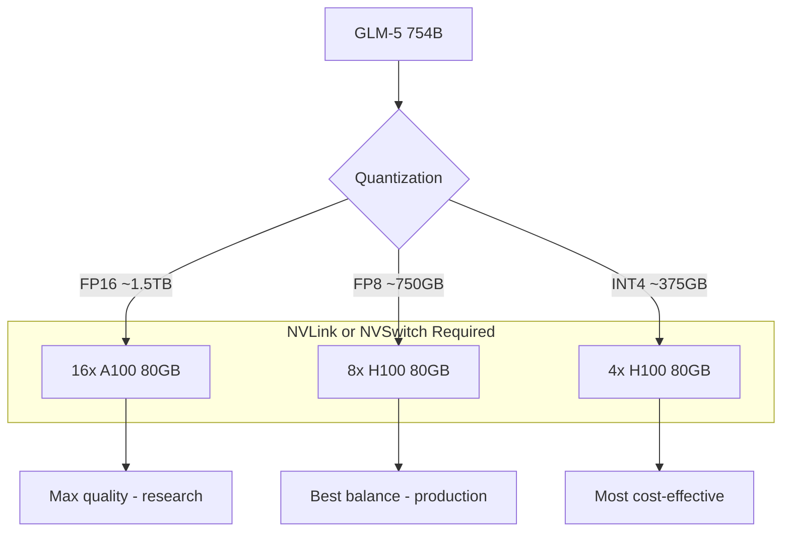

> 💡 **Quick Answer:** Deploy GLM-5 (754B parameters) with vLLM using `--tensor-parallel-size 8` on 8x H100 80GB GPUs. One of the largest open-weight models available — needs 1.5TB+ of VRAM in FP16 or 8x H100 with FP8 quantization. For most teams, FP8 on H100 is the practical deployment path.

## The Problem

Ultra-large language models (700B+) push the boundaries of what's possible with open weights:

- **Frontier reasoning** — complex multi-step problems that smaller models struggle with
- **Deep knowledge** — broader coverage of specialized domains
- **GPU requirements** — 754B in FP16 needs ~1.5TB VRAM, far beyond a single node
- **Inference optimization** — tensor parallelism, quantization, and efficient KV cache management are critical

GLM-5 from Zhipu AI (251K+ downloads, 1.78K+ likes) is one of the largest open models on HuggingFace.

## The Solution

### Step 1: Deploy GLM-5 with FP8 on 8x H100

```yaml
apiVersion: apps/v1
kind: Deployment
metadata:
  name: glm5-754b
  namespace: ai-inference
  labels:
    app: glm5-754b
spec:
  replicas: 1
  selector:
    matchLabels:
      app: glm5-754b
  template:
    metadata:
      labels:
        app: glm5-754b
    spec:
      containers:
        - name: vllm
          image: vllm/vllm-openai:latest
          args:
            - "--model"
            - "zai-org/GLM-5"
            - "--tensor-parallel-size"
            - "8"
            - "--quantization"
            - "fp8"
            - "--max-model-len"
            - "16384"
            - "--gpu-memory-utilization"
            - "0.92"
            - "--max-num-seqs"
            - "8"
            - "--enable-chunked-prefill"
            - "--trust-remote-code"
            - "--dtype"
            - "bfloat16"
            - "--port"
            - "8000"
          ports:
            - containerPort: 8000
          env:
            - name: HUGGING_FACE_HUB_TOKEN
              valueFrom:
                secretKeyRef:
                  name: huggingface-token
                  key: token
            - name: NCCL_DEBUG
              value: "WARN"
            - name: VLLM_WORKER_MULTIPROC_METHOD
              value: "spawn"
          resources:
            limits:
              nvidia.com/gpu: "8"
              memory: 256Gi
              cpu: "64"
          volumeMounts:
            - name: model-cache
              mountPath: /root/.cache/huggingface
            - name: shm
              mountPath: /dev/shm
          startupProbe:
            httpGet:
              path: /health
              port: 8000
            initialDelaySeconds: 600
            periodSeconds: 60
            failureThreshold: 30
          readinessProbe:
            httpGet:
              path: /health
              port: 8000
            periodSeconds: 30
      volumes:
        - name: model-cache
          persistentVolumeClaim:
            claimName: glm5-model-cache
        - name: shm
          emptyDir:
            medium: Memory
            sizeLimit: 64Gi
      nodeSelector:
        nvidia.com/gpu.product: "H100-SXM"
      terminationGracePeriodSeconds: 300
---
apiVersion: v1
kind: Service
metadata:
  name: glm5-754b
  namespace: ai-inference
spec:
  selector:
    app: glm5-754b
  ports:
    - port: 8000
      targetPort: 8000
```

### GPU Requirements

```text
| Precision | Total VRAM  | Configuration             | Context  |
|-----------|-------------|---------------------------|----------|
| FP16      | ~1.5TB      | 16x A100 80GB or 20x 80GB | 8K       |
| FP8       | ~750GB      | 8x H100 80GB              | 16K      |
| INT4 AWQ  | ~375GB      | 4x H100 80GB or 8x A100   | 16K      |
```



## Common Issues

### Model loading takes 30+ minutes

```yaml
# 754B at FP8 is ~750GB of weights
# NVMe-backed PVC is essential
# Pre-download weights as an init container or CronJob
startupProbe:
  initialDelaySeconds: 600  # 10 minutes
  periodSeconds: 60
  failureThreshold: 30      # total 40 minutes
```

### NCCL timeout with 8 GPUs

```yaml
env:
  - name: NCCL_SOCKET_IFNAME
    value: "eth0"
  - name: NCCL_IB_DISABLE
    value: "0"  # Enable InfiniBand if available
  - name: NCCL_NET_GDR_LEVEL
    value: "5"  # GPUDirect RDMA
  - name: NCCL_TIMEOUT
    value: "1800"  # 30 min timeout for large models
```

## Best Practices

- **8x H100 with FP8** — the practical deployment path for 754B
- **NVLink/NVSwitch mandatory** — PCIe interconnect is too slow for 8-GPU TP
- **NVMe PVC** — network storage is impractical for 750GB+ model weights
- **Low concurrency** — `--max-num-seqs 4-8` to avoid OOM
- **64Gi `/dev/shm`** — NCCL needs large shared memory for 8-GPU communication

## Key Takeaways

- GLM-5 is **754B parameters** — one of the largest open-weight models available
- Minimum **8x H100 80GB** with FP8 quantization for practical deployment
- **251K+ downloads** — significant community adoption despite extreme hardware requirements
- Use for **frontier-level reasoning** tasks that smaller models can't handle
- **NVLink/NVSwitch is mandatory** — PCIe bandwidth is insufficient for 8-way tensor parallelism
