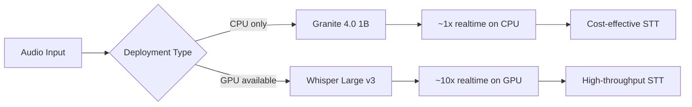

> 💡 **Quick Answer:** Deploy IBM Granite 4.0 1B Speech for automatic speech recognition. At just 2B parameters, it runs on CPU (no GPU needed) or accelerates on a small GPU like T4 or L4. Ideal for cost-effective speech-to-text pipelines.

## The Problem

Speech-to-text on Kubernetes doesn't always justify a GPU:

- **Whisper** (1.5B) is great but often overkill for simple transcription
- **Cost** — GPU instances are expensive for intermittent STT workloads
- **Latency requirements** vary — batch processing doesn't need GPU speeds
- **Edge deployment** — some clusters don't have GPU nodes at all

Granite 4.0 1B Speech from IBM (9.2K downloads) offers a lightweight alternative that runs on CPU.

## The Solution

### Deploy Granite Speech (CPU)

```yaml
apiVersion: apps/v1
kind: Deployment
metadata:
  name: granite-speech
  namespace: ai-inference
  labels:
    app: granite-speech
spec:
  replicas: 1
  selector:
    matchLabels:
      app: granite-speech
  template:
    metadata:
      labels:
        app: granite-speech
    spec:
      containers:
        - name: granite-stt
          image: python:3.11-slim
          command:
            - /bin/bash
            - -c
            - |
              apt-get update && apt-get install -y ffmpeg
              pip install transformers torch torchaudio fastapi uvicorn soundfile

              python3 << 'PYEOF'
              import torch
              from transformers import pipeline
              from fastapi import FastAPI, UploadFile, File
              import soundfile as sf
              import io

              app = FastAPI()

              pipe = pipeline(
                  "automatic-speech-recognition",
                  model="ibm-granite/granite-4.0-1b-speech",
                  device="cpu",  # or "cuda" if GPU available
              )

              @app.get("/health")
              def health():
                  return {"status": "ready", "model": "granite-4.0-1b-speech"}

              @app.post("/transcribe")
              async def transcribe(file: UploadFile = File(...)):
                  audio_bytes = await file.read()
                  audio, sr = sf.read(io.BytesIO(audio_bytes))
                  result = pipe({"raw": audio, "sampling_rate": sr})
                  return {"text": result["text"]}

              import uvicorn
              uvicorn.run(app, host="0.0.0.0", port=8000)
              PYEOF
          ports:
            - containerPort: 8000
          resources:
            requests:
              memory: 4Gi
              cpu: "4"
            limits:
              memory: 8Gi
              cpu: "8"
          startupProbe:
            httpGet:
              path: /health
              port: 8000
            initialDelaySeconds: 120
            periodSeconds: 10
            failureThreshold: 12
          readinessProbe:
            httpGet:
              path: /health
              port: 8000
            periodSeconds: 10
---
apiVersion: v1
kind: Service
metadata:
  name: granite-speech
  namespace: ai-inference
spec:
  selector:
    app: granite-speech
  ports:
    - port: 8000
      targetPort: 8000
```

### GPU-Accelerated Version

```yaml
# Add GPU for 5-10x faster inference
resources:
  limits:
    nvidia.com/gpu: "1"  # T4, L4, or A10G — any small GPU works
    memory: 8Gi
    cpu: "4"
```

### STT Model Comparison

```text
| Model                  | Params | GPU Required | Languages | Speed (CPU) |
|------------------------|--------|-------------|-----------|-------------|
| Granite 4.0 1B Speech  | 2B     | No          | Multi     | ~1x realtime|
| Whisper Large v3       | 1.5B   | Recommended | 99+       | ~0.3x       |
| faster-whisper Large   | 1.5B   | Recommended | 99+       | ~1.2x       |
| Whisper Tiny           | 39M    | No          | 99+       | ~5x         |
```



## Common Issues

### CPU inference speed

```bash
# 2B model on CPU processes audio at roughly real-time speed
# 60s audio ≈ 60s processing
# For faster: add a T4 GPU ($0.35/hr) → 5-10x speedup
# Or use HPA to scale replicas during peaks
```

### Audio format compatibility

```bash
# Ensure ffmpeg is installed for format conversion
# Supported: WAV, FLAC, MP3, OGG
# Convert before sending: ffmpeg -i input.mp3 -ar 16000 -ac 1 output.wav
```

## Best Practices

- **CPU-first deployment** — no GPU needed, dramatically reduces cost
- **HPA on CPU utilization** — scale replicas during peak transcription load
- **ffmpeg for preprocessing** — normalize to 16kHz mono WAV for best results
- **Pair with LLM** — transcribe → summarize/analyze with Llama or Phi-4
- **Batch processing** — use Kubernetes Jobs for bulk audio transcription

## Key Takeaways

- IBM Granite 4.0 1B Speech: **2B parameter ASR model** that runs on **CPU**
- **No GPU required** — cost-effective speech-to-text for any Kubernetes cluster
- ~**1x realtime** on CPU, 5-10x with a small GPU (T4, L4)
- **9.2K downloads** — IBM's latest speech model
- Pair with **Fish Audio TTS** for a complete CPU-friendly speech pipeline
