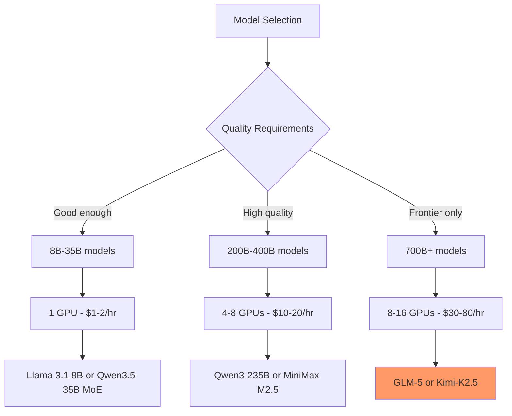

> 💡 **Quick Answer:** Kimi-K2.5 (1.1 trillion parameters) is the largest open MoE model on HuggingFace with 2.69M downloads. Requires multi-node deployment: 16x H100 80GB with FP8, or 2 nodes of 8x H100 each. Only deploy this if smaller models genuinely don't meet your quality bar.

## The Problem

When frontier-quality output is non-negotiable:

- **Smaller models plateau** on complex reasoning, multi-image analysis, and deep domain expertise
- **API-only models** (GPT-4, Claude) aren't an option due to data sovereignty or cost at scale
- **You need the best open model** — and Kimi-K2.5 at 1.1T parameters with 2.69M downloads represents the frontier

## The Solution

### Deploy Kimi-K2.5 with Multi-Node vLLM

```yaml
# Node 1: Head node with 8x H100
apiVersion: apps/v1
kind: Deployment
metadata:
  name: kimi-k25
  namespace: ai-inference
  labels:
    app: kimi-k25
spec:
  replicas: 1
  selector:
    matchLabels:
      app: kimi-k25
  template:
    metadata:
      labels:
        app: kimi-k25
    spec:
      containers:
        - name: vllm
          image: vllm/vllm-openai:latest
          args:
            - "--model"
            - "moonshotai/Kimi-K2.5"
            - "--tensor-parallel-size"
            - "8"
            - "--pipeline-parallel-size"
            - "2"
            - "--quantization"
            - "fp8"
            - "--max-model-len"
            - "8192"
            - "--gpu-memory-utilization"
            - "0.95"
            - "--max-num-seqs"
            - "4"
            - "--enable-chunked-prefill"
            - "--trust-remote-code"
            - "--port"
            - "8000"
          ports:
            - containerPort: 8000
          env:
            - name: HUGGING_FACE_HUB_TOKEN
              valueFrom:
                secretKeyRef:
                  name: huggingface-token
                  key: token
            - name: NCCL_DEBUG
              value: "WARN"
            - name: NCCL_IB_DISABLE
              value: "0"
            - name: NCCL_NET_GDR_LEVEL
              value: "5"
          resources:
            limits:
              nvidia.com/gpu: "8"
              memory: 512Gi
              cpu: "128"
          volumeMounts:
            - name: model-cache
              mountPath: /root/.cache/huggingface
            - name: shm
              mountPath: /dev/shm
          startupProbe:
            httpGet:
              path: /health
              port: 8000
            initialDelaySeconds: 1200
            periodSeconds: 60
            failureThreshold: 30
      volumes:
        - name: model-cache
          persistentVolumeClaim:
            claimName: kimi-model-cache
        - name: shm
          emptyDir:
            medium: Memory
            sizeLimit: 128Gi
      nodeSelector:
        nvidia.com/gpu.product: "H100-SXM"
      terminationGracePeriodSeconds: 600
```

### Ultra-Large Model Comparison

```text
| Model              | Total  | Active  | GPUs Needed     | Downloads | Type     |
|--------------------|--------|---------|-----------------|-----------|----------|
| Llama 3.1 8B       | 8B     | 8B      | 1x A100 40GB    | 7.35M     | Dense    |
| Qwen3.5-35B-A3B    | 36B    | 3B      | 1x A100 40GB    | 1.46M     | MoE VLM  |
| Qwen3-235B-A22B    | 235B   | 22B     | 4x A100 80GB    | 1.66M     | MoE      |
| MiniMax M2.5       | 229B   | 229B    | 4x A100 80GB    | 485K      | Dense    |
| Qwen3.5-397B-A17B  | 403B   | 17B     | 8x A100 80GB    | 1.66M     | MoE VLM  |
| GLM-5              | 754B   | 754B    | 8x H100         | 251K      | Dense    |
| Kimi-K2.5          | 1.1T   | MoE     | 16x H100        | 2.69M     | MoE VLM  |
```



## Common Issues

### Model too large for single node

```bash
# 1.1T even with FP8 needs ~1.1TB VRAM
# Single 8x H100 node = 640GB → not enough
# Pipeline parallelism across 2 nodes:
--tensor-parallel-size 8 --pipeline-parallel-size 2
# Requires InfiniBand between nodes
```

### Cost justification

```bash
# 16x H100 at ~$5/hr each = $80/hr
# Only justified when:
# 1. Smaller models measurably fail on your task
# 2. Volume justifies self-hosting vs API
# 3. Data sovereignty requires on-prem
# Start with Qwen3-235B or MiniMax M2.5 first
```

## Best Practices

- **Start smaller** — benchmark Qwen3-235B or MiniMax M2.5 first
- **Multi-node with InfiniBand** — pipeline parallelism needs fast inter-node links
- **FP8 quantization** — mandatory to fit on 16 GPUs instead of 32
- **Very low concurrency** — `--max-num-seqs 2-4` for 1.1T model
- **Pre-stage model weights** — 2TB+ download, pre-pull to NVMe before deployment

## Key Takeaways

- Kimi-K2.5 at **1.1 trillion parameters** is the **largest open MoE model**
- **2.69M downloads** — the most downloaded ultra-large model on HuggingFace
- Requires **16x H100 80GB** minimum with FP8 and multi-node pipeline parallelism
- **Multimodal** — processes images and text
- Cost: **~$80/hr** on cloud — only for frontier tasks where smaller models fail
- **Start with smaller models** and only scale up when quality justifies the cost
