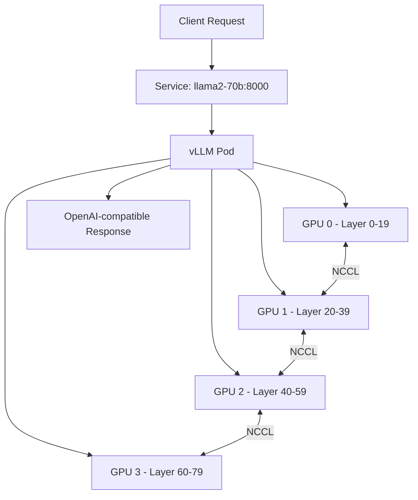

> 💡 **Quick Answer:** Deploy Llama 2 70B with vLLM using `tensor_parallel_size: 4` across 4x A100 80GB GPUs. Use AWQ quantization to fit on 2x A100 or a single H100. Serve via OpenAI-compatible API with health checks and HPA autoscaling.

## The Problem

Llama 2 70B is one of the most capable open-weight LLMs, but deploying it on Kubernetes is challenging:

- **Model size** — 140GB in FP16, requires multiple GPUs with tensor parallelism
- **Memory management** — KV cache can exhaust GPU memory under concurrent load
- **Multi-GPU coordination** — NCCL communication between GPUs needs proper configuration
- **Production readiness** — health checks, graceful shutdown, and autoscaling are essential

## The Solution

### Step 1: Create Secrets and Storage

```yaml
apiVersion: v1
kind: Secret
metadata:
  name: huggingface-token
  namespace: ai-inference
type: Opaque
stringData:
  token: "hf_your_token_here"
---
apiVersion: v1
kind: PersistentVolumeClaim
metadata:
  name: model-cache-llama70b
  namespace: ai-inference
spec:
  accessModes: ["ReadWriteOnce"]
  resources:
    requests:
      storage: 200Gi
  storageClassName: fast-ssd
```

### Step 2: Deploy Llama 2 70B with vLLM

```yaml
apiVersion: apps/v1
kind: Deployment
metadata:
  name: llama2-70b
  namespace: ai-inference
  labels:
    app: llama2-70b
spec:
  replicas: 1
  selector:
    matchLabels:
      app: llama2-70b
  template:
    metadata:
      labels:
        app: llama2-70b
    spec:
      containers:
        - name: vllm
          image: vllm/vllm-openai:latest
          args:
            - "--model"
            - "meta-llama/Llama-2-70b-chat-hf"
            - "--tensor-parallel-size"
            - "4"
            - "--max-model-len"
            - "4096"
            - "--gpu-memory-utilization"
            - "0.90"
            - "--max-num-seqs"
            - "64"
            - "--enable-chunked-prefill"
            - "--port"
            - "8000"
          ports:
            - containerPort: 8000
              name: http
          env:
            - name: HUGGING_FACE_HUB_TOKEN
              valueFrom:
                secretKeyRef:
                  name: huggingface-token
                  key: token
            - name: NCCL_DEBUG
              value: "WARN"
            - name: NCCL_SOCKET_IFNAME
              value: "eth0"
          resources:
            limits:
              nvidia.com/gpu: "4"
              memory: 64Gi
              cpu: "16"
            requests:
              memory: 32Gi
              cpu: "8"
          volumeMounts:
            - name: model-cache
              mountPath: /root/.cache/huggingface
            - name: shm
              mountPath: /dev/shm
          livenessProbe:
            httpGet:
              path: /health
              port: 8000
            initialDelaySeconds: 600
            periodSeconds: 30
            timeoutSeconds: 10
          readinessProbe:
            httpGet:
              path: /health
              port: 8000
            initialDelaySeconds: 300
            periodSeconds: 10
          startupProbe:
            httpGet:
              path: /health
              port: 8000
            initialDelaySeconds: 120
            periodSeconds: 30
            failureThreshold: 20
      volumes:
        - name: model-cache
          persistentVolumeClaim:
            claimName: model-cache-llama70b
        - name: shm
          emptyDir:
            medium: Memory
            sizeLimit: 16Gi
      terminationGracePeriodSeconds: 120
---
apiVersion: v1
kind: Service
metadata:
  name: llama2-70b
  namespace: ai-inference
spec:
  selector:
    app: llama2-70b
  ports:
    - port: 8000
      targetPort: 8000
      name: http
```

### Step 3: AWQ Quantized Version (2x A100)

```yaml
apiVersion: apps/v1
kind: Deployment
metadata:
  name: llama2-70b-awq
  namespace: ai-inference
spec:
  replicas: 1
  selector:
    matchLabels:
      app: llama2-70b-awq
  template:
    metadata:
      labels:
        app: llama2-70b-awq
    spec:
      containers:
        - name: vllm
          image: vllm/vllm-openai:latest
          args:
            - "--model"
            - "TheBloke/Llama-2-70B-Chat-AWQ"
            - "--quantization"
            - "awq"
            - "--tensor-parallel-size"
            - "2"
            - "--max-model-len"
            - "4096"
            - "--gpu-memory-utilization"
            - "0.90"
            - "--max-num-seqs"
            - "128"
          resources:
            limits:
              nvidia.com/gpu: "2"
              memory: 48Gi
              cpu: "8"
          volumeMounts:
            - name: shm
              mountPath: /dev/shm
      volumes:
        - name: shm
          emptyDir:
            medium: Memory
            sizeLimit: 8Gi
```

### Step 4: Test the Deployment

```bash
# Wait for model to load (can take 10-15 minutes)
kubectl wait --for=condition=ready pod -l app=llama2-70b \
  -n ai-inference --timeout=900s

# Test inference
kubectl run test-llama --rm -it --image=curlimages/curl -- \
  curl -s http://llama2-70b:8000/v1/chat/completions \
  -H "Content-Type: application/json" \
  -d '{
    "model": "meta-llama/Llama-2-70b-chat-hf",
    "messages": [{"role": "user", "content": "Explain Kubernetes pods in 3 sentences"}],
    "max_tokens": 256,
    "temperature": 0.7
  }'
```



## Common Issues

### NCCL timeout during multi-GPU initialization

```yaml
# Increase NCCL timeout and ensure shared memory
env:
  - name: NCCL_TIMEOUT
    value: "1800"
  - name: NCCL_SOCKET_IFNAME
    value: "eth0"
# Ensure /dev/shm is large enough (16Gi for 4 GPUs)
```

### OOM during model loading

```bash
# FP16 needs ~140GB GPU memory total
# 4x A100 80GB = 320GB available (safe)
# 2x A100 80GB = 160GB — tight, use AWQ quantization
# Use --gpu-memory-utilization 0.85 to leave headroom
```

### Startup probe timeout

```yaml
# 70B model takes 10-15 minutes to load
startupProbe:
  failureThreshold: 30  # 30 × 30s = 15 minutes
  periodSeconds: 30
```

## Best Practices

- **Use `/dev/shm` with adequate size** — NCCL uses shared memory for GPU communication
- **PVC for model cache** — avoid re-downloading 140GB on every pod restart
- **AWQ for cost efficiency** — 4-bit quantization fits on 2 GPUs with minimal quality loss
- **Startup probes with long timeout** — large models need 10-15 minutes to load
- **Set `NCCL_SOCKET_IFNAME`** — prevents NCCL from using wrong network interface

## Key Takeaways

- Llama 2 70B requires **4x A100 80GB** in FP16 or **2x A100** with AWQ quantization
- Use vLLM with `--tensor-parallel-size` matching your GPU count
- Mount **`/dev/shm`** as emptyDir Memory for NCCL inter-GPU communication
- **Startup probes** need 10-15 minute timeout for model loading
- AWQ quantization reduces GPU requirement by 50% with minimal quality impact
