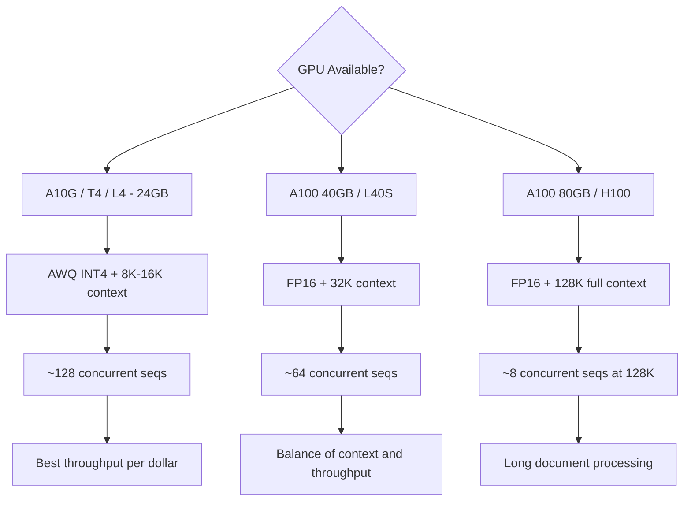

> 💡 **Quick Answer:** Deploy Llama 3.1 8B Instruct with vLLM on a single A100 or L40S. It supports 128K context, native tool/function calling, and serves 50+ concurrent users. At ~16GB VRAM (FP16), it fits comfortably on most datacenter GPUs.

## The Problem

Llama 3.1 8B Instruct is Meta's best small model — 128K context window, native tool calling, multilingual support. But deploying it on Kubernetes requires:

- **Context length management** — 128K tokens needs careful KV cache sizing
- **Tool calling** — OpenAI-compatible function calling format
- **Efficient serving** — maximizing throughput on a single GPU
- **Cost optimization** — choosing between FP16, FP8, and AWQ based on hardware

## The Solution

### Step 1: Deploy with vLLM

```yaml
apiVersion: apps/v1
kind: Deployment
metadata:
  name: llama31-8b
  namespace: ai-inference
  labels:
    app: llama31-8b
spec:
  replicas: 1
  selector:
    matchLabels:
      app: llama31-8b
  template:
    metadata:
      labels:
        app: llama31-8b
    spec:
      containers:
        - name: vllm
          image: vllm/vllm-openai:latest
          args:
            - "--model"
            - "meta-llama/Llama-3.1-8B-Instruct"
            - "--max-model-len"
            - "32768"
            - "--gpu-memory-utilization"
            - "0.90"
            - "--max-num-seqs"
            - "64"
            - "--enable-chunked-prefill"
            - "--enable-auto-tool-choice"
            - "--tool-call-parser"
            - "llama3_json"
            - "--port"
            - "8000"
          ports:
            - containerPort: 8000
              name: http
          env:
            - name: HUGGING_FACE_HUB_TOKEN
              valueFrom:
                secretKeyRef:
                  name: huggingface-token
                  key: token
          resources:
            limits:
              nvidia.com/gpu: "1"
              memory: 32Gi
              cpu: "8"
            requests:
              memory: 16Gi
              cpu: "4"
          volumeMounts:
            - name: model-cache
              mountPath: /root/.cache/huggingface
            - name: shm
              mountPath: /dev/shm
          startupProbe:
            httpGet:
              path: /health
              port: 8000
            initialDelaySeconds: 60
            periodSeconds: 10
            failureThreshold: 20
          readinessProbe:
            httpGet:
              path: /health
              port: 8000
            periodSeconds: 10
          livenessProbe:
            httpGet:
              path: /health
              port: 8000
            periodSeconds: 30
      volumes:
        - name: model-cache
          persistentVolumeClaim:
            claimName: llama31-model-cache
        - name: shm
          emptyDir:
            medium: Memory
            sizeLimit: 4Gi
---
apiVersion: v1
kind: Service
metadata:
  name: llama31-8b
  namespace: ai-inference
spec:
  selector:
    app: llama31-8b
  ports:
    - port: 8000
      targetPort: 8000
      name: http
```

### Step 2: Full 128K Context Deployment

```yaml
# For 128K context — needs A100 80GB or H100
apiVersion: apps/v1
kind: Deployment
metadata:
  name: llama31-8b-128k
  namespace: ai-inference
spec:
  replicas: 1
  selector:
    matchLabels:
      app: llama31-8b-128k
  template:
    metadata:
      labels:
        app: llama31-8b-128k
    spec:
      containers:
        - name: vllm
          image: vllm/vllm-openai:latest
          args:
            - "--model"
            - "meta-llama/Llama-3.1-8B-Instruct"
            - "--max-model-len"
            - "131072"
            - "--gpu-memory-utilization"
            - "0.95"
            - "--max-num-seqs"
            - "8"
            - "--enable-chunked-prefill"
            - "--enable-auto-tool-choice"
            - "--tool-call-parser"
            - "llama3_json"
          resources:
            limits:
              nvidia.com/gpu: "1"
              memory: 96Gi
              cpu: "16"
```

### Step 3: Tool Calling / Function Calling

```bash
# Llama 3.1 supports native tool calling
kubectl run test-tools --rm -it --image=curlimages/curl -- \
  curl -s http://llama31-8b:8000/v1/chat/completions \
  -H "Content-Type: application/json" \
  -d '{
    "model": "meta-llama/Llama-3.1-8B-Instruct",
    "messages": [
      {"role": "system", "content": "You are a helpful assistant with access to tools."},
      {"role": "user", "content": "What pods are running in the default namespace?"}
    ],
    "tools": [
      {
        "type": "function",
        "function": {
          "name": "kubectl_get",
          "description": "Run kubectl get command",
          "parameters": {
            "type": "object",
            "properties": {
              "resource": {"type": "string", "description": "Kubernetes resource type"},
              "namespace": {"type": "string", "description": "Namespace"}
            },
            "required": ["resource"]
          }
        }
      }
    ],
    "tool_choice": "auto",
    "max_tokens": 512
  }'
```

### Step 4: AWQ for Smaller GPUs (A10G, T4)

```yaml
apiVersion: apps/v1
kind: Deployment
metadata:
  name: llama31-8b-awq
  namespace: ai-inference
spec:
  replicas: 1
  selector:
    matchLabels:
      app: llama31-8b-awq
  template:
    metadata:
      labels:
        app: llama31-8b-awq
    spec:
      containers:
        - name: vllm
          image: vllm/vllm-openai:latest
          args:
            - "--model"
            - "hugging-quants/Meta-Llama-3.1-8B-Instruct-AWQ-INT4"
            - "--quantization"
            - "awq"
            - "--max-model-len"
            - "16384"
            - "--gpu-memory-utilization"
            - "0.90"
            - "--max-num-seqs"
            - "128"
          resources:
            limits:
              nvidia.com/gpu: "1"
              memory: 24Gi
              cpu: "4"
```

### Context Length vs GPU Memory

```text
| Context Length | VRAM (FP16) | VRAM (AWQ) | Recommended GPU    |
|---------------|-------------|------------|--------------------|
| 8,192         | ~18GB       | ~8GB       | A10G, L4, T4       |
| 32,768        | ~26GB       | ~14GB      | A100 40GB, L40S    |
| 65,536        | ~42GB       | ~22GB      | A100 80GB          |
| 131,072       | ~72GB       | ~38GB      | A100 80GB, H100    |
```



## Common Issues

### KV cache OOM at high concurrency + long context

```bash
# Reduce max concurrent sequences when using long context
--max-num-seqs 8   # for 128K context
--max-num-seqs 32  # for 32K context
--max-num-seqs 128 # for 8K context

# Or reduce max_model_len to cap per-request context
--max-model-len 32768  # limit to 32K even though model supports 128K
```

### Tool calling not working

```bash
# vLLM needs explicit tool call parser for Llama 3.1
--enable-auto-tool-choice \
--tool-call-parser llama3_json

# Without these flags, tool_choice in API requests is ignored
```

### Slow prefill on long inputs

```bash
# Chunked prefill prevents long inputs from blocking short ones
--enable-chunked-prefill

# This is critical for mixed workloads with both short and long prompts
```

## Best Practices

- **Start with 32K context** — most use cases don't need 128K, and 32K is 3x more memory efficient
- **AWQ for cost-sensitive deployments** — fits on 24GB GPUs with minimal quality loss
- **Enable tool calling** — `--enable-auto-tool-choice --tool-call-parser llama3_json` for agent workflows
- **Chunked prefill** — essential for mixed-length workloads
- **PVC for model cache** — ~16GB model files, avoid re-downloading

## Key Takeaways

- Llama 3.1 8B Instruct fits on a **single GPU** (~16GB VRAM at FP16)
- Supports **128K context** natively — but reduce `max-model-len` to save VRAM for throughput
- **Native tool/function calling** via vLLM's `llama3_json` parser
- **AWQ INT4** enables deployment on **24GB GPUs** (A10G, L4, T4)
- Best balance of **quality, speed, and cost** for instruction-following and code generation
- Use `--enable-chunked-prefill` for mixed-length workloads
