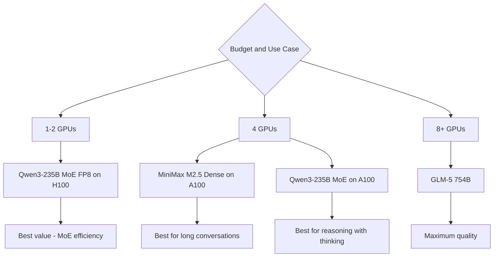

> 💡 **Quick Answer:** Deploy MiniMax M2.5 (229B parameters) with vLLM using `--tensor-parallel-size 4` on 4x A100 80GB. A strong large-scale LLM with 485K+ downloads, optimized for long multi-turn conversations and complex reasoning tasks.

## The Problem

Large-scale LLMs in the 200B+ range offer significantly better reasoning than smaller models, but:

- **GPU cost** — 229B in FP16 needs ~460GB VRAM
- **Serving efficiency** — must maximize throughput across multiple GPUs
- **Long conversations** — multi-turn context needs efficient KV cache management
- **Competition** — how does M2.5 compare to Qwen3-235B, Llama, and GPT-4?

MiniMax M2.5 (485K downloads, 1.17K likes) is a strong contender in the 200B+ open model space.

## The Solution

### Deploy MiniMax M2.5

```yaml
apiVersion: apps/v1
kind: Deployment
metadata:
  name: minimax-m25
  namespace: ai-inference
  labels:
    app: minimax-m25
spec:
  replicas: 1
  selector:
    matchLabels:
      app: minimax-m25
  template:
    metadata:
      labels:
        app: minimax-m25
    spec:
      containers:
        - name: vllm
          image: vllm/vllm-openai:latest
          args:
            - "--model"
            - "MiniMaxAI/MiniMax-M2.5"
            - "--tensor-parallel-size"
            - "4"
            - "--max-model-len"
            - "32768"
            - "--gpu-memory-utilization"
            - "0.92"
            - "--max-num-seqs"
            - "16"
            - "--enable-chunked-prefill"
            - "--trust-remote-code"
            - "--port"
            - "8000"
          ports:
            - containerPort: 8000
          env:
            - name: HUGGING_FACE_HUB_TOKEN
              valueFrom:
                secretKeyRef:
                  name: huggingface-token
                  key: token
            - name: NCCL_DEBUG
              value: "WARN"
          resources:
            limits:
              nvidia.com/gpu: "4"
              memory: 192Gi
              cpu: "32"
          volumeMounts:
            - name: model-cache
              mountPath: /root/.cache/huggingface
            - name: shm
              mountPath: /dev/shm
          startupProbe:
            httpGet:
              path: /health
              port: 8000
            initialDelaySeconds: 300
            periodSeconds: 30
            failureThreshold: 30
          readinessProbe:
            httpGet:
              path: /health
              port: 8000
            periodSeconds: 15
      volumes:
        - name: model-cache
          persistentVolumeClaim:
            claimName: minimax-model-cache
        - name: shm
          emptyDir:
            medium: Memory
            sizeLimit: 32Gi
      terminationGracePeriodSeconds: 120
---
apiVersion: v1
kind: Service
metadata:
  name: minimax-m25
  namespace: ai-inference
spec:
  selector:
    app: minimax-m25
  ports:
    - port: 8000
      targetPort: 8000
```

### FP8 on H100 (2 GPUs)

```yaml
args:
  - "--model"
  - "MiniMaxAI/MiniMax-M2.5"
  - "--tensor-parallel-size"
  - "2"
  - "--quantization"
  - "fp8"
  - "--max-model-len"
  - "32768"
  - "--trust-remote-code"
resources:
  limits:
    nvidia.com/gpu: "2"
nodeSelector:
  nvidia.com/gpu.product: "H100-SXM"
```

### 200B+ Model Landscape

```text
| Model              | Params | Type  | GPUs (FP16)  | Downloads | Focus           |
|--------------------|--------|-------|-------------|-----------|-----------------|
| MiniMax M2.5       | 229B   | Dense | 4x A100 80GB| 485K      | Long context    |
| Qwen3-235B-A22B    | 235B   | MoE   | 4x A100 80GB| 1.66M     | Thinking mode   |
| GLM-5              | 754B   | Dense | 8x H100     | 251K      | Frontier        |
| Kimi-K2.5          | 1.1T   | MoE   | 16x H100    | 2.69M     | Ultra frontier  |
```



## Common Issues

### Dense 229B vs MoE 235B

```bash
# MiniMax M2.5 is DENSE — all 229B parameters active per token
# Qwen3-235B-A22B is MoE — only 22B active
# Same GPU count, but:
# - MiniMax: slower inference, all parameters used → potentially deeper reasoning
# - Qwen3 MoE: faster inference, broader but sparser knowledge
```

### Memory for long multi-turn conversations

```bash
# Long conversations accumulate KV cache
# With 229B dense model + 32K context, KV cache is substantial
--max-num-seqs 8   # Reduce concurrency for longer conversations
--max-model-len 16384  # Cap context if memory constrained
```

## Best Practices

- **4x A100 80GB** at FP16, or **2x H100** with FP8
- **Dense advantage** — all parameters active means deeper per-token reasoning
- **NVMe PVC** — ~460GB model weights, fast storage essential
- **Generous shared memory** — 32Gi `/dev/shm` for 4-GPU NCCL
- **Compare against Qwen3 MoE** — benchmark both for your use case

## Key Takeaways

- MiniMax M2.5 is a **229B dense model** — all parameters active per token
- Requires **4x A100 80GB** (FP16) or **2x H100** (FP8)
- **485K+ downloads** — strong community adoption
- Best for **long multi-turn conversations** and complex reasoning
- Dense vs MoE trade-off: deeper reasoning per token vs faster throughput
