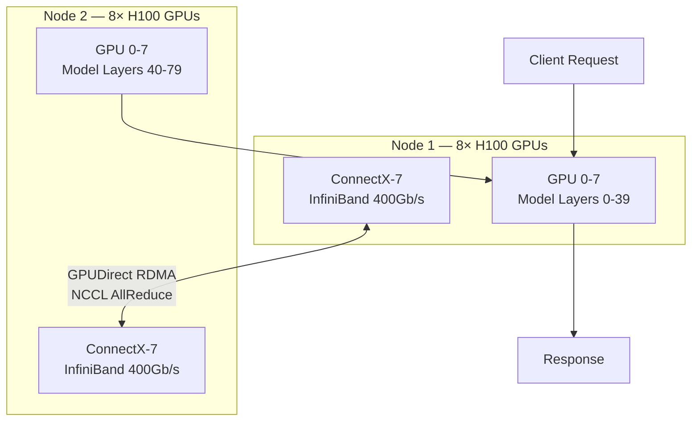

> 💡 **Quick Answer:** Multinode NIM deploys models too large for a single node (like DeepSeek-R1 671B or Llama 3.1 405B) across multiple GPU nodes using tensor parallelism over NCCL + InfiniBand. Deploy as a Kubernetes LeaderWorkerSet or paired Jobs with RDMA networking for optimal performance.

## The Problem

Some large language models exceed the GPU memory available on a single node. Even a node with 8×H100 80GB (640GB total) cannot fit models like DeepSeek-R1 (671B parameters, MoE architecture) or the full-precision Llama 3.1 405B in memory. You need to split the model across multiple nodes while maintaining the low-latency inter-GPU communication required for inference.



## The Solution

### Prerequisites

Before deploying multinode NIM, ensure your cluster has:

1. **NVIDIA GPU Operator** with open kernel modules (`useOpenKernelModules: true`)
2. **Network Operator** with InfiniBand or RoCE support
3. **GPUDirect RDMA** enabled (DMA-BUF export)
4. **SR-IOV** configured for network isolation (optional but recommended)
5. **NFD (Node Feature Discovery)** labeling GPU nodes

```bash
# Verify GPU nodes are ready
kubectl get nodes -l nvidia.com/gpu.present=true

# Verify GPUDirect RDMA is functional
kubectl exec -it gpu-test-pod -- nvidia-smi topo -m
# Look for NV12 (NVLink) between local GPUs
# Look for SYS (cross-node) connections

# Verify NCCL can use RDMA
kubectl exec -it gpu-test-pod -- \
  bash -c 'ls /dev/infiniband/uverbs* 2>/dev/null && echo "RDMA devices available"'
```

### Which NIM Models Support Multinode?

Models that support multinode inference on NVIDIA NGC NIM:

| Model | Parameters | Architecture | Min GPUs | Why Multinode |
|-------|-----------|--------------|----------|---------------|
| DeepSeek-R1 | 671B | MoE | 16× H100 | Active params exceed single-node memory |
| Llama 3.1 405B | 405B | Dense | 16× H100 | Full model > 640GB at FP16 |
| Nemotron-4 340B | 340B | Dense | 16× H100 | Dense architecture, large KV cache |
| Mixtral 8x22B | 176B | MoE | 16× H100 | MoE routing + expert memory |
| DBRX | 132B | MoE | 16× H100 | Expert parallelism across nodes |

> Check the NGC catalog for the current list — filter by **Multinode Support: Yes** on any NIM container page.

### Understanding Tensor Parallelism Across Nodes

NIM uses **tensor parallelism (TP)** to split model layers across GPUs. Within a node, GPUs communicate via NVLink. Across nodes, NCCL uses InfiniBand with GPUDirect RDMA for direct GPU-to-GPU data transfer.

```
┌─────────────────────────────────────────────┐
│            Tensor Parallelism               │
│                                             │
│  TP Rank 0-7 (Node 1, GPUs 0-7)            │
│       ↕ NVLink (900 GB/s)                  │
│  TP Rank 0-7 communicate locally            │
│                                             │
│       ↕ InfiniBand (400 Gb/s)              │
│       ↕ GPUDirect RDMA (zero-copy)         │
│                                             │
│  TP Rank 8-15 (Node 2, GPUs 0-7)           │
│       ↕ NVLink (900 GB/s)                  │
│  TP Rank 8-15 communicate locally           │
└─────────────────────────────────────────────┘
```

### Method 1: LeaderWorkerSet (Recommended)

The LeaderWorkerSet API is the cleanest way to deploy multinode NIM on Kubernetes:

```yaml
apiVersion: leaderworkerset.x-k8s.io/v1
kind: LeaderWorkerSet
metadata:
  name: deepseek-r1-nim
  namespace: ai-inference
  labels:
    app: deepseek-r1
spec:
  replicas: 1
  leaderWorkerTemplate:
    size: 2  # 2 nodes total
    restartPolicy: RecreateGroupOnPodRestart
    leaderTemplate:
      metadata:
        labels:
          role: leader
      spec:
        containers:
          - name: nim
            image: nvcr.io/nim/deepseek-ai/deepseek-r1:1.7.3
            env:
              - name: NIM_TENSOR_PARALLEL_SIZE
                value: "16"  # 8 GPUs × 2 nodes
              - name: NIM_PIPELINE_PARALLEL_SIZE
                value: "1"
              - name: NCCL_IB_HCA
                value: "mlx5"
              - name: NCCL_IB_GID_INDEX
                value: "3"
              - name: NCCL_NET_GDR_LEVEL
                value: "SYS"
              - name: NCCL_P2P_LEVEL
                value: "SYS"
              - name: NCCL_DEBUG
                value: "INFO"
              - name: NIM_LEADER_ADDRESS
                valueFrom:
                  fieldRef:
                    fieldPath: metadata.name
              - name: NIM_NUM_NODES
                value: "2"
              - name: NIM_NODE_RANK
                value: "0"
            ports:
              - containerPort: 8000
                name: http
            resources:
              limits:
                nvidia.com/gpu: "8"
                # Request RDMA device if using SR-IOV
                # nvidia.com/rdma_shared_device: "1"
              requests:
                nvidia.com/gpu: "8"
                cpu: "32"
                memory: "256Gi"
            volumeMounts:
              - name: model-cache
                mountPath: /opt/nim/.cache
              - name: shm
                mountPath: /dev/shm
        volumes:
          - name: model-cache
            persistentVolumeClaim:
              claimName: nim-model-cache
          - name: shm
            emptyDir:
              medium: Memory
              sizeLimit: 64Gi
        nodeSelector:
          nvidia.com/gpu.product: NVIDIA-H100-80GB-HBM3
        tolerations:
          - key: nvidia.com/gpu
            operator: Exists
            effect: NoSchedule
    workerTemplate:
      metadata:
        labels:
          role: worker
      spec:
        containers:
          - name: nim
            image: nvcr.io/nim/deepseek-ai/deepseek-r1:1.7.3
            env:
              - name: NIM_TENSOR_PARALLEL_SIZE
                value: "16"
              - name: NIM_PIPELINE_PARALLEL_SIZE
                value: "1"
              - name: NCCL_IB_HCA
                value: "mlx5"
              - name: NCCL_IB_GID_INDEX
                value: "3"
              - name: NCCL_NET_GDR_LEVEL
                value: "SYS"
              - name: NCCL_P2P_LEVEL
                value: "SYS"
              - name: NIM_LEADER_ADDRESS
                value: "$(LWS_LEADER_ADDRESS)"
              - name: NIM_NUM_NODES
                value: "2"
              - name: NIM_NODE_RANK
                value: "1"
            resources:
              limits:
                nvidia.com/gpu: "8"
              requests:
                nvidia.com/gpu: "8"
                cpu: "32"
                memory: "256Gi"
            volumeMounts:
              - name: model-cache
                mountPath: /opt/nim/.cache
              - name: shm
                mountPath: /dev/shm
        volumes:
          - name: model-cache
            persistentVolumeClaim:
              claimName: nim-model-cache
          - name: shm
            emptyDir:
              medium: Memory
              sizeLimit: 64Gi
        nodeSelector:
          nvidia.com/gpu.product: NVIDIA-H100-80GB-HBM3
        tolerations:
          - key: nvidia.com/gpu
            operator: Exists
            effect: NoSchedule
```

Install LeaderWorkerSet if not already present:

```bash
kubectl apply --server-side -f \
  https://github.com/kubernetes-sigs/lws/releases/latest/download/default.yaml
```

### Method 2: Paired Kubernetes Jobs with Indexed Completion

For clusters without LeaderWorkerSet:

```yaml
apiVersion: v1
kind: Service
metadata:
  name: deepseek-r1-headless
  namespace: ai-inference
spec:
  clusterIP: None
  selector:
    job-name: deepseek-r1-multinode
  ports:
    - port: 29500
      name: nccl
---
apiVersion: batch/v1
kind: Job
metadata:
  name: deepseek-r1-multinode
  namespace: ai-inference
spec:
  completions: 2
  parallelism: 2
  completionMode: Indexed
  template:
    metadata:
      labels:
        app: deepseek-r1
    spec:
      subdomain: deepseek-r1-headless
      containers:
        - name: nim
          image: nvcr.io/nim/deepseek-ai/deepseek-r1:1.7.3
          env:
            - name: NIM_TENSOR_PARALLEL_SIZE
              value: "16"
            - name: NIM_NUM_NODES
              value: "2"
            - name: NIM_NODE_RANK
              valueFrom:
                fieldRef:
                  fieldPath: metadata.annotations['batch.kubernetes.io/job-completion-index']
            - name: NIM_LEADER_ADDRESS
              value: "deepseek-r1-multinode-0.deepseek-r1-headless"
            - name: NCCL_IB_HCA
              value: "mlx5"
            - name: NCCL_NET_GDR_LEVEL
              value: "SYS"
            - name: NCCL_SOCKET_IFNAME
              value: "eth0"
          ports:
            - containerPort: 8000
              name: http
            - containerPort: 29500
              name: nccl
          resources:
            limits:
              nvidia.com/gpu: "8"
            requests:
              cpu: "32"
              memory: "256Gi"
          volumeMounts:
            - name: shm
              mountPath: /dev/shm
      volumes:
        - name: shm
          emptyDir:
            medium: Memory
            sizeLimit: 64Gi
      nodeSelector:
        nvidia.com/gpu.product: NVIDIA-H100-80GB-HBM3
      tolerations:
        - key: nvidia.com/gpu
          operator: Exists
          effect: NoSchedule
      restartPolicy: Never
```

### Service for Inference Endpoint

Expose only the leader node (rank 0) for inference requests:

```yaml
apiVersion: v1
kind: Service
metadata:
  name: deepseek-r1-inference
  namespace: ai-inference
spec:
  selector:
    app: deepseek-r1
    role: leader  # Only route to leader
  ports:
    - port: 8000
      targetPort: 8000
      protocol: TCP
  type: ClusterIP
---
apiVersion: networking.k8s.io/v1
kind: Ingress
metadata:
  name: deepseek-r1-ingress
  namespace: ai-inference
  annotations:
    nginx.ingress.kubernetes.io/proxy-read-timeout: "300"
    nginx.ingress.kubernetes.io/proxy-send-timeout: "300"
spec:
  rules:
    - host: deepseek-r1.ai.example.com
      http:
        paths:
          - path: /
            pathType: Prefix
            backend:
              service:
                name: deepseek-r1-inference
                port:
                  number: 8000
```

### NCCL Environment Variables Explained

```yaml
env:
  # Which InfiniBand HCA to use (mlx5 = ConnectX-6/7)
  - name: NCCL_IB_HCA
    value: "mlx5"

  # GID index for RoCE (usually 3 for RoCEv2)
  - name: NCCL_IB_GID_INDEX
    value: "3"

  # Enable GPUDirect RDMA at system level (cross-node)
  - name: NCCL_NET_GDR_LEVEL
    value: "SYS"

  # Enable P2P across system (not just NVLink)
  - name: NCCL_P2P_LEVEL
    value: "SYS"

  # Network interface for out-of-band control
  - name: NCCL_SOCKET_IFNAME
    value: "eth0"

  # Debug logging (INFO for setup, WARN for production)
  - name: NCCL_DEBUG
    value: "INFO"

  # Disable IB if using RoCE only
  # - name: NCCL_IB_DISABLE
  #   value: "0"
```

### Verify Multinode Communication

```bash
# Check NCCL initialization in leader logs
kubectl logs -f deepseek-r1-nim-0 -n ai-inference | grep -i nccl
# Expected:
# NCCL INFO Bootstrap: Using eth0:10.244.1.5<0>
# NCCL INFO Channel 00 : 0[0] -> 1[1] via NET/IB/0
# NCCL INFO Connected all rings
# NCCL INFO 16 coll channels, 16 nvls channels, ...

# Verify all ranks joined
kubectl logs -f deepseek-r1-nim-0 -n ai-inference | grep "rank"
# Expected: All 16 ranks initialized

# Test inference
curl -s http://deepseek-r1-inference.ai-inference.svc:8000/v1/chat/completions \
  -H "Content-Type: application/json" \
  -d '{
    "model": "deepseek-ai/deepseek-r1",
    "messages": [{"role": "user", "content": "Hello"}],
    "max_tokens": 64
  }' | jq .choices[0].message.content
```

### Model Cache with Shared PVC

For multinode, both nodes need access to the model weights. Use ReadWriteMany storage:

```yaml
apiVersion: v1
kind: PersistentVolumeClaim
metadata:
  name: nim-model-cache
  namespace: ai-inference
spec:
  accessModes:
    - ReadWriteMany  # Both nodes read the model
  resources:
    requests:
      storage: 500Gi  # DeepSeek-R1 is ~300GB on disk
  storageClassName: cephfs  # Or any RWX-capable StorageClass
```

Alternatively, use an init container to download the model to local NVMe on each node:

```yaml
initContainers:
  - name: model-download
    image: nvcr.io/nim/deepseek-ai/deepseek-r1:1.7.3
    command: ["nim-download-model"]
    env:
      - name: NIM_CACHE_PATH
        value: /cache
    volumeMounts:
      - name: local-cache
        mountPath: /cache
volumes:
  - name: local-cache
    emptyDir:
      sizeLimit: 500Gi
```

## Common Issues

| Issue | Cause | Fix |
|-------|-------|-----|
| NCCL timeout during init | Nodes can't reach each other on NCCL port | Ensure headless Service covers port 29500, check NetworkPolicy |
| `NCCL WARN Connect to ... failed` | InfiniBand not configured or RDMA unavailable | Verify `ibstat`, check GPU Operator ClusterPolicy has RDMA enabled |
| OOM on single node | TP size too small for model | Increase to 16 (2 nodes) or 24 (3 nodes) |
| Slow inference despite multinode | Falling back to TCP instead of RDMA | Check `NCCL_DEBUG=INFO` logs for `NET/Socket` vs `NET/IB` — should be IB |
| Worker can't find leader | DNS not resolving headless service | Wait for both pods to be Running, verify `nslookup` from worker |
| `GPUDirect RDMA not available` | Open kernel modules not loaded | Set `useOpenKernelModules: true` in ClusterPolicy |
| Asymmetric GPU topology | Nodes have different GPU/NIC affinity | Use `nvidia-smi topo -m` to verify, pin NCCL to correct HCA |

## Best Practices

- **Use InfiniBand over RoCE** when available — lower latency, higher bandwidth, no PFC tuning needed
- **Pin NCCL to the correct HCA** — `NCCL_IB_HCA=mlx5_0` avoids NCCL probing all devices
- **Size /dev/shm generously** — NCCL uses shared memory for local GPU communication; 64Gi minimum
- **Use LeaderWorkerSet** over raw Jobs — automatic leader election, coordinated restarts, cleaner lifecycle
- **Monitor with DCGM** — track NVLink/IB bandwidth utilization per GPU during inference
- **Pre-pull images** — NIM containers are 10-15GB; use DaemonSets to pre-pull on GPU nodes
- **Test NCCL standalone first** — run `nccl-tests` (allreduce) across nodes before deploying NIM

## Key Takeaways

- Multinode NIM is required for models exceeding single-node GPU memory (DeepSeek-R1 671B, Llama 405B, Nemotron 340B)
- Tensor parallelism splits model layers across all GPUs on all nodes — NCCL handles the AllReduce communication
- GPUDirect RDMA over InfiniBand is essential for acceptable cross-node latency
- Deploy with LeaderWorkerSet for production or Indexed Jobs for simpler setups
- The full NVIDIA stack (GPU Operator + Network Operator + SR-IOV) must be in place before multinode NIM works
