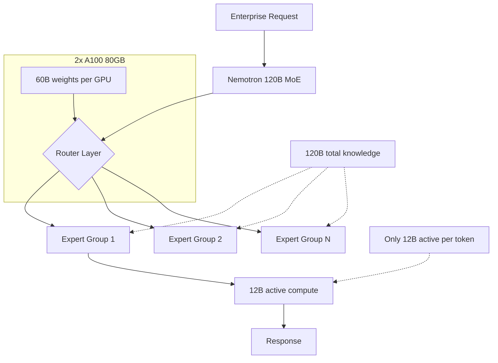

> 💡 **Quick Answer:** Deploy NVIDIA Nemotron-3-Super-120B-A12B with vLLM using `--tensor-parallel-size 2` on 2x A100 80GB. A MoE model with 120B total parameters and 12B active per token — enterprise-grade quality at efficient inference cost. Built by NVIDIA for production AI workloads.

## The Problem

Enterprise AI deployments need:

- **Frontier-quality reasoning** — matching or exceeding GPT-4 on enterprise benchmarks
- **Efficient inference** — can't justify 8-GPU clusters for every deployment
- **NVIDIA-optimized** — best performance on NVIDIA hardware with native TensorRT-LLM support
- **Open weights** — no API dependency, run on your own infrastructure

Nemotron-3-Super-120B-A12B delivers GPT-4-class quality with only 12B parameters active per token.

## The Solution

### Step 1: Deploy with vLLM

```yaml
apiVersion: apps/v1
kind: Deployment
metadata:
  name: nemotron-120b
  namespace: ai-inference
  labels:
    app: nemotron-120b
spec:
  replicas: 1
  selector:
    matchLabels:
      app: nemotron-120b
  template:
    metadata:
      labels:
        app: nemotron-120b
    spec:
      containers:
        - name: vllm
          image: vllm/vllm-openai:latest
          args:
            - "--model"
            - "nvidia/NVIDIA-Nemotron-3-Super-120B-A12B-BF16"
            - "--tensor-parallel-size"
            - "2"
            - "--max-model-len"
            - "32768"
            - "--gpu-memory-utilization"
            - "0.92"
            - "--max-num-seqs"
            - "32"
            - "--enable-chunked-prefill"
            - "--trust-remote-code"
            - "--dtype"
            - "bfloat16"
            - "--port"
            - "8000"
          ports:
            - containerPort: 8000
              name: http
          env:
            - name: HUGGING_FACE_HUB_TOKEN
              valueFrom:
                secretKeyRef:
                  name: huggingface-token
                  key: token
            - name: NCCL_DEBUG
              value: "WARN"
          resources:
            limits:
              nvidia.com/gpu: "2"
              memory: 128Gi
              cpu: "16"
            requests:
              memory: 96Gi
              cpu: "8"
          volumeMounts:
            - name: model-cache
              mountPath: /root/.cache/huggingface
            - name: shm
              mountPath: /dev/shm
          startupProbe:
            httpGet:
              path: /health
              port: 8000
            initialDelaySeconds: 300
            periodSeconds: 30
            failureThreshold: 30
          readinessProbe:
            httpGet:
              path: /health
              port: 8000
            periodSeconds: 15
          livenessProbe:
            httpGet:
              path: /health
              port: 8000
            periodSeconds: 30
      volumes:
        - name: model-cache
          persistentVolumeClaim:
            claimName: nemotron-model-cache
        - name: shm
          emptyDir:
            medium: Memory
            sizeLimit: 16Gi
      terminationGracePeriodSeconds: 120
---
apiVersion: v1
kind: Service
metadata:
  name: nemotron-120b
  namespace: ai-inference
spec:
  selector:
    app: nemotron-120b
  ports:
    - port: 8000
      targetPort: 8000
      name: http
```

### Step 2: FP8 on H100 (Single GPU Possible)

```yaml
apiVersion: apps/v1
kind: Deployment
metadata:
  name: nemotron-120b-fp8
  namespace: ai-inference
spec:
  replicas: 1
  selector:
    matchLabels:
      app: nemotron-120b-fp8
  template:
    metadata:
      labels:
        app: nemotron-120b-fp8
    spec:
      containers:
        - name: vllm
          image: vllm/vllm-openai:latest
          args:
            - "--model"
            - "nvidia/NVIDIA-Nemotron-3-Super-120B-A12B-BF16"
            - "--quantization"
            - "fp8"
            - "--tensor-parallel-size"
            - "1"
            - "--max-model-len"
            - "16384"
            - "--gpu-memory-utilization"
            - "0.95"
            - "--max-num-seqs"
            - "16"
            - "--trust-remote-code"
          resources:
            limits:
              nvidia.com/gpu: "1"
              memory: 96Gi
              cpu: "8"
      nodeSelector:
        nvidia.com/gpu.product: "H100-SXM"
```

### Step 3: Test Enterprise Workloads

```bash
# Complex reasoning task
kubectl run test-nemotron --rm -it --image=curlimages/curl -- \
  curl -s http://nemotron-120b:8000/v1/chat/completions \
  -H "Content-Type: application/json" \
  -d '{
    "model": "nvidia/NVIDIA-Nemotron-3-Super-120B-A12B-BF16",
    "messages": [
      {"role": "system", "content": "You are an enterprise Kubernetes architect."},
      {"role": "user", "content": "Design a multi-region, active-active Kubernetes platform for a financial services company with requirements: <100ms API latency, 99.99% uptime, SOC 2 compliance, and support for 10,000 microservices. Include networking, security, observability, and disaster recovery architecture."}
    ],
    "max_tokens": 4096,
    "temperature": 0.3
  }'
```

### NVIDIA MoE Model Landscape

```text
| Model                       | Total  | Active | GPUs (BF16) | Use Case            |
|-----------------------------|--------|--------|-------------|---------------------|
| Nemotron-3-Super-120B-A12B  | 124B   | 12B    | 2x A100 80GB| Enterprise, reasoning|
| Qwen3-235B-A22B             | 235B   | 22B    | 4x A100 80GB| Frontier, thinking  |
| Qwen3.5-35B-A3B             | 36B    | 3B     | 1x A100 40GB| Efficient multimodal|
| Mixtral-8x7B                | 47B    | 13B    | 1x A100 80GB| General purpose     |
```



## Common Issues

### Model loading takes 15+ minutes

```yaml
# 120B model in BF16 is ~240GB — loading from network storage is slow
# Use NVMe-backed PVC
startupProbe:
  failureThreshold: 30  # 30 × 30s = 15 minutes
  periodSeconds: 30
```

### NCCL errors with tensor parallelism

```yaml
env:
  - name: NCCL_SOCKET_IFNAME
    value: "eth0"
  - name: NCCL_DEBUG
    value: "INFO"  # Change to INFO for debugging
# Ensure /dev/shm is large enough (16Gi for 2 GPUs)
```

### BF16 vs FP16

```bash
# Nemotron is trained in BF16 — use --dtype bfloat16
# FP16 may cause numerical issues with large MoE models
# BF16 has wider dynamic range, better for MoE routing
```

## Best Practices

- **BF16 precision** — Nemotron is trained in BF16, use `--dtype bfloat16`
- **2x A100 80GB minimum** — all 120B parameters must fit in VRAM
- **FP8 on H100** — potentially fits on single H100 80GB with reduced context
- **NVIDIA ecosystem** — pairs well with TensorRT-LLM, NIM, and Triton
- **Enterprise use cases** — designed for complex reasoning, code gen, and analysis
- **Large `/dev/shm`** — 16Gi for NCCL multi-GPU communication

## Key Takeaways

- Nemotron-3-Super-120B-A12B: **120B total, 12B active** — enterprise MoE by NVIDIA
- Requires **2x A100 80GB** (BF16) or potentially **1x H100** (FP8)
- Built for **enterprise workloads** — complex reasoning, architecture design, code generation
- **NVIDIA-optimized** — best performance on NVIDIA GPUs with native TensorRT-LLM support
- MoE architecture: **10x the knowledge** of a 12B dense model at similar inference cost
- Use `--dtype bfloat16` — trained in BF16, don't convert to FP16
