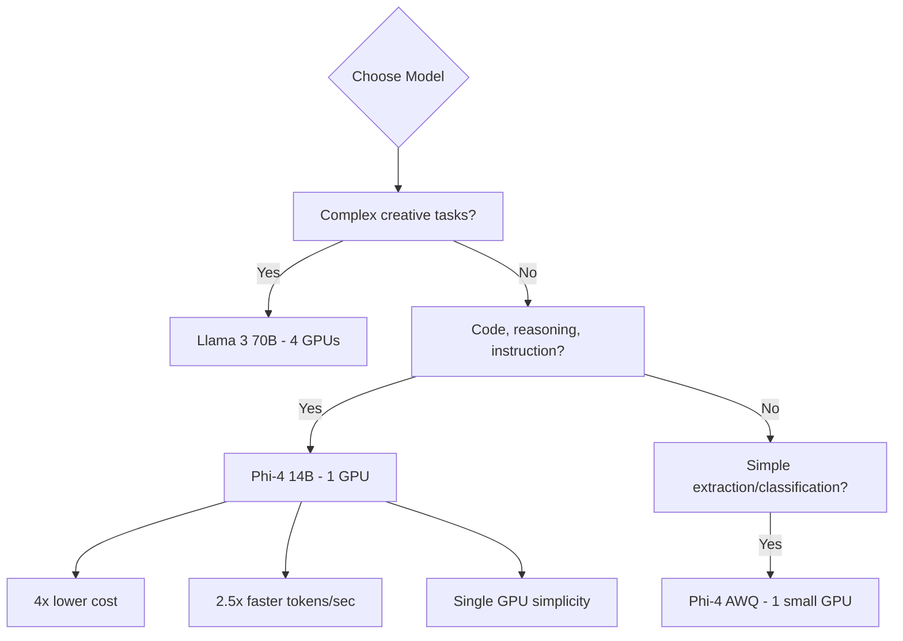

> 💡 **Quick Answer:** Deploy Phi-4 (14B parameters) with vLLM on a single A100 or L40S GPU. It fits in ~28GB VRAM at FP16, delivers reasoning quality comparable to much larger models, and serves 30+ concurrent users. Use AWQ for single-GPU deployment on 24GB cards.

## The Problem

Large language models (70B+) are expensive and require multi-GPU setups. For many use cases — code generation, reasoning, instruction following — a smaller, high-quality model is more efficient:

- **Phi-4** — 14B parameters, trained on high-quality synthetic data
- **Single GPU** — fits on one A100 40GB or L40S 48GB
- **Cost effective** — 1 GPU instead of 4-8, same quality for structured tasks
- **Lower latency** — smaller model = faster token generation

## The Solution

### Step 1: Deploy Phi-4 with vLLM

```yaml
apiVersion: apps/v1
kind: Deployment
metadata:
  name: phi4
  namespace: ai-inference
  labels:
    app: phi4
spec:
  replicas: 1
  selector:
    matchLabels:
      app: phi4
  template:
    metadata:
      labels:
        app: phi4
    spec:
      containers:
        - name: vllm
          image: vllm/vllm-openai:latest
          args:
            - "--model"
            - "microsoft/phi-4"
            - "--max-model-len"
            - "16384"
            - "--gpu-memory-utilization"
            - "0.90"
            - "--max-num-seqs"
            - "64"
            - "--enable-chunked-prefill"
            - "--trust-remote-code"
            - "--port"
            - "8000"
          ports:
            - containerPort: 8000
              name: http
          env:
            - name: HUGGING_FACE_HUB_TOKEN
              valueFrom:
                secretKeyRef:
                  name: huggingface-token
                  key: token
          resources:
            limits:
              nvidia.com/gpu: "1"
              memory: 48Gi
              cpu: "8"
            requests:
              memory: 32Gi
              cpu: "4"
          volumeMounts:
            - name: model-cache
              mountPath: /root/.cache/huggingface
            - name: shm
              mountPath: /dev/shm
          startupProbe:
            httpGet:
              path: /health
              port: 8000
            initialDelaySeconds: 120
            periodSeconds: 15
            failureThreshold: 20
          readinessProbe:
            httpGet:
              path: /health
              port: 8000
            periodSeconds: 10
          livenessProbe:
            httpGet:
              path: /health
              port: 8000
            periodSeconds: 30
      volumes:
        - name: model-cache
          persistentVolumeClaim:
            claimName: phi4-model-cache
        - name: shm
          emptyDir:
            medium: Memory
            sizeLimit: 4Gi
---
apiVersion: v1
kind: Service
metadata:
  name: phi4
  namespace: ai-inference
spec:
  selector:
    app: phi4
  ports:
    - port: 8000
      targetPort: 8000
      name: http
```

### Step 2: AWQ Quantized (24GB GPUs)

```yaml
apiVersion: apps/v1
kind: Deployment
metadata:
  name: phi4-awq
  namespace: ai-inference
spec:
  replicas: 1
  selector:
    matchLabels:
      app: phi4-awq
  template:
    metadata:
      labels:
        app: phi4-awq
    spec:
      containers:
        - name: vllm
          image: vllm/vllm-openai:latest
          args:
            - "--model"
            - "microsoft/phi-4"
            - "--quantization"
            - "awq"
            - "--max-model-len"
            - "16384"
            - "--gpu-memory-utilization"
            - "0.90"
            - "--max-num-seqs"
            - "128"
            - "--trust-remote-code"
          resources:
            limits:
              nvidia.com/gpu: "1"
              memory: 32Gi
              cpu: "4"
```

### Step 3: Phi-4 for Code Generation

```bash
# Phi-4 excels at code generation and reasoning
kubectl run test-phi4 --rm -it --image=curlimages/curl -- \
  curl -s http://phi4:8000/v1/chat/completions \
  -H "Content-Type: application/json" \
  -d '{
    "model": "microsoft/phi-4",
    "messages": [
      {
        "role": "system",
        "content": "You are a Kubernetes expert. Write production-ready YAML."
      },
      {
        "role": "user",
        "content": "Create a HPA that scales based on custom Prometheus metrics for request latency P99 > 500ms"
      }
    ],
    "max_tokens": 1024,
    "temperature": 0.3
  }'
```

### Step 4: Autoscaling with HPA

```yaml
apiVersion: autoscaling/v2
kind: HorizontalPodAutoscaler
metadata:
  name: phi4-hpa
  namespace: ai-inference
spec:
  scaleTargetRef:
    apiVersion: apps/v1
    kind: Deployment
    name: phi4
  minReplicas: 1
  maxReplicas: 4
  metrics:
    - type: Pods
      pods:
        metric:
          name: vllm_num_requests_running
        target:
          type: AverageValue
          averageValue: "30"
  behavior:
    scaleUp:
      stabilizationWindowSeconds: 60
      policies:
        - type: Pods
          value: 1
          periodSeconds: 120
    scaleDown:
      stabilizationWindowSeconds: 300
      policies:
        - type: Pods
          value: 1
          periodSeconds: 300
```

### Phi-4 vs Larger Models: When to Choose

```text
| Use Case              | Phi-4 (14B)  | Llama 3 70B  |
|-----------------------|--------------|--------------|
| Code generation       | Excellent    | Excellent    |
| Math/reasoning        | Very good    | Excellent    |
| Creative writing      | Good         | Excellent    |
| Instruction following | Excellent    | Excellent    |
| GPUs required         | 1x A100      | 4x A100      |
| Tokens/sec (c=32)     | ~2000        | ~800         |
| Cost/month (cloud)    | ~$2k         | ~$8k         |
```



## Common Issues

### `trust-remote-code` required

```yaml
# Phi-4 uses custom model code from HuggingFace
# vLLM needs --trust-remote-code flag
args:
  - "--trust-remote-code"
```

### OOM on 24GB GPU

```bash
# FP16 Phi-4 needs ~28GB — too large for 24GB cards
# Options:
# 1. AWQ quantization (~8GB)
# 2. Reduce max_model_len
--max-model-len 8192  # instead of 16384
# 3. Lower gpu-memory-utilization
--gpu-memory-utilization 0.85
```

### Slow first response

```bash
# vLLM compiles CUDA graphs on first requests
# This is normal — subsequent requests are fast
# Increase startup probe timeout:
startupProbe:
  failureThreshold: 30
  periodSeconds: 15
```

## Best Practices

- **Single GPU deployment** — Phi-4's 14B size is its biggest advantage over 70B models
- **AWQ for 24GB cards** — fits on RTX 4090, L4, or T4 with quantization
- **Long context** — Phi-4 supports 16K tokens, increase `--max-model-len` as needed
- **Code and reasoning tasks** — Phi-4 punches above its weight on structured tasks
- **PVC model cache** — ~28GB model files, avoid re-downloading
- **`--trust-remote-code`** — required for Phi-4's custom architecture

## Key Takeaways

- Phi-4 (14B) delivers **near-GPT-4 quality** for code, math, and reasoning on **1 GPU**
- **4x cheaper** than 70B models — one A100 instead of four
- **2.5x faster token generation** — smaller model = lower latency
- AWQ quantization fits on **24GB GPUs** (L4, RTX 4090) for even lower cost
- Best for **structured tasks** (code gen, instruction following, reasoning) — use larger models for creative writing
- Supports **16K context length** with chunked prefill for long documents
