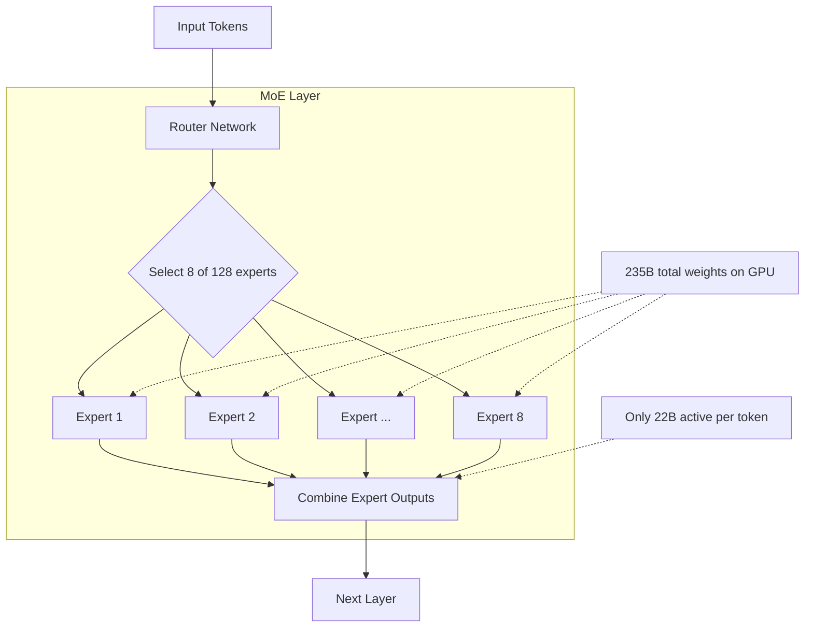

> 💡 **Quick Answer:** Deploy Qwen3-235B-A22B with vLLM using `--tensor-parallel-size 4` on 4x A100 80GB. Despite 235B total parameters, only 22B are active per token (MoE architecture), giving you 70B+ quality at near-8B inference speed. Use FP8 on H100 for optimal performance.

## The Problem

You want frontier-model quality (GPT-4 class) with open weights, but:

- Dense 70B models need 4 GPUs and are slower than you'd like
- 8B models are fast but lack reasoning depth
- **Mixture-of-Experts (MoE)** gives you the best of both — 235B total knowledge compressed into 22B active parameters per forward pass

Qwen3-235B-A22B is one of the largest open MoE models. Deploying it requires understanding MoE-specific memory, routing, and serving patterns.

## The Solution

### Step 1: Deploy Qwen3-235B-A22B with vLLM

```yaml
apiVersion: apps/v1
kind: Deployment
metadata:
  name: qwen3-235b
  namespace: ai-inference
  labels:
    app: qwen3-235b
spec:
  replicas: 1
  selector:
    matchLabels:
      app: qwen3-235b
  template:
    metadata:
      labels:
        app: qwen3-235b
    spec:
      containers:
        - name: vllm
          image: vllm/vllm-openai:latest
          args:
            - "--model"
            - "Qwen/Qwen3-235B-A22B"
            - "--tensor-parallel-size"
            - "4"
            - "--max-model-len"
            - "32768"
            - "--gpu-memory-utilization"
            - "0.92"
            - "--max-num-seqs"
            - "32"
            - "--enable-chunked-prefill"
            - "--trust-remote-code"
            - "--port"
            - "8000"
          ports:
            - containerPort: 8000
              name: http
          env:
            - name: HUGGING_FACE_HUB_TOKEN
              valueFrom:
                secretKeyRef:
                  name: huggingface-token
                  key: token
            - name: NCCL_DEBUG
              value: "WARN"
            - name: VLLM_WORKER_MULTIPROC_METHOD
              value: "spawn"
          resources:
            limits:
              nvidia.com/gpu: "4"
              memory: 128Gi
              cpu: "32"
            requests:
              memory: 96Gi
              cpu: "16"
          volumeMounts:
            - name: model-cache
              mountPath: /root/.cache/huggingface
            - name: shm
              mountPath: /dev/shm
          startupProbe:
            httpGet:
              path: /health
              port: 8000
            initialDelaySeconds: 300
            periodSeconds: 30
            failureThreshold: 30
          readinessProbe:
            httpGet:
              path: /health
              port: 8000
            periodSeconds: 15
          livenessProbe:
            httpGet:
              path: /health
              port: 8000
            periodSeconds: 30
            timeoutSeconds: 10
      volumes:
        - name: model-cache
          persistentVolumeClaim:
            claimName: qwen3-model-cache
        - name: shm
          emptyDir:
            medium: Memory
            sizeLimit: 32Gi
      terminationGracePeriodSeconds: 120
---
apiVersion: v1
kind: Service
metadata:
  name: qwen3-235b
  namespace: ai-inference
spec:
  selector:
    app: qwen3-235b
  ports:
    - port: 8000
      targetPort: 8000
      name: http
```

### Step 2: FP8 on H100 (Best Performance)

```yaml
apiVersion: apps/v1
kind: Deployment
metadata:
  name: qwen3-235b-fp8
  namespace: ai-inference
spec:
  replicas: 1
  selector:
    matchLabels:
      app: qwen3-235b-fp8
  template:
    metadata:
      labels:
        app: qwen3-235b-fp8
    spec:
      containers:
        - name: vllm
          image: vllm/vllm-openai:latest
          args:
            - "--model"
            - "Qwen/Qwen3-235B-A22B-FP8"
            - "--tensor-parallel-size"
            - "2"
            - "--max-model-len"
            - "65536"
            - "--gpu-memory-utilization"
            - "0.92"
            - "--max-num-seqs"
            - "64"
            - "--enable-chunked-prefill"
            - "--trust-remote-code"
          resources:
            limits:
              nvidia.com/gpu: "2"
              memory: 96Gi
              cpu: "16"
          volumeMounts:
            - name: shm
              mountPath: /dev/shm
      volumes:
        - name: shm
          emptyDir:
            medium: Memory
            sizeLimit: 16Gi
      nodeSelector:
        nvidia.com/gpu.product: "H100-SXM"
```

### Step 3: AWQ INT4 (Minimum GPUs)

```yaml
# Fit on 2x A100 80GB with INT4 quantization
apiVersion: apps/v1
kind: Deployment
metadata:
  name: qwen3-235b-awq
  namespace: ai-inference
spec:
  replicas: 1
  selector:
    matchLabels:
      app: qwen3-235b-awq
  template:
    metadata:
      labels:
        app: qwen3-235b-awq
    spec:
      containers:
        - name: vllm
          image: vllm/vllm-openai:latest
          args:
            - "--model"
            - "Qwen/Qwen3-235B-A22B-AWQ"
            - "--quantization"
            - "awq"
            - "--tensor-parallel-size"
            - "2"
            - "--max-model-len"
            - "32768"
            - "--gpu-memory-utilization"
            - "0.92"
            - "--max-num-seqs"
            - "32"
            - "--trust-remote-code"
          resources:
            limits:
              nvidia.com/gpu: "2"
              memory: 96Gi
```

### Step 4: Thinking Mode (Chain-of-Thought)

```bash
# Qwen3 supports thinking mode for complex reasoning
kubectl run test-qwen3 --rm -it --image=curlimages/curl -- \
  curl -s http://qwen3-235b:8000/v1/chat/completions \
  -H "Content-Type: application/json" \
  -d '{
    "model": "Qwen/Qwen3-235B-A22B",
    "messages": [
      {"role": "system", "content": "You are a Kubernetes security expert."},
      {"role": "user", "content": "Design a zero-trust network policy architecture for a multi-tenant Kubernetes cluster with 50 namespaces. Think step by step."}
    ],
    "max_tokens": 4096,
    "temperature": 0.7,
    "extra_body": {"chat_template_kwargs": {"enable_thinking": true}}
  }'

# Non-thinking mode for faster responses
curl -s http://qwen3-235b:8000/v1/chat/completions \
  -H "Content-Type: application/json" \
  -d '{
    "model": "Qwen/Qwen3-235B-A22B",
    "messages": [
      {"role": "user", "content": "List the 5 most important Kubernetes security best practices"}
    ],
    "max_tokens": 512,
    "temperature": 0.7
  }'
```

### MoE vs Dense Model Comparison

```text
| Model              | Total Params | Active Params | GPUs (FP16) | Tokens/sec |
|--------------------|-------------|---------------|-------------|------------|
| Llama 3.1 8B       | 8B          | 8B            | 1x A100     | ~3000      |
| Phi-4              | 14B         | 14B           | 1x A100     | ~2000      |
| Llama 2 70B        | 70B         | 70B           | 4x A100     | ~800       |
| Qwen3-235B-A22B    | 235B        | 22B           | 4x A100     | ~1500      |
| GPT-4 (estimated)  | ~1.8T       | ~220B         | N/A         | N/A        |
```



### GPU Memory Requirements

```text
| Configuration       | GPUs         | VRAM per GPU | Context  |
|---------------------|--------------|-------------|----------|
| FP16, 4x A100 80GB  | 4x A100 80GB | ~55GB each  | 32K      |
| FP8, 2x H100 80GB   | 2x H100 80GB | ~60GB each  | 64K      |
| AWQ, 2x A100 80GB   | 2x A100 80GB | ~55GB each  | 32K      |
| FP16, 8x A100 40GB  | 8x A100 40GB | ~30GB each  | 32K      |
```

## Common Issues

### Model loading takes 20+ minutes

```yaml
# 235B model is ~440GB in FP16 — loading from network storage is slow
# Use local NVMe PVC or pre-pull model
# Startup probe must be generous:
startupProbe:
  failureThreshold: 40  # 40 × 30s = 20 minutes
  periodSeconds: 30
```

### Expert load imbalance causes GPU hotspots

```bash
# MoE routing isn't perfectly uniform — some GPUs work harder
# Tensor parallelism distributes experts across GPUs
# Monitor per-GPU utilization:
nvidia-smi dmon -s u -d 5

# If imbalanced, increase tensor-parallel-size to spread experts
```

### OOM with long context

```bash
# MoE models need extra memory for all expert weights
# even though only 22B are active — all 235B must be in VRAM
# Reduce context length or concurrency:
--max-model-len 16384 --max-num-seqs 16
```

### Shared memory too small

```yaml
# NCCL needs large /dev/shm for multi-GPU
# 32Gi recommended for 4-GPU MoE
volumes:
  - name: shm
    emptyDir:
      medium: Memory
      sizeLimit: 32Gi
```

## Best Practices

- **All 235B parameters must fit in GPU memory** — MoE doesn't load experts on-demand
- **FP8 on H100** — best performance, fits on 2 GPUs instead of 4
- **AWQ INT4** — fits on 2x A100 80GB for cost-sensitive deployments
- **Large `/dev/shm`** (32Gi) — NCCL needs it for multi-GPU expert routing
- **Generous startup probes** — model loading takes 15-20 minutes
- **`--trust-remote-code`** — required for Qwen3 architecture
- **PVC with fast storage** — NVMe-backed PVC cuts loading time significantly

## Key Takeaways

- Qwen3-235B-A22B is a **MoE model** — 235B total parameters, only **22B active per token**
- Delivers **frontier-model quality** at inference speeds closer to a 22B dense model
- Requires **4x A100 80GB** (FP16) or **2x H100** (FP8) — all expert weights must be in VRAM
- **AWQ quantization** reduces to **2x A100 80GB**
- **Thinking mode** enables chain-of-thought reasoning for complex problems
- MoE gives the best **quality-per-FLOP ratio** — more knowledge, less compute per token
