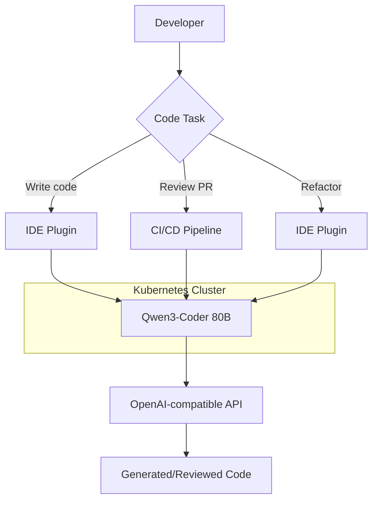

> 💡 **Quick Answer:** Deploy Qwen3-Coder-Next (80B) with vLLM using `--tensor-parallel-size 2` on 2x A100 80GB. Purpose-built for code generation, review, and refactoring. 1.16M downloads — one of the most popular open coding models. Supports 200+ programming languages.

## The Problem

Self-hosted AI coding assistants need:

- **Code quality** — generate production-ready code, not just snippets
- **Long context** — understand entire codebases, not just single files
- **Privacy** — proprietary code stays on your infrastructure
- **Integration** — OpenAI-compatible API for IDE plugins and CI/CD pipelines
- **Cost** — avoid per-token API pricing for high-volume teams

Qwen3-Coder-Next at 80B parameters (1.16M downloads, 1.12K likes) is a leading open coding model.

## The Solution

### Deploy Qwen3-Coder-Next 80B

```yaml
apiVersion: apps/v1
kind: Deployment
metadata:
  name: qwen3-coder
  namespace: ai-inference
  labels:
    app: qwen3-coder
spec:
  replicas: 1
  selector:
    matchLabels:
      app: qwen3-coder
  template:
    metadata:
      labels:
        app: qwen3-coder
    spec:
      containers:
        - name: vllm
          image: vllm/vllm-openai:latest
          args:
            - "--model"
            - "Qwen/Qwen3-Coder-Next"
            - "--tensor-parallel-size"
            - "2"
            - "--max-model-len"
            - "65536"
            - "--gpu-memory-utilization"
            - "0.92"
            - "--max-num-seqs"
            - "16"
            - "--enable-chunked-prefill"
            - "--trust-remote-code"
            - "--port"
            - "8000"
          ports:
            - containerPort: 8000
          env:
            - name: HUGGING_FACE_HUB_TOKEN
              valueFrom:
                secretKeyRef:
                  name: huggingface-token
                  key: token
          resources:
            limits:
              nvidia.com/gpu: "2"
              memory: 96Gi
              cpu: "16"
          volumeMounts:
            - name: model-cache
              mountPath: /root/.cache/huggingface
            - name: shm
              mountPath: /dev/shm
          startupProbe:
            httpGet:
              path: /health
              port: 8000
            initialDelaySeconds: 300
            periodSeconds: 30
            failureThreshold: 20
          readinessProbe:
            httpGet:
              path: /health
              port: 8000
            periodSeconds: 15
      volumes:
        - name: model-cache
          persistentVolumeClaim:
            claimName: qwen3-coder-cache
        - name: shm
          emptyDir:
            medium: Memory
            sizeLimit: 16Gi
---
apiVersion: v1
kind: Service
metadata:
  name: qwen3-coder
  namespace: ai-inference
spec:
  selector:
    app: qwen3-coder
  ports:
    - port: 8000
      targetPort: 8000
```

### IDE Integration (Continue.dev / Copilot Alternative)

```json
{
  "models": [
    {
      "title": "Qwen3 Coder",
      "provider": "openai",
      "model": "Qwen/Qwen3-Coder-Next",
      "apiBase": "http://qwen3-coder.ai-inference.svc:8000/v1",
      "apiKey": "not-needed"
    }
  ]
}
```

### Code Review in CI/CD

```yaml
# GitHub Actions: AI-powered code review
apiVersion: batch/v1
kind: Job
metadata:
  name: ai-code-review
  namespace: ai-inference
spec:
  template:
    spec:
      restartPolicy: Never
      containers:
        - name: reviewer
          image: curlimages/curl
          command:
            - /bin/sh
            - -c
            - |
              DIFF=$(cat /workspace/pr-diff.txt)
              curl -s http://qwen3-coder:8000/v1/chat/completions \
                -H "Content-Type: application/json" \
                -d "{
                  \"model\": \"Qwen/Qwen3-Coder-Next\",
                  \"messages\": [
                    {\"role\": \"system\", \"content\": \"You are a senior code reviewer. Review this diff for bugs, security issues, and best practice violations. Be concise.\"},
                    {\"role\": \"user\", \"content\": $(echo "$DIFF" | jq -Rs .)}
                  ],
                  \"max_tokens\": 2048,
                  \"temperature\": 0.1
                }" | jq -r '.choices[0].message.content'
```



## Common Issues

### Long file context

```bash
# 65K context supports large files but uses significant KV cache
--max-model-len 65536  # for whole-file understanding
--max-num-seqs 8       # reduce concurrency for long contexts

# For shorter completions (autocomplete), reduce context:
--max-model-len 16384 --max-num-seqs 32
```

### Streaming for IDE autocomplete

```bash
# Use streaming for responsive autocomplete
curl -N http://qwen3-coder:8000/v1/completions \
  -H "Content-Type: application/json" \
  -d '{
    "model": "Qwen/Qwen3-Coder-Next",
    "prompt": "def fibonacci(n):\n    ",
    "max_tokens": 256,
    "stream": true,
    "temperature": 0.1
  }'
```

## Best Practices

- **2x A100 80GB** for 80B model at FP16, or FP8 on H100 for single GPU
- **65K context** — enough for entire files, reduce for higher concurrency
- **Low temperature** (0.1) — code generation needs determinism
- **IDE integration** via Continue.dev, Cody, or custom plugins
- **Streaming** — essential for autocomplete responsiveness
- **CI/CD integration** — automate code reviews on PRs

## Key Takeaways

- Qwen3-Coder-Next: **80B parameter coding model** — 1.16M downloads
- Deploys on **2x A100 80GB** with 65K context for whole-file understanding
- **OpenAI-compatible API** — works with Continue.dev, custom IDE plugins, CI/CD
- Use for **code generation, review, refactoring, and documentation**
- **Self-hosted Copilot alternative** — proprietary code stays on your infrastructure
