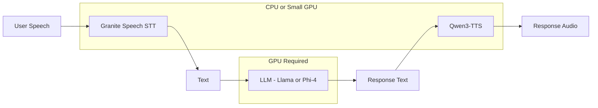

> 💡 **Quick Answer:** Deploy Qwen3-TTS (1.7B parameters) for text-to-speech with custom voice cloning. At just 1.7B params, it runs on a small GPU (T4, L4) or even CPU. 1.13M downloads and 1.28K likes — one of the most popular open TTS models. Supports custom voice creation from short audio samples.

## The Problem

Text-to-speech on Kubernetes needs to be:

- **Lightweight** — not every TTS task justifies an A100
- **Custom voices** — enterprise apps need branded voices, not generic ones
- **Multilingual** — Chinese, English, and other languages from one model
- **Low latency** — conversational AI needs fast synthesis

Qwen3-TTS at 1.7B parameters with 1.13M downloads is the sweet spot — high quality, low resource requirements, with voice cloning.

## The Solution

### Deploy Qwen3-TTS

```yaml
apiVersion: apps/v1
kind: Deployment
metadata:
  name: qwen3-tts
  namespace: ai-inference
  labels:
    app: qwen3-tts
spec:
  replicas: 1
  selector:
    matchLabels:
      app: qwen3-tts
  template:
    metadata:
      labels:
        app: qwen3-tts
    spec:
      containers:
        - name: tts
          image: python:3.11-slim
          command:
            - /bin/bash
            - -c
            - |
              apt-get update && apt-get install -y ffmpeg
              pip install transformers torch torchaudio \
                fastapi uvicorn soundfile

              python3 << 'PYEOF'
              import torch
              from transformers import AutoModelForCausalLM, AutoTokenizer
              from fastapi import FastAPI
              from fastapi.responses import StreamingResponse
              import io, soundfile as sf

              app = FastAPI()

              model_name = "Qwen/Qwen3-TTS-12Hz-1.7B-CustomVoice"
              tokenizer = AutoTokenizer.from_pretrained(model_name, trust_remote_code=True)
              model = AutoModelForCausalLM.from_pretrained(
                  model_name,
                  torch_dtype=torch.float16,
                  device_map="auto",
                  trust_remote_code=True,
              )

              @app.get("/health")
              def health():
                  return {"status": "ready", "model": "qwen3-tts"}

              @app.post("/synthesize")
              async def synthesize(request: dict):
                  text = request.get("text", "Hello world")
                  speaker = request.get("speaker", None)

                  # Generate audio tokens
                  inputs = tokenizer(text, return_tensors="pt").to(model.device)
                  with torch.no_grad():
                      outputs = model.generate(
                          **inputs,
                          max_new_tokens=2048,
                      )

                  # Decode audio
                  audio = tokenizer.decode_audio(outputs[0])

                  buf = io.BytesIO()
                  sf.write(buf, audio, 24000, format="WAV")
                  buf.seek(0)

                  return StreamingResponse(buf, media_type="audio/wav")

              import uvicorn
              uvicorn.run(app, host="0.0.0.0", port=8000)
              PYEOF
          ports:
            - containerPort: 8000
          resources:
            limits:
              nvidia.com/gpu: "1"
              memory: 8Gi
              cpu: "4"
          env:
            - name: HUGGING_FACE_HUB_TOKEN
              valueFrom:
                secretKeyRef:
                  name: huggingface-token
                  key: token
          volumeMounts:
            - name: model-cache
              mountPath: /root/.cache/huggingface
          startupProbe:
            httpGet:
              path: /health
              port: 8000
            initialDelaySeconds: 120
            periodSeconds: 10
            failureThreshold: 15
          readinessProbe:
            httpGet:
              path: /health
              port: 8000
            periodSeconds: 10
      volumes:
        - name: model-cache
          persistentVolumeClaim:
            claimName: qwen3-tts-cache
---
apiVersion: v1
kind: Service
metadata:
  name: qwen3-tts
  namespace: ai-inference
spec:
  selector:
    app: qwen3-tts
  ports:
    - port: 8000
      targetPort: 8000
```

### TTS Model Comparison

```text
| Model                | Params | GPU Required | Custom Voice | Downloads |
|----------------------|--------|-------------|-------------|-----------|
| Qwen3-TTS 1.7B      | 1.7B   | T4/L4/CPU   | Yes          | 1.13M     |
| Fish Audio S2-Pro    | 5B     | A100/L40S   | Yes          | 1.8K      |
| HumeAI TADA 1B      | 2B     | T4/L4       | Emotional    | 5.6K      |
| Bark                 | ~1B    | T4/L4/CPU   | Limited      | 800K+     |
```

### Complete Voice AI Pipeline



## Common Issues

### CPU-only deployment

```yaml
# 1.7B model can run on CPU — slower but works
resources:
  requests:
    memory: 8Gi
    cpu: "8"
  limits:
    memory: 16Gi
    cpu: "16"
# Remove nvidia.com/gpu from limits
# Change device_map to "cpu" in code
```

### Custom voice cloning

```bash
# Provide 10-30 seconds of reference audio
# The CustomVoice variant specifically supports voice cloning
curl -X POST http://qwen3-tts:8000/synthesize \
  -H "Content-Type: application/json" \
  -d '{
    "text": "Kubernetes pods are the smallest deployable units.",
    "reference_audio_url": "https://example.com/voice-sample.wav"
  }'
```

## Best Practices

- **T4 or L4 GPU** — 1.7B model only needs ~4GB VRAM
- **CPU fallback** — works without GPU, just slower
- **Custom voice** — use the CustomVoice variant for voice cloning
- **24kHz output** — standard high-quality audio
- **Pair with lightweight STT** — Granite Speech + Qwen3-TTS = full pipeline on small GPUs

## Key Takeaways

- Qwen3-TTS: **1.7B parameter TTS** model with **1.13M downloads**
- Runs on **T4, L4, or even CPU** — no expensive GPU needed
- **Custom voice cloning** from short audio samples
- **12Hz audio token rate** — efficient generation
- Pair with **Granite Speech (STT)** for a complete voice pipeline on minimal hardware
