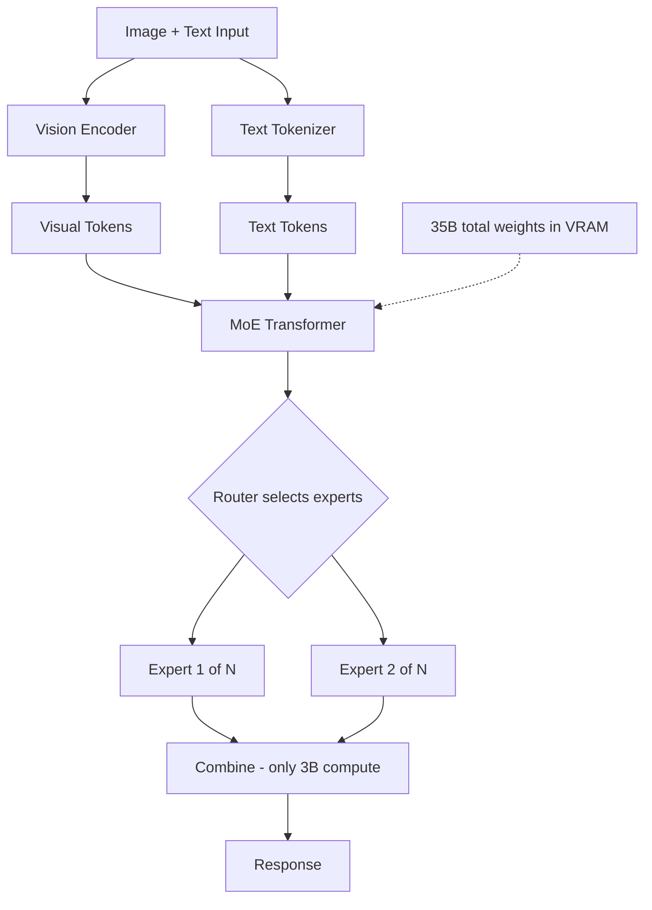

> 💡 **Quick Answer:** Qwen3.5-35B-A3B is a MoE vision-language model — 35B total parameters but only **3B active per token**. It runs on a single GPU with near-3B-model speed but 35B-model quality. Ideal for multimodal workloads where cost efficiency matters.

## The Problem

You need multimodal (image + text) AI but face a trade-off:

- **Small models (3B)** — fast and cheap, but limited reasoning
- **Large models (35B dense)** — great quality, but need expensive multi-GPU setups
- **MoE solves this** — 35B parameters of knowledge, only 3B active per forward pass

Qwen3.5-35B-A3B gives you the quality of a 35B model at the inference cost of a 3B model, with vision capabilities.

## The Solution

### Deploy Qwen3.5-35B-A3B

```yaml
apiVersion: apps/v1
kind: Deployment
metadata:
  name: qwen35-35b-moe
  namespace: ai-inference
  labels:
    app: qwen35-35b-moe
spec:
  replicas: 1
  selector:
    matchLabels:
      app: qwen35-35b-moe
  template:
    metadata:
      labels:
        app: qwen35-35b-moe
    spec:
      containers:
        - name: vllm
          image: vllm/vllm-openai:latest
          args:
            - "--model"
            - "Qwen/Qwen3.5-35B-A3B"
            - "--max-model-len"
            - "32768"
            - "--gpu-memory-utilization"
            - "0.92"
            - "--max-num-seqs"
            - "64"
            - "--enable-chunked-prefill"
            - "--trust-remote-code"
            - "--limit-mm-per-prompt"
            - "image=4"
            - "--port"
            - "8000"
          ports:
            - containerPort: 8000
          env:
            - name: HUGGING_FACE_HUB_TOKEN
              valueFrom:
                secretKeyRef:
                  name: huggingface-token
                  key: token
          resources:
            limits:
              nvidia.com/gpu: "1"
              memory: 48Gi
              cpu: "8"
          volumeMounts:
            - name: model-cache
              mountPath: /root/.cache/huggingface
            - name: shm
              mountPath: /dev/shm
          startupProbe:
            httpGet:
              path: /health
              port: 8000
            initialDelaySeconds: 180
            periodSeconds: 15
            failureThreshold: 20
          readinessProbe:
            httpGet:
              path: /health
              port: 8000
            periodSeconds: 10
      volumes:
        - name: model-cache
          persistentVolumeClaim:
            claimName: qwen35-moe-cache
        - name: shm
          emptyDir:
            medium: Memory
            sizeLimit: 4Gi
---
apiVersion: v1
kind: Service
metadata:
  name: qwen35-35b-moe
  namespace: ai-inference
spec:
  selector:
    app: qwen35-35b-moe
  ports:
    - port: 8000
      targetPort: 8000
```

### GGUF Version for llama.cpp

```yaml
# Use unsloth GGUF quantization for even lower resource usage
apiVersion: apps/v1
kind: Deployment
metadata:
  name: qwen35-35b-gguf
  namespace: ai-inference
spec:
  replicas: 1
  selector:
    matchLabels:
      app: qwen35-35b-gguf
  template:
    metadata:
      labels:
        app: qwen35-35b-gguf
    spec:
      containers:
        - name: llamacpp
          image: ghcr.io/ggerganov/llama.cpp:server
          args:
            - "--model"
            - "/models/Qwen3.5-35B-A3B-Q4_K_M.gguf"
            - "--ctx-size"
            - "16384"
            - "--n-gpu-layers"
            - "99"
            - "--host"
            - "0.0.0.0"
            - "--port"
            - "8000"
          resources:
            limits:
              nvidia.com/gpu: "1"
              memory: 32Gi
          volumeMounts:
            - name: models
              mountPath: /models
      volumes:
        - name: models
          persistentVolumeClaim:
            claimName: gguf-models
```

### MoE Efficiency Comparison

```text
| Model                | Total | Active | VRAM (FP16) | Tokens/sec | Quality |
|----------------------|-------|--------|-------------|------------|---------|
| Qwen3.5-0.8B        | 0.9B  | 0.9B   | ~2GB        | ~5000      | Basic   |
| Qwen3.5-4B           | 5B    | 5B     | ~10GB       | ~3000      | Good    |
| Qwen3.5-9B           | 10B   | 10B    | ~18GB       | ~2000      | Great   |
| Qwen3.5-35B-A3B (MoE)| 36B   | 3B     | ~35GB*      | ~3500      | Great   |
* All expert weights must be in VRAM even though only 3B are active
```



## Common Issues

### All 35B must fit in VRAM

```bash
# MoE doesn't load experts on demand — all weights stay in GPU memory
# FP16: ~35GB VRAM needed (fits on A100 40GB or L40S 48GB)
# GGUF Q4: ~18GB (fits on RTX 4090, A10G, L4)
```

### Model slower than expected for 3B active

```bash
# MoE routing adds overhead vs a pure 3B dense model
# But quality is much higher — it's the quality of 35B, speed closer to 3B
# Still faster than a 35B dense model by ~10x
```

## Best Practices

- **Single GPU is enough** — despite 35B total, fits on A100 40GB at FP16
- **GGUF Q4 for smaller GPUs** — unsloth quantization fits on 24GB cards
- **Use for multimodal tasks** — the MoE architecture especially benefits vision+text
- **Higher concurrency than 9B dense** — 3B active means less compute per request
- **1.46M+ downloads, 1K+ likes** — proven community adoption

## Key Takeaways

- **35B total, 3B active** — MoE gives 35B quality at near-3B inference cost
- **Vision + text** multimodal model in one deployment
- Fits on **single A100 40GB** at FP16 or **RTX 4090** with GGUF Q4
- **~3500 tokens/sec** — faster than 9B dense despite higher quality
- Available in **GGUF format** (unsloth) for llama.cpp deployments
