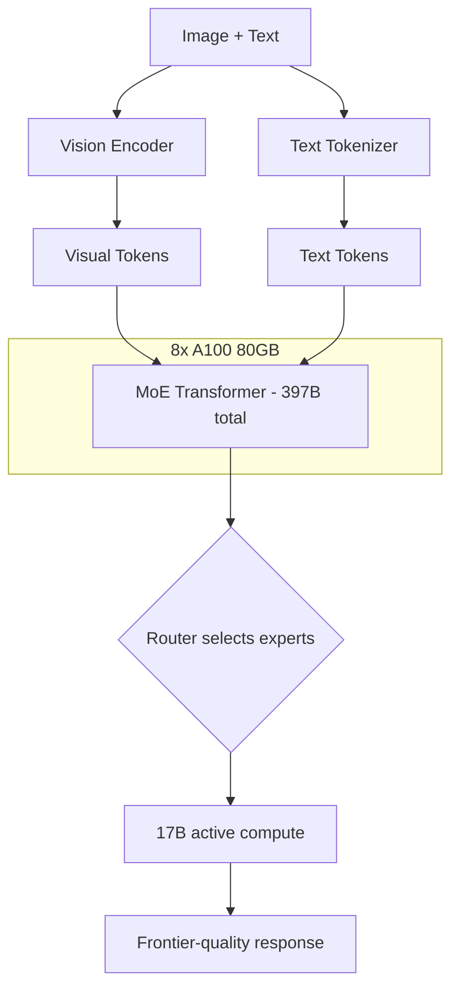

> 💡 **Quick Answer:** Deploy Qwen3.5-397B-A17B with vLLM using `--tensor-parallel-size 8` on 8x A100 80GB. A MoE vision-language model with 397B total parameters but only 17B active per token. Frontier multimodal quality (1.66M downloads, 1.3K likes) at efficient inference cost.

## The Problem

You need the best open multimodal model available — one that can:

- **Analyze complex images** — medical scans, satellite imagery, detailed diagrams
- **Reason across modalities** — combine visual and textual understanding for deep analysis
- **Handle frontier tasks** — tasks where 9B and 35B models fall short
- **Stay cost-efficient** — MoE architecture keeps inference fast despite 397B total parameters

Qwen3.5-397B-A17B is Alibaba's flagship multimodal MoE model — the largest in the Qwen3.5 family.

## The Solution

### Deploy Qwen3.5-397B-A17B

```yaml
apiVersion: apps/v1
kind: Deployment
metadata:
  name: qwen35-397b
  namespace: ai-inference
  labels:
    app: qwen35-397b
spec:
  replicas: 1
  selector:
    matchLabels:
      app: qwen35-397b
  template:
    metadata:
      labels:
        app: qwen35-397b
    spec:
      containers:
        - name: vllm
          image: vllm/vllm-openai:latest
          args:
            - "--model"
            - "Qwen/Qwen3.5-397B-A17B"
            - "--tensor-parallel-size"
            - "8"
            - "--max-model-len"
            - "16384"
            - "--gpu-memory-utilization"
            - "0.92"
            - "--max-num-seqs"
            - "16"
            - "--enable-chunked-prefill"
            - "--trust-remote-code"
            - "--limit-mm-per-prompt"
            - "image=2"
            - "--port"
            - "8000"
          ports:
            - containerPort: 8000
          env:
            - name: HUGGING_FACE_HUB_TOKEN
              valueFrom:
                secretKeyRef:
                  name: huggingface-token
                  key: token
            - name: NCCL_DEBUG
              value: "WARN"
            - name: VLLM_WORKER_MULTIPROC_METHOD
              value: "spawn"
          resources:
            limits:
              nvidia.com/gpu: "8"
              memory: 256Gi
              cpu: "64"
          volumeMounts:
            - name: model-cache
              mountPath: /root/.cache/huggingface
            - name: shm
              mountPath: /dev/shm
          startupProbe:
            httpGet:
              path: /health
              port: 8000
            initialDelaySeconds: 600
            periodSeconds: 60
            failureThreshold: 20
          readinessProbe:
            httpGet:
              path: /health
              port: 8000
            periodSeconds: 30
      volumes:
        - name: model-cache
          persistentVolumeClaim:
            claimName: qwen35-397b-cache
        - name: shm
          emptyDir:
            medium: Memory
            sizeLimit: 64Gi
      terminationGracePeriodSeconds: 300
---
apiVersion: v1
kind: Service
metadata:
  name: qwen35-397b
  namespace: ai-inference
spec:
  selector:
    app: qwen35-397b
  ports:
    - port: 8000
      targetPort: 8000
```

### FP8 on H100 (Fewer GPUs)

```yaml
# FP8 cuts VRAM in half — fits on 4x H100
args:
  - "--model"
  - "Qwen/Qwen3.5-397B-A17B"
  - "--tensor-parallel-size"
  - "4"
  - "--quantization"
  - "fp8"
  - "--max-model-len"
  - "16384"
  - "--trust-remote-code"
resources:
  limits:
    nvidia.com/gpu: "4"
nodeSelector:
  nvidia.com/gpu.product: "H100-SXM"
```

### Qwen3.5 Family Comparison

```text
| Model               | Total  | Active | GPUs (FP16) | Multimodal | Downloads |
|----------------------|--------|--------|-------------|------------|-----------|
| Qwen3.5-0.8B        | 0.9B   | 0.9B   | CPU/L4      | Yes        | 662K      |
| Qwen3.5-2B          | 2B     | 2B     | T4/L4       | Yes        | 454K      |
| Qwen3.5-4B          | 5B     | 5B     | A10G        | Yes        | 751K      |
| Qwen3.5-9B          | 10B    | 10B    | 1x A100     | Yes        | 1.54M     |
| Qwen3.5-27B         | 28B    | 28B    | 1x A100 80G | Yes        | 1.1M      |
| Qwen3.5-35B-A3B     | 36B    | 3B     | 1x A100 40G | Yes (MoE)  | 1.46M     |
| Qwen3.5-397B-A17B   | 403B   | 17B    | 8x A100 80G | Yes (MoE)  | 1.66M     |
```



## Common Issues

### 397B model needs fast storage

```bash
# ~800GB in FP16 — NVMe PVC is essential
# Loading from network storage takes 30-60 minutes
# Pre-download with an init container or dedicated pull Job
```

### Image processing at this scale

```bash
# Limit images per request — each image adds significant KV cache
--limit-mm-per-prompt image=2  # max 2 images per request
# For image-heavy workloads, use Qwen3.5-9B which is more efficient
```

## Best Practices

- **8x A100 80GB minimum** at FP16, or **4x H100** with FP8
- **NVLink/NVSwitch** — mandatory for 8-GPU tensor parallelism
- **Limit images per prompt** — vision adds significant memory overhead at 397B scale
- **Use smaller Qwen3.5 models first** — 9B or 35B-A3B handle most use cases
- **Reserve 397B for frontier tasks** — complex multi-image analysis, research, benchmarking

## Key Takeaways

- Qwen3.5-397B-A17B is the **flagship Qwen3.5 MoE model** — 397B total, 17B active
- **1.66M downloads** — the most downloaded model in the Qwen3.5 MoE family
- Requires **8x A100 80GB** (FP16) or **4x H100** (FP8)
- **Multimodal** — processes both images and text with frontier quality
- MoE means **17B compute cost** with **397B knowledge** — best quality per FLOP
